# Introduction

Denoising diffusion probabilistic models [@ho2020denoising] have shown to be a powerful tool for sampling from complicated, high-dimensional distributions, achieving state-of-the-art performance on tasks such as image generation [@dhariwal2021diffusion], motion planning [@janner2022planning] and control [@chi2024diffusionpolicy]. In this paper, we introduce a diffusion model that can solve a vehicle navigation task consisting of localization and planning in arbitrary 2D environments. In particular, our model is conditioned on a 2D obstacle map, raw LIDAR sensor measurements, and a desired goal state, and produces collision-free paths in the global map frame (see [1](#fig:overview){reference-type="ref+label" reference="fig:overview"}). We also demonstrate how this model's output can serve to control a vehicle with real-time online replanning. To the best of our knowledge, this is the first paper exploring the joint global vehicle localization and planning problem using diffusion. However, there is a significant amount of existing work on applications of diffusion to several problems in robotics.

**Diffusion planning and RL.** *Diffuser* [@janner2022planning] uses a diffusion model in conjunction with a guidance function learned via reinforcement learning (RL) to perform a variety of planning tasks. The use of hand-designed guidance to enforce test-time conditions, such as obstacle avoidance, in diffusion models for planning [@song2023loss], has also been explored. Offline RL has been shown to benefit from diffusion models to represent policies [@wang2022diffusion], and conditional diffusion models have been used to behavior-clone a model-based 2D pathplanner [@liu2024dipper].

We note that these contributions generally do not consider the geometry of the diffused states specially, performing diffusion in Euclidean space, and do not address the global localization problem, requiring an external perception and control pipeline. In contrast, *Diffusion Policy* learns visumotor policies that directly take sequences of images as inputs [@chi2024diffusionpolicy] with impressive results in manipulation applications. However, *Diffusion Policy* has not been applied to problems related to vehicle navigation.

**Diffusion on manifolds.** Diffusion on ${\mathrm{SE}(3)}$ has been applied to manipulation problems [@urain2023se3]. Recent work on diffusion on Riemannian manifolds [@de2022riemannian] has also laid the groundwork for the rigorous development of diffusion on ${\mathrm{SO}(3)}$ [@leach2022denoising] and ${\mathrm{SE}(3)}$ with applications to protein design [@yim2023se3]. These results transfer directly to applications in robotic navigation.

**Perception using diffusion.** Diffusion for LIDAR localization has been studied [@li2024diffloc] in the context of absolute pose regression with a given map known at training time. The LIDAR localization problem we consider in our work differs from this in that we do not rely on per-map model training but instead can condition on arbitrary maps at test time. This is more similar to the point cloud registration studied using diffusion by Wu et al. [@wu2023pcrdiffusion], although the global localization problem differs in that the map may describe a much larger extent than captured by the sensor observation.

**End-to-end navigation.** Prior work on end-to-end navigation [@liu2021efficient; @amini2019variational] explores a similar problem setting, but uses explicit representations of distributions such as Gaussian mixture models to handle uncertainty. Diffusion models have the potential to characterize much richer distributions, which we demonstrate in our experiments.

:::: {#fig:overview .figure latex-placement="t"}
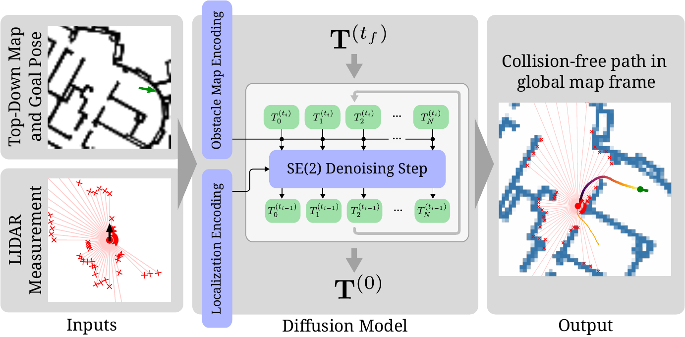{width="\\linewidth"}

::: caption
Proposed model. A denoising diffusion process is conditioned on an obstacle map, a LIDAR scan, and a goal pose, producing a collision free path in the global map frame.
:::
::::

In summary, we present the following main contributions in this paper. First, obstacle-free trajectory generation via diffusion on ${\mathrm{SE}(2)}$, conditioned on arbitrary obstacle maps. Second, a conditioning technique enabling our diffusion model to perform global localization given an arbitrary map and egocentric LIDAR scan. Finally, a demonstration of jointly solving the global localization and planning tasks using a diffusion model and the use of our model for closed-loop control in realistic environments.

# Preliminaries

In this work, we focus on vehicles traversing 2D environments. Therefore, we consider paths parameterized by $N$ approximately uniformly spaced pose samples ${\mathbf{T} = [T_1,
    \dots, T_N]} \in {\mathrm{SE}(2)}^N$, where each pose ${T \in {\mathrm{SE}(2)}}$ consists of a heading ${R \in {\mathrm{SO}(2)}}$ as well as a position $X \in
\operatorname{\mathbb{R}}^2$ in the global coordinate frame. We use similar notation $\mathbf{R} \in {\mathrm{SO}(2)}^N$ and $\mathbf{X} \in \operatorname{\mathbb{R}}^{2N}$ for sequences of rotations and translations, respectively. We also assume that positions are scaled such that their coordinates do not fall far outside of the $[-1, 1]$ range.

## Forward and Reverse Diffusion Processes on ${\mathrm{SE}(2)}$

To define a forward and reverse diffusion process on ${\mathrm{SE}(2)}$, we follow the development of diffusion modeling on ${\mathrm{SE}(3)}$ by Yim et al. [@yim2023se3]. In particular, we leverage the fact that ${\mathrm{SE}(2)}$ can be identified with ${\mathrm{SO}(2)} \times \operatorname{\mathbb{R}}^2$ in order to define a forward process $(\mathbf{T}^{(t)})_{t \geq 0}$ on ${\mathrm{SE}(2)}$ by considering diffusion on ${\mathrm{SO}(2)}$ and $\operatorname{\mathbb{R}}^2$ separately: $$\begin{equation}
  {\mathrm{d}\mathbf{R}^{(t)}} = g(t) {\mathrm{d}\mathbf{B}^{(t)}_{{\mathrm{SO}(2)}}}\,\,\text{and}\,\,
  {\mathrm{d}\mathbf{X}^{(t)}} = g(t) {\mathrm{d}\mathbf{B}^{(t)}_{\operatorname{\mathbb{R}}^2}}.
  \label{eq:forward-sde}
\end{equation}$$ Here, $g(t)$ is the diffusion coefficient, and ${\mathrm{d}\mathbf{B}^{(t)}_{{\mathrm{SO}(2)}}}$ and ${\mathrm{d}\mathbf{B}^{(t)}_{\operatorname{\mathbb{R}}^2}}$ denote Brownian motion on ${\mathrm{SO}(2)}$ and $\operatorname{\mathbb{R}}^2$, respectively. As in Karras et al.'s EDM model [@karras2022elucidating], we choose to skip the drift term.

Let $\overleftarrow{\mathbf{T}}^{(t)} = \mathbf{T}^{(t_f - t)}$, where $t_f$ denotes the final timestep of the forward diffusion process. Define $\overleftarrow{\mathbf{R}}^{(t)}$ and $\overleftarrow{\mathbf{X}}^{(t)}$ equivalently. Let $p_t$ denote the density of $\mathbf{T}^{(t)}$. Then, following Song et al. [@song2021scorebased] and De Bortoili et al. [@de2022riemannian], the time reversal of the forward process [\[eq:forward-sde\]](#eq:forward-sde){reference-type="eqref" reference="eq:forward-sde"} is given by $$\begin{align}
\begin{split}
  {\mathrm{d}\overleftarrow{\mathbf{T}}^{(t)}}
  &= g^2(t_f - t) \nabla_{\overleftarrow{\mathbf{T}}^{(t)}} \log p_{t_f-t}(\overleftarrow{\mathbf{T}}^{(t)}) \\
  &\quad+ g(t_f - t) [{\mathrm{d}\mathbf{B}_{{\mathrm{SO}(2)}}^{(t)}}, {\mathrm{d}\mathbf{B}_{\operatorname{\mathbb{R}}^2}^{(t)}}]
  \label{eq:reverse}
\end{split}
\end{align}$$ so that for $t \in [0, t_f]$, we have $\overleftarrow{\mathbf{T}}^{(t)} \sim p_{t_f - t}$.

## Score Modeling on ${\mathrm{SE}(2)}$

To sample from the data distribution $p_0$ by running reverse diffusion, we approximate the intractable Stein score ${\nabla \log
  p_t}$. Using denoising score matching (DSM), a neural network $s_\theta(t, \cdot)$ is trained to minimizing the DSM loss $$\begin{equation}
  \mathcal{L}(\theta) = \operatorname{\mathbb{E}}[ \lambda_t \lVert 
      \nabla \log p_{t|0}(\mathbf{T}^{(t)} \mid \mathbf{T}^{(0)})
      - s_\theta(t, \mathbf{T}^{(t)})
     \rVert^2 ]
  \label{eq:dsm}
\end{equation}$$ with weights $\lambda_t > 0$ and $t \in [0, t_f]$ [@song2021scorebased]. Since we designed the diffusion processes on ${\mathrm{SO}(2)}$ and $\operatorname{\mathbb{R}}^2$ to be independent [\[eq:forward-sde\]](#eq:forward-sde){reference-type="eqref" reference="eq:forward-sde"}, note that the conditional score $$\begin{equation}
  \begin{aligned}
  \nabla \log p_{t|0}(\mathbf{T}^{(t)} \mid \mathbf{T}^{(0)})
  = [&\nabla_{\mathbf{R}^{(t)}} \log p_{t|0}(\mathbf{R}^{(t)} \mid \mathbf{R}^{(0)}), \\
    &\nabla_{\mathbf{X}^{(t)}} \log p_{t|0}(\mathbf{X}^{(t)} \mid \mathbf{X}^{(0)})]
  \label{eq:score}
  \end{aligned}
\end{equation}$$ can be computed by considering the rotation and translation separately [@yim2023se3]. Here, we have for the Euclidean part of the score that $\nabla_{\mathbf{x}} \log p_{t|0}(\mathbf{x} \mid
\mathbf{y}) = \sigma^{-2}(t) (\mathbf{y} - \mathbf{x})$, where we refer to Karras et al.'s EDM formulation [@karras2022elucidating] for the definition of $\sigma(t)$ in terms of the diffusion coefficient $g(t)$. In the case of angles $\phi, \psi \in {\mathrm{SO}(2)}$, the score is instead computed by differentiating the wrapped normal [@fletcher2003gaussian] pdf: $$\begin{equation}
  \nabla_{\phi} \log p_{t|0}(\phi \mid \psi)
  = \nabla_{\phi} \log \sum_{k\in\mathbb{N}}
  \exp(-\frac{(\psi - \phi - 2 \pi k)^2}{2 \sigma^2(t)}).
\end{equation}$$ In practice we observe that the series converges rapidly on ${[-\pi,\pi)}$, so we truncate it summing only over ${k\in[-10,10]}$ and compute the derivative using automatic differentiation, or use the Euclidean score as an approximation in the case where $\sigma(t)$ is small.

# Diffusion Localization and Planning Model

We explore a diffusion model for jointly performing global localization and planning in the context of behavior cloning of a model-based pathplanner. We procedurally generate a dataset $\mathcal{D} = \{\mathcal{S}_i\}_{i \in \mathbb{Z}}$ of example scenarios and demonstrations. Each scenario $\mathcal{S} =
(\mathcal{E}, \mathcal{O}, \mathcal{G}, \mathbf{T}^*)$ consists of a randomly generated environment occupancy map $\mathcal{E} \in \{0,
1\}^{H \times W}$, an noisy egocentric LIDAR sensor observation $\mathcal{O} \in \operatorname{\mathbb{R}}^{N_{\text{rays}}}$, a goal pose $\mathcal{G} \in {\mathrm{SE}(2)}$, and an expert demonstration produced by a model-based pathplanner in the form of a collision free path $\mathbf{T}^* \in {\mathrm{SE}(2)}^N$.

## Denoising Network

We describe our score approximator in terms of a "denoiser" ${f_\theta(t, \cdot) : {\mathrm{SE}(2)}^N \rightarrow {\mathrm{SE}(2)}^N}$, as follows: $$\begin{equation}
  s_\theta(t, \mathbf{T}^{(t)})
  = \nabla \log p_{t|0}(\mathbf{T}^{(t)} \mid f_\theta(t, \mathbf{T}^{(t)})).
\end{equation}$$ Note that we have omitted writing explicit dependencies on $\mathcal{E}$, $\mathcal{O}$ and $\mathcal{G}$ for notational simplicity. However, $f_\theta$ and the entire diffusion processes are to be understood as being conditioned on $\mathcal{E}$, $\mathcal{O}$ and $\mathcal{G}$ as applicable. More explicitly, we write $f_\theta(t, \cdot)$ in terms of the conditional 1D U-Net [@ronneberger2015u] $F_{\theta}(\cdot~\mid~\mathbf{x}_{\text{cond}}):~\operatorname{\mathbb{R}}^{N
  \times (4 + d_{\text{local}})} \rightarrow \operatorname{\mathbb{R}}^{N \times 4}$ as $$\begin{equation}
  f_\theta(t, \mathbf{T}^{(t)})
  = f_{\text{out}}(F_\theta(f_{\text{in}}(\mathbf{T}^{(t)}, \mathcal{E})
            \mid f_{\text{cond}}(t, \mathcal{O}, \mathcal{G}))).
\end{equation}$$ Here, $f_{\text{in}}(\cdot, \mathcal{E}) : {\mathrm{SE}(2)}^N \rightarrow \operatorname{\mathbb{R}}^{N
  \times (4 + d_{\text{local}})}$ encodes the position $(x, y)$ and rotation angle $\phi$ of each input pose $T_i^{(t)}$ as a vector $\begin{bmatrix} x & y & \cos \phi & \sin \phi \end{bmatrix}^\top$ and concatenates a $d_{\text{local}}$-dimensional *local* conditioning vector to each encoded input pose. An additional *global* conditioning vector is computed by $f_{\text{cond}}$ and applied via FiLM modulation [@perez2018film]. This global conditioning vector always includes the goal pose and a sinusoidal positional embedding of the current timestep $t$. Finally, $f_{\text{out}} : \operatorname{\mathbb{R}}^{N \times 4} \rightarrow {\mathrm{SE}(2)}^N$ undoes the pose transformation and encoding to recover the denoised path.

## Obstacle Avoidance {#sec:obstacle-conditioning}

:::: {#fig:env-feature-map-sampling .figure latex-placement="tb"}
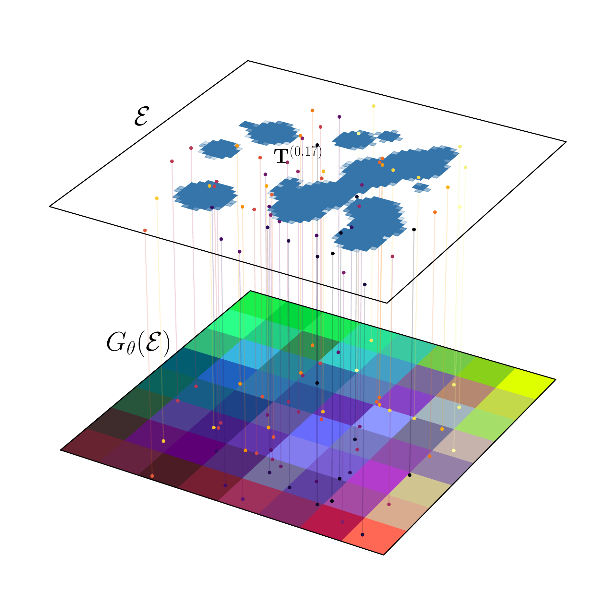{width="49%"} 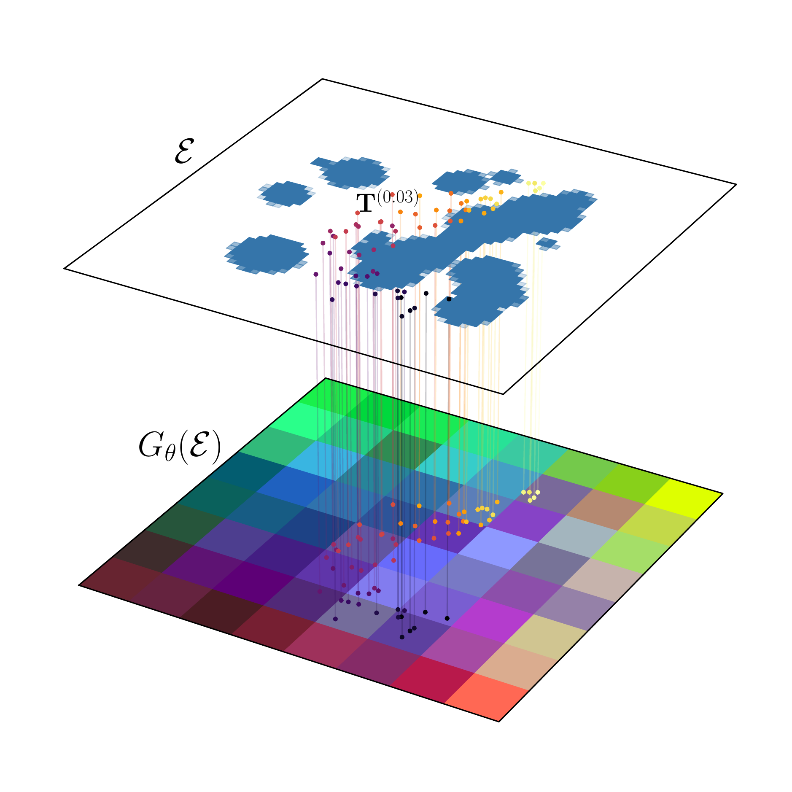{width="49%"}

::: caption
Local conditioning strategy based on sampling of the encoded obstacle map $G_\theta(\mathcal{E})$ shown for two different noise levels. Samples of $G_\theta(\mathcal{E})$ are appended to the corresponding pose and fed into the denoising network.
:::
::::

We propose a simple local conditioning strategy to condition the denoising network on the obstacle map $\mathcal{E}$. To this end, we first encode $\mathcal{E}$ into a feature map via a learned encoder network $G_\theta: \operatorname{\mathbb{R}}^{H \times W} \rightarrow \operatorname{\mathbb{R}}^{d_{\text{local}}
  \times H' \times W'}$. The encoded map $G_\theta(\mathcal{E})$ is then sampled (via bilinear interpolation) at the positions $\mathbf{X}^{(t)}$ corresponding to each pose in the (noisy) input path, and $f_\text{in}$ concatenates each sampled feature to the corresponding pose encoding. Sampling the encoded map at out-of-bounds locations produces a zero feature vector. [2](#fig:env-feature-map-sampling){reference-type="ref+label" reference="fig:env-feature-map-sampling"} illustrates this sampling process.

Intuitively, for the model to perform obstacle avoidance successfully, the map encoder must learn to produce features which capture information which is locally relevant for the obstacle avoidance task while incorporating global geometric knowledge of the full obstacle map. In [3](#fig:env-feature-maps){reference-type="ref+label" reference="fig:env-feature-maps"} we empirically observe such behavior.

:::: {#fig:env-feature-maps .figure latex-placement="tb"}
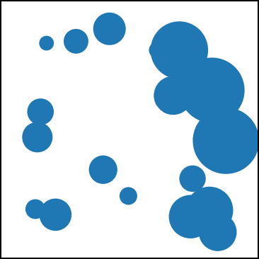{width="23.5%"} 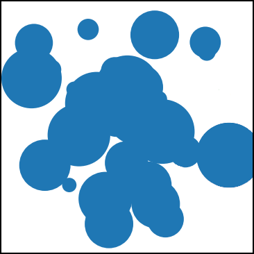{width="23.5%"} 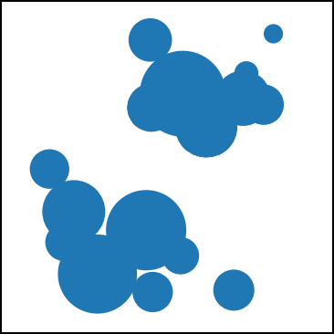{width="23.5%"} 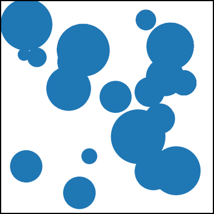{width="23.5%"}\
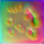{width="23.5%"} 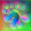{width="23.5%"} 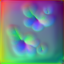{width="23.5%"} 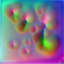{width="23.5%"}

::: caption
Obstacle map encoding using U-Net encoder. Top row shows test environments with obstacles in blue. Bottom row visualizes the corresponding encoded obstacle feature maps by mapping the first three principal components of each feature onto the RGB channels. Feature maps contain structure reminiscent of a Voronoi decomposition and also appear to encode distance to obstacles.
:::
::::

Note also that the map encoder $G_\theta$ does not depend on $t$, so at test time, the encoded map $G_\theta(\mathcal{E})$ is reused across iterations during the reverse diffusion process.

## Global Localization {#sec:observation-conditioning}

:::: {#fig:loc-feature-sampling .figure latex-placement="tb"}
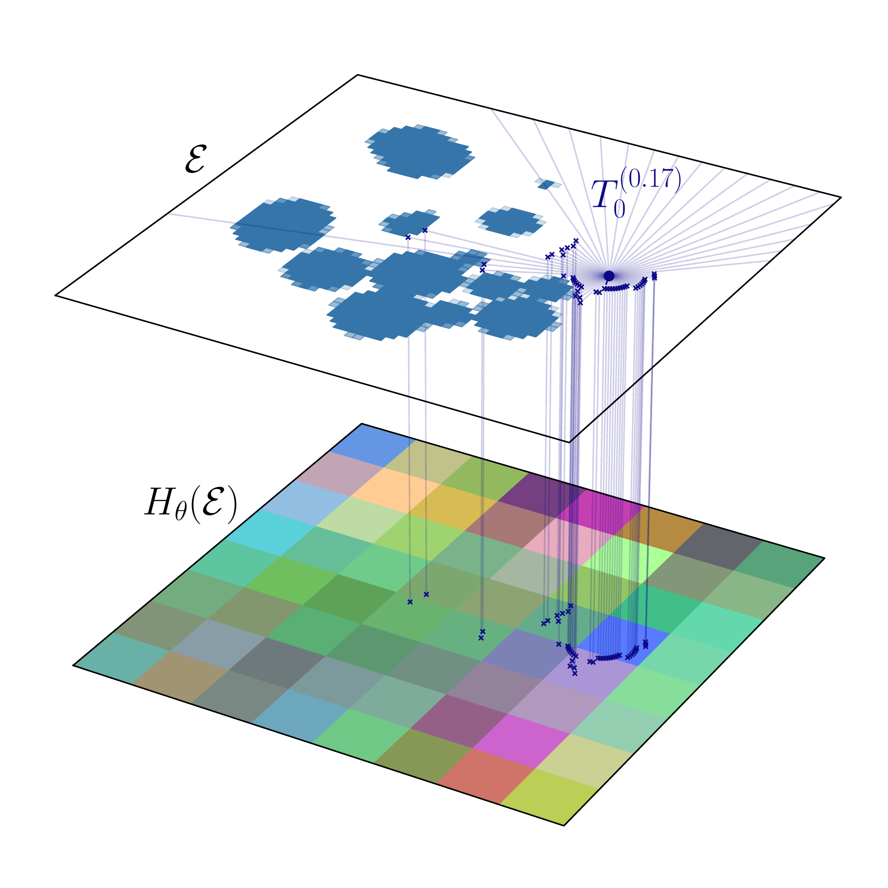{width="47.8%"} 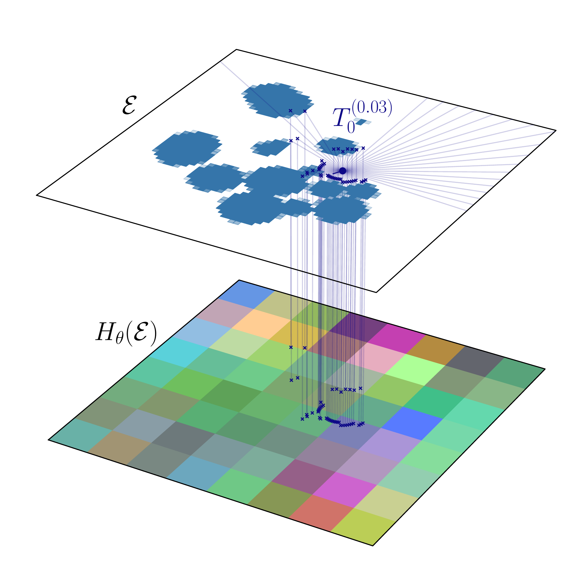{width="47.8%"}

::: caption
Sensor observation conditioning for global localization. Given the (noisy) start pose $T_0^{(t)}$ and LIDAR observation $\mathcal{O}$, we calculate the termination position of each ray to determine the location at which to sample the localization feature map $H_\theta(\mathcal{E})$. The concatenation of the sampled features serves as conditioning for the denoising network.
:::
::::

Similar to the local conditioning strategy for obstacle avoidance from [3.2](#sec:obstacle-conditioning){reference-type="ref+label" reference="sec:obstacle-conditioning"}, we introduce an environment map encoder $H_\theta: \operatorname{\mathbb{R}}^{H \times W} \rightarrow \operatorname{\mathbb{R}}^{d_{\text{loc}}
  \times H' \times W'}$ and again adopt a conditioning method based on sampling the feature map $H_\theta(\mathcal{E})$. In this case, we sample the feature map at the termination position of each LIDAR ray, assuming the (noisy) start pose of the trajectory, $T_1^{(t)}$, as the reference frame. This yields $N_\text{rays}$ features, which are concatenated and fed to the denoising U-Net via FiLM conditioning. This process is illustrated in [4](#fig:loc-feature-sampling){reference-type="ref+label" reference="fig:loc-feature-sampling"}.

## Joint Localization and Planning {#sec:joint-loc-plan}

We train $F_\theta$, $G_\theta$, and $H_\theta$ jointly by minimizing a score matching loss [\[eq:dsm\]](#eq:dsm){reference-type="eqref" reference="eq:dsm"}. Weights $\lambda_t$, noise schedule $\sigma(t)$, and distribution of samples of $t$ during training are chosen following the EDM framework of Karras et al. [@karras2022elucidating].

At test time, the model is given a novel environment map $\mathcal{E}$, a sensor observation $\mathcal{O}$, and a goal pose in the global map frame $\mathcal{G}$. Sampling from the reverse diffusion process then produces an estimated path in the global map frame, ideally starting from a correct estimate of the current location according to the LIDAR measurements and traversing the environment towards the specified goal.

As in *Diffuser* [@janner2022planning], we additionally implement an incremental sampling strategy which leverages previously generated plans to warm-start the diffusion process. In an online replanning setting, this allows us to apply a small amount of noise to the previous path, requiring a much smaller number of denoising iterations to replan with updated observations. We highlight that this approach also prevents "mode confusion": from-scratch planning in each frame can lead to samples coming from different modes of the distribution of plans, while a warm start serves as a form of conditioning on the previous solution that we observe to prevent unnecessary mode switches.

# Dataset Generation {#sec:dataset-generation}

Our training dataset consists of smooth, obstacle-free paths traversing cluttered 2D environments between randomized start and goal positions. Each example scenario is generated by placing a variable number of circular obstacles of randomized position and radius. We render the obstacle map to a $64~\times~64$ pixel bitmap serving as the environment map $\mathcal{E}$. The vector of LIDAR ray lengths $\mathcal{O}$ is computed by casting 64 rays in the rendered environment map $\mathcal{E}$, starting from the ground truth start position until hitting an obstacle.

The reference path $\mathbf{T}^*$ is generated in three steps: shortest path search, spline fitting and optimization, and heading assignment. First, an A\* search attempts to find the shortest obstacle-free path between start and goal on a discrete grid. If the search succeeds, the second step fits a 2D cubic B-spline to the A\* path, and then optimizes it considering obstacle avoidance and and length minimization costs. This step is implemented as a nonlinear optimizations using the Ceres [@Agarwal_Ceres_Solver_2022] library.

In a final step, we assign the heading along the path by randomly choosing a start heading and linearly (as a function of arclength) interpolating it towards the tangent heading at the goal position. We also perform collision checks of the final optimized spline and discard the scenario if the optimization in the third step produced an invalid result. [5](#fig:example-scenarios){reference-type="ref+label" reference="fig:example-scenarios"} shows a random selection of scenarios produced by the procedure described in this section.

:::: {#fig:example-scenarios .figure}
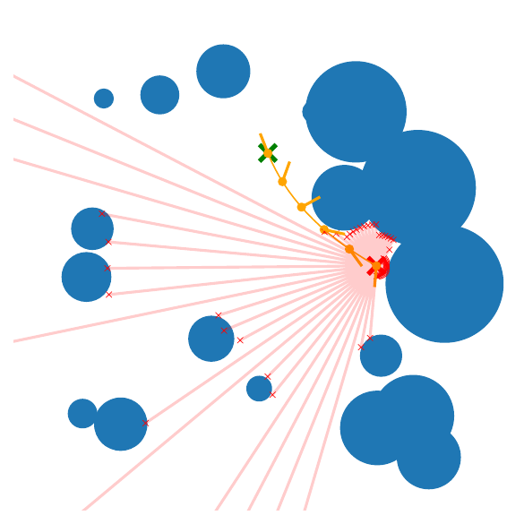{width="32%"} 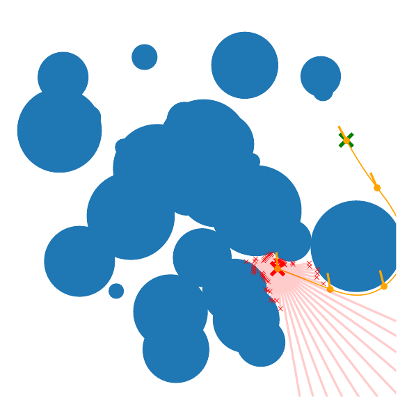{width="32%"} 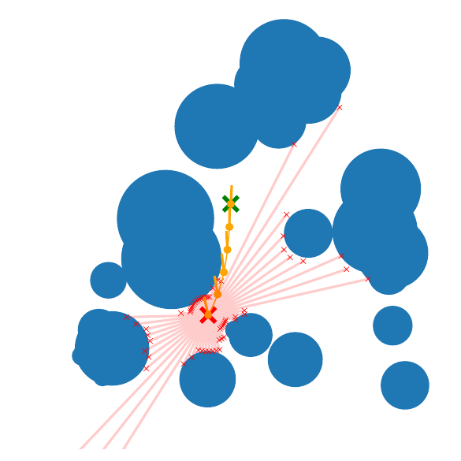{width="32%"}

::: caption
Random example scenarios produced by dataset generation procedure. Obstacles shown in blue, expert trajectory produced by B-spline optimization shown in orange, and LIDAR scan shown in red.
:::
::::

# Implementation and Evaluation

We evaluate our model first on the pure localization task to verify the effectiveness of the proposed conditioning technique, assessing global localization accuracy, generalization to out-of-distribution environments, and distributional modeling capability. We then demonstrate our model on the full navigation task consisting of joint global localization and planning, starting with a quantitative evaluation of success rate on our synthetic dataset and ending with an application to real-time closed-loop control in a realistic scenario. All reported runtimes are measured on an NVIDIA RTX A5000 GPU, and models are trained on two RTX A6000 GPUs for one week.

## Implementation Details

The first three layers of a ResNet-18 [@he2016deep] network are used as the environment and localization encoders $G_\theta$ and $H_\theta$, producing $8 \times 8$ feature maps from the $64
\times 64$ input obstacle maps. To generate the high resolution feature maps shown in [3](#fig:env-feature-maps){reference-type="ref+label" reference="fig:env-feature-maps"}, we train a model using a larger U-Net as the environment encoder, but find it does not significantly improve planning or localization performance. The pose denoising network $F_\theta$ is a 1D U-Net with three down-/upsampling and stages and four ResNet blocks in each stage.

## Global Localization {#global-localization}

Next, we evaluate the quality of a diffusion-based global localization model. This model leverages the LIDAR observation conditioning described in [3.3](#sec:observation-conditioning){reference-type="ref+label" reference="sec:observation-conditioning"} to condition a denoising multilayer perceptron with 6 layers of size 1024 (instead of the 1D U-Net used for path diffusion) to estimate the pose of the sensor in the global map frame. Conditioning is performed by concatenation to the input pose.

:::: {#fig:loc-metrics .figure latex-placement="tb"}
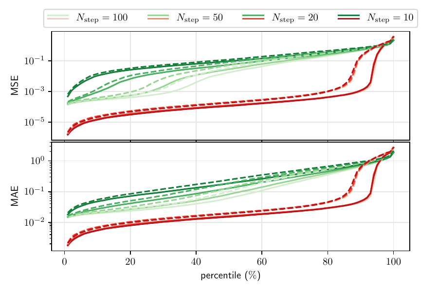{width="\\linewidth"}

::: caption
Localization accuracy metrics. Green traces correspond to raw model output, red traces apply simple KDE-based selection based on $64$ samples. Solid traces correspond to evaluation on environments containing only circular obstacles, dashed traces to environments containing only rectangular obstacles. $N_{\text{step}}$ specifies the number of denoising steps used in the reverse diffusion process.
:::
::::

:::: {#fig:loc-failure-cases .figure latex-placement="tb"}
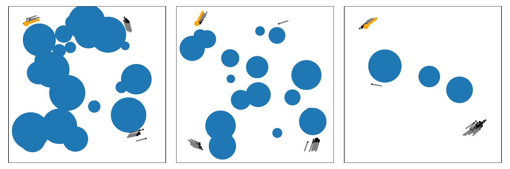{width="\\linewidth"} {width="\\linewidth"}

::: caption
Typical localization failure behavior corresponding to the far right end of the plots from [6](#fig:loc-metrics){reference-type="ref+label" reference="fig:loc-metrics"}. Note that failure scenarios contain symmetry or potentially ambiguous elements and model output degrades by gracefully producing multimodal output, including samples of the correct mode.
:::
::::

**Global localization accuracy.** We first evaluate the global localization model on a set of $8192$ unseen test examples produced according to the randomized scenario generation procedure described in [4](#sec:dataset-generation){reference-type="ref+label" reference="sec:dataset-generation"}. For each scenario, we sample $64$ poses and compute mean-squared error (MSE) and mean absolute error (MAE) in position. We additionally perform kernel density (KDE) estimation with a Gaussian kernel and report MSE and MAE for the sample with the highest estimated probability. [6](#fig:loc-metrics){reference-type="ref+label" reference="fig:loc-metrics"} presents MSE and MAE for both the raw model samples as well as the KDE estimate. Note that with the simple KDE filtering strategy, the model achieves high localization accuracy of within $2\%$ of the true position in over $88\%$ of scenarios. See [7](#fig:loc-failure-cases){reference-type="ref+label" reference="fig:loc-failure-cases"} for examples of behavior in failure cases.

**Performance.** While increasing the number of denoising iterations $N_{\text{iter}}$ significantly improves the accuracy of each individual raw sample, note that with the proposed KDE-based sample selection there is no noticeable drop in sample quality when reducing $N_{\text{iter}}$ dramatically from 100 to 10. Our unoptimized implementation can produce 512 samples with 10 denoising iterations in about 80 ms.

:::: {#fig:qualitative-loc-eval .figure latex-placement="htb"}
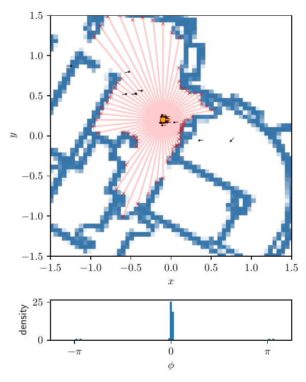{width="24%"} 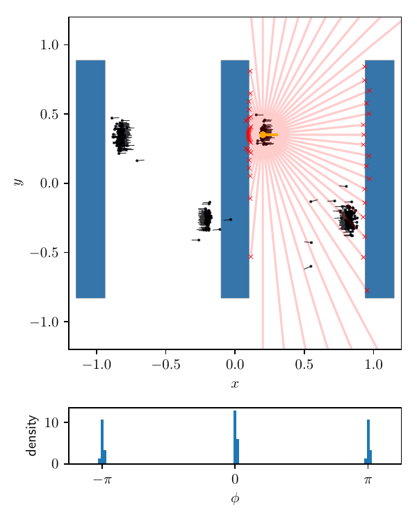{width="24%"} 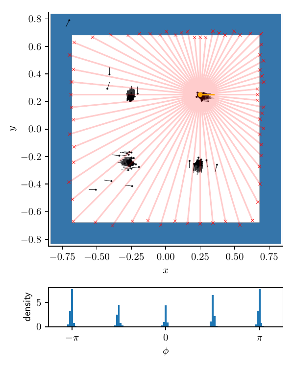{width="24%"} 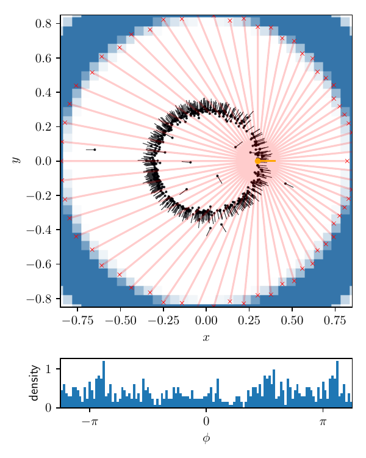{width="24%"}\
{width="50%"}

::: caption
Localization in hand-designed environments. The LIDAR observation is plotted in the coordinate frame of the ground truth pose for visualization purposes. The bottom row shows a histogram of predicted headings $\phi$ (ground truth heading is zero in each scenario). The map in the leftmost scenario is derived from a floorplan to illustrate transfer to real-world environments, while the three remaining scenarios are designed to illustrate behavior in ambiguous scenarios.
:::
::::

**Out-of-distribution scenarios.** We implement rectangular obstacles instead of the circular obstacles from [4](#sec:dataset-generation){reference-type="ref+label" reference="sec:dataset-generation"}, according to a similar random generation procedure. Note that we do not train the model on any such environments, yet localization accuracy remains comparable to the circular obstacle cases in the top $80\%$ of scenarios. We refer again to [6](#fig:loc-metrics){reference-type="ref+label" reference="fig:loc-metrics"} for detailed metrics.

**Qualitative evaluation.** In [8](#fig:qualitative-loc-eval){reference-type="ref+label" reference="fig:qualitative-loc-eval"} we further analyze a few hand-designed scenarios that are either (i) of significantly different appearance than the automatically generated circle/rectangle scenarios used previously, or (ii) exhibit symmetries that cause the global localization problem to become degenerate, admitting more than one solution. We find that the model is able to generalize to unseen classes of obstacle maps such as realistic floorplans. In scenarios with symmetries, we find that the diffusion model is able to produce samples that span all possible solution classes.

## Joint Localization and Planning {#joint-localization-and-planning}

:::: center
::: {#tab:nav-results}
+-------------+-----------------------------------------------------+------------------+
|             | Success rate \[$N_{\text{iter}} =$ 5/15/50\] (%)    |                  |
+:============+:========================:+:========================:+:================:+
| 2-3         | 2% loc. tol.             | 5% loc. tol.             | Length incr. (%) |
+-------------+--------------------------+--------------------------+------------------+
| Circular    | 81.3/83.4/83.6           | 88.1/89.1/88.6           | 0.5              |
+-------------+--------------------------+--------------------------+------------------+
| Rectangular | 64.5/66.4/68.9           | 76.8/77.7/79.9           | ---              |
+-------------+--------------------------+--------------------------+------------------+
| Both        | 73.0/73.2/73.8           | 82.6/83.2/82.6           | ---              |
+-------------+--------------------------+--------------------------+------------------+

: Joint global localization and planning in synthetic environments. When both obstacle types are used, the class of each obstacle is selected at random with equal probability. "Success" implies a well-formed, collision-free path and correct global localization within the stated tolerance. Length increase reported is total length of model solution paths wrt. model-based planner solution and is therefore only available for circular obstacle environments.
:::
::::

To evaluate the performance of our full model jointly solving the global localization and path planning problems, we first consider success rates on $512$ individual in- and out-of-distribution synthetic examples unseen during training. We then demonstrate how warm-starting the diffusion process can yield a real-time online replanning strategy.

**Synthetic environments.** [1](#tab:nav-results){reference-type="ref+label" reference="tab:nav-results"} lists the results of the evaluation on the synthetic circles and rectangles datasets. For each scenario, we draw 64 samples with $N_{\text{iter}}$ denoising iterations from the diffusion model and again employ a Gaussian KDE based sample selection strategy: the sampled trajectory whose initial pose $T_0^{(0)}$ has the highest probability according to the KDE result is used. Additionally, we reject any samples that collide with obstacles.

**Success criteria.** We define a successful output as having a localization error of less than certain absolute deviation in each $x$, $y$, and the heading $\phi$. Note that a 2% deviation in position approximately corresponds to the size of one pixel in the rasterized environment map, so we do not evaluate tolerances lower than that. We deem a path as colliding if it intrudes by more than half a pixel width into the obstacles, with this collision check being performed with respect to the ground truth geometric collection of obstacles instead of the rasterized environment.

**Generalization to arbitrary environment maps.** Note that we implement only support for circular obstacles in our model-based planner, and therefore, our training data consists only of environments composed of circular obstacles. Since the model is conditioned on arbitrary environment maps, in [1](#tab:nav-results){reference-type="ref+label" reference="tab:nav-results"} we evaluate its performance also in environments composed of circular *and* rectangular obstacles. We observe a modest drop in success rate when evaluated with the higher 5% tolerance for localization error, although there is a more pronounced drop when considering the tighter 2% threshold in scenarios with only rectangular obstacles.

**Performance.** As shown in [1](#tab:nav-results){reference-type="ref+label" reference="tab:nav-results"}, minimal degradation in success rate and solution quality is observed when using only 5 denoising iterations. Interestingly, the more out-of-distribution rectangle-only scenarios appear to benefit more from a higher number of denoising iterations, while the scenarios containing circles do not experience a noticeable improvement in quality even when increasing the number of denoising iterations dramatically. When reducing the number of denoising iterations to 4 or lower, the resulting paths are noisy and global localization accuracy begins to suffer. With 5 denoising iterations, drawing 64 samples from our unoptimized implementation of the joint global localization and planning diffusion model takes 140 ms.

:::: {#fig:qualitative-nav-eval .figure latex-placement="htb"}
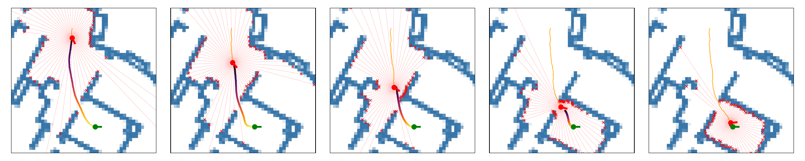{width="\\linewidth"} 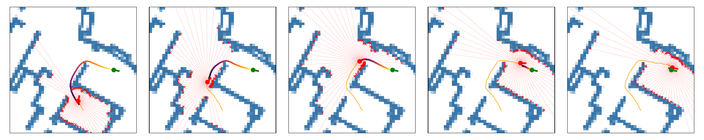{width="\\linewidth"}

::: caption
Navigation with continuous replanning in floorplan environment. Fixed goal pose (green), obstacle map (blue) and egocentric LIDAR scans serve as conditioning to the diffusion navigation model, which produces a globally referenced path (multicolored). True vehicle pose is shown in red. Trace of true position shown in orange.
:::
::::

**Closed loop control.** We deploy the diffusion model for control of the simple system ${\mathrm{d}x} = u(t) {\mathrm{d}t} + \mathbf{S}
{\mathrm{d}B}_t$ with state $x(t) \in {\mathrm{SE}(2)}$, control input $u(t) \in
\operatorname{\mathbb{R}}^3$, Brownian motion ${\mathrm{d}B}_t$, and noise scale $\mathbf{S} =
\text{diag}(\sigma_{xy}^2, \sigma_{xy}^2, \sigma_\phi^2))$. We set $\sigma_{xy}^2 = 0.1$ and $\sigma_\phi^2 = 0.05$. The control input $u(t)$ is computed directly from the predicted path by finite differencing the first two returned poses. We run the full diffusion process only in the first frame, and warm-start using the previous solution in subsequent replanning iterations. As mentioned in [3.4](#sec:joint-loc-plan){reference-type="ref+label" reference="sec:joint-loc-plan"} this not only improves computation efficiency significantly, but also leads to better behavior by leveraging implicit conditioning on the previous solution to improve temporal consistency of subsequent plans. [9](#fig:qualitative-nav-eval){reference-type="ref+label" reference="fig:qualitative-nav-eval"} shows two examples of closed-loop navigation in a realistic environment using this approach.

We also evaluate this replanning and control scheme on the synthetic environments, with a single denoising iteration in each warm-started frame. Out of those environments for which global localization in the first frame succeeds, we find that the model can successfully navigate the vehicle to the goal pose in 90% (circular obstacles only), 87% (rectangular obstacles only) and 87% (both obstacle types) of cases.

**Online replanning performance.** Using warm start, we only perform a single denoising iteration on a single sample and reuse the environment map encodings. We can perform such an online replanning step in 16 ms, enabling our planning loop to run in real-time at around 60 Hz.

# Conclusions & Future Work

In this work we have developed a diffusion-based model which can jointly perform global localization on a given map using LIDAR observations and plan a collision-free path. We demonstrate that the diffusion framework's powerful distributional modeling abilities enable the model to gracefully handle degenerate scenarios where multiple solutions may exist. Furthermore, we find the proposed conditioning strategies effectively allow our model, trained only on a narrow set of synthetic examples, to navigate realistic floorplans and other out-of-distribution scenarios.

While we show that we can already successfully deploy this model for end-to-end online replanning and control tasks, we identify several directions for future work. First, we would like to extend our joint localization and planning model for prediction of multiple timesteps in order to enable the model to better leverage the coupling of perception and control through methods like *Diffusion Forcing* [@chen2024diffusion]. Next, it would be interesting to explore the full navigation problem including mapping, instead of relying on the availability of a map, as well as extensions of our method to ${\mathrm{SE}(3)}$ with camera images instead of LIDAR scans. Additionally, it would be interesting to investigate the use of test-time guidance [@song2023loss] instead of or in combination with the current conditional diffusion model. Finally, we would like to reconsider the need of an expert planner for dataset generation by instead training our model for use on vehicles with more complex dynamics using online reinforcement learning.

We hope that our work on joint global localization and planning can be a useful stepping stone towards generalizable and robust end-to-end navigation, enabling the learning of richer behavior than traditional navigation pipelines that rely on decoupled perception and planning.

[^1]: $^{1}$Laboratory for Information and Decision Systems, Massachusetts Institute of Technology, Cambridge, MA. `{llb, sertac}@mit.edu`
