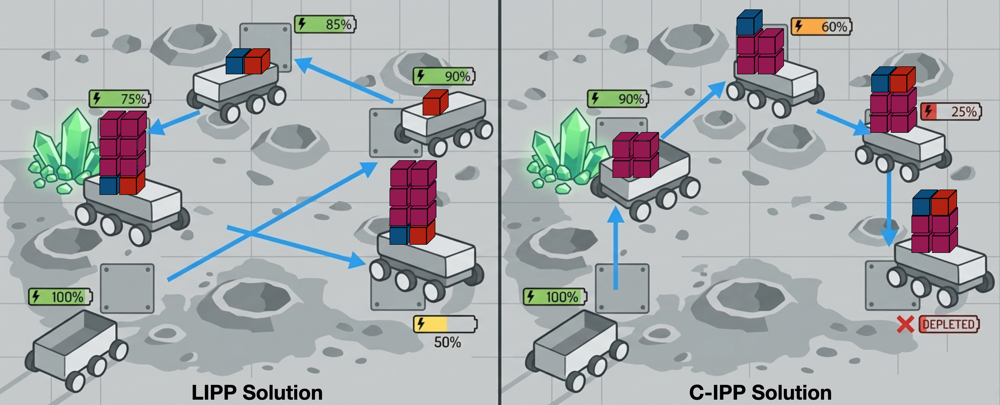
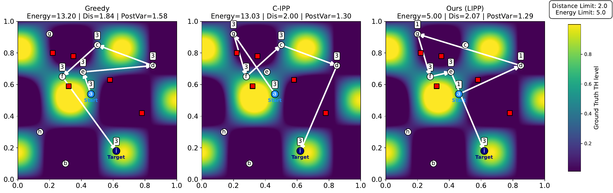
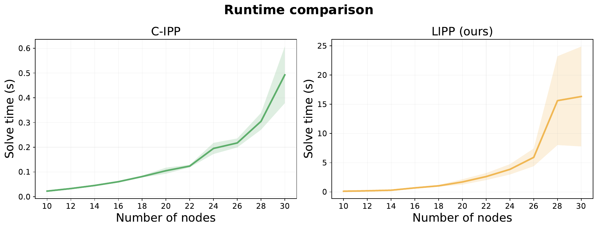

# Introduction

Robotic exploration missions increasingly rely on autonomous systems to gather information in environments where human access is limited or impossible. For example, in planetary surface exploration [@10783051], environmental monitoring [@Das], or precision agriculture [@van_Essen_2025], these systems must continually decide where to move and what data to collect while operating under strict resource limitations. Informative Path Planning (IPP) provides a principled framework for solving such decision-making problems by enabling robots to find paths that maximize information gain under travel cost constraints.

In classical IPP(C-IPP) formulations, sensing is modeled as a digital operation: measurements such as images, radiation levels, or temperature readings are acquired without altering the robot's physical state. Under this assumption, traversal cost mainly depends on geometric path length. As a consequence, energy and distance are not distinguished, and minimizing path length often serves as a reasonable surrogate for minimizing energy consumption. However, this abstraction breaks down in missions involving physical sample acquisition. Consider a lunar rover collecting regolith samples for laboratory analysis. Each additional sample increases the rover's payload, raising the energy cost of all subsequent motion. The same effect arises for surface vehicles accumulating water samples or drones retrieving agricultural specimens for field inspection. In each of these settings, information is acquired in the form of physical samples rather than purely digital observations, and each collected sample modifies the robot's physical state in a way that persists over the remainder of the mission.

:::: {#fig:example .figure latex-placement="t"}
{width="\\columnwidth"}

::: caption
Illustration of load-aware (LIPP) and load-unaware (C-IPP) planning in a regolith sampling mission in which planetary rovers collect and store physical soil samples. As the rover gathers multiple samples at a scientifically important site, (where minerals are concentrated in the figure) the accumulated payload increases the energy required for the remainder of the journey. C-IPP does not account for this effect during planning, often producing distance-efficient but energy-inefficient paths. In contrast, LIPP explicitly models the evolving load and introduces an additional decision dimension: how much material to collect at each visited location. This added flexibility enables LIPP to allocate more samples to high-value regions while maintaining or even reducing the overall energy budget, resulting in greater information gain per unit of energy expended compared to classical distance-based planning.
:::
::::

In addition, many real-world missions require the collection of multiple physical samples at scientifically significant locations, introducing an additional decision dimension: how many samples to collect at each site. Together, these factors fundamentally alter the planning problem. Traversal cost becomes payload-dependent, and the energy cost of collecting a sample depends on when it is acquired along the route; collecting heavily at an important location early in the mission raises the energy cost of all subsequent motion, whereas deferring collection can reduce total energy expenditure even if it results in a longer geometric path. Consequently, routing decisions, visitation order, and sampling amount become tightly intertwined. Unlike C-IPP, which optimizes only when and where to measure under static traversal costs, in our setting, there is a coupling between uncertainty reduction and energy consumption through decision variables that jointly determine when, where, and how much to (physically) sample. To this end, we propose Load-aware IPP(LIPP), a more general version of the C-IPP formulation that explicitly models the impact of physical sample mass on energy consumption.

The main contributions of this paper are as follows:

- We propose LIPP, a new class of IPP problem in which the amount of physical sampling affects estimation uncertainty and induces load-dependent, order-sensitive traversal costs.

- We propose an MIQP-based formulation for LIPP.

- We derive theoretical bounds quantifying the path-length loss in LIPP w.r.t. distance-optimal solutions.

- We validate the proposed LIPP formulation through extensive simulations and show the effectiveness of our proposed approach.

# Related Work

IPP has been widely applied to environmental monitoring, spatial field estimation, and target tracking, where paths are optimized under resource constraints to reduce estimation uncertainty or to accurately recover distributional statistics (e.g., quantiles) of the underlying field [@9832756; @Hitz2017AdaptiveCI; @Rueckin2022AdaptiveIPP; @Hollinger2014SamplingBased; @JakkalaAOA26; @shi2023robust; @shek2024drop]. Most existing formulations assume digital measurements with fixed sensing cost, leading to a weak coupling between sensing and motion. In contrast, several applications involve physical sample collection, where robots gather material samples rather than purely digital observations. Prior work in such settings has either focused on determining whether a sample is worth collecting under limited storage capacity and remaining unexplored regions---resembling secretary or knapsack-style selection problems [@Das; @Luo2017; @Farley2020]---or on developing integrated in-loop automation systems capable of sampling and analysis while assuming energy constraints are negligible [@11284891]. These approaches emphasize capacity management or system integration, rather than modeling the continuous interaction between repeated sampling decisions and load-dependent energy expenditure along the path.

Separately, routing problems with load-dependent travel costs have been studied in the operations research literature. Representative examples include pickup-and-delivery problems, vehicle routing with load-dependent fuel consumption, and the Traveling Thief Problem (TTP), where item selection directly influences travel speed or cost [@6557681; @Bektas2011PollutionRouting; @Zachariadis2015LoadDependentVRP]. These formulations explicitly capture the coupling between carried load and traversal effort, typically balancing transportation cost against profit or service objectives. However, in these settings, energy or fuel consumption is treated purely as an operational cost accumulated deterministically along a route, rather than as part of a sequential decision process that trades off information gain and future mobility. Moreover, they generally assume a fully known environment with deterministic rewards, and their objective is cost--profit optimization rather than uncertainty reduction. Consequently, they do not incorporate adaptive information gathering or the estimation-theoretic structure that underpins informative path planning.

Existing IPP methods do not jointly model repeated physical sampling and cumulative load-dependent traversal energy, while routing formulations with load-dependent travel costs do not incorporate probabilistic field estimation or information-theoretic objectives. Our work bridges these two directions by integrating load-dependent energy consumption into informative path planning for spatial field estimation, yielding a tightly coupled optimization problem that simultaneously determines sampling amount, traversal order, and uncertainty reduction.

# Problem Formulation

## Problem Setup

Consider a robot capable of collecting physical samples operating within a closed and bounded region $\chi \subset \mathbb{R}^2$. We discretize $\chi$ into a weighted directed graph $G := (V, \mathcal{E}, d)$, where $V$ is a set of $n$ admissible sampling locations, $\mathcal{E} \subseteq V \times V$ is a set of directed edges, and $d : \mathcal{E} \rightarrow \mathbb{R}^{+}$ denotes the traversal cost per unit carried load along each directed edge. The cost function $d$ may incorporate environment-dependent factors such as terrain slope or surface roughness for planetary rovers, as well as wind or water currents for aerial and aquatic robots.

In addition to the sampling vertices $V$, we define a set of $m$ test locations $T \subset \chi$ at which we aim to estimate an unknown static scalar field $f : \chi \rightarrow \mathbb{R}$. We model the field $f$ as a Gaussian Process (GP), $f \sim \mathcal{GP}(0, k),$ where $k : \chi \times \chi \rightarrow \mathbb{R}$ is a known positive definite covariance kernel, similar to many GP-based IPP formulations [@gp].

The robot is assigned a start vertex $s \in V$ and a target vertex $t \in V$. The planner produces a path for the robot, $P = \bigl\langle (v_{1},\, l_{1}), (v_{2},\, l_{2}), \dots, (v_{p},\, l_{p}) \bigr\rangle,$ where $v_{1} = s$, $v_{p} = t$, $(v_{j}, v_{j+1}) \in \mathcal{E}$ for all $j = 1,\dots,p-1$, and $l_{j} \in \{0,1,\dots,S_{\max}\}$ denotes the number of unit-mass physical samples collected at vertex $v_{j}$.\
**Problem 1** *Load-Aware IPP(LIPP)*\
Given a set of test locations $T$, determine a path $P$ consisting of $(\text{vertex},\, \text{sample amount})$ tuples that minimizes the posterior uncertainty of the test locations subject to an accumulated energy budget: $$\begin{align*}
\min_{P} \quad & \operatorname{PostVar}_{T}(P) \\
\text{s.t.} \quad & \operatorname{Energy}(P) \le B.
\end{align*}$$ Here, $B$ denotes the available energy budget, and $\operatorname{PostVar}_{T}(P)$ represents the trace of the posterior covariance matrix of the GP evaluated at $T$ after collecting samples along path $P$.

## Measurement Noise and Energy Model

Conventional IPP formulations assume that the robot acquires a single digital noisy measurement $y_j$ at each visited vertex $v_j$, with constant measurement noise variance: $$\begin{equation}
y_j = f(v_j) + \eta_j,
\qquad
\eta_j \sim \mathcal{N}\!\left(0, \sigma^2\right),
\label{eq:measurement_model_1}
\end{equation}$$ where $\sigma^2$ denotes the variance of the measurement noise associated with each sample.

In realistic sampling settings, where repeated sampling is allowed, collecting multiple independent samples at the same vertex can reduce the effective measurement noise variance due to the variance-reduction effect of averaging independent observations [@MoodIntroStat]. To capture this effect, we adopt the following measurement model: if $l_j \in \mathbb{Z}_{\ge 0}$ samples are collected at vertex $v_j$, then the resulting measurement noise is modeled as $\eta_j \sim \mathcal{N}\!\left(0, \frac{\sigma^2}{l_j}\right).$ However, acquiring additional samples also increases the load carried by the robot. Consider a path consisting of an ordered sequence of vertices $\{v_1, \dots, v_p\}$, where $l_j \in \{0,1,\dots,S_{\max}\}$ denotes the number of unit-mass samples collected at vertex $v_j$. Let $\lambda$ denote the unit mass of a sample and $R_0$ denote the mass of the robot without any samples. Then, the cumulative mass of the robot at the $i$-th vertex is defined as $R_i := \sum_{j=1}^{i} (\lambda l_j)  + R_0.$ Using this, we define the total energy expenditure along the path as $$E :=
\sum_{j=1}^{p-1}
d(v_j, v_{j+1}) \, R_j,$$ where $d(v_j, v_{j+1})$ denotes the travel cost between consecutive vertices. This formulation provides a first-order approximation of load-dependent energy consumption based on the relation $E = \text{force} \times \text{distance}$, assuming that the dominant traversal forces (e.g., friction and gravity) scale linearly with the robot mass.

Note that the proposed load-aware formulation strictly generalizes C-IPP. In particular, when the robot base mass is normalized to $R_0 = 1$ and the sample unit mass approaches zero $\lambda \to 0$, the cumulative mass satisfies $R_j \to 1$ for all $j$. In this limit, the energy model reduces to $E(P) = \sum_{j=1}^{p-1} d_j$, and the energy budget constraint becomes equivalent to the standard distance budget constraint used in C-IPP: $\sum_{e} d(e)\chi_e \le b$. Therefore, C-IPP can be viewed as a special case of the proposed LIPP formulation in which sampling does not affect mobility.

## Objective Function

We quantify information using the posterior variance [@10916979] over the test set, $$\begin{equation}
\operatorname{PostVar}_{M}^T(P)
=
\operatorname{trace}\!\left(
M \, \bar{k}_{TT}
\right),     
\label{eq:postvar_1}
\end{equation}$$ where $M \in \mathbb{R}^{m \times m}$ is a diagonal weight matrix representing the importance of each test vertices. The posterior covariance matrix given by kernel is $$\begin{equation}
\bar{k}_{TT}
=
k_{TT}
-
k_{TV}
\left(
k_{VV} + N
\right)^{-1}
k_{VT},
\end{equation}$$ where $k_{VV} \in \mathbb{R}^{n \times n}, \quad
k_{TV} \in \mathbb{R}^{m \times n},$ and $N \in \mathbb{R}^{n \times n}$ is a diagonal noise matrix whose entries depend on the sampling amount decision $l_j$, and its diagonal element is defined as $N_{jj}=\frac{\sigma^2}{l_j}$ using our new measurement noise model.

However, the objective in [\[eq:postvar_1\]](#eq:postvar_1){reference-type="eqref" reference="eq:postvar_1"} involves a matrix inverse whose entries depend nonlinearly on the discrete sampling decisions through $N$, resulting in a highly nonlinear and nonconvex problem, making such an inverse-based formulation not directly amenable to standard optimization solvers.

To address this, we leverage the equivalence between the GP posterior mean and the linear least-squares estimator (LLSE) under Gaussian assumptions (Theorem 5 in [@10916979]). Crucially, this is not a linear approximation of the GP posterior but an exact algebraic identity: under jointly Gaussian assumptions, the LLSE coincides with the conditional expectation, so the resulting reformulation preserves the original objective exactly. The key insight is that the optimal GP predictor at each test location is a linear combination of the observations at visited vertices; collecting this weight matrix into $A\in\mathbb{R}^{m\times n}$, the posterior covariance can be written as a polynomial in $A$ and $N$ without the matrix inverse.

Specifically, we introduce a mixed-integer formulation of Problem 1 as follows.

$$\begin{align}
\min_{A,N} \quad
& \operatorname{tr}\!\left(
M \bigl(A(k_{VV}+N)A^\top - 2k_{TV}A^\top + k_{TT}\bigr)
\right)
\label{eq:objective}
\\[4pt]
\text{s.t.}\quad
& \sum_{e\in\mathcal E_v^{\mathrm{in}}} \chi_e
=
\sum_{e\in\mathcal E_v^{\mathrm{out}}} \chi_e
\le 1
\label{eq:flow_conservation}
\\
& \sum_{e\in\mathcal E_s^{\mathrm{out}}} \chi_e = 1,
\quad
\sum_{e\in\mathcal E_t^{\mathrm{in}}} \chi_e = 1
\label{eq:start_target}
\\
& \sum_{e\in\mathcal E_s^{\mathrm{in}}} \chi_e = 0,
\quad
\sum_{e\in\mathcal E_t^{\mathrm{out}}} \chi_e = 0
\label{eq:no_backflow}
\\
& y_v = \sum_{e\in\mathcal E_v^{\mathrm{in}}} \chi_e
\label{eq:vertex_activation}
\\
& -A_{\max} y_v
\le
A_{t,v}
\le
A_{\max} y_v
\label{eq:A_activation}
\\
& o_s = 0
\label{eq:order_start}
\\
& 0 \le o_v \le |V|-1
\label{eq:order_bounds}
\\
& o_v \ge o_u + 1 - \mathcal{M}^{(o)}(1-\chi_{uv})
\label{eq:MTZ}
\\
& L_s = \lambda \sum_{c=1}^{S_{\max}} c\, z_{s,c}
\label{eq:load_start}
\\
& L_v \ge L_u + \lambda
\sum_{c=1}^{S_{\max}} c\,z_{u,c}
- \mathcal{M}^{(L)}(1-\chi_{uv})
\label{eq:load_propagation}
\\
& 0 \le L_v \le L_{\max}
\label{eq:load_bounds}
\\
& R_v = R_0 + L_v
\label{eq:robot_mass}
\\
& l_v = \sum_{c=1}^{S_{\max}} c\,z_{v,c}
\label{eq:load_definition}
\\
& \sum_{c=1}^{S_{\max}} z_{v,c} = y_v
\label{eq:sampling_activation}
\\
& \sum_{(u,v)\in\mathcal E} d_{uv} \,R_u\, \chi_{uv}
\le B
\label{eq:energy_budget}
\\
& \chi_e \in \{0,1\},
\quad e\in\mathcal E
\label{eq:chi_binary}
\\
& y_v \in \{0,1\},
\quad v\in V
\label{eq:y_binary}
\\
& z_{v,c} \in \{0,1\},
\quad v\in V,\; c=1,\dots,S_{\max}
\label{eq:z_binary}
\\
& A \in \mathbb R^{m\times n},\quad
l_v\in\mathbb Z_{\ge0},\quad
L_v\in\mathbb R_{\ge0},\quad
R_v\in\mathbb R_{\ge0}.
\label{eq:variable_domains}
\end{align}$$ where constraints [\[eq:flow_conservation\]](#eq:flow_conservation){reference-type="eqref" reference="eq:flow_conservation"} and [\[eq:vertex_activation\]](#eq:vertex_activation){reference-type="eqref" reference="eq:vertex_activation"} hold for all $v\in V\setminus\{s,t\}$, constraint [\[eq:A_activation\]](#eq:A_activation){reference-type="eqref" reference="eq:A_activation"} holds for all $t\in T$ and $v\in V\setminus\{s,t\}$, and constraints [\[eq:MTZ\]](#eq:MTZ){reference-type="eqref" reference="eq:MTZ"} and [\[eq:load_propagation\]](#eq:load_propagation){reference-type="eqref" reference="eq:load_propagation"} hold for all $(u,v)\in\mathcal E$.

In this formulation, $A \in \mathbb{R}^{m\times n}$ is a continuous decision variable representing the linear estimator matrix obtained from the LLSE reformulation. The discrete decision variables consist of: (i) binary edge variables $\chi_e$ indicating whether edge $e$ is selected, (ii) binary vertex variables $y_v$ indicating whether vertex $v$ is visited, (iii) binary sampling variables $z_{v,c}$ indicating whether $c$ unit samples are collected at vertex $v$, (iv) integer order variables $o_v$ representing the position of vertex $v$ along the path, (v) integer sample count variable $l_v$ representing the number of samples taken at vertex $v$, (vi) continuous load variables $L_v$ representing the mass of the cumulative sample load carried upon departing vertex $v$, and (vii) continuous mass variables $R_v$ representing the mass of the robot upon departing vertex $v$.

Constraints [\[eq:flow_conservation\]](#eq:flow_conservation){reference-type="eqref" reference="eq:flow_conservation"}--[\[eq:vertex_activation\]](#eq:vertex_activation){reference-type="eqref" reference="eq:vertex_activation"} encode the flow and path feasibility requirements. Specifically, [\[eq:flow_conservation\]](#eq:flow_conservation){reference-type="eqref" reference="eq:flow_conservation"} enforces flow conservation at intermediate vertices, [\[eq:start_target\]](#eq:start_target){reference-type="eqref" reference="eq:start_target"} and [\[eq:no_backflow\]](#eq:no_backflow){reference-type="eqref" reference="eq:no_backflow"} ensure a single outgoing edge from the start vertex and a single incoming edge to the terminal vertex, and [\[eq:vertex_activation\]](#eq:vertex_activation){reference-type="eqref" reference="eq:vertex_activation"} maintains consistency between vertex and edge activation variables. Constraint [\[eq:A_activation\]](#eq:A_activation){reference-type="eqref" reference="eq:A_activation"} links the estimator variables to the visitation decisions via a linear big-$M$ formulation, enforcing $A_{t,v}=0$ whenever vertex $v$ is not selected (i.e., $y_v=0$). Thus, estimator coefficients are active only at visited vertices.

We introduce ordering constraints to eliminate subtours and capture the order-dependent nature of the load--energy coupling induced by repeated physical sampling. Constraint [\[eq:order_start\]](#eq:order_start){reference-type="eqref" reference="eq:order_start"} fixes the order of the start vertex to zero, while [\[eq:order_bounds\]](#eq:order_bounds){reference-type="eqref" reference="eq:order_bounds"} bounds the order variable within $0$ and $|V|-1$. Constraint [\[eq:MTZ\]](#eq:MTZ){reference-type="eqref" reference="eq:MTZ"} enforces precedence along selected edges: if edge $(u,v)$ is active, then the order of vertex $v$ must be at least one greater than that of $u$. Here, $\mathcal{M}^{(o)}$ denotes a sufficiently large big-$M$ constant, e.g., $|V|$. Together, constraints [\[eq:order_start\]](#eq:order_start){reference-type="eqref" reference="eq:order_start"}--[\[eq:MTZ\]](#eq:MTZ){reference-type="eqref" reference="eq:MTZ"} form a Miller--Tucker--Zemlin (MTZ) subtour elimination scheme, preventing disconnected cycles and ensuring a single directed path from $s$ to $t$.

Lastly, we introduce the load and energy constraints. Constraint [\[eq:load_start\]](#eq:load_start){reference-type="eqref" reference="eq:load_start"} initializes the sample load at the start vertex to the load collected at the first vertex. Constraint [\[eq:load_propagation\]](#eq:load_propagation){reference-type="eqref" reference="eq:load_propagation"} ensures that the cumulative load at each visited vertex equals the load carried upon arrival plus the samples collected at that vertex. The Constraint [\[eq:load_bounds\]](#eq:load_bounds){reference-type="eqref" reference="eq:load_bounds"} bounds load variable within its feasible range, and Constraint [\[eq:robot_mass\]](#eq:robot_mass){reference-type="eqref" reference="eq:robot_mass"} defines the mass of the robot using the cumulative sample load and its initial mass. Constraint [\[eq:load_definition\]](#eq:load_definition){reference-type="eqref" reference="eq:load_definition"} defines the integer sampling amount $l_v$ at vertex $v$ in terms of the binary variables $z_{v,c}$, which is used in the noise matrix $N$ in the objective. Constraint [\[eq:sampling_activation\]](#eq:sampling_activation){reference-type="eqref" reference="eq:sampling_activation"} ensures consistency between vertex activation and sampling decisions by enforcing that exactly one sampling level is selected if and only if the vertex is visited. Finally, constraint [\[eq:energy_budget\]](#eq:energy_budget){reference-type="eqref" reference="eq:energy_budget"} imposes the total energy budget $B$, where the energy expenditure depends on both traversal distance and cumulative robot mass along the path.

With this formulation, we explicitly capture the coupling between uncertainty reduction from repeated sampling and the order-dependent energy cost induced by transporting the accumulated physical load. Nevertheless, the resulting optimization problem remains computationally challenging. The objective function is nonconvex due to the cubic term $A (k_{VV}+N) A^\top$, and the energy budget constraint [\[eq:energy_budget\]](#eq:energy_budget){reference-type="eqref" reference="eq:energy_budget"} contains bilinear terms in $R_u$ and $\chi_{uv}$. Consequently, the resulting formulation is a mixed-integer nonconvex program and is NP-hard. To enable an efficient solution using a commercial solver such as Gurobi, we next reformulate the problem into an equivalent MIQP by eliminating higher-order terms and linearizing the bilinear constraints through auxiliary variables and standard convexification techniques.

# Solution

**Mixed Integer Quadratic Programming Reformulation:** The objective in [\[eq:objective\]](#eq:objective){reference-type="eqref" reference="eq:objective"} contains the cubic interaction $z_{v,c}\,A_{t,v}^{2}$ arising from the product $A\,N\,A^{\top}$, where the diagonal noise matrix $N$ depends on the discrete sampling decisions through $z_{v,c}$. To reduce this to a quadratic program, we disaggregate each estimator coefficient into per-sampling-level components by introducing auxiliary continuous variables $$A_{t,v,c}\in\mathbb{R},
\qquad t\in T,\;v\in\mathcal V,\;c=1,\dots,S_{\max},$$ with the aggregation and big-$M$ linking constraints $$\begin{equation}
A_{t,v}
=
\sum_{c=1}^{S_{\max}} A_{t,v,c},
\qquad
-A_{\max}\,z_{v,c}
\;\le\;
A_{t,v,c}
\;\le\;
A_{\max}\,z_{v,c}.
\label{eq:A_aggregation_bigM}
\end{equation}$$ These constraints ensure $A_{t,v,c}=0$ whenever $z_{v,c}=0$, linking the estimator coefficients to the discrete sampling choices.

Because both $M$ and $N$ are diagonal, the trace objective $\operatorname{tr}\!\bigl(M(A(k_{VV}+N)A^{\!\top}
-2\,k_{TV}A^{\!\top}+k_{TT})\bigr)$ decomposes into a sum over test locations $t$. Expanding and substituting $N_{vv}=\sum_{c}^{S_{max}}\frac{\sigma^{2}}{c}\,z_{v,c}$ yields cubic terms of the form $\frac{\sigma^{2}}{c}\,z_{v,c}\,A_{t,v}^{2}$. By [\[eq:A_aggregation_bigM\]](#eq:A_aggregation_bigM){reference-type="eqref" reference="eq:A_aggregation_bigM"}, each such term is equivalently expressed as the quadratic $\frac{\sigma^{2}}{c}\,A_{t,v,c}^{2}$, since $A_{t,v,c}$ is nonzero only when $z_{v,c}=1$. The resulting MIQP objective is $$\begin{align}
\min_{A_{\cdot,\cdot,\cdot},\,z}\;
\sum_{t=1}^{m} M_{tt}
\Big(\,
&\sum_{v_1,v_2\in\mathcal V}
k_{VV}(v_1,v_2)\,
A_{t,v_1}\,A_{t,v_2}
\nonumber\\
&+\sum_{v\in\mathcal V}
\sum_{c=1}^{S_{\max}}
\frac{\sigma^2}{c}\,A_{t,v,c}^{2}
\nonumber\\
&-2\!\sum_{v\in\mathcal V}
k_{TV}(t,v)\,A_{t,v}
\;+\;
k_{TT}(t,t)
\Big).
\label{eq:MIQP_objective}
\end{align}$$

All constraints [\[eq:flow_conservation\]](#eq:flow_conservation){reference-type="eqref" reference="eq:flow_conservation"}--[\[eq:z_binary\]](#eq:z_binary){reference-type="eqref" reference="eq:z_binary"} carry over unchanged, except that the bilinear energy budget constraint [\[eq:energy_budget\]](#eq:energy_budget){reference-type="eqref" reference="eq:energy_budget"} is replaced by its exact McCormick linearization. Introducing auxiliary variables $T_{uv}\in\mathbb{R}_{\ge0}$ for every $(u,v)\in\mathcal E$, we write $$\begin{align}
\sum_{(u,v)\in\mathcal E} d_{uv}\, T_{uv}
&\;\le\; B,
\label{eq:energy_linearized}
\\[4pt]
T_{uv} &\le R_u,
\qquad
T_{uv} \le R_{\max}\,\chi_{uv},
\nonumber\\
T_{uv} &\ge R_u - R_{\max}\,(1-\chi_{uv}),
\qquad
T_{uv} \ge 0,
\label{eq:T_bounds}
\end{align}$$ where $R_{\max}=R_0+L_{\max}$. When $\chi_{uv}=1$ the envelope forces $T_{uv}=R_u$; when $\chi_{uv}=0$ it forces $T_{uv}=0$. Since $R_u\in[R_0,R_{\max}]$ is bounded and $\chi_{uv}$ is binary, the McCormick relaxation is exact, and the overall formulation remains an MIQP solvable by an off-the-shelf solver such as Gurobi.

# Analysis

Incorporating repeated physical sampling and load-aware energy modeling fundamentally changes the structure of the IPP problem, enabling improved energy efficiency while maintaining low posterior variance. These benefits, however, introduce trade-offs, including potentially longer geometric path lengths and increased computational complexity. Although path length no longer directly corresponds to total energy expenditure in the LIPP setting, it remains practically relevant as a proxy for mission execution time. In this section, we provide a theoretical analysis of the trade-offs.

## Theoretical Bound on Execution Path Length

We derive a worst-case bound on the execution path length of the LIPP formulation relative to the C-IPP formulation. The C-IPP formulation is equivalent to [\[eq:objective\]](#eq:objective){reference-type="eqref" reference="eq:objective"}--[\[eq:A_activation\]](#eq:A_activation){reference-type="eqref" reference="eq:A_activation"} with $N_{jj} = \sigma^2$ and the distance constraint $\sum_{e} d(e)\chi_e \le b$, matching the formulation presented in [@10916979]. Throughout the remainder of this section, C-IPP refers to this formulation.

Let $P_D$ denote a path generated by C-IPP and $P_E$ denote a path generated by the proposed LIPP formulation. We assume that: (i) the LIPP solution consumes no more total energy than the C-IPP solution, $E(P_E) \le E(P_D),$ and (ii) the C-IPP solution is distance-optimal under its distance budget constraint, thus $D(P_D) \le D(P_E)$. Let $S_{\max}$ denote the maximum number of unit samples allowed per vertex.

For a path $P = \langle v_1, \dots, v_p \rangle$, define the total energy and the conventional IPP travel cost as $$E(P) := \sum_{j=1}^{p-1} R_j d_j,
\qquad
D(P) := \sum_{j=1}^{p-1} d_j,$$ where $d_j$ is the travel cost of edge $(v_j, v_{j+1})$, and $R_j$ is the robot mass while traversing that edge.

Since the number of samples collected at each visited vertex ranges from $1$ to $S_{\max}$, and each unit sample contributes mass $\lambda > 0$, the accumulated mass after $j$ vertices satisfies $$R_0 + \lambda j 
\;\le\; 
R_j 
\;\le\; 
R_0 + \lambda S_{\max} j .$$ Therefore, for any path $P$ with $p$ vertices, $$\sum_{j=1}^{p-1} (R_0 + \lambda j)\, d_j
\;\le\;
E(P)
\;\le\;
\sum_{j=1}^{p-1} (R_0 + \lambda S_{\max} j)\, d_j .$$

Let $p_E := |P_E|$ and $p_D := |P_D|$ denote the number of vertices in the respective paths. Applying the bounds above to $P_E$ and $P_D$ and using $E(P_E) \le E(P_D)$ yields $$\begin{aligned}
\sum_{j=1}^{p_E-1} (R_0 + \lambda j)\, d_j^{(E)}
&\le E(P_E) \le E(P_D) \\
&\le \sum_{j=1}^{p_D-1} (R_0 + \lambda S_{\max} j)\, d_j^{(D)} .
\end{aligned}$$

:::: {#fig:th_heatmap_comparison .figure latex-placement="t"}
{width="\\textwidth"}

::: caption
Comparison of sampling strategies on a synthetic scalar field. The heatmap represents the ground-truth (GT) scalar function to be estimated. The numbers inside the white boxes indicate the number of samples taken at each vertex. (left) The Greedy method first moves to vertex e and then to vertex d, as these provide the greatest uncertainty reduction normalized by distance at each iteration. (center) C-IPP considers a global view, budgeting its distance to enable visiting vertex g. However, it visits the important region early in the path, resulting in greater energy usage. (right) LIPP not only visits the important vertices selected by C-IPP, but also chooses an order that allocates less sample-intensive regions earlier in the path, achieving comparable posterior variance while using significantly less energy.
:::
::::

Using $\sum_{j=1}^{p-1} j = \frac{(p-1)p}{2}$ and bounding the weighted sums in terms of total path length gives $$\left(R_0 + \lambda \tfrac{p_E}{2}\right) D(P_E)
\;\le\;
\left(R_0 + \lambda S_{\max} \tfrac{p_D}{2}\right) D(P_D).$$

Thus, $$\frac{D(P_E)}{D(P_D)}
\;\le\;
\frac{R_0 + \lambda S_{\max} \frac{p_D}{2}}
     {R_0 + \lambda \frac{p_E}{2}}.$$

Since $R_0 \geq 0$, $p_E \ge 2$, $p_D \ge 2$, and $S_{\max} \ge 1$, we upper-bound the numerator as $$R_0 + \lambda S_{\max} \frac{p_D}{2}
\le
S_{\max}\!\left(R_0 + \lambda \frac{p_D}{2}\right),
\quad
\text{since } (S_{\max}-1)R_0 \ge 0.$$

Consequently, $$\boxed{
\frac{D(P_E)}{D(P_D)}
\le
S_{\max}
\frac{R_0 + \lambda \frac{p_D}{2}}
     {R_0 + \lambda \frac{p_E}{2}}
}$$

which holds even when $p_E \neq p_D$, regardless of the underlying graph structure. In particular, when $p_E = p_D$, this reduces to $$\frac{D(P_E)}{D(P_D)} \le S_{\max}.$$ Additionally, it is worth noting that the path length can be explicitly controlled by introducing an additional linear constraint of the form $\sum_{(u,v)\in\mathcal E} d_{uv}\,\chi_{uv} \le b,$ where $b$ is a user-specified path-length budget. By doing so, it limits the execution time of the selected path while still optimizing load-dependent energy without adding the number of decision variables nor significantly increasing the total time complexity. Thus, we not only establish theoretical bounds on execution time for any arbitrary graphs, but also provide a simple mechanism to regulate execution time explicitly.

:::: {#fig:lambda .figure latex-placement="t"}
::: caption
Posterior variance reduction, total energy used, and posterior variance reduction per unit energy values averaged over 2000 randomly generated graphs with $R_0=1.0$ across different unit sample mass $\lambda$. (a) As the unit sample mass approaches zero, the energy constraint relaxes, and LIPP converges to the same posterior variance reduction as C-IPP. (b) As the unit sample mass increases, LIPP expends energy much more slowly than C-IPP and will be bounded by the threshold 2 energy units. (c) As the unit sample mass increases, LIPP achieves progressively greater reduction in posterior variance per unit energy used compared to C-IPP.
:::
::::

## Computational Complexity

Both formulations result in mixed-integer quadratic programs (MIQPs), but they differ in relaxation strength and solver behavior. In terms of nominal problem size, the C-IPP formulation scales as $O(m n^2)$, whereas the LIPP formulation introduces additional sampling-indexed variables and bilinear terms, increasing the size to $O(m n^2 S_{\max}^2)$.

In practice, however, the computational gap is driven less by polynomial growth and more by differences in relaxation quality. In the classical formulation, routing and sampling variables are largely separable, leading to comparatively tighter continuous relaxations. In contrast, the LIPP formulation---through the bilinear coupling introduced in Constraint (24)---links load accumulation, sampling decisions, and traversal order. When integrality constraints are relaxed, these interactions permit fractional routing and load propagation, which can weaken the resulting lower bound after linearization (e.g., via McCormick envelopes) [@Vielma2015]. A weaker root relaxation forces the branch-and-bound solver to explore a larger portion of the search tree to certify optimality. The empirical solve-time trends in Fig. [5](#fig:runtime){reference-type="ref" reference="fig:runtime"} suggest this behavior is realized in practice as problem size grows.

# Experimental Results

In this section, we empirically validate four key properties of the proposed LIPP formulation. First, LIPP selects a fundamentally different optimal vertex set than C-IPP under the energy constraint, rather than merely permuting visitation order or redistributing sampling effort over the same vertices identified by C-IPP. Second, when the unit sample mass $\lambda = 0$, LIPP coincides with C-IPP in information-energy efficiency (posterior variance reduction per unit energy), and strictly outperforms C-IPP as $\lambda$ increases. Third, beyond the worst-case theoretical guarantee, empirical results show that in practice, LIPP achieves comparable execution paths while consuming less energy than C-IPP in most reasonable budget scenarios, as the joint optimization of routing and sampling avoids wasteful over-collection. Lastly, we characterize the computational overhead introduced by the LIPP formulation relative to C-IPP, arising from the additional integer variables and weaker LP relaxations. We present both qualitative and quantitative comparisons between the proposed LIPP method, the C-IPP formulation, and a Greedy baseline across 2,000 randomly generated scenarios spanning various graph densities and sizes.

:::: {#fig:dist_energy .figure latex-placement="t"}
::: caption
We evaluate LIPP against C-IPP and Greedy across different budget constraints on 2000 randomly generated graphs, with sample count fixed at $S_{\max} = 3$. For each test instance, we run C-IPP to find a path of length $d$ and compute the energy needed, $B_{CIPP}$, where the robot takes $S_{\max}$ samples at each node. In (a) LIPP is given the same energy budget as C-IPP consumes; it takes longer paths due to the excessive budget allowance. However, in (b) when the energy budget is set to roughly half of C-IPP's consumption, LIPP travels a similar distance while achieving comparable posterior variance. This trend becomes more pronounced in (c) when $B_{LIPP}=0.35B_{CIPP}$ and LIPP matches or improves upon C-IPP in both distance and energy efficiency.
:::
::::

## Experiment Setup

The experiment emulates a lunar rover mission collecting regolith samples for subsequent estimation of thorium (Th) surface concentration, which provides critical geochemical information such as crustal composition and evolution history [@Lawrence1998LunarProspector]. Terrain elevation is incorporated by modeling traversal cost as a function of elevation difference between vertices, $d_{uv} = d_{\mathrm{euclid}} \cdot (1 + \alpha(\mathrm{height}_v - \mathrm{height}_u))$, where $\alpha$ is a constant scaling factor. The total energy to traverse an edge is the traversal cost multiplied by the robot's accumulated mass at the start of that edge. The elevation profile and Th concentration field are held fixed across all trials. The C-IPP formulation follows Section V-A, and the Greedy heuristic selects at each step the vertex that maximizes posterior variance reduction normalized by travel distance. For C-IPP and Greedy, we evaluate uniform sample counts of 1, 2, and 3 per visited vertex, denoted by the suffixes "\_S1", "\_S2", and "\_S3", respectively. For LIPP, the suffix "\_Bk" indicates an energy budget of $k$ units.

## Qualitative Results

As illustrated in Fig. [2](#fig:th_heatmap_comparison){reference-type="ref" reference="fig:th_heatmap_comparison"}, each method produces distinct paths due to differences in objective structure. The Greedy algorithm recursively selects the sample vertex that yields the greatest reduction in posterior variance normalized by distance at each step, resulting in a myopic path. In contrast, the C-IPP formulation considers a longer planning horizon, enabling it to include vertex g even under a tight distance constraint. The proposed formulation not only allocates repeated samples toward the end of the path, but also skips vertex c to allocate more samples at vertex e, which is closer to the test vertices. This behavior supports our first hypothesis that the proposed method is not merely a permutation of the visitation order, but fundamentally alters sampling allocation and routing decisions.

## Quantitative Results

First, to show that LIPP can be relaxed to C-IPP as discussed in Section III-B, we set the energy budget of LIPP to $B = 2.0$, the distance budget of C-IPP to $b=2.0$, the robot mass to $R_0 = 1.0$, and sweep through unit mass values $\lambda$ from $0$ to $1$. Fig. [\[fig:ratio\]](#fig:ratio){reference-type="ref" reference="fig:ratio"} and Fig. [\[fig:efficiency_unit_mass\]](#fig:efficiency_unit_mass){reference-type="ref" reference="fig:efficiency_unit_mass"} show that as $\lambda \to 0$, the posterior variance reduction and efficiency of LIPP converge to those of C-IPP with $S=S_{\max}$. This is consistent with the theoretical equivalence in Section III-B, as LIPP naturally samples the maximum number of samples when they are weightless. Unlike LIPP, the posterior variance reduction of C-IPP remains flat despite growing sample mass, revealing that their path selection is entirely decoupled from the physical cost of carrying samples. This decoupling leads to a steep increase in total energy consumption, as shown in Fig. [\[fig:energy_unit_mass\]](#fig:energy_unit_mass){reference-type="ref" reference="fig:energy_unit_mass"}. In contrast, LIPP explicitly accounts for growing sample mass through its joint optimization formulation (Section IV), adapting routing order and sampling amount to the energy budget. As shown in Fig. [\[fig:efficiency_unit_mass\]](#fig:efficiency_unit_mass){reference-type="ref" reference="fig:efficiency_unit_mass"} at $\lambda = 1.0$, LIPP achieves approximately three times the posterior reduction per unit energy relative to the C-IPP baseline under uniform sampling with $S_{max}=3$. This demonstrates that explicitly modeling load-dependent coupling yields substantial efficiency gains when the physical burden of carrying samples is non-negligible.

Second, we show that LIPP operates at lower energy and distance while achieving similar final posterior variance on average, given a fixed budget constraint. In Section V-A, we provided a theoretical bound on the maximum distance increase due to energy optimization. This is a worst-case bound: even when LIPP is allocated energy close to what C-IPP would consume, the maximum detour is bounded by a factor of $S_{\max}\frac{R_0 + \lambda \frac{p_D}{2}}{R_0 + \lambda \frac{p_E}{2}}$. In practice, however, Fig. [4](#fig:dist_energy){reference-type="ref" reference="fig:dist_energy"} shows a much more favorable trend. Since distance and energy consumption depend heavily on budget parameters, we evaluate three regimes: a large energy budget [\[fig:lambda_distance_a\]](#fig:lambda_distance_a){reference-type="ref" reference="fig:lambda_distance_a"} (approaching what C-IPP consumes), a moderate budget [\[fig:lambda_distance_b\]](#fig:lambda_distance_b){reference-type="ref" reference="fig:lambda_distance_b"}, and a restrictive budget [\[fig:lambda_distance_c\]](#fig:lambda_distance_c){reference-type="ref" reference="fig:lambda_distance_c"}. Even in the worst case, the distance overhead of LIPP remains consistent with our theoretical bound of at most $S_{\max}$ times the distance traveled by C-IPP. In the moderate and restrictive regimes, where the energy budget is set to roughly half of what C-IPP consumes or lower, LIPP achieves similar posterior variance while consuming less total energy and traveling a shorter or comparable distance.

:::: {#fig:runtime .figure latex-placement="h"}
{width="\\columnwidth"}

::: caption
Runtime comparison of C-IPP and LIPP as a function of graph nodes across density around 15%, measured on 2000 graphs. Solve time is recorded as the time for Gurobi to reach a relative optimality gap below 5%. C-IPP exhibits computationally tractable behavior across all tested densities. However, LIPP exhibits steeper growth than $S_{max}^2 = 9$ times C-IPP, reflecting the increased complexity introduced by a weaker LP relaxation.
:::
::::

The primary limitation of the proposed formulation is computational cost. As illustrated in Fig. [5](#fig:runtime){reference-type="ref" reference="fig:runtime"}, Gurobi solves the C-IPP formulation to within a 5% optimality gap in less than 1 second for all graphs with fewer than 30 sampling vertices. In contrast, it takes over 10 seconds for Gurobi to solve the LIPP formulation for graphs with more than 27 nodes. This empirical trend aligns with the theoretical analysis in Section V-B, suggesting that the increased computational burden is mainly caused by weaker relaxations introduced by load-dependent coupling, rather than by the moderate (approximately ninefold) increase in decision variables $S_{max}^2 = 9$. Although the planner operates offline, discretizing real-world environments at finer resolutions will significantly increase problem size, motivating the development of more efficient exact and approximate solution methods for LIPP.

# Conclusion and Future Work

In this work, we introduced LIPP(load-aware IPP), motivated by a fundamental limitation of classical C-IPP: when information acquisition physically alters the robot through cumulative sampling load, the traversal cost of future edges depends on past sampling decisions, making the problem inherently order-dependent --- a property C-IPP cannot model. We showed that LIPP strictly generalizes C-IPP, recovering it exactly as sample unit mass $\lambda \to 0$, and derived a MIQP formulation that jointly optimizes routing, visitation order, and sampling allocation under an energy budget. We further established theoretical bounds on the path-length increase of LIPP relative to C-IPP and validated both properties across 2,000 diverse mission scenarios, demonstrating that LIPP achieves comparable posterior variance at significantly lower energy cost as sample mass grows.

LIPP opens several directions for future work. On the algorithmic side, the weaker LP relaxations introduced by load-dependent coupling motivate tailored heuristics, tighter relaxations, and approximation strategies to scale to larger environments. On the system side, the load-dependent formulation naturally extends to heterogeneous multi-robot teams --- such as a slow, high-capacity carrier paired with agile scouts --- providing a principled foundation for real-world physical sampling missions where energy efficiency and information gain must be jointly managed.
