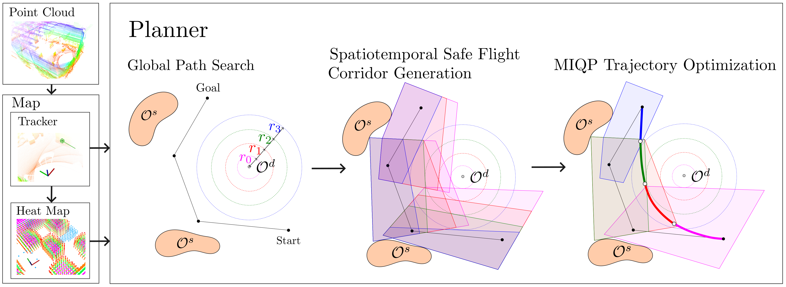
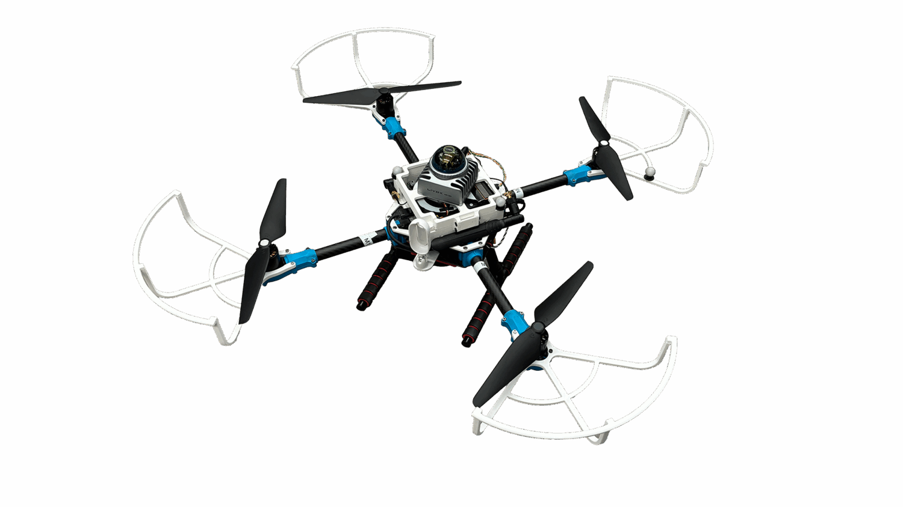
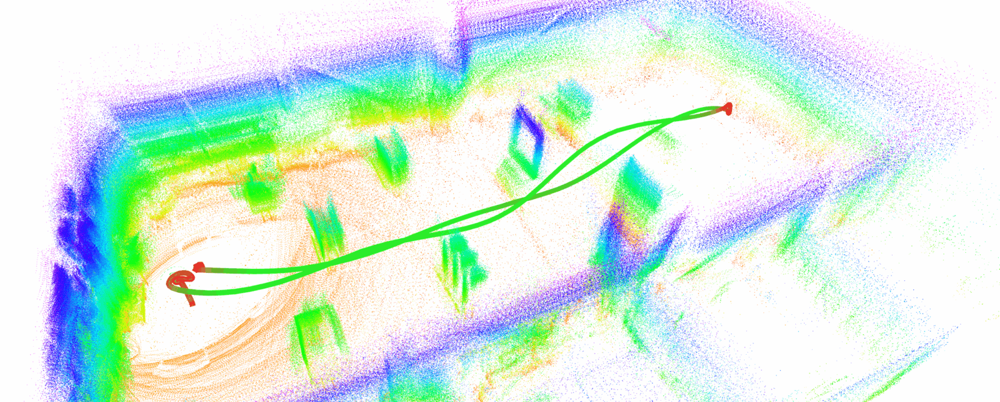
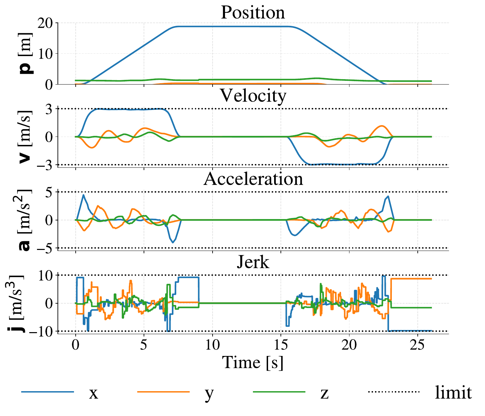
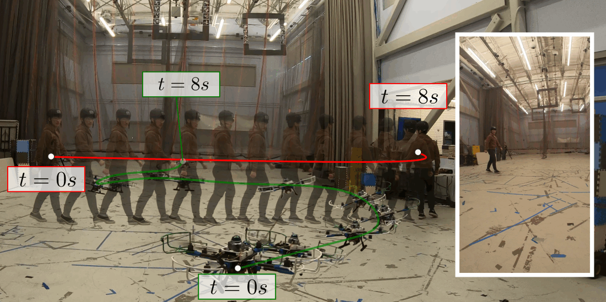
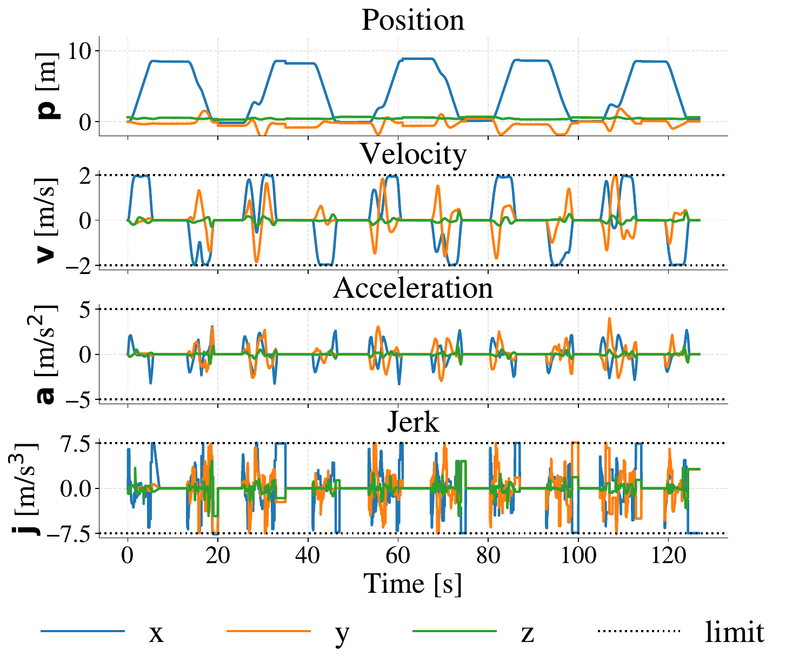
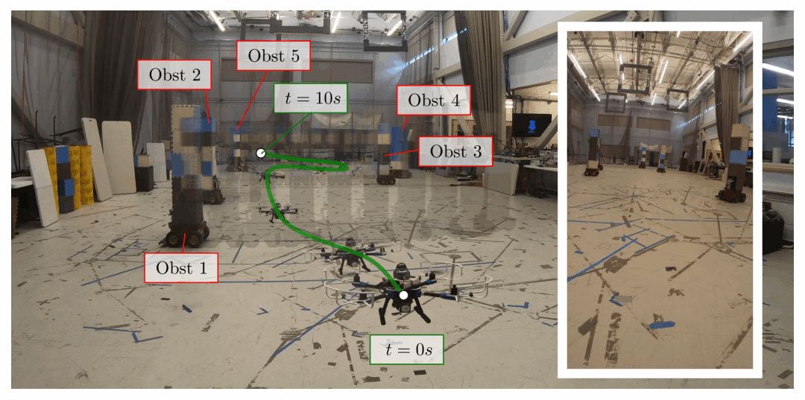
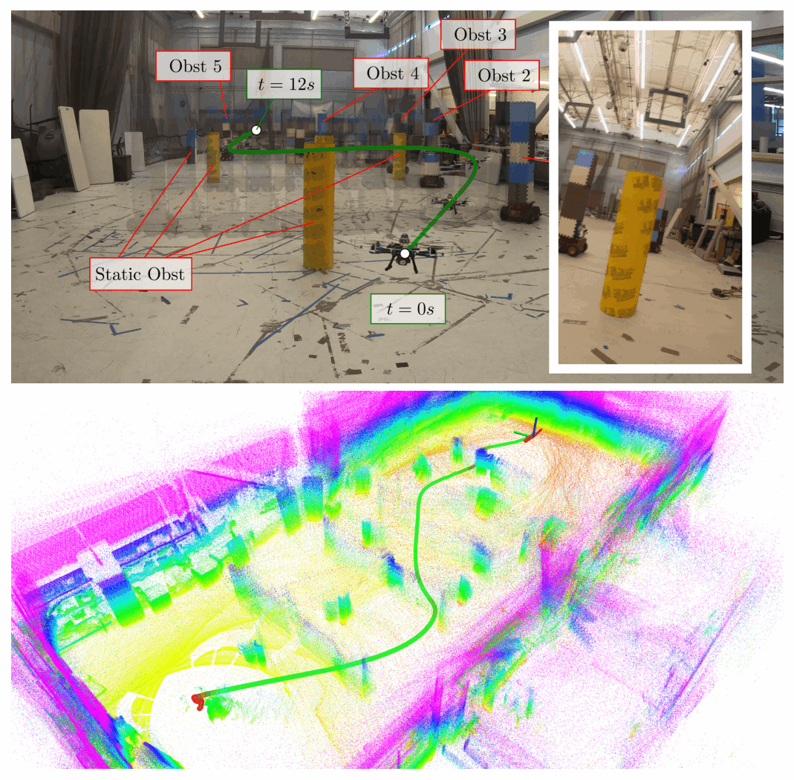

# Supplementary Material {#supplementary-material .unnumbered}

**Video**: <https://youtu.be/_T10DJiLQXg>\
**Code**: <https://github.com/mit-acl/sando.git>

# Introduction {#sec:introduction}

![Comparison of trajectory planning approaches near a dynamic obstacle $\mathcal{O}^d$. **Left (Other Approaches -- Soft):** Soft-constraint methods use penalty-based collision avoidance, producing fast but potentially unsafe trajectories. **Center (Other Approaches -- Hard):** Other hard-constraint methods inflate the obstacle by its full worst-case reachable set and generate purely spatial corridors, producing safe but overly conservative trajectories that detour far from the obstacle. **Right (SANDO):** SANDO generates spatiotemporal safe flight corridors (STSFCs) that account for when the trajectory passes each region, inflating the obstacle only by its reachable set at the corresponding time layer, yielding a safe and fast trajectory. (The dynamic obstacle is depicted as a point mass for visual clarity; in practice, obstacles have finite axis-aligned bounding box (AABB) extents, and the reachable set is the Minkowski sum of the AABB with a cube whose half-side equals the per-layer reachable radius.)[]{#fig:money_shot label="fig:money_shot"}](svg/comparisonSOTA.png){#fig:money_shot width="\\columnwidth"}

Autonomous unmanned aerial vehicle (UAV) navigation in dynamic unknown environments is challenging: the future trajectories of obstacles are unknown, so a collision-free path can become unsafe moments after it is computed. This requires planners that can quickly recompute safe trajectories while handling spatiotemporal collision avoidance. Existing approaches address parts of this challenge but fall into three categories with distinct limitations (see Table [\[tab:state_of_the_art_comparison\]](#tab:state_of_the_art_comparison){reference-type="ref" reference="tab:state_of_the_art_comparison"}).

First, planners designed for unknown static environments (e.g., EGO-Planner [@zhou2021ego-planner], FASTER [@tordesillas2022faster], HDSM [@toumieh2024high], and SUPER [@ren2025super]) achieve fast replanning but assume that once space is observed as free, it remains free, making them unsuitable for environments with moving obstacles. Second, planners that handle dynamic obstacles with soft constraints (e.g., HOPA [@feng2021uav], ViGO [@xu2022vision], FAPP [@lu2024fapp], Risk-Aware [@zong2025risk], and FHD [@Fan2025flying]) can react to moving obstacles but provide no formal safety guarantee, as collision avoidance is encouraged via penalty terms rather than enforced (see Fig. [1](#fig:money_shot){reference-type="ref" reference="fig:money_shot"}). Third, planners that enforce hard safety constraints in dynamic environments (e.g., CC-MPC [@lin2020robust], OA-MPC [@firoozi2022occlusion], Liu et al. [@liu2023tight], Stamouli et al. [@stamouli2024recursively], STS [@quan2025state], and IP-MPC [@xu2025intent]) guarantee safety only at discretized model predictive control (MPC) or sample points, leaving the trajectory potentially unsafe between time steps. While PANTHER [@tordesillas2022panther] provides continuous-time safety in dynamic environments, it has only been demonstrated in open settings and the computation scales poorly with the number of obstacles. As summarized in Table [\[tab:state_of_the_art_comparison\]](#tab:state_of_the_art_comparison){reference-type="ref" reference="tab:state_of_the_art_comparison"}, no existing method simultaneously (1) handles spatiotemporal dynamic obstacle collision avoidance, (2) guarantees continuous-time safety, and (3) operates in dynamic unknown confined environments. To address these gaps, we introduce SANDO (**S**afe **A**uto**N**omous trajectory planning for **D**ynamic unkn**O**wn environments), a trajectory planner that integrates a heat map-based A$^\ast$ global planner, a novel Spatiotemporal Safe Flight Corridor (STSFC) generation method, and a variable elimination-based hard-constrained optimization technique to provide continuous-time safety guarantees in dynamic unknown environments.

:::: table*
::: centering
:::
::::

# Related Work {#sec:related_work}

## Environment Taxonomy {#subsec:classification_of_environments}

We focus on unknown environments, where no prior map is available, and classify them into two categories: (1) static vs. dynamic, and (2) open vs. confined. Static environments have fixed obstacles, whereas dynamic environments include moving obstacles. Open environments have relatively sparse obstacle distributions, whereas confined environments involve occlusions and narrow passages.

We organize our review around the three criteria in Table [\[tab:state_of_the_art_comparison\]](#tab:state_of_the_art_comparison){reference-type="ref" reference="tab:state_of_the_art_comparison"}, namely, environment type (static vs. dynamic), environment structure (open vs. confined), and safety guarantee level (none, discretized, or continuous). We first discuss planners designed for static environments, and then review dynamic-environment planners grouped by their safety guarantee.

## Planning in Unknown Static Environments {#sec:lit_review_static}

Several planners are designed for unknown static environments and achieve fast replanning by assuming that once space is observed as free, it remains free. EGO-Planner [@zhou2021ego-planner] uses a gradient-based local optimizer with soft collision penalties, enabling fast replanning in both open and confined static settings but providing no safety guarantees. FASTER [@tordesillas2022faster] builds on the MIQP trajectory planning approaches [@deits2015miqp; @landry2016aggressive] by generating safe flight corridors via convex decomposition and solving a hard-constrained MIQP within them, providing continuous-time collision-free guarantees in static environments; however, it does not model dynamic obstacles. HDSM [@toumieh2024high] extends the corridor-based approach with a high-degree spline representation that improves trajectory smoothness and corridor utilization, also providing continuous safety guarantees but only under the static assumption. SUPER [@ren2025super] adopts FASTER's exploratory-safe trajectory framework and replaces the hard-constraint optimizer with a gradient-based solver for faster computation, but trades off safety guarantees by using soft constraints and is limited to static environments. While these methods work well in static settings, none of them handle dynamic obstacles.

## Soft-Constrained Planning in Dynamic Environments {#sec:lit_review_soft}

A number of planners handle dynamic obstacles but use soft constraints, meaning collision avoidance is encouraged via penalty terms but not strictly enforced. HOPA [@feng2021uav] uses obstacle positions and potential fields to perform avoidance maneuvers, but operates only in open environments and provides no hard safety guarantee. ViGO [@xu2022vision] fuses vision-based obstacle detection with a gradient-based planner to navigate dynamic clutter in both open and confined settings, but relies on soft collision penalties. FAPP [@lu2024fapp] tightly integrates perception and planning for dynamic cluttered environments, demonstrating fast replanning and good practical performance; however, its collision avoidance is soft-constrained using MINCO [@wang2022minco], so it does not guarantee safety. Xu et al. [@xu2024heuristic] propose a heuristic-based incremental probabilistic roadmap (PRM) for efficient replanning in dynamic environments, using ViGO [@xu2022vision] as the underlying local planner and thus inheriting its soft-constraint limitation. Risk-Aware [@zong2025risk] incorporates risk metrics into the planning objective to improve safety awareness in dynamic environments, but the risk terms act as soft penalties rather than hard constraints. FHD [@Fan2025flying] uses a learning-based approach to navigate dynamic environments, achieving agile flight without explicit obstacle modeling; however, the learned policy provides no formal safety guarantee. While these methods demonstrate strong empirical performance, the absence of hard constraints means safety cannot be formally guaranteed, which is a critical limitation for safety-critical UAV deployments.

## Safety-Guaranteed Planning in Dynamic Environments {#sec:lit_review_safe}

Early approaches to dynamic collision avoidance include velocity obstacles [@fiorini1998velocity]. Formal safety frameworks such as control barrier functions [@ames2019cbf] and Hamilton-Jacobi reachability [@chen2018hj] provide rigorous guarantees but can be computationally expensive in 3D cluttered environments. In the trajectory planning literature, a smaller set of planners enforce collision avoidance as hard constraints in dynamic environments. We distinguish between discretized guarantees (safety enforced only at sampled time steps or MPC knot points) and continuous guarantees (safety enforced continuously along the trajectory).

### Discretized Safety Guarantees

CC-MPC [@lin2020robust] formulates chance constraints within an MPC framework to handle obstacle uncertainty, providing probabilistic safety guarantees at discretized MPC steps but not between them. OA-MPC [@firoozi2022occlusion] provides hard-constraint guarantees at MPC steps via worst-case reachability analysis and accounts for occluded regions, but ignores the temporal motion history of obstacles, leading to excessive conservatism (see Fig. [1](#fig:money_shot){reference-type="ref" reference="fig:money_shot"}). Liu et al. [@liu2023tight] compute tight collision probability bounds and enforce chance constraints at MPC steps, but safety is only guaranteed at discrete time points. Stamouli et al. [@stamouli2024recursively] combine conformal prediction with shrinking-horizon MPC to provide probabilistic safety guarantees at MPC steps without distributional assumptions; however, their approach has only been demonstrated in open environments. STS [@quan2025state] uses state-time space to handle dynamic environments; however, it is only demonstrated in 2D scenarios and only provides safety guarantees at discretized sample points but not continuously. IP-MPC [@xu2025intent] incorporates intent prediction of dynamic obstacles into an MPC framework with hard constraints at MPC steps, improving avoidance quality but without continuous-time guarantees.

All of these methods share a fundamental limitation: collisions can occur between the discrete time points at which constraints are enforced, particularly for fast-moving obstacles or long MPC intervals.

### Continuous Safety Guarantees

PANTHER [@tordesillas2022panther] constructs per-obstacle convex hulls to enforce continuous-time collision avoidance in dynamic unknown environments using probabilistic reachable-set inflation for obstacle uncertainty. However, its per-obstacle convex hull representation becomes computationally expensive as the number of obstacles grows, and it has been demonstrated primarily in open environments without many static obstacles.

## Contributions {#subsec:sando_contributions}

To address the gaps identified above, SANDO makes the following contributions:

1.  **STSFC Generation:** A novel Spatiotemporal Safe Flight Corridor generation method that produces time-layered polytope sequences accounting for worst-case obstacle reachable sets at each time layer, addressing the lack of time-varying corridor generation framework for dynamic environments (Section [4](#subsec:temporal_safety_corridor){reference-type="ref" reference="subsec:temporal_safety_corridor"}).

2.  **Heat Map-based Global Planner:** A heat map-based A$^\ast$ planner that assigns soft costs around both static and dynamic obstacles, guiding the global path toward regions where larger STSFC corridors can be generated (Section [5](#subsec:global_planner_heatmap){reference-type="ref" reference="subsec:global_planner_heatmap"}).

3.  **MIQP Trajectory Optimization with STSFCs:** A hard-constraint MIQP formulation that assigns each trajectory piece to a time-layered STSFC polytope, whose continuous-time collision-free guarantee is established by the formal safety analysis below (Section [6](#sec:trajectory_optimization){reference-type="ref" reference="sec:trajectory_optimization"}).

4.  **Formal Safety Analysis:** Safety guarantees through worst-case reachable set inflation with explicit assumptions, and a discussion of recursive feasibility limitations.

5.  **Extensive Evaluation** in simulation across diverse environments and hardware experiments on a fully automated UAV platform, demonstrating the practical effectiveness of SANDO in real-world scenarios.

# System Overview {#sec:system_overview_section}

:::: {#fig:system_overview .figure latex-placement="htbp"}
{width="\\textwidth"}

::: caption
SANDO system overview: Point cloud data are processed by the Map Manager, which detects static obstacles (denoted $\mathcal{O}^s$) and dynamic obstacles (denoted $\mathcal{O}^d$) and estimates the states of dynamic obstacles. The Dynamic Obstacle Tracker feeds its predictions to the Heat Map module, which generates soft costs around both static and dynamic obstacles (Section [5](#subsec:global_planner_heatmap){reference-type="ref" reference="subsec:global_planner_heatmap"}). The heat map-based global planner computes a global path using A$^\ast$ search, and the predicted obstacle trajectories are used by the STSFC Generation module to produce time-layered polytope sequences (Section [4](#subsec:temporal_safety_corridor){reference-type="ref" reference="subsec:temporal_safety_corridor"}). These time-varying polytopes are then used in the Trajectory Optimization module to compute a safe trajectory (Section [6](#sec:trajectory_optimization){reference-type="ref" reference="sec:trajectory_optimization"}).[]{#fig:system_overview label="fig:system_overview"}
:::
::::

SANDO consists of five modules (see Fig. [2](#fig:system_overview){reference-type="ref" reference="fig:system_overview"}): a dynamic obstacle tracker, a heat map generator, a global path planner, an STSFC generator, and a hard-constraint local trajectory optimizer. Each module is designed to handle **dynamic unknown obstacles**, which requires planning in spatiotemporal space, adapting trajectories as obstacles move unpredictably, and computing safe trajectories in real time.

SANDO processes point cloud data from a LiDAR sensor and/or a depth camera. The point cloud is processed by the map manager, which generates a voxel map with heat map costs for both static and dynamic obstacles. Point cloud data are also used by a dynamic obstacle tracker, where dynamic obstacles are detected, clustered, and tracked to estimate their current positions and predict their future trajectories, as detailed in Section [7](#sec:obstacle_tracking){reference-type="ref" reference="sec:obstacle_tracking"}.

The voxel map and predicted obstacle trajectories are provided as inputs to the heat map-based global planner and the STSFC Generation module. The global planner computes a global path from the agent's start position to a *subgoal* (a projection of the goal position on the local map around the agent) using heat map-based A$^\ast$ search with soft costs for both static and dynamic obstacles; see Section [5](#subsec:global_planner_heatmap){reference-type="ref" reference="subsec:global_planner_heatmap"} for details. SANDO then constructs STSFCs, which account for spatial and temporal dimensions, by inflating dynamic obstacles based on their worst-case reachable sets at each time layer, as described in Section [4](#subsec:temporal_safety_corridor){reference-type="ref" reference="subsec:temporal_safety_corridor"}.

Since dynamic obstacles can change their motion unpredictably, fast trajectory optimization is needed. SANDO introduces a variable elimination approach that reduces the number of decision variables and constraints in the optimization problem, enabling fast hard-constraint optimization; see Section [6](#sec:trajectory_optimization){reference-type="ref" reference="sec:trajectory_optimization"}. The resulting trajectory is then sent to the low-level controller for execution. Replanning is triggered at 100 Hz; however, a new replanning cycle begins only after the previous one completes, so the effective replanning rate is bounded by the total replanning time (typically 20--35 ms in hardware, yielding an effective rate of approximately 30--50 Hz). If replanning fails to find a feasible trajectory, the agent continues executing the previously computed trajectory; if no valid trajectory remains, the agent hovers in place. Point cloud processing, dynamic obstacle tracking, map management, and SANDO's planning modules are all parallelized.

# Spatiotemporal Safe Flight Corridor (STSFC) Generation {#subsec:temporal_safety_corridor}

We first define the key terminology used throughout the paper. Let $t_0$ denote the *current planning time*. The trajectory is composed of $N$ *pieces* $\boldsymbol{x}_0, \ldots, \boldsymbol{x}_{N-1}$, each a cubic Bézier polynomial indexed by $n \in \{0, \ldots, N{-}1\}$. Each piece $n$ executes during the *time interval* $[t_0 + n \cdot dt,\; t_0 + (n{+}1) \cdot dt]$, where $dt$ is the uniform duration per piece, so that the full trajectory spans $[t_0,\; t_0 + N \cdot dt]$. The global path consists of $P$ *path segments*, indexed by $p \in \{0, \ldots, P{-}1\}$. Each of the $K$ tracked dynamic obstacles, indexed by $k \in \{1, \ldots, K\}$, occupies a region $\mathcal{O}_k(t) \subset \mathbb{R}^3$ at time $t$, with true centroid $\mathbf{c}_k(t) \in \mathbb{R}^3$. The obstacle region is contained in an axis-aligned bounding box (AABB) centered at $\mathbf{c}_k(t)$ with half-extents $\mathbf{h}_k = (h_k^x,\, h_k^y,\, h_k^z) \in \mathbb{R}_{>0}^3$: $$\mathcal{O}_k(t) \;\subseteq\; \bigl\{\mathbf{x} \in \mathbb{R}^3 : |x_i - c_k^i(t)| \le h_k^i, \;\; i \in \{x,y,z\}\bigr\}.$$

In dynamic environments, safety corridors must account for both spatial constraints and how obstacles move over time. Traditional corridor generation methods, such as [@liu2017planning; @tordesillas2022faster; @deits2014iris], produce purely spatial polytopes along a path, which is sufficient for static environments but does not capture how free space changes as obstacles move. This requires corridors that account for both the spatial location and the time at which each region is safe. To this end, we introduce *STSFCs*, time-varying polytope sequences where each time layer represents the collision-free region at a given duration in the trajectory's time horizon. This section describes the structure of STSFCs, the time allocation strategy, and the obstacle inflation method used to ensure safety guarantees. The global path input used during corridor generation is described in Section [5](#subsec:global_planner_heatmap){reference-type="ref" reference="subsec:global_planner_heatmap"}.

## Temporal Corridor Structure

An STSFC is represented as a two-dimensional array $\mathcal{C}[n][p]$ where:

- $n \in \{0, \ldots, N-1\}$ indexes the *time layer*, representing discrete time intervals along the trajectory,

- $p \in \{0, \ldots, P-1\}$ indexes the *spatial polytope* within each time layer, representing free-space regions at that time.

Each element $\mathcal{C}[n][p]$ is a convex polytope defined by linear constraints $\{\mathbf{F}_{np}, \mathbf{g}_{np}\}$ such that a point $\mathbf{x} \in \mathbb{R}^3$ is inside the polytope if $\mathbf{F}_{np}\mathbf{x} \le \mathbf{g}_{np}$. Each time layer $n$ corresponds to the time interval $[t_0 + n \cdot dt,\; t_0 + (n{+}1) \cdot dt]$, matching the time interval of trajectory piece $n$. This structure allows the trajectory optimizer to select different spatial corridors at different times, adapting to the evolving obstacle configuration. Note that we generate a polytope for every combination of time layer $n$ and path segment $p$, even though some assignments may seem unlikely (e.g., the last time layer in the first path segment, or the first time layer in the last path segment). This is necessary because the MIQP solver determines the piece-to-polytope assignment, and the assignment of pieces is not known a priori. Moreover, as reported in Tables [\[tab:unknown_dynamic_benchmark\]](#tab:unknown_dynamic_benchmark){reference-type="ref" reference="tab:unknown_dynamic_benchmark"} and [\[tab:hw_dynamic_round2\]](#tab:hw_dynamic_round2){reference-type="ref" reference="tab:hw_dynamic_round2"}, the total STSFC generation time for 10--15 polytopes is only a few milliseconds, so generating polytopes for all combinations adds negligible computational cost.

## Obstacle Inflation by Reachable Radius

For each dynamic obstacle $k$ with estimated position $\hat{\mathbf{c}}_k(t_0) \in \mathbb{R}^3$ and each time layer $n$, we compute the worst-case reachable position set by inflating the obstacle's AABB half-extents by the per-layer reachable radius: $$r_n = v^{\mathrm{obs}}_{\max} \cdot (n{+}1) \cdot dt + \epsilon,$$ where $(n{+}1) \cdot dt$ is the end time of layer $n$ (we use the end time rather than the midpoint to ensure that the inflation covers the worst-case obstacle displacement over the *entire* layer), $v^{\mathrm{obs}}_{\max}$ is the maximum obstacle velocity, and $\epsilon \ge 0$ is a bound on the per-axis position estimation error from the obstacle tracker (Section [7](#sec:obstacle_tracking){reference-type="ref" reference="sec:obstacle_tracking"}). Because $r_n$ grows with $n$, obstacles are inflated more in later time layers, reflecting the increasing uncertainty in obstacle position over time.

The inflated obstacle region for time layer $n$ is the Minkowski sum of the obstacle's estimated AABB with an axis-aligned cube of half-side $r_n$: $$\hat{\mathcal{O}}_k^n \coloneqq \bigl\{\mathbf{x} \in \mathbb{R}^3 : |x_i - \hat{c}_k^i(t_0)| \le h_k^i + r_n, \;\; i \in \{x,y,z\}\bigr\},$$ yielding an enlarged AABB with half-extents $\mathbf{h}_k + r_n \mathbf{1}$ centered at $\hat{\mathbf{c}}_k(t_0)$. In addition to $r_n$, a fixed safety margin $r_{\text{margin}}$ (see Table [\[tab:experiment_parameters\]](#tab:experiment_parameters){reference-type="ref" reference="tab:experiment_parameters"}) is added to the AABB half-extents $\mathbf{h}_k$ during obstacle detection (Section [7](#sec:obstacle_tracking){reference-type="ref" reference="sec:obstacle_tracking"}), providing an additional buffer that absorbs position estimation error and controller tracking error beyond the reachable-set inflation. In practice, this margin allows setting $\epsilon = 0$ in $r_n$ while still maintaining robustness to estimation and tracking errors, since $r_{\text{margin}}$ serves the same role as a nonzero $\epsilon$ (see Section [8](#subsec:theoretical_safety_guarantees){reference-type="ref" reference="subsec:theoretical_safety_guarantees"}). The inflated AABB voxels are then used to generate STSFCs for time layer $n$.

## Unknown Space Inflation {#subsubsec:unknown_space_inflation}

![Unknown-space inflation for STSFC corridor generation. Boundary voxels of unknown regions are inflated using the same per-layer reachable radius $r_n$ as dynamic obstacles. **Scenario 1:** The goal $G_1$ lies outside the unknown region. The trajectory from $A_1$ to $G_1$ stays outside the inflated boundary, guaranteeing safety against unobserved dynamic obstacles. **Scenario 2:** The goal $G_2$ lies inside the unknown region. SANDO walks back along the global path from the unknown boundary until a point outside the worst-case inflated region is found, yielding a new subgoal $G_2'$. Since the trajectory to $G_2'$ is shorter, the per-layer $r_n$ values are smaller compared to Scenario 1, producing less conservative inflation and larger corridors. For simplicity, the figure does not show the inflation on the right side of the unknown region, which is also performed in practice. The same inflation process is applied to all unknown boundaries, ensuring safety regardless of the global path's direction. []{#fig:unknown_inflation label="fig:unknown_inflation"}](svg/unknownInflation.png){#fig:unknown_inflation width="\\columnwidth"}

SANDO maintains a voxel map that is built incrementally from sensor observations: each voxel is classified as free, occupied, or unknown, where unknown voxels are those that have not yet been observed by the sensor. In such environments, dynamic obstacles may emerge from unknown regions at any time. If these regions are treated as free during corridor generation, the resulting corridors may overlap with space that is actually occupied, violating safety. To address this, SANDO inflates the boundaries of unknown (unobserved) voxels, treating them as occupied during the ellipsoid-based corridor decomposition.

Specifically, let $\mathcal{U}(t_0) \subset \mathbb{R}^3$ denote the set of unknown voxels at planning time $t_0$, and let $\mathcal{B}_{\mathcal{U}}(t_0)$ denote its boundary voxels. Each boundary voxel is inflated by the same per-layer radius $r_n$ used for dynamic obstacles. The inflated unknown region for time layer $n$ is: $$\hat{\mathcal{U}}^n \coloneqq \mathcal{U}(t_0) \;\cup\; \bigl(\mathcal{B}_{\mathcal{U}}(t_0) \oplus B_\infty(r_n)\bigr),$$ where $B_\infty(r_n)$ is the $L_\infty$-ball of radius $r_n$ and $\oplus$ denotes the Minkowski sum. The inflated unknown voxels are included in the obstacle set used for corridor generation, ensuring that any dynamic obstacles that could emerge from these regions are accounted for in the resulting polytopes $\mathcal{C}[n][p]$ (see Fig. [3](#fig:unknown_inflation){reference-type="ref" reference="fig:unknown_inflation"}). When the goal lies outside the unknown region (Scenario 1 in Fig. [3](#fig:unknown_inflation){reference-type="ref" reference="fig:unknown_inflation"}), the trajectory stays entirely in observed space and the inflated boundary provides a safety buffer against unobserved obstacles.

#### Safe subgoal selection

When the global path enters the unknown region, corridors cannot be generated beyond the unknown boundary. To handle this, SANDO finds the first point where the global path intersects the unknown boundary and walks back along the path until it reaches a point outside the worst-case inflated unknown region, yielding a new subgoal $G'$ (Scenario 2 in Fig. [3](#fig:unknown_inflation){reference-type="ref" reference="fig:unknown_inflation"}). The worst-case inflation is computed from the planning horizon, the agent's dynamic constraints, and the maximum time allocation factor (see Section [6.1.2](#subsec:time_allocation){reference-type="ref" reference="subsec:time_allocation"}) in a given replanning cycle. Since the trajectory to $G'$ is shorter than to the original goal, each per-layer $r_n$ is smaller, producing less conservative inflation and larger corridors. Note that this is a heuristic: if the global path runs close to the unknown boundary, the walk-back may not find a subgoal fully outside the worst-case inflated region. In practice, however, the reduced trajectory duration sufficiently shrinks $r_n$ to yield feasible corridors.

The resulting STSFCs are used as constraints in the MIQP trajectory optimization described in Section [6](#sec:trajectory_optimization){reference-type="ref" reference="sec:trajectory_optimization"}. System-level parameters, including $r_{\text{drone}}$, $v^{\mathrm{obs}}_{\max}$, and the replanning rate, are configured per-environment and listed in Section [9](#sec:simulation-results){reference-type="ref" reference="sec:simulation-results"}.

# Heat Map-Based Global Planner {#subsec:global_planner_heatmap}

![STSFC corridors and MIQP trajectory optimization in dynamic environments. For visualization, the figure shows a 2D ($x$-$y$) case with the time-layer axis as the third dimension; in practice, SANDO uses full 3D ($x$, $y$, $z$) STSFCs. **Left column, other approaches (hard-blocking reachable sets):** At $t=t_0$ (top left), the planner hard-blocks the worst-case reachable set of $\mathcal{O}^d$ as occupied and computes a conservative global path $A \to G$ that avoids the entire blocked region. Although planning succeeds, the resulting trajectory is overly conservative. At $t=t_1$ (bottom left), the agent replans from the new position $A'$ toward $G'$, but $A'$ now falls inside the shifted blocked region, making the query $A' \to G'$ infeasible. **Right column, SANDO (heat map-based soft costs):** At $t=t_0$, the 2D view (top center) shows the global path $A \to G$ steered away from $\mathcal{O}^d$ by soft heat costs, producing a less conservative trajectory. The temporal view (top right) visualizes the STSFC corridors $\mathcal{C}[n][p]$ along the time-layer axis, with increasing per-layer inflation radii $r_n$ (see Section [4](#subsec:temporal_safety_corridor){reference-type="ref" reference="subsec:temporal_safety_corridor"}); the MIQP assigns each trajectory piece to a corridor ($\boldsymbol{x}_0 \subseteq \mathcal{C}[0][0]$, $\boldsymbol{x}_1 \subseteq \mathcal{C}[1][1]$, $\boldsymbol{x}_2 \subseteq \mathcal{C}[2][1]$, and $\boldsymbol{x}_3 \subseteq \mathcal{C}[3][2]$). At $t=t_1$, the 2D view (bottom center) and temporal view (bottom right) show successful replanning from $A'$ to $G'$: the updated corridors $\mathcal{C}'[n][p]$ remain valid and the MIQP assignment ($\boldsymbol{x}'_0 \subseteq \mathcal{C}'[0][0]$, $\boldsymbol{x}'_1 \subseteq \mathcal{C}'[1][1]$, $\boldsymbol{x}'_2 \subseteq \mathcal{C}'[2][2]$, and $\boldsymbol{x}'_3 \subseteq \mathcal{C}'[3][2]$) succeeds, since soft costs never blocked the region around $A'$. Even though in the first global path section ($A' \to W_1$), the corridor generation for $n=2$ (green) and $n=3$ (blue) fails to produce corridors, since $n=0$ (pink) and $n=1$ (red) still have valid corridors, the MIQP can find a feasible trajectory that safely navigates through the dynamic environment. (The dynamic obstacle is depicted as a point mass for visual clarity; in practice, obstacles have finite AABB extents $\mathbf{h}_k$, and the reachable set is the Minkowski sum of the AABB with a cube of half-side $r_n$.)[]{#fig:safe_corridor_in_dynamic_environments label="fig:safe_corridor_in_dynamic_environments"}](svg/spatioTemporalSFCWhyHeatMap.png){#fig:safe_corridor_in_dynamic_environments width="\\textwidth"}

As described in Section [4](#subsec:temporal_safety_corridor){reference-type="ref" reference="subsec:temporal_safety_corridor"}, STSFC corridors shrink as dynamic obstacles are inflated by their worst-case reachable sets. If the global path passes close to dynamic obstacles, the resulting corridors may become too small for the trajectory optimizer to find a feasible solution. A naive approach would be to hard-block the entire worst-case reachable set as occupied in the planner's occupancy grid. However, this creates a critical replanning failure mode: at the next replanning step, the agent's current position may fall inside the previously blocked region, since the obstacle has moved and the reachable set has shifted, making the new planning query infeasible (see *No Heat Map & No STSFC* approach at $t=t_1$ in Fig. [4](#fig:safe_corridor_in_dynamic_environments){reference-type="ref" reference="fig:safe_corridor_in_dynamic_environments"}).

To avoid this, SANDO employs a heat map-based A$^\ast$ planner that uses soft costs rather than hard occupancy constraints for dynamic obstacles. The heat map proactively steers the global path away from regions where corridors will shrink, without blocking those regions entirely. This ensures that the global path search always has a feasible start configuration, while still biasing the path toward regions with larger corridors. Static and dynamic obstacles are both incorporated through heat maps, and only known static obstacles and the current location of dynamic obstacles enforce hard infeasibility. These occupied voxels are inflated by the drone radius $r_{\text{drone}}$ (the circumscribed radius of the vehicle) to account for the agent's physical extent. Unknown space is treated as free in the global planner to allow the agent to plan paths toward unexplored regions. In contrast, during STSFC generation, unknown space is treated as occupied, and when unknown-space inflation is enabled, the boundaries of unknown regions are further inflated by the per-layer reachable radius $r_n$ so that the resulting corridors account for obstacles that may emerge from unobserved space (see Section [4.3](#subsubsec:unknown_space_inflation){reference-type="ref" reference="subsubsec:unknown_space_inflation"}).

## Static Obstacle Heat Map

We define a static heat map $H^{s} : \mathbf{q} \in \mathbb{R}^3 \to \mathbb{R}_{\ge 0}$ using a distance-based cost that decreases with distance from obstacle surfaces. Only boundary voxels (surface voxels of obstacles) serve as heat sources. For each boundary voxel $b$ with center $\mathbf{c}_b$ and halo radius $R^s$ (the maximum distance at which the voxel influences the cost), the heat contribution at a query point $\mathbf{q} \in \mathbb{R}^3$ is: $$H^{s}_b(\mathbf{q}) =
\begin{cases}
\alpha^s \left(1 - \dfrac{\|\mathbf{q} - \mathbf{c}_b\|}{R^s}\right)^{p^s}, & \|\mathbf{q} - \mathbf{c}_b\| \le R^s, \\[6pt]
0, & \text{otherwise},
\end{cases}$$ where $\alpha^s$ is the intensity scale and $p^s$ controls the decay shape. The aggregate static heat is $H^{s}(\mathbf{q}) = \min(\max_b H^{s}_b(\mathbf{q}),\, H_{\max})$, using max aggregation to avoid artificially inflating costs in dense obstacle regions, capped at $H_{\max}$ (the maximum allowable heat value). See Table [1](#tab:system_parameters){reference-type="ref" reference="tab:system_parameters"} for the static heat parameters used in our experiments.

## Dynamic Obstacle Heat Map

For each tracked dynamic obstacle $k$ with estimated position $\hat{\mathbf{c}}_k$, AABB half-extents $\mathbf{h}_k$, and predicted trajectory $\mu_k(t)$ from the obstacle tracker (Section [7](#sec:obstacle_tracking){reference-type="ref" reference="sec:obstacle_tracking"}) over a prediction time horizon $T_h$, we construct a per-obstacle heat $H_k(\mathbf{q})$ combining a penalty around the current position and a penalty around the predicted trajectory tube.

#### Base heat around the current position

We define the base obstacle radius as $R_{0,k} \coloneqq \max_i h_k^i + r_{\text{margin}}$, where $r_{\text{margin}}$ is a fixed safety margin (see Table [\[tab:experiment_parameters\]](#tab:experiment_parameters){reference-type="ref" reference="tab:experiment_parameters"}), and the horizon-limited reachable radius as $R^d_k \coloneqq R_{0,k} + v^{\mathrm{obs}}_{\max} T_h$. The base heat is: $$H^{\mathrm{base}}_k(\mathbf{q}) \;=\;
\begin{cases}
\alpha^d_0\,\left(1-\dfrac{\|\mathbf{q}-\hat{\mathbf{c}}_k\|}{R^d_k}\right)^{p^d}, & \|\mathbf{q}-\hat{\mathbf{c}}_k\| \le R^d_k, \\[6pt]
0, & \text{otherwise},
\end{cases}$$ where $\alpha^d_0$ is the base cost scale and $p^d$ controls the decay shape.

#### Tube penalty from predicted motion

We discretize the horizon into $M_{\text{tube}}$ samples $\{t_j\}_{j=0}^{M_{\text{tube}}-1}$ with predicted centers $\hat{\mathbf{c}}_{k,j}=\mu_k(t_j)$. The tube radius $R_{k,j} \coloneqq R_{0,k} + \gamma_k t_j$ grows with prediction time to account for increasing uncertainty, where $\gamma_k$ is the per-obstacle uncertainty growth rate. The tube penalty is: $$\begin{multline*}
\!\! H^{\mathrm{tube}}_k\! (\mathbf{q}) \! =\! \alpha^d_1 \max_{j} \Biggl(\! w(t_j)
\! \left[\! \max\!\left(\! 0,\,1\! -\! \dfrac{\|\mathbf{q}-\hat{\mathbf{c}}_{k,j}\|}{R_{k,j}}\right)\right]^{q^d}\Biggr),
\end{multline*}$$ where $w(t)=\exp(-t/\tau^d)$ with $\tau^d \coloneqq \tau^d_{\text{ratio}} \cdot T_h$ is an exponential time weight that discounts predictions further into the future (since they are less reliable), $\tau^d_{\text{ratio}}$ is a scaling factor that sets the decay time constant as a fraction of the horizon, $\alpha^d_1$ scales the tube penalty, and $q^d$ controls how sharply the cost increases near the predicted path. The tube radius $R_{k,j}$ grows with time while the time weight $w(t_j)$ decays: near-future predictions receive high weight over a small region, whereas far-future predictions receive low weight over a larger region. This is a heuristic that balances spatial coverage against prediction reliability, and we found empirically that it produces effective obstacle avoidance paths across a wide range of environments. The total per-obstacle heat combines both components: $H_k(\mathbf{q}) = H^{\mathrm{base}}_k(\mathbf{q}) + H^{\mathrm{tube}}_k(\mathbf{q})$, where $H^{\mathrm{base}}_k$ penalizes proximity to the obstacle's current position and $H^{\mathrm{tube}}_k$ penalizes proximity to its predicted future path. The dynamic heat across all obstacles is $H^{d}(\mathbf{q}) = \max_k H_k(\mathbf{q})$, using max aggregation so that the most dangerous obstacle dominates the cost.

## Combined Heat Formulation

![Visualization of the heat map-based global planner in hardware. Static and dynamic obstacle heat maps are combined via max aggregation, and the A$^\ast$ planner computes a global path that avoids high-cost regions while maintaining feasibility. From the wall on the side, the static heat decays with distance, while from the dynamic obstacle (blue and green boxes), the heat decays both spatially and temporally. On the left, the dynamic obstacle is not moving, so the heat is dominated by the base heat around its current position. On the right, the dynamic obstacle is moving toward the center of the room (the prediction is visualized as the green line), so the tube penalty creates a heat trail along the predicted path, steering the global path away from that region. []{#fig:heatmap_visualization label="fig:heatmap_visualization"}](svg/heatmapRvizVisualization.png){#fig:heatmap_visualization width="\\columnwidth"}

Fig. [5](#fig:heatmap_visualization){reference-type="ref" reference="fig:heatmap_visualization"} illustrates the combined heat map in a hardware experiment. The combined heat map merges the static and dynamic components via max aggregation: $$H(\mathbf{q}) \;=\; \min\!\left(\max\!\left(H^{s}(\mathbf{q}),\, H^{d}(\mathbf{q})\right),\; H_{\max}\right),$$ where $H_{\max}$ caps the total heat. Max aggregation avoids double-penalization and ensures the highest risk dominates.

## A$^\ast$ with Hard Occupancy and Soft Cost Penalties

Let $\mathcal{G} = (\mathcal{V}, \mathcal{E})$ denote the 26-connected voxel graph (i.e., each voxel is connected to all $3^3 - 1 = 26$ neighbors in its $3 \times 3 \times 3$ neighborhood), where $\mathcal{V}$ is the set of free voxel centers and $\mathcal{E}$ contains edges between neighboring free voxels. For an edge $(\mathbf{q}_i, \mathbf{q}_{i+1}) \in \mathcal{E}$, the edge cost is: $$c(\mathbf{q}_i,\mathbf{q}_{i+1}) \;=\; d(\mathbf{q}_i,\mathbf{q}_{i+1}) \;+\; w_{\text{heat}}\, H(\mathbf{q}_{i+1}),$$ where $d(\mathbf{q}_i,\mathbf{q}_{i+1})$ is the Euclidean distance between neighboring voxel centers and $w_{\text{heat}} > 0$ is a tunable weight that balances the heat penalty against path length. A$^\ast$ searches for the minimum-cost path from start $\mathbf{q}_s$ to goal $\mathbf{q}_g$ using the goal-directed heuristic $h(\mathbf{q}) = \|\mathbf{q} - \mathbf{q}_g\|$, yielding a global path in known-free space that avoids regions near both static and dynamic obstacles.

#### Heat map parameter selection

The heat map parameters (listed in Table [1](#tab:system_parameters){reference-type="ref" reference="tab:system_parameters"}) influence only the global path quality, not the safety guarantee, which is enforced by the hard STSFC constraints in the trajectory optimizer. A path that passes too close to obstacles may result in small corridors and reduced optimization feasibility, while overly aggressive heat penalties can produce unnecessarily long detours. In practice, we found the same parameter set (Table [1](#tab:system_parameters){reference-type="ref" reference="tab:system_parameters"}) to be effective across all simulation environments without per-scenario tuning. For the hardware experiments, we increased $w_{\text{heat}}$ from 5.0 to 20.0 in the five-obstacle configuration (Experiments 11--16) to account for the smaller physical environment ($8 \times 20$ m vs. $100 \times 40$ m in simulation), where obstacles occupy a proportionally larger fraction of the space and stronger steering is needed to maintain corridor feasibility.

# Trajectory Optimization {#sec:trajectory_optimization}

Building on the MIQP framework for static environments [@deits2015miqp; @mellinger2012miqp; @tordesillas2022faster], SANDO optimizes position trajectories using hard-constraint Mixed-Integer Quadratic Programming (MIQP) extended to dynamic settings with time-varying corridors. Although MIQP introduces binary variables for piece-polytope assignment and increases computational cost relative to soft-constraint methods, it guarantees collision-free trajectories. To reduce complexity, we leverage a variable elimination technique [@nocedal2006numerical] that reduces the number of decision variables by symbolically solving the linear equality constraints, similar to the closed-form reductions in [@richter2016polynomial] but extended to the MIQP setting (see Section [6.1.1](#subsubsec:variable_elimination){reference-type="ref" reference="subsubsec:variable_elimination"} for details). SANDO also incorporates a parallelized time allocation strategy that launches multiple MIQP instances with different time allocations concurrently, selecting the best solution that satisfies all constraints (see Section [6.1.2](#subsec:time_allocation){reference-type="ref" reference="subsec:time_allocation"} for details).

## Trajectory Optimization {#subsec:trajectory_optimization_for_position}

We model the agent with triple integrator dynamics and state vector $\mathbf{x}^T = \left[\boldsymbol{{x}}^T ~\boldsymbol{{v}}^T ~\boldsymbol{{a}}^T\right]$, where $\boldsymbol{{x}}$, $\boldsymbol{{v}}$, and $\boldsymbol{{a}}$ denote position, velocity, and acceleration, respectively.

We formulate trajectory optimization using an $N$-piece composite Bézier curve with $P$ spatial polytopes per time layer. As described in Section [4](#subsec:temporal_safety_corridor){reference-type="ref" reference="subsec:temporal_safety_corridor"}, STSFCs in dynamic environments are time-layered, with polytopes indexed by both time layer and spatial location. We reuse $n\in\{0:N-1\}$ and $p\in\{0{:}P-1\}$ from Section [4](#subsec:temporal_safety_corridor){reference-type="ref" reference="subsec:temporal_safety_corridor"}: since each trajectory piece $n$ executes during time layer $n$ of the STSFC, the same index identifies both the piece and its corresponding time layer. Similarly, $p$ indexes the spatial polytope within that layer. The time interval $dt$ per piece is uniform and matches the STSFC layer duration. Fig. [4](#fig:safe_corridor_in_dynamic_environments){reference-type="ref" reference="fig:safe_corridor_in_dynamic_environments"} illustrates this process: the MIQP assigns each trajectory piece to a spatial polytope within its time layer (e.g.,$\boldsymbol{x}_0 \subseteq \mathcal{C}[0][0]$, $\boldsymbol{x}_1 \subseteq \mathcal{C}[1][1]$), ensuring the trajectory remains in free space both spatially and temporally.

The control input, jerk, remains constant within each piece, allowing the position trajectory of each piece to be represented as a cubic polynomial. Note that this implies jerk is discontinuous at piece boundaries; however, cubic polynomial representations are widely adopted in real-time planning [@tordesillas2022faster; @zhou2021ego-planner; @zhou2021raptor]: $$\begin{equation}
\label{eq:cubic_spline}
    \boldsymbol{x}_{n}(\tau)=\boldsymbol{a}_{n}\tau^{3}+\boldsymbol{b}_{n}\tau^{2}+\boldsymbol{c}_{n}\tau+\boldsymbol{d}_{n},\; \; \tau\in[0,dt]
\end{equation}$$ where $\boldsymbol{a}_{n}, \boldsymbol{b}_{n}, \boldsymbol{c}_{n}, \boldsymbol{d}_{n} \in \mathbb{R}^3$ are the coefficients of the cubic spline in piece $n$.

We now discuss the constraints for the optimization formulation. Continuity constraints are added between adjacent pieces to ensure the trajectory is continuous in position, velocity, and acceleration: $$\begin{equation}
\label{eq:continuity_constraints}
    \mathbf{x}_{n+1}(0)=\mathbf{x}_{n}(dt) \quad \text{for} \quad n\in\{0{:}N-2\}
\end{equation}$$ The Bézier curve control points $\boldsymbol{p}_{nj}$ $(j \in \{0{:}3\})$ associated with each piece $n$ are: $$\begin{align}
	&\boldsymbol{p}_{n0}=\boldsymbol{d}_{n},
	\quad \boldsymbol{p}_{n1}=\frac{\boldsymbol{c}_{n}dt+3\boldsymbol{d}_{n}}{3} \nonumber\\
	&\boldsymbol{p}_{n2}=\frac{\boldsymbol{b}_{n}dt^{2}+2\boldsymbol{c}_{n}dt+3\boldsymbol{d}_{n}}{3} \\
	&\boldsymbol{p}_{n3}=\boldsymbol{a}_{n}dt^{3}+\boldsymbol{b}_{n}dt^{2}+\boldsymbol{c}_{n}dt+\boldsymbol{d}_{n} \nonumber
\end{align}$$ Since a Bézier curve lies within the convex hull of its control points [@farin2002curves], constraining all control points to lie inside a convex polytope guarantees that the entire piece remains inside that polytope. To assign pieces to polytopes, we introduce binary variables $z_{np}$, where $z_{np}=1$ if piece $n$ is assigned to polytope $p$, and $z_{np}=0$ otherwise. This condition is enforced through the following constraint: $$\begin{align}
    & z_{np}=1\implies \mathbf{F}_{np}\boldsymbol{p}_{nj}\leq\mathbf{g}_{np}, \, \text{for} \quad j\in\{0{:}3\}, \, \forall n, \forall p
    \label{eq:polytope_constraints_MIQP}
\end{align}$$ where polytopes are time-layered as described in Section [4](#subsec:temporal_safety_corridor){reference-type="ref" reference="subsec:temporal_safety_corridor"}, with $(\mathbf{F}_{np}, \mathbf{g}_{np})$ denoting the polytope at time layer corresponding to piece $n$ and spatial index $p$. In dynamic environments, the polytope constraints $\mathbf{F}_{np}$ and $\mathbf{g}_{np}$ vary with both the trajectory piece $n$ (time) and spatial polytope index $p$, reflecting the temporal evolution of free space as obstacles move. Each piece must be assigned to at least one polytope, which is ensured by the constraint: $$\begin{align}
	& \sum_{p=0}^{P-1}z_{np}\ge1, \quad \forall n
    \label{eq:polytope_assignment_constraints}
\end{align}$$ To ensure the trajectory starts at the initial state and ends at the final state, we impose the following constraints: $$\begin{align}
 \label{eq:initial_and_final_state}
    \mathbf{x}_{0}(0) &= \mathbf{x}_{\text{init}}, \qquad \mathbf{x}_{N-1}(dt) = \mathbf{x}_{\text{final}}
\end{align}$$ where $\mathbf{x}_{\text{init}}$ is the initial state, and $\mathbf{x}_{\text{final}}$ is the final state. The final state is set to the $(P{+}1)$-th waypoint on the global path with zero velocity and zero acceleration, so that the trajectory spans exactly $P$ path segments and stops at the $(P{+}1)$-th waypoint. Since SANDO replans in a receding horizon manner, only the initial portion of the trajectory is typically executed before a new plan is computed; the agent does not necessarily reach the final stop state of each optimized trajectory.

For dynamic constraints, we define the velocity control points $\boldsymbol{v}_{nj}$ ($j \in \{0{:}2\}$), acceleration control points $\boldsymbol{a}_{nj}$ ($j \in \{0{:}1\}$), and jerk $\boldsymbol{j}_{n}$ for each piece $n$. By the convex hull property of Bézier curves, bounding these control points guarantees that the continuous velocity, acceleration, and jerk remain within limits throughout each piece: $$\begin{align}
	\left\Vert \boldsymbol{v}_{nj} \right\Vert_{\infty} &\le v_{\text{max}}, \quad j \in \{0{:}2\} \nonumber\\
	\left\Vert \boldsymbol{a}_{nj} \right\Vert_{\infty} &\le a_{\text{max}}, \quad j \in \{0{:}1\} \label{eq:velocity_accel_jerk_constraints} \\
	\left\Vert \boldsymbol{j}_{n} \right\Vert_{\infty} &\le j_{\text{max}} \nonumber
\end{align}$$ where $v_{\text{max}}$, $a_{\text{max}}$, and $j_{\text{max}}$ denote the maximum allowable velocity, acceleration, and jerk, respectively. The objective function penalizes the squared jerk along the trajectory for smooth motion: $$J = \sum_{n=0}^{N-1} \left\| \boldsymbol{j}_n \right\|^2.$$

The complete MIQP problem is then formulated as: $$\begin{equation}
\label{eq:MIQP_formulation}
\begin{split}
    \min_{\boldsymbol{a}_n, \boldsymbol{b}_n, \boldsymbol{c}_n, \boldsymbol{d}_n, z_{np}} \quad & J \\
    \text{s.t.} \quad \quad \quad \ & \text{Eqs.~\eqref{eq:continuity_constraints}, \eqref{eq:polytope_constraints_MIQP}, \eqref{eq:polytope_assignment_constraints}, \eqref{eq:initial_and_final_state}, and \eqref{eq:velocity_accel_jerk_constraints}}
\end{split}
\end{equation}$$

### Variable Elimination {#subsubsec:variable_elimination}

In the MIQP formulation of Eq. [\[eq:MIQP_formulation\]](#eq:MIQP_formulation){reference-type="eqref" reference="eq:MIQP_formulation"}, each piece $n$ introduces four coefficient vectors ($\boldsymbol{a}_n$, $\boldsymbol{b}_n$, $\boldsymbol{c}_n$, $\boldsymbol{d}_n$), giving $4N$ decision variables per axis ($x$, $y$, $z$), i.e.,$12N$ in 3D. However, the continuity constraints (Eq. [\[eq:continuity_constraints\]](#eq:continuity_constraints){reference-type="eqref" reference="eq:continuity_constraints"}) and boundary conditions (Eq. [\[eq:initial_and_final_state\]](#eq:initial_and_final_state){reference-type="eqref" reference="eq:initial_and_final_state"}) impose $3N+3$ equality constraints per axis: $3(N{-}1)$ from position, velocity, and acceleration continuity at the $N{-}1$ interior piece boundaries, plus $6$ from the initial and final boundary conditions (position, velocity, and acceleration at start and end). By symbolically solving these equality constraints, we can express most coefficients as affine functions of a small set of remaining variables, which (1) reduces the number of decision variables to $N-3$ per axis and (2) removes all equality constraints from the optimization.

For instance, with $N = 4$ pieces there are $4N = 16$ variables and $3N+3 = 15$ equality constraints per axis, leaving only one decision variable per axis. Symbolic elimination reveals this remaining variable to be $\boldsymbol{d}_3$ (the first control point of the final piece); all other coefficients become affine functions of $\boldsymbol{d}_3$. In general, the number of remaining decision variables per axis is $4N - (3N+3) = N-3$; for example, $N=5$ yields 2 and $N=6$ yields 3 per axis, with the same elimination procedure applied. However, the symbolic expressions grow combinatorially with $N$: each remaining variable's affine coefficients depend on all boundary conditions and continuity relations, so the closed-form expressions become prohibitively large for $N > 7$. In our implementation, we precompute the symbolic elimination offline for $N \in \{4, 5, 6, 7\}$, which covers the operating range used in all experiments.

This leads to a revised MIQP with many fewer decision variables and no equality constraints: $$\begin{aligned}
    \min_{\boldsymbol{d}_3,\, z_{np}} \quad & J \\
    \text{s.t.} \quad \,\, & \text{Eqs.~\eqref{eq:polytope_constraints_MIQP}, \eqref{eq:polytope_assignment_constraints}, and \eqref{eq:velocity_accel_jerk_constraints}}.
\end{aligned}$$ This MIQP is solved using Gurobi [@gurobi]. Section [9.2](#sec:variable-elimination-benchmarking){reference-type="ref" reference="sec:variable-elimination-benchmarking"} performs an ablation study to evaluate the computational benefits of this variable elimination technique, and it demonstrates up to $7.4\times$ reduction in optimization time.

### Time Allocation and Parallelization {#subsec:time_allocation}

The time allocated to each trajectory piece strongly affects feasibility and optimality: too short and the dynamical limits are violated, too long and the trajectory is overly slow. Following [@tordesillas2022faster], SANDO computes a baseline time per piece $dt_0$ from the per-axis minimum-time solutions under velocity, acceleration, and jerk limits, and scales it by a factor $f \ge 1$ to obtain the actual time per piece $dt = f \cdot dt_0$.

To search over time allocations efficiently, SANDO maintains a sliding window of $M$ candidate factors $\{f_1, \ldots, f_M\}$ spanning a range of width $2\kappa$ centered on a mean value, with uniform step size $\Delta f$, where $M = \lfloor 2\kappa / \Delta f \rfloor + 1$. At each replanning iteration, $M$ MIQP solver threads are launched in parallel, one per factor, each with $dt = f_i \cdot dt_0$. Since each factor yields a different $dt$, a separate STSFC is generated per thread to reflect the corresponding obstacle inflation radii; the per-thread STSFC computation cost is reported in Sections [9](#sec:simulation-results){reference-type="ref" reference="sec:simulation-results"} and [10](#sec:hardware-experiments){reference-type="ref" reference="sec:hardware-experiments"}. As soon as any thread finds a feasible solution, the remaining threads are terminated and that solution is used.

The factor window adapts for the next replanning cycle based on the outcome:

- **Success:** The window is recentered so that the successful factor becomes the median, biasing the next iteration toward similar time allocations.

- **All fail:** The window is shifted upward by one step $\Delta f$, increasing the time allocation to improve feasibility. If the window reaches a configurable upper bound $f_{\max}$ (see Table [\[tab:experiment_parameters\]](#tab:experiment_parameters){reference-type="ref" reference="tab:experiment_parameters"}), it resets to the initial position.

# Dynamic Obstacle Detection and Tracking {#sec:obstacle_tracking}

SANDO detects and tracks dynamic obstacles from raw point cloud data through a multi-stage pipeline.

## Detection via Temporal Occupancy Grid

Inspired by Dynablox [@schmid2023dynablox], SANDO constructs a temporal occupancy grid to classify voxels as static or dynamic. Voxels that remain occupied beyond a configurable duration are classified as static. When a voxel transitions from free to occupied and has fewer than a threshold number of static neighbors, it is classified as dynamic, indicating a newly appearing moving object rather than part of an existing static structure. Dynamic labels persist for a configurable duration to maintain temporal continuity during brief sensor occlusions. False positives are mitigated by the static-neighbor threshold: voxels adjacent to many static voxels are not classified as dynamic, preventing edges of static structures from being misidentified as moving objects.

## Clustering and Data Association

Dynamic voxels are grouped into clusters using Euclidean clustering. For each cluster, the centroid and AABB half-extents are computed. Since onboard sensors typically observe only one face of an obstacle, the AABB is inflated to a cubic shape using the largest observed dimension, providing a conservative size estimate for collision avoidance. Clusters are associated with existing tracks via nearest-neighbor matching within a distance threshold; unmatched clusters initialize new tracks. Nearest-neighbor association can produce incorrect matches when obstacle trajectories cross or obstacles are closely spaced; however, the tracker is a modular component and can be replaced with more sophisticated methods (e.g., the Hungarian algorithm) without changing the planning framework.

## Adaptive Extended Kalman Filter (AEKF)

Each tracked obstacle $k$ is modeled with a 9-state vector $\mathbf{x}_k = [\mathbf{p}_k^\top,\, \mathbf{v}_k^\top,\, \mathbf{a}_k^\top]^\top$, where $\mathbf{p}_k$, $\mathbf{v}_k$, and $\mathbf{a}_k$ denote the obstacle's position, velocity, and acceleration, using a constant-acceleration process model. The measurement is the cluster centroid (position only). To handle unknown and time-varying noise characteristics, we employ an AEKF [@akhlaghi2017adaptive] that continuously updates both the measurement noise covariance $R_i$ and the process noise covariance $Q_i$ at each filter step $i$ using exponential forgetting with factor $\alpha$: $$\begin{eqnarray}
    R_i &=& \alpha R_{i-1} + (1-\alpha)\,\epsilon_i \epsilon_i^\top, \\
    Q_i &=& \alpha Q_{i-1} + (1-\alpha)\,K_i d_i d_i^\top K_i^\top,
\end{eqnarray}$$ where $\epsilon_i$ is the residual, $d_i$ is the innovation, and $K_i$ is the Kalman gain. When a new obstacle is detected, its initial $Q_0$ and $R_0$ are set to the average of the covariances from existing tracks, allowing the filter to use prior knowledge of the environment's noise characteristics.

## Prediction and Output

Future positions are predicted using a constant-velocity model with the AEKF-estimated velocity. Although the AEKF uses a constant-acceleration process model for state estimation, we use constant-velocity for prediction because acceleration estimates are noisy and change rapidly, making them unreliable over longer prediction horizons; constant-velocity extrapolation is more robust in practice. For each tracked obstacle, the system publishes the predicted trajectory and AABB half-extents. Tracks that are not updated for a configurable timeout are deleted, allowing the system to discard obstacles that have left the sensor's field of view or stopped moving. The predicted trajectories and reachable sets are then used by the heat map-based global planner (Section [5](#subsec:global_planner_heatmap){reference-type="ref" reference="subsec:global_planner_heatmap"}) and STSFC generator (Section [4](#subsec:temporal_safety_corridor){reference-type="ref" reference="subsec:temporal_safety_corridor"}).

# Safety Analysis {#subsec:theoretical_safety_guarantees}

SANDO provides formal collision-free guarantees through its STSFC framework. Using the notation introduced in Section [4](#subsec:temporal_safety_corridor){reference-type="ref" reference="subsec:temporal_safety_corridor"}, we recall that the per-layer inflation radius is: $$\begin{equation}
\label{eq:safety_rn}
    r_n \coloneqq v^{\mathrm{obs}}_{\max} \cdot (n+1) \cdot dt \;+\; \epsilon,
\end{equation}$$ where the first term accounts for worst-case obstacle displacement from $t_0$ to $t_0 + (n{+}1) \cdot dt$, and $\epsilon$ accounts for the position estimation error (see Assumption [2](#ass:estimation_error){reference-type="ref" reference="ass:estimation_error"}).

## Assumptions

::: {#ass:bounded_vel .assumption}
**Assumption 1** (Bounded obstacle velocity). *There exists a known constant $v^{\mathrm{obs}}_{\max} > 0$ such that: $$\left\|\dot{\mathbf{c}}_k(t)\right\|_\infty \le v^{\mathrm{obs}}_{\max}, \quad \forall\, k,\; \forall\, t \ge 0.$$ That is, each component of the obstacle's velocity is bounded: $|\dot{c}_k^i(t)| \le v^{\mathrm{obs}}_{\max}$ for $i \in \{x,y,z\}$.*
:::

::: {#ass:estimation_error .assumption}
**Assumption 2** (Bounded position estimation error). *The obstacle tracker provides an estimated position $\hat{\mathbf{c}}_k(t_0)$ of each obstacle at the planning time $t_0$. There exists a known constant $\epsilon \ge 0$ such that: $$\left\|\mathbf{c}_k(t_0) - \hat{\mathbf{c}}_k(t_0)\right\|_\infty \le \epsilon, \quad \forall\, k.$$ That is, the per-axis estimation error is bounded by $\epsilon$.*
:::

::: {#ass:perfect_tracking .assumption}
**Assumption 3** (Perfect trajectory tracking). *The low-level controller tracks the planned trajectory exactly, i.e., the executed position coincides with the planned position at all times.*
:::

In practice, Assumptions [2](#ass:estimation_error){reference-type="ref" reference="ass:estimation_error"} and [3](#ass:perfect_tracking){reference-type="ref" reference="ass:perfect_tracking"} are not satisfied exactly. However, the safety margin $r_{\text{margin}}$ (see Table [\[tab:experiment_parameters\]](#tab:experiment_parameters){reference-type="ref" reference="tab:experiment_parameters"}), which is added to each obstacle's AABB half-extents during detection, provides an additional buffer beyond the reachable-set inflation $r_n$. This margin absorbs both position estimation errors and controller tracking errors: when $r_{\text{margin}}$ exceeds the combined worst-case estimation and tracking error, one can set $\epsilon = 0$ in Eq. [\[eq:safety_rn\]](#eq:safety_rn){reference-type="eqref" reference="eq:safety_rn"} and still maintain the safety guarantee. In all experiments, we set $\epsilon = 0$ and rely on $r_{\text{margin}}$ (0.1 m in simulation, 0.2 m in hardware) together with the drone radius $r_{\text{drone}}$ to absorb these errors. The larger hardware margin accounts for the greater tracking errors observed on the physical platform.

::: {#ass:untracked_in_unknown .assumption}
**Assumption 4** (Untracked obstacles in unknown space). *Let $\mathcal{U}(t_0) \subset \mathbb{R}^3$ denote the set of unobserved (unknown) voxels at the planning time $t_0$. Any dynamic obstacle that is not currently tracked by the obstacle tracker is located entirely within $\mathcal{U}(t_0)$ at time $t_0$.*
:::

## Corridor Construction {#subsubsec:corridor_construction}

As described in Section [4](#subsec:temporal_safety_corridor){reference-type="ref" reference="subsec:temporal_safety_corridor"}, each dynamic obstacle $k$ is inflated by $r_n$ (Eq. [\[eq:safety_rn\]](#eq:safety_rn){reference-type="eqref" reference="eq:safety_rn"}) to obtain $\hat{\mathcal{O}}_k^n$, and when unknown-space inflation is enabled, the unknown region boundary is inflated by the same radius to obtain $\hat{\mathcal{U}}^n$ (Section [4.3](#subsubsec:unknown_space_inflation){reference-type="ref" reference="subsubsec:unknown_space_inflation"}). The corridor polytopes are then generated to be free of all inflated regions: For each time layer $n$ and each spatial polytope $p$, the polytope $\mathcal{C}[n][p]$ is generated to be free of all inflated tracked dynamic obstacles and, when unknown-space inflation is enabled, the inflated unknown region: $$\begin{eqnarray}
    \mathcal{C}[n][p] \cap \hat{\mathcal{O}}_k^n &=& \emptyset, \quad \forall\, k,\; \forall\, n,\; \forall\, p, \label{eq:safety_corridor_free} \\
    \mathcal{C}[n][p] \cap \hat{\mathcal{U}}^n &=& \emptyset, \quad \forall\, n,\; \forall\, p. \label{eq:safety_corridor_free_unknown}
\end{eqnarray}$$

#### MIQP polytope assignment

As described in Section [6](#sec:trajectory_optimization){reference-type="ref" reference="sec:trajectory_optimization"}, the MIQP assigns each piece $n$ to a polytope $\mathcal{C}[n][p_n^*]$ such that all four control points lie inside (Eq. [\[eq:polytope_constraints_MIQP\]](#eq:polytope_constraints_MIQP){reference-type="eqref" reference="eq:polytope_constraints_MIQP"}). By the convex hull property of Bézier curves [@farin2002curves], the entire piece therefore remains inside $\mathcal{C}[n][p_n^*]$.

## Safety

::: {#thm:safety .theorem}
**Theorem 1** (Safety guarantee). *Under Assumptions [1](#ass:bounded_vel){reference-type="ref" reference="ass:bounded_vel"}--[3](#ass:perfect_tracking){reference-type="ref" reference="ass:perfect_tracking"} and the corridor construction in Section [8.2](#subsubsec:corridor_construction){reference-type="ref" reference="subsubsec:corridor_construction"}, the trajectory $\boldsymbol{{x}}(t)$ produced by the MIQP solver is collision-free with respect to all *tracked* dynamic obstacles for the duration of the trajectory. Furthermore, when unknown-space inflation is enabled (Eq. [\[eq:safety_corridor_free_unknown\]](#eq:safety_corridor_free_unknown){reference-type="eqref" reference="eq:safety_corridor_free_unknown"}) and Assumption [4](#ass:untracked_in_unknown){reference-type="ref" reference="ass:untracked_in_unknown"} holds, the trajectory is also collision-free with respect to all *untracked* dynamic obstacles. That is: $$\boldsymbol{{x}}(t) \notin \mathcal{O}_k(t), \quad \forall\, t \in [t_0,\; t_0 + N \cdot dt],\; \forall\, k,$$ where $k$ ranges over all tracked dynamic obstacles, and additionally over all untracked dynamic obstacles when unknown-space inflation is enabled.*
:::

Consider an arbitrary trajectory piece $n$ executing over $[t_0 + n \cdot dt,\; t_0 + (n{+}1) \cdot dt]$ and any time $\bar{t}$ within that interval. Let $p_n^*$ be the spatial polytope assigned to piece $n$ by the MIQP (Eq. [\[eq:polytope_constraints_MIQP\]](#eq:polytope_constraints_MIQP){reference-type="eqref" reference="eq:polytope_constraints_MIQP"}). We proceed in three steps: first, we show the trajectory stays inside its assigned corridor polytope; second, we show the true obstacle remains inside its inflated region; third, we show the corridor and inflated region are disjoint, which together imply no collision.

*(i) Trajectory is inside a corridor polytope.* By Eq. [\[eq:polytope_constraints_MIQP\]](#eq:polytope_constraints_MIQP){reference-type="eqref" reference="eq:polytope_constraints_MIQP"}, all four control points of piece $n$ lie inside $\mathcal{C}[n][p_n^*]$. Since a Bézier curve is contained within the convex hull of its control points [@farin2002curves], piece $n$ remains inside $\mathcal{C}[n][p_n^*]$ throughout its time interval, so $\boldsymbol{{x}}(\bar{t}) \in \mathcal{C}[n][p_n^*]$.

*(ii) The true obstacle is inside the inflated region.* For tracked dynamic obstacles, from $t_0$ to $\bar{t}$ the true centroid can differ from the estimated position by at most $\epsilon$ (Assumption [2](#ass:estimation_error){reference-type="ref" reference="ass:estimation_error"}) plus $v^{\mathrm{obs}}_{\max} \cdot (n{+}1) \cdot dt$ of motion (Assumption [1](#ass:bounded_vel){reference-type="ref" reference="ass:bounded_vel"}) per axis. Since $r_n = v^{\mathrm{obs}}_{\max} \cdot (n{+}1) \cdot dt + \epsilon$, the true obstacle region is contained in the inflated AABB: $\mathcal{O}_k(\bar{t}) \subseteq \hat{\mathcal{O}}_k^n$. For untracked dynamic obstacles (when unknown-space inflation is enabled), by Assumption [4](#ass:untracked_in_unknown){reference-type="ref" reference="ass:untracked_in_unknown"} the obstacle starts in $\mathcal{U}(t_0)$, and by Assumption [1](#ass:bounded_vel){reference-type="ref" reference="ass:bounded_vel"} it moves at most $v^{\mathrm{obs}}_{\max} \cdot (n{+}1) \cdot dt$ per axis during time layer $n$, so $\mathcal{O}_k(\bar{t}) \subseteq \hat{\mathcal{U}}^n$.

*(iii) Corridor and inflated regions are disjoint.* By construction, the corridor polytope is disjoint from all inflated tracked dynamic obstacles (Eq. [\[eq:safety_corridor_free\]](#eq:safety_corridor_free){reference-type="eqref" reference="eq:safety_corridor_free"}): ${\mathcal{C}[n][p_n^*] \cap \hat{\mathcal{O}}_k^n = \emptyset}$. When unknown-space inflation is enabled, it is also disjoint from the inflated unknown region (Eq. [\[eq:safety_corridor_free_unknown\]](#eq:safety_corridor_free_unknown){reference-type="eqref" reference="eq:safety_corridor_free_unknown"}): ${\mathcal{C}[n][p_n^*] \cap \hat{\mathcal{U}}^n = \emptyset}$.

Combining (i)--(iii): the trajectory lies inside the corridor, the obstacle lies inside its inflated region, and the two are disjoint, so $\boldsymbol{{x}}(\bar{t}) \notin \mathcal{O}_k(\bar{t})$. Since $\bar{t}$ and $k$ were arbitrary, the trajectory is collision-free with respect to all dynamic obstacles at all times. Safety with respect to static obstacles follows directly: the corridor polytopes are constructed in free space that excludes all static obstacles (inflated by the drone radius $r_{\text{drone}}$), so the trajectory cannot intersect any static obstacle either.

#### Role of agent and obstacle velocities in the inflation radius.

The inflation radius $r_n = v^{\mathrm{obs}}_{\max} \cdot (n{+}1) \cdot dt + \epsilon$ depends on both the obstacle velocity bound $v^{\mathrm{obs}}_{\max}$ and the per-piece duration $dt$. As described in Section [6.1.2](#subsec:time_allocation){reference-type="ref" reference="subsec:time_allocation"}, $dt = f \cdot dt_0$, where $dt_0$ is the minimum feasible time per piece derived from the agent's dynamic constraints ($v_{\max}$, $a_{\max}$, $j_{\max}$) and $f \ge 1$ is the time allocation factor. Hence, tighter agent dynamic constraints reduce $dt_0$ and consequently $dt$, which shrinks $r_n$ and produces larger corridors. Conversely, a higher $v^{\mathrm{obs}}_{\max}$ increases $r_n$, requiring more conservative corridors and potentially reducing feasibility in dense environments.

## When Assumptions Are Violated

The safety guarantee of Theorem [1](#thm:safety){reference-type="ref" reference="thm:safety"} depends on both assumptions and the corridor construction properties.

**Velocity bound violated:** If an obstacle exceeds $v^{\mathrm{obs}}_{\max}$ along any axis, its true position at time $t$ can lie outside the inflated box $\hat{\mathcal{O}}_k^n$. The corridor remains obstacle-free with respect to the *inflated* region, but the true obstacle may have moved into the corridor. As $v^{\mathrm{obs}}_{\max}$ increases, the per-layer inflation radius $r_n$ grows linearly, shrinking the STSFC corridors and eventually making trajectory optimization infeasible. For very fast obstacles, the planner would need to rely more heavily on trajectory prediction to tighten the inflation (inflating around the predicted future position rather than the worst-case reachable set from the current position), which is an avenue for future work.

**Estimation error exceeded:** The total buffer available to absorb estimation error is $\epsilon + r_{\text{margin}}$. In our experiments, $\epsilon = 0$ and $r_{\text{margin}} \in \{0.1, 0.2\}$ m, so safety is maintained as long as the per-axis estimation error does not exceed $r_{\text{margin}}$. If the actual error exceeds this margin, the inflated region may not fully contain the true obstacle, and collisions become possible. Users can increase either $\epsilon$ or $r_{\text{margin}}$ to accommodate larger estimation errors at the cost of more conservative corridors.

**Tracking error:** If the low-level controller does not track the planned trajectory perfectly, the actual position may deviate from the planned position. Even though the planned trajectory lies inside the corridor, the actual trajectory may exit the corridor and potentially collide with obstacles. In practice, tracking errors are absorbed by the drone radius $r_{\text{drone}}$ and the safety margin $r_{\text{margin}}$, which together provide a spatial buffer between the corridor boundary and the obstacle surface.

**Unknown-space inflation disabled:** When unknown-space inflation is disabled, the safety guarantee of Theorem [1](#thm:safety){reference-type="ref" reference="thm:safety"} covers only tracked dynamic obstacles. Untracked dynamic obstacles emerging from unobserved space are not represented in the corridor generation, and the trajectory may enter regions where such obstacles are present.

Note that safety is guaranteed only within the local planning horizon $N \cdot dt$; long-term safety requires continuous replanning, as discussed in Section [8.5](#subsec:recursive_feasibility){reference-type="ref" reference="subsec:recursive_feasibility"}.

## Recursive Feasibility {#subsec:recursive_feasibility}

Recursive feasibility means that if a feasible trajectory exists at the current replanning step, one will also exist at the next step. OA-MPC [@firoozi2024oa] and Stamouli et al. [@stamouli2024recursively] guarantee this for MPC in dynamic environments using a *shrinking horizon* tied to a fixed mission duration $T$, so the remaining planning time decreases at each step. Because the horizon shrinks toward the same end time $T$, the obstacle's reachable sets do not grow between replanning steps, and the previous plan remains feasible for the next step. However, this strategy is not suitable for long-duration navigation where the goal may be far from the agent and the mission duration is not fixed.

SANDO could adopt the same strategy if the goal were close enough to be reached within a single planning horizon, but this is not generally the case for long-range navigation. As described in Section [3](#sec:system_overview_section){reference-type="ref" reference="sec:system_overview_section"}, SANDO replans in a receding horizon manner toward a subgoal that moves with the agent. Since the subgoal moves with the agent and the horizon does not shrink toward a fixed end time, the assumptions required for recursive feasibility do not hold. One alternative is to adopt the approach of Wu et al. [@wu2012guaranteed] when the agent reaches a subgoal but cannot find a new trajectory. Ref. [@wu2012guaranteed] guarantees infinite-horizon safety by allowing the agent to fly away from obstacles, but this requires the agent to be faster than all obstacles and the environment to be open, which is unrealistic in cluttered settings.

Theorem [1](#thm:safety){reference-type="ref" reference="thm:safety"} guarantees collision-free execution within each individual planning horizon, but SANDO generally does not guarantee that a feasible plan will exist at every future replanning step due to the receding horizon nature where we use a different subgoal at each step. However, as shown in simulations in Section [9](#sec:simulation-results){reference-type="ref" reference="sec:simulation-results"} and hardware experiments in Section [10](#sec:hardware-experiments){reference-type="ref" reference="sec:hardware-experiments"}, SANDO often finds new trajectories before reaching the end of the current plan, effectively maintaining safety through continuous replanning even without formal recursive feasibility guarantees.

# Simulation Results {#sec:simulation-results}

We performed all the simulations on an `AlienWare Aurora R8` desktop computer with an Intel^®^ Core ^TM^ i9 CPU $\times$`<!-- -->`{=html}16, 64 GB of RAM. The operating system is Ubuntu 22.04 LTS, and we used ROS2 Humble for SANDO's implementation. Other methods were implemented in ROS1 Noetic/Melodic, so we dockerized them and ran them in ROS1 Noetic/Melodic on the same machine for benchmarking. Table [1](#tab:system_parameters){reference-type="ref" reference="tab:system_parameters"} lists the SANDO system parameters that remain fixed across all simulations, and Table [\[tab:experiment_parameters\]](#tab:experiment_parameters){reference-type="ref" reference="tab:experiment_parameters"} summarizes the per-experiment configuration parameters for both simulation and hardware experiments (Section [10](#sec:hardware-experiments){reference-type="ref" reference="sec:hardware-experiments"}). For all baseline methods, we used their default parameter values (planning horizon, number of trajectory pieces, etc.), with one exception: in the static forest benchmark, EGO-Swarm2's default planning horizon of 7.5 m caused frequent collisions even in the easy environment, so we increased it to 20.0 m to achieve a higher success rate (see Table [\[tab:static_benchmark\]](#tab:static_benchmark){reference-type="ref" reference="tab:static_benchmark"}).

::: {#tab:system_parameters}
  **Module**   **Symbol**                **Value**                      **Parameter**
  ------------ ------------------------- ------------------------------ ------------------------
                                                                        
  Heat Map     $\alpha^s$                                               Intensity scale
               $p^s$                                                    Decay exponent
               $R^s$                     $3.0 \cdot r_{\text{drone}}$   Halo radius
               $H_{\max}$                                               Maximum heat
                                                                        
  Heat Map     $\alpha^d_0$                                             Base cost scale
               $\alpha^d_1$                                             Tube penalty scale
               $p^d,\, q^d$                                             Decay exponents
               $\gamma_k$                $v^{\mathrm{obs}}_{\max}$      Tube growth rate
               $\tau^d_{\text{ratio}}$                                  Time weight ratio
                                                                        
  Alloc.       $\Delta f$                                               Factor step size
               $\kappa$                                                 Window half-width
  Tracker      $\alpha$                                                 AEKF forgetting factor
  Solver       N/A                       Gurobi                         MIQP solver [@gurobi]

  : SANDO system parameters across all simulations.
:::

:::: table*
::: tabular*
\@l c c c c c c@ & &\
(lr)2-5 (lr)6-7 & & & & & &\
Pieces $N$ & 4--6 & 5 & 5 & 5 & 5 & 5\
Polytopes per layer $P$ & 3 & 3 & 3 & 2, 3 & 3 & 2\
Drone radius $r_{\text{drone}}$ \[m\] & 0.1 & 0.1 & 0.1 & 0.1 & 0.45 & 0.45\
Max obs. velocity $v^{\mathrm{obs}}_{\max}$ \[m/s\] & N/A & N/A & 0.5 & 0.5 & N/A & 0.25\
A$^\ast$ heat weight $w_{\text{heat}}$ & 5.0 & 5.0 & 5.0 & 5.0 & 5.0 & 5.0 $|$ 20.0\
Estimation error $\epsilon$ \[m\] & N/A & N/A & 0.0 & 0.0 & N/A & 0.0\
Safety margin $r_{\text{margin}}$ \[m\] & 0.1 & 0.1 & 0.1 & 0.1 & 0.2 & 0.2\
Max time factor $f_{\max}$ & 2.5 & 2.5 & 2.5 & 2.5 & 3.0 & 3.0\
Unknown space inflation & N/A & on & on & on & off & off\
Sensor & N/A & MID-360 & N/A & D435 & MID-360 & MID-360\
:::
::::

## Benchmarking in Standardized Static Environments {#sec:benchmarking-standardized-static-environments}

![Standardized Benchmarking: The environment used for benchmarking SANDO against state-of-the-art methods in static environments. Start position to the left and goal positions are the right. The safe flight corridors used as safe constraints shown as green polytopes. Trajectory color-coded according to the planner. (a) shows trajectories for 10 different cases with different start and goal positions. (b) and (c) show a close-up view of one of the cases. Instead of enforcing hard safe flight corridor constraints, SUPER uses soft constraints, where the trajectory is encouraged to go close to the center of overlapping polytopes, which results in longer trajectories as shown in (b) and (c).[]{#fig:standardized_benchmarking_environment label="fig:standardized_benchmarking_environment"}](figures/sim/standardized/combined_standardized.png){#fig:standardized_benchmarking_environment width="\\columnwidth"}

To compare SANDO against state-of-the-art methods, we first performed benchmarking experiments in a standardized static environment, as shown in Fig. [6](#fig:standardized_benchmarking_environment){reference-type="ref" reference="fig:standardized_benchmarking_environment"}. We evaluated 61 cases by varying the goal position from $-3$ to $3$ m in $0.1$ m increments along the $y$-axis. For fair comparison, we used the same start and goal positions, dynamic constraints, and safe flight corridor constraints. The dynamic constraints were set to $\boldsymbol{{v_{\text{max}}}} = 1.0$  m/s, $\boldsymbol{{a_{\text{max}}}} = 2.0$  m/s^2^, and $\boldsymbol{{j_{\text{max}}}} = 3.0$  m/s^3^. We compared SANDO against FASTER [@tordesillas2022faster] and SUPER [@ren2025super], which are state-of-the-art static environment planners that both use safe flight corridors. Since this benchmark has no dynamic obstacles, SANDO uses spatial safe flight corridors (SSFCs) rather than STSFCs; an SSFC is a single-time-layer STSFC (i.e.,$\mathcal{C}[0][p]$ only), identical to FASTER's corridor generation, since obstacle positions do not change over time. FASTER uses MIQP-based hard constraints, while SUPER uses soft constraints. SANDO and FASTER use Gurobi [@gurobi] as the MIQP solver, while SUPER uses LBFGS [@liu1989lbfgs] as the soft-constraint solver. For a fair comparison, we relaxed SUPER to use per-axis dynamic constraints ($L_\infty$ norm), since SANDO and FASTER enforce per-axis constraints. FASTER only applies dynamic constraints at the very first control points of each piece, so we also report the results of FASTER with additional dynamic constraints at all control points, denoted as FASTER (CP). The original FASTER is denoted as FASTER (orig.). For SANDO and FASTER, we set the number of pieces from 4 to 6.

The metrics used in the table are defined as follows. $R^{\mathrm{opt}}_{\mathrm{succ}}$ \[%\] (optimization success rate; optimization completes without failure); $T^{\mathrm{per}}_{\mathrm{opt}}$ \[ms\] (per-optimization runtime; since SANDO and FASTER perform iterative time allocation and trajectory optimization, we report the average runtime of each individual optimization); $T^{\mathrm{total}}_{\mathrm{opt}}$ \[ms\] (total optimization runtime); $T_{\mathrm{trav}}$ \[s\] (trajectory travel time); $L_{\mathrm{path}}$ \[m\] (total path length); $S_{\mathrm{jerk}}=\!\int_0^{T_{\mathrm{trav}}}\!\lVert\mathbf{j}(t)\rVert\,dt$ \[m/s$^{2}$\] (L1 jerk integral, where $\mathbf{j}(t)=\dddot{\mathbf{p}}(t)$ is the trajectory jerk; smoothness); $\rho_{\mathrm{sfc}},\,\rho_{\mathrm{vel},}\,\rho_{\mathrm{acc}},\,\rho_{\mathrm{jerk}}$ \[%\] (SFC/velocity/acceleration/jerk constraint violation rates; the percentage of trajectory points that violate the respective constraints, with $\rho_{\mathrm{acc/jerk}}$ denoting the combined acceleration and jerk violation rate when reported jointly). Unlike SANDO and FASTER, SUPER optimizes spatial trajectories combined with temporal allocation in a single optimization problem, so we report the per-optimization runtime as the total optimization runtime since it does not have iterative time allocation. FASTER and SUPER have two trajectory optimization approaches (exploratory and safe), but for this benchmarking we only report the exploratory trajectory optimization since it yields better performance. SUPER and SANDO use multi-threading for parallel optimization, while FASTER is single-threaded. We report both single-threaded and multi-threaded results for SANDO to show the benefit of multi-threading.

Table [\[tab:standardized_benchmark\]](#tab:standardized_benchmark){reference-type="ref" reference="tab:standardized_benchmark"} summarizes the benchmarking results. As $N$ increases, both SANDO and FASTER achieve better trajectory performance (shorter travel time) at the cost of increased computation time, since trajectories with more segments have larger degrees of freedom. Note that FASTER (orig.) achieves fastest travel time at $N=5$ but with a high velocity violation rate of 38.0 % , while FASTER ( CP ) achieves zero velocity violation since it applies dynamic constraints at all control points Multi - threaded SANDO incurs a slightly higher per - optimization time $T^{\mathrm{per}}_{\mathrm{opt}}$ than single-threaded due to thread overhead (e.g., 6.8 vs. 6.1 ms at $N\!=\!5$, 17.2 vs. 16.1 ms at $N\!=\!6$), but achieves substantially faster total optimization time $T^{\mathrm{total}}_{\mathrm{opt}}$ due to parallel execution (e.g., 9.7 vs. 18.2 ms at $N\!=\!5$, 19.7 vs. 28.0 ms at $N\!=\!6$). No method exhibited acceleration or jerk constraint violations. SUPER reports SFC and velocity constraint violations because it uses soft constraints; however, it achieves fastest computation time while performing spatiotemporal optimization. Compared to FASTER, SANDO achieves consistently faster computation across all $N$ while maintaining the same trajectory performance and no constraint violations. Overall, SUPER achieves the fastest computation time due to its MINCO-based [@wang2022minco] spatiotemporal optimization, but at the cost of constraint violations. Among hard-constraint methods, SANDO and FASTER (CP) achieve the best trajectory performance with zero constraint violations, and SANDO is consistently computationally faster than FASTER across all $N$, especially with multi-threading. These results illustrate the fundamental trade-off between $N$ (and similarly $P$) and computational cost: larger $N$ and $P$ increase the MIQP's degrees of freedom and the number of binary assignment variables ($N \times P$), improving trajectory quality but increasing solve time. In dynamic environments where fast replanning is critical, we use $N = 5$ and $P \in \{2, 3\}$ as a practical operating point that balances trajectory quality against real-time computation (see Table [\[tab:experiment_parameters\]](#tab:experiment_parameters){reference-type="ref" reference="tab:experiment_parameters"}).

::: table*
:::

## Effectiveness of Variable Elimination {#sec:variable-elimination-benchmarking}

We also benchmarked SANDO with and without variable elimination (VE) (see Section [6.1.1](#subsubsec:variable_elimination){reference-type="ref" reference="subsubsec:variable_elimination"}) to evaluate the effectiveness of the technique. The benchmark was performed in the same standardized static environment with $N=4,5,6$ with multi-threaded SANDO under the same dynamic constraints as in Section [9.1](#sec:benchmarking-standardized-static-environments){reference-type="ref" reference="sec:benchmarking-standardized-static-environments"}. Table [\[tab:variable_elimination_benchmark\]](#tab:variable_elimination_benchmark){reference-type="ref" reference="tab:variable_elimination_benchmark"} summarizes the results. The metrics used in the table are the same as those in Section [9.1](#sec:benchmarking-standardized-static-environments){reference-type="ref" reference="sec:benchmarking-standardized-static-environments"} except that we report all the constraint violation rates as a single value $\rho_{\mathrm{viol}}$ \[%\] (the maximum rate among SFC/velocity/acceleration/jerk constraint violations). VE achieves identical trajectory performance to the non-VE baseline across all $N$ while reducing per-optimization time by up to $7.4\times$, confirming that, as expected, variable elimination reduces computation time while producing the same optimal solution since the underlying optimization problem is equivalent. This is because VE reduces the number of decision variables and constraints in the MIQP while effectively solving the original problem, so the same optimal solution is obtained with much faster computation.

## Benchmarking against State-of-the-Art Methods in Static Environments {#sec:benchmarking-static-environments}

![Static Benchmarking: The static forest Gazebo environment used for benchmarking SANDO against state-of-the-art methods.[]{#fig:static_benchmarking_environment label="fig:static_benchmarking_environment"}](figures/sim/static_benchmark/stacked_forests.png){#fig:static_benchmarking_environment width="\\columnwidth"}

![Rviz Visualization of Static Benchmarking (Hard Environment): One of the simulation runs in the hard static environment. The purple dot is the replanning point (Point A), the green polytopes are the safe flight corridors, and the color-coded trajectory is the optimized trajectory, where green is faster and red is slower. The orange dots are occupied voxels, the orange line is the original global path, and the red line is a smoother version of the global path used for SFC generation.[]{#fig:static_benchmarking_rviz label="fig:static_benchmarking_rviz"}](figures/sim/static_benchmark/static_rviz.png){#fig:static_benchmarking_rviz width="\\columnwidth"}

To evaluate SANDO's full planning pipeline in realistic settings, we benchmarked it against state-of-the-art methods in obstacle-rich static forest environments at three difficulty levels. Static cylindrical obstacles (radius 1.0--1.5 m, height 6 m) were placed randomly, occupying a $\SI{100}{m}\times\SI{40}{m}$ area (Fig. [7](#fig:static_benchmarking_environment){reference-type="ref" reference="fig:static_benchmarking_environment"}). Three difficulty levels are defined by the fraction of the area occupied by obstacles: Easy (5%), Medium (10%), and Hard (20%). The agent starts at $(0,0,3)\,\si{m}$ and the goal is $(105,0,3)\,\si{m}$.

We benchmarked SANDO against EGO-Swarm2 [@zhou2022swarm], SUPER [@ren2025super], and FASTER [@tordesillas2022faster]. To simulate LiDAR data, we used the `livox_ros_driver2` package, which provides a ROS 2 interface for the Livox MID-360 LiDAR sensor; all methods receive the same sensor data for fair comparison. The dynamic constraints were set to $\boldsymbol{{v_{\text{max}}}} = 5.0$  m/s, $\boldsymbol{{a_{\text{max}}}} = 20.0$  m/s^2^, and $\boldsymbol{{j_{\text{max}}}} = 100.0$  m/s^3^. SANDO and FASTER enforce hard $L_\infty$ dynamic constraints, while EGO-Swarm2 and SUPER use soft constraints. EGO-Swarm2 and SUPER originally use $L_2$ norms for dynamic constraints, but we relaxed them to $L_\infty$ norms for fair comparison since SANDO and FASTER enforce per-axis constraints. We performed 10 simulations per difficulty level with the same evaluation metrics in Section [9.1](#sec:benchmarking-standardized-static-environments){reference-type="ref" reference="sec:benchmarking-standardized-static-environments"} with the addition of $R_{\mathrm{succ}}$ \[%\] (overall success rate; the percentage of runs in which the agent reaches the goal without collision) and $T_{\mathrm{replan}}$ \[ms\] (total replanning computation time). Fig. [8](#fig:static_benchmarking_rviz){reference-type="ref" reference="fig:static_benchmarking_rviz"} shows a visualization of one of SANDO's simulation runs in RViz.

Table [\[tab:static_benchmark\]](#tab:static_benchmark){reference-type="ref" reference="tab:static_benchmark"} summarizes the results. SANDO achieves a 100% success rate across all difficulty levels, whereas FASTER drops to 90% and 70% in the medium and hard cases, respectively, and EGO-Swarm2 drops to 50--60% in the hard case. SANDO also achieves the fastest travel time and the lowest total optimization computation time $T^{\mathrm{total}}_{\mathrm{opt}}$ across all cases. Since SUPER and FASTER use both safe and exploratory trajectory optimization, we report the computation time of both trajectories in $T^{\mathrm{total}}_{\mathrm{opt}}$. SANDO maintains no constraint violations in velocity, acceleration, and jerk owing to its hard-constraint formulation. Although FASTER also enforces hard constraints, it exhibits velocity violations of 7.9% in the hard case, likely due to the constraints only being applied at the first control point of each piece. SUPER shows high jerk violation rates (8--12.7%) because its soft-constraint solver does not strictly enforce dynamic limits. Similarly, EGO-Swarm2 exhibits velocity violations (3--8.6%) due to its soft-constraint optimization. In terms of smoothness, SANDO's jerk integral $S_{\mathrm{jerk}}$ is lower than SUPER's and FASTER's, but higher than EGO-Swarm2's. Overall, SANDO achieves the best overall performance with the highest success rate, fastest travel time, and no constraint violations across all difficulty levels.

::: table*
:::

## SANDO in Dynamic Environments {#sec:benchmarking-dynamic-environments}

![Dynamic Benchmarking: The dynamic Gazebo environment used for benchmarking SANDO against state-of-the-art methods at three difficulty levels (Easy, Medium, and Hard). The environment contains a mix of static cylindrical obstacles and dynamic cube obstacles following trefoil knot trajectories with randomized parameters.[]{#fig:dynamic_benchmarking_environment label="fig:dynamic_benchmarking_environment"}](figures/sim/dynamic_benchmark/stacked_dynamic_env.png){#fig:dynamic_benchmarking_environment width="\\columnwidth"}

{reference-type="ref" reference="fig:static_benchmarking_rviz"}. The estimated AABBs of the dynamic obstacles are shown as colored boxes and the predicted trajectories of the dynamic obstacles are shown as colored lines. The spatiotemporal safe flight corridors (STSFC) are shown as green polytopes. Notice that STSFCs have many layers in the time dimension, and hence many more polytopes than the static case.[]{#fig:dynamic_benchmarking_rviz label="fig:dynamic_benchmarking_rviz"}](figures/sim/dynamic_benchmark/dynamic_rviz.png){#fig:dynamic_benchmarking_rviz width="\\columnwidth"}

We next evaluated SANDO in environments containing both static and dynamic obstacles to test its spatiotemporal collision avoidance capability. The environment spans a $\SI{100}{m}\times\SI{40}{m}$ forest area populated with static cylindrical obstacles and dynamic obstacles modeled as 0.8 m cubes following trefoil knot trajectories with randomized parameters (position, scale, speed, and time offset) (Fig. [9](#fig:dynamic_benchmarking_environment){reference-type="ref" reference="fig:dynamic_benchmarking_environment"}). Three difficulty levels are defined: Easy (50 obstacles, ${\sim}33$ dynamic), Medium (100 obstacles, ${\sim}65$ dynamic), and Hard (200 obstacles, ${\sim}130$ dynamic), with approximately 65% of obstacles being dynamic. The agent starts at $(0,0,2)\,\si{m}$ with a goal at $(105,0,2)\,\si{m}$.

We benchmarked SANDO against EGO-Swarm2 [@zhou2022swarm], I-MPC [@xu2025intent], and FAPP [@lu2024fapp] with 10 simulations per difficulty level. All methods use $L_\infty$ dynamic constraints set to $v_{\max} = 5.0$  m/s, $a_{\max} = 20.0$  m/s^2^, and $j_{\max} = 100.0$  m/s^3^. For I-MPC, we swept over six combinations of velocity and acceleration limits ($v_{\max} \in \{1,2,3,4,5\}$  m/s with matched $a_{\max}$, plus $v_{\max}=5$  m/s, $a_{\max}=20$  m/s^2^) because at the nominal limits ($v_{\max}=5$  m/s, $a_{\max}=20$  m/s^2^), I-MPC reports large constraint violations. Constraint violations for all methods are evaluated against the shared limits $v_{\max}=5$  m/s and $a_{\max}=20$  m/s^2^. Each method uses different inputs for dynamic obstacles. For instance, EGO-Swarm2 does not have a built-in dynamic obstacle estimator/predictor, but I-MPC and FAPP have built-in estimators/predictors. For a fair comparison, we feed the ground truth positions and future predictions of dynamic obstacles to EGO-Swarm2 since it only receives a quintic polynomial prediction of each dynamic obstacle with a clearance radius. For I-MPC, we feed the ground truth positions, velocities, and sizes of dynamic obstacles since that is what their built-in `fake_detector` provides. For FAPP, we also feed the ground truth positions and velocities. FAPP uses a fixed squared-distance threshold of 1.96 m^2^ in its obstacle avoidance cost, corresponding to an effective avoidance radius of $\sqrt{1.96} \approx 1.4\,\mathrm{m}$ from the obstacle center regardless of the actual obstacle size; i.e., it does not adapt per obstacle. In contrast, for this benchmarking, SANDO receives only the current position of dynamic obstacles, and hence SANDO receives the least information about dynamic obstacles compared to other methods.

Table [\[tab:dynamic_benchmark\]](#tab:dynamic_benchmark){reference-type="ref" reference="tab:dynamic_benchmark"} summarizes the results, and Fig. [10](#fig:dynamic_benchmarking_rviz){reference-type="ref" reference="fig:dynamic_benchmarking_rviz"} shows a visualization of one of SANDO's simulation runs in RViz. SANDO achieves a 100% success rate across all difficulty levels, while all other methods exhibit failures in one or more cases. SANDO ($P$=3) also achieves the shortest path length in all cases and the fastest travel time in easy and hard. Most notably, SANDO maintains zero constraint violations in velocity, acceleration, and jerk across all cases, demonstrating that hard constraints in the MIQP formulation reliably enforce dynamic feasibility even in dense dynamic environments. EGO-Swarm2 achieves 100% success in easy and medium but drops to 80% in hard, with velocity violations of 5.1--11.8% across all cases. FAPP achieves 80% success in easy and medium and 50% in hard, with small velocity violations (3.1--8.1%) and no acceleration or jerk violations. Among I-MPC variants, lower velocity and acceleration limits reduce constraint violations, while higher limits lead to constraint violations without improved success rates. I-MPC's jerk violations are reported as "-" because it does not enforce jerk constraints. These results show that SANDO's STSFC approach with worst-case reachable set inflation maintains safety under the most conservative obstacle information assumption.

::: table*
:::

## STSFC Ablation {#sec:temporal-sfc-ablation}

To evaluate the effectiveness of the STSFC approach, we compared it against a worst-case baseline that inflates all dynamic obstacles by the maximum time horizon. The STSFC approach inflates obstacles per layer using $r_n = v^{\mathrm{obs}}_{\max} \cdot (n{+}1) \cdot dt + \epsilon$, where $(n{+}1) \cdot dt$ is the end time of layer $n$ (Section [4](#subsec:temporal_safety_corridor){reference-type="ref" reference="subsec:temporal_safety_corridor"}), whereas the worst-case baseline uses $r = v^{\mathrm{obs}}_{\max} \cdot T_{\text{traj}} + \epsilon$ for all layers, where $T_{\text{traj}} = N \cdot dt$ is the total trajectory duration. We conducted the comparison in the Hard dynamic environment from Section [9.4](#sec:benchmarking-dynamic-environments){reference-type="ref" reference="sec:benchmarking-dynamic-environments"} at two maximum velocities ($v_{\max} = 2.5$ and $5.0$ m/s) to examine how corridor inflation interacts with agent speed.

Table [\[tab:sfc_ablation\]](#tab:sfc_ablation){reference-type="ref" reference="tab:sfc_ablation"} summarizes the results. At $v_{\max} = 2.5$ m/s, the worst-case baseline achieves only 80% success rate because the large uniform inflation radius results in replanning failures and stoppage when the agent gets hit by dynamic obstacles. The STSFC approach maintains a 100% success rate by inflating obstacles proportionally to each time layer, preserving more free space in earlier layers while still guaranteeing safety. STSFC also achieves substantially lower computation time (8.9 vs. 15.5 ms), faster travel time (43.8 vs. 58.8 s), and a much smoother trajectory (jerk integral 330.6 vs. 1392.2 m/s$^2$). At $v_{\max} = 5.0$ m/s, both approaches achieve 100% success, as the faster trajectory (and hence shorter traversal time) reduces the worst-case inflation radius and allows the worst-case approach to succeed without many replanning failures. Nevertheless, STSFC still provides lower computation time (5.0 vs. 6.4 ms), faster travel time (22.7 vs. 23.5 s), and a smoother trajectory (jerk integral 669.6 vs. 753.3 m/s$^2$) than the worst-case baseline.

## Dynamic Environments without Ground Truth Obstacle Knowledge {#sec:dynamic-no-gt}

::: table*
:::

The dynamic benchmarks in Sections [9.4](#sec:benchmarking-dynamic-environments){reference-type="ref" reference="sec:benchmarking-dynamic-environments"} and [9.5](#sec:temporal-sfc-ablation){reference-type="ref" reference="sec:temporal-sfc-ablation"} provide all methods with ground truth obstacle information for fair comparison. In practice, however, this information is not available. This section evaluates SANDO in the same dynamic environments but without any ground truth obstacle knowledge, testing the full perception-to-planning pipeline.

The environment, obstacle configuration, dynamic constraints, start/goal positions, and trial settings are identical to those in Section [9.4](#sec:benchmarking-dynamic-environments){reference-type="ref" reference="sec:benchmarking-dynamic-environments"}. For sensing, we used a simulated Intel RealSense D435 depth camera (via the `realsense-ros` package) rather than the Livox MID-360 LiDAR used in the static benchmarks, because the simulated LiDAR produces too few points on the small dynamic obstacles for reliable detection. This is a simulation artifact; in hardware experiments (Section [10](#sec:hardware-experiments){reference-type="ref" reference="sec:hardware-experiments"}), the real LiDAR sensor provides sufficient point density for dynamic obstacle detection. Point clouds are processed by the temporal occupancy grid and AEKF-based dynamic obstacle tracker (Section [7](#sec:obstacle_tracking){reference-type="ref" reference="sec:obstacle_tracking"}); the planner receives only estimated obstacle positions, bounding boxes, and predicted trajectories rather than ground truth. We evaluated two spatial polytope configurations ($P=2$ and $P=3$).

Table [\[tab:unknown_dynamic_benchmark\]](#tab:unknown_dynamic_benchmark){reference-type="ref" reference="tab:unknown_dynamic_benchmark"} summarizes the results, where $T_{\mathrm{STSFC}}$ denotes the spatiotemporal safe flight corridor generation time. $P=2$ generally achieves faster per-optimization time (3.0--4.6 ms vs. 4.6--8.5 ms for $P=3$), while $P=3$ produces smoother trajectories with lower jerk integrals. In the easy case, both configurations achieve high success rates (93% for $P=2$, 95% for $P=3$). In the medium case, $P=2$ achieves 90% while $P=3$ drops to 86%. In the hard case, success rates are 64% ($P=2$) and 51% ($P=3$). This is likely because a shorter replanning horizon and faster computation time with $P=2$ allows more frequent replanning and quicker reactions to unexpected obstacles, which is beneficial in dense dynamic environments where perception uncertainty is high. Neither configuration produced any constraint violations across all difficulty levels.

Compared to the ground-truth results in Section [9.4](#sec:benchmarking-dynamic-environments){reference-type="ref" reference="sec:benchmarking-dynamic-environments"}, where SANDO achieves 100% success across all difficulties, the perception-only gap is small in the easy case (93--95% vs. 100%) but becomes larger in medium (86--90% vs. 100%) and hard (51--64% vs. 100%) cases. The primary failure mode is late detection of dynamic obstacles: when obstacles are not detected until they are close to the agent, the planner has insufficient time to generate a collision-free trajectory, resulting in collisions. This highlights the challenge of perception uncertainty in dense dynamic environments. Nevertheless, these results confirm that SANDO can maintain a high success rate even without any ground truth obstacle information, showcasing the robustness of its full perception-to-planning pipeline in dynamic environments.

# Hardware Experiments {#sec:hardware-experiments}

To evaluate the performance of SANDO, we conducted hardware experiments in static and dynamic environments. Fig. [11](#fig:hardware_uav_picture){reference-type="ref" reference="fig:hardware_uav_picture"} shows the UAV platform used in our experiments. For perception, we use a Livox Mid-360 LiDAR sensor, and for localization, we use onboard DLIO [@chen2023dlio]. SANDO runs on an Intel NUC 13 with an Intel^®^ Core ^TM^ i7 CPU $\times$`<!-- -->`{=html}16, 64 GB of RAM, and for low-level control, we use PX4 [@meier2015px4] on a Pixhawk flight controller [@meier2011pixhawk]. All perception, planning, control, and localization modules run onboard in real time, enabling fully autonomous operations. As summarized in Table [\[tab:experiment_parameters\]](#tab:experiment_parameters){reference-type="ref" reference="tab:experiment_parameters"}, we use $w_{\text{heat}} = 5.0$ for Experiments 7--10 (single obstacle) and increase it to $w_{\text{heat}} = 20.0$ for Experiments 11--16 (five obstacles) to account for the higher collision risk in denser environments. We also disabled unknown space inflation for the hardware experiments because the MID-360's field of view has many blind spots, and inflating unknown space results in excessive conservatism close to the UAV and prevents it from finding any feasible trajectory. As noted in Section [8](#subsec:theoretical_safety_guarantees){reference-type="ref" reference="subsec:theoretical_safety_guarantees"}, with unknown space inflation turned off, the formal safety guarantee of Theorem [1](#thm:safety){reference-type="ref" reference="thm:safety"} covers only tracked dynamic obstacles; untracked obstacles emerging from unobserved space are not accounted for in the corridor generation. Nevertheless, SANDO maintains practical safety through the combined effect of conservative obstacle inflation ($r_{\text{margin}} = 0.2$ m, $r_{\text{drone}} = 0.45$ m), continuous replanning, and heat map-based steering away from occluded areas, as demonstrated by 16 collision-free hardware flights across all experiments.

:::: {#fig:hardware_uav_picture .figure latex-placement="t"}
{width="\\columnwidth"}

::: caption
Holybro PX4 Development Kit X500 is equipped with a Pixhawk flight controller and protective propeller guards. A Livox Mid-360 LiDAR is mounted on top for perception and localization. All modules run fully onboard: perception, planning, and localization on an Intel NUC 13, and low-level control on the Pixhawk flight controller.[]{#fig:hardware_uav_picture label="fig:hardware_uav_picture"}
:::
::::

## Static Environments

:::: {#fig:hw_static_pc .figure latex-placement="t"}
{width="\\columnwidth"}

::: caption
Static environment experiment (Experiment 3): the UAV successfully navigates through a cluttered environment with static obstacles. The agent's speed is color-coded (green for faster, red for slower), and the point cloud is colored by height.[]{#fig:hw_static_pc label="fig:hw_static_pc"}
:::
::::

:::: {#fig:hw_static_history .figure latex-placement="t"}
{width="\\columnwidth"}

::: caption
UAV's velocity profile in Experiment 3. UAV satisfies the dynamic constraints and the velocity profile is smooth. When the UAV reaches the goal, it rotates in place to face the starting point, which causes the velocity, acceleration, and jerk to drop to zero in the middle of the flight.[]{#fig:hw_static_history label="fig:hw_static_history"}
:::
::::

We first evaluated SANDO in a static indoor environment where obstacles were placed in a $20\,\text{m} \times 8\,\text{m}$ area. The UAV was tasked with flying from $x=0.0$ m to $x=20.0$ m and returning to the start. To assess performance across a range of speeds, we conducted six flights with velocity limits $v_{\max} \in \{1.0, 2.0, 3.0, 4.0, 5.0, 6.0\}$ m/s. The acceleration and jerk limits were set to $a_{\max} = 5.0$ m/s$^2$ and $j_{\max} = 10.0$ m/s$^3$ for the first four flights. For Experiments 5 and 6, $j_{\max}$ was reduced to $7.5$ m/s$^3$ to mitigate the larger tracking errors observed at higher speeds. Fig. [12](#fig:hw_static_pc){reference-type="ref" reference="fig:hw_static_pc"} shows the resulting trajectory overlaid on the LiDAR point cloud; the UAV successfully avoids all static obstacles across the entire speed range.

Table [\[tab:hw_static\]](#tab:hw_static){reference-type="ref" reference="tab:hw_static"} reports the computation times for all six flights, where $T_{\mathrm{replan}}$, $T_{\mathrm{global}}$, $T_{\mathrm{SSFC}}$, and $T_{\mathrm{opt}}$ denote the average total replanning, global planning, spatial safe flight corridor (SSFC) generation, and trajectory optimization times, respectively. As in the static simulation benchmark (Section [9.1](#sec:benchmarking-standardized-static-environments){reference-type="ref" reference="sec:benchmarking-standardized-static-environments"}), SANDO uses SSFCs rather than STSFCs since there are no dynamic obstacles. Although the computation times are higher than in simulation due to the less powerful onboard computer, SANDO consistently maintains real-time performance, with average replanning times around 35 ms across all velocity limits. Fig. [13](#fig:hw_static_history){reference-type="ref" reference="fig:hw_static_history"} shows the velocity profile for Experiment 3, confirming that the UAV satisfies the dynamic constraints while maintaining smooth velocity transitions throughout the flight.

:::: {#fig:hw_dynamic_history .figure latex-placement="t"}
{width="\\columnwidth"}

{width="\\columnwidth"}

::: caption
UAV's velocity profile in Experiment 10. The UAV satisfies the dynamic constraints while flying back and forth around a dynamic obstacle.[]{#fig:hw_dynamic_history label="fig:hw_dynamic_history"}
:::
::::

:::: {#fig:hardware_uav_dynamic_exp12 .figure latex-placement="htbp"}
{width="\\columnwidth"}

::: caption
Experiment 13: the UAV navigates among five dynamic obstacles moving at 0.5 m/s with random linear trajectories in an $8\,\text{m} \times 20\,\text{m}$ area. Screenshots are taken every 1 s.[]{#fig:hardware_uav_dynamic_exp12 label="fig:hardware_uav_dynamic_exp12"}
:::
::::

:::: {#fig:hardware_uav_dynamic_exp13 .figure latex-placement="th"}
{width="\\columnwidth"}

::: caption
Experiment 14: the UAV flies at $v_{\max}=2.0$ m/s through an $8\,\text{m} \times 20\,\text{m}$ area with five dynamic obstacles and additional static obstacles. Screenshots are taken every 1 s.[]{#fig:hardware_uav_dynamic_exp13 label="fig:hardware_uav_dynamic_exp13"}
:::
::::

## UAV in Dynamic Environments

To evaluate SANDO in dynamic environments, we conducted hardware experiments involving one or five dynamic obstacles, each created by attaching an approximately 2.0 m-tall foam rectangular box to a wheeled platform. In Experiments 7 to 10, the UAV flew back and forth ($x=0.0$ m to $x=8.0$ m, 5 rounds) in an $8\,\text{m} \times 8\,\text{m}$ area with a single dynamic obstacle moving at approximately 0.5 m/s: Experiments 7--9 used linear, circular, and figure-eight obstacle trajectories, while Experiment 10 (Fig. [\[fig:hardware_uav_dynamic_exp10\]](#fig:hardware_uav_dynamic_exp10){reference-type="ref" reference="fig:hardware_uav_dynamic_exp10"}) used a person walking randomly to test SANDO's ability to handle unpredictable human motion. Experiments 11 to 13 (Fig. [15](#fig:hardware_uav_dynamic_exp12){reference-type="ref" reference="fig:hardware_uav_dynamic_exp12"}) had five dynamic obstacles in an $8\,\text{m} \times 20\,\text{m}$ area, where each obstacle follows a linear trajectory at 0.5 m/s with random initial positions and directions. The agent was tasked with flying from $x=0.0$ m to $x=20.0$ m and returning to the start, similar to the static environment experiments. In Experiments 14 to 16 (Fig. [16](#fig:hardware_uav_dynamic_exp13){reference-type="ref" reference="fig:hardware_uav_dynamic_exp13"}), the same five dynamic obstacles were placed in an environment with additional static obstacles, and the UAV was tasked with flying at higher speeds ($v_{\max} \in \{2.0, 3.0, 4.0\}$ m/s) to further challenge SANDO's performance. The agent was tasked with flying from $x=0.0$ m to $x=20.0$ m, while avoiding both static and dynamic obstacles. The dynamic constraints were set to $v_{\max} = 2.0\,\text{m/s}$, $a_{\max} = 5.0\,\text{m/s}^2$, and $j_{\max} = 10.0\,\text{m/s}^3$ for Experiments 7 to 13, and $v_{\max} \in \{2.0, 3.0, 4.0\}$ m/s, $a_{\max} = 5.0\,\text{m/s}^2$, and $j_{\max} = 10.0\,\text{m/s}^3$ for Experiments 14 to 16. Fig. [14](#fig:hw_dynamic_history){reference-type="ref" reference="fig:hw_dynamic_history"} shows the velocity profile for Experiment 10, confirming that the UAV satisfies the dynamic constraints throughout the flight.

Table [\[tab:hw_dynamic_round2\]](#tab:hw_dynamic_round2){reference-type="ref" reference="tab:hw_dynamic_round2"} summarizes the computation times for all ten dynamic environment experiments, where $T_{\mathrm{STSFC}}$ denotes the spatiotemporal safe flight corridor generation time. For the dynamic experiments, we used $P=2$ spatial polytopes per time layer, whereas the static experiments used $P=3$. This difference is because, as shown in Table [\[tab:unknown_dynamic_benchmark\]](#tab:unknown_dynamic_benchmark){reference-type="ref" reference="tab:unknown_dynamic_benchmark"}, $P=2$ achieves higher success rates than $P=3$ in harder dynamic environments (64% vs. 51% in the hard case), since fewer polytopes per layer reduce the MIQP complexity and allow faster replanning, which is critical when the obstacles move. This also explains why the average replanning times in dynamic experiments (around 22 ms) are lower than in static environments. Overall, SANDO successfully avoids all dynamic obstacles across all ten experiments while maintaining real-time performance.

# Conclusions {#sec:conclusion}

This paper presented SANDO, a safe trajectory planner for 3D dynamic unknown environments. SANDO combines a heat map-based global planner with STSFC generation that inflates dynamic obstacles by worst-case reachable sets, a variable elimination technique that reduces hard-constraint MIQP optimization to as few as one free variable per axis (for $N=4$), and an AEKF-based dynamic obstacle tracker. Simulations across standardized static benchmarks, obstacle-rich forests, and dynamic environments showed that SANDO consistently achieves the highest success rate with no constraint violations across all difficulty levels, and perception-only experiments without ground truth obstacle information confirmed robust performance under realistic sensing conditions. Hardware experiments on a quadrotor validated the approach.

The current framework has two main limitations. First, as discussed in Section [8.5](#subsec:recursive_feasibility){reference-type="ref" reference="subsec:recursive_feasibility"}, SANDO does not guarantee recursive feasibility due to its moving subgoal structure. Second, the worst-case reachable set inflation can become overly conservative in dense environments, as evidenced by the perception-only results in Section [9.6](#sec:dynamic-no-gt){reference-type="ref" reference="sec:dynamic-no-gt"}.

# Acknowledgements {#sec:acknowledgements}

The authors would like to thank Lili Sun for her insightful comments, drone hardware design, and help with the hardware experiments; Lucas Jia for his assistance with the hardware experiments; Juan Rached for his help with the drone design and build; and Mason B. Peterson for his help with the ground robot setup.
