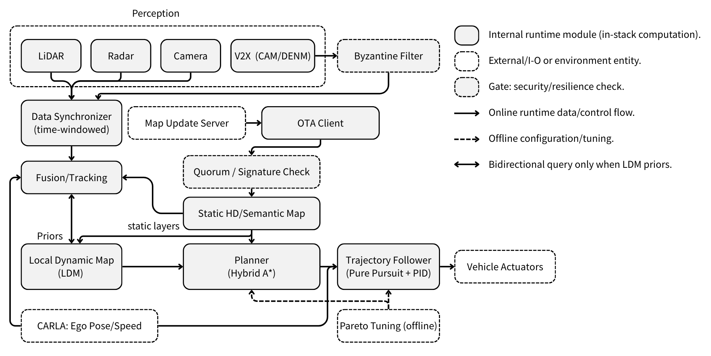
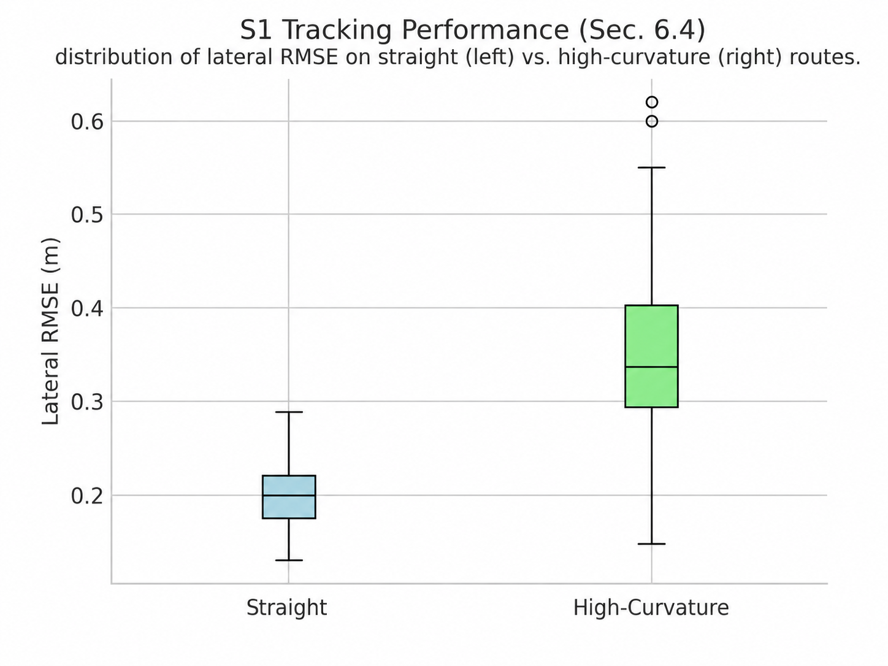
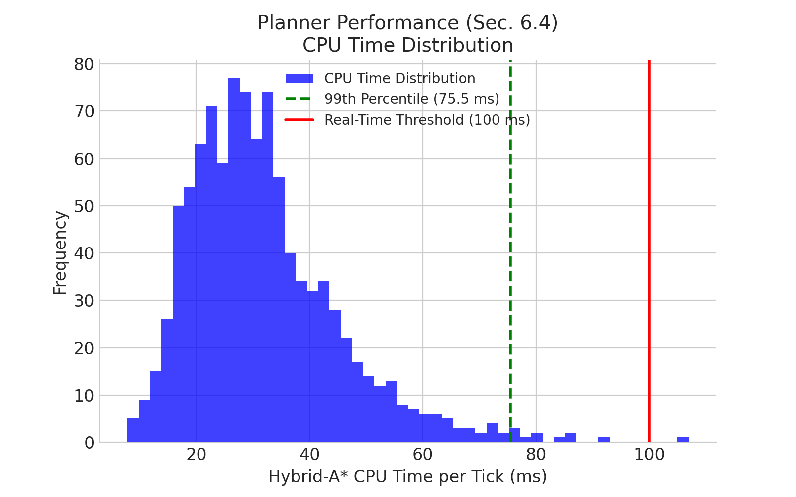

::: IEEEkeywords
V2X Communication, Motion Planning, Multi-Objective Optimization, Event-Driven Replanning, Resilient Autonomous Driving, CARLA Simulator.
:::

# Introduction

V2X promises earlier hazard awareness than on-board sensing alone, but in practice V2X inputs are uncertain: messages can arrive late, be lost, or be incorrect under realistic wireless conditions and dynamic traffic [@zhang2024v2x; @delooz2023adaptive; @ribouh2024seecad]. For a vehicle operating near safety margins, such uncertainty directly affects *when* to replan and *how* aggressively to control. In addition, road knowledge can change during execution (e.g., closures or topology updates), which may invalidate the current route and require replanning within a fixed control cycle [@kaljavesi2024carla].

While prior work studies V2X cooperation [@zhang2024v2x; @delooz2023adaptive], uncertainty-aware perception [@van2023evidential], and simulation toolchains [@CARLA; @justo2024simbusters], fewer studies connect them *in a closed loop* with measurable planning/control trade-offs under event-driven V2X/map updates, where safety, tracking, and smoothness are inherently competing. We present **MORPH-U**, a CARLA-based vehicle-side pipeline that (i) fuses LiDAR/radar/camera with V2X CAM/DENM into a Local Dynamic Map (LDM), (ii) runs Hybrid-A\* planning with event-driven replanning, and (iii) executes trajectories using Pure Pursuit and PID control [@CARLA]. On top of this loop, we add two mechanisms that target the above uncertainties: a multi-objective Pareto analysis for selecting operating points across tracking, safety, responsiveness, and smoothness [@deb2002nsga; @zitzler2003performance]; and a lightweight Byzantine-inspired acceptance gate that filters V2X-triggered replanning events before they affect the vehicle [@lamport1982byzantine; @blanchard2017machine].

Our contributions are:

1.  A V2X-augmented LDM that integrates CAM/DENM with on-board sensing and supports closed-loop planning under uncertain external inputs [@zhang2024v2x; @delooz2023adaptive; @van2023evidential].

2.  An event-driven Hybrid-A\* replanning loop in CARLA that reacts to validated hazards and map changes during execution [@CARLA; @kaljavesi2024carla].

3.  A multi-objective formulation and Pareto-frontier analysis that makes safety--tracking--smoothness trade-offs explicit and selectable [@deb2002nsga; @zitzler2003performance].

4.  A Byzantine-inspired acceptance gate for V2X-triggered replanning, evaluated under injected false-event attacks [@lamport1982byzantine; @blanchard2017machine].

We position MORPH-U as an *integration* contribution: Hybrid-A\*, Pure Pursuit, PID, and quorum-style filtering are individually standard. The novelty lies in (i) routing CAM/DENM through a probabilistically-fused LDM that is the *sole* planner interface, enabling clean ablations; (ii) treating planner re-entry as an explicit, gated event rather than continuous re-optimization; and (iii) reporting V2X's downstream effect on a *measured* Pareto frontier rather than at hand-tuned points.

We evaluate MORPH-U in CARLA urban intersections under both multi-vehicle traffic and single-vehicle route-following setups (Fig. [1](#Fig_1){reference-type="ref" reference="Fig_1"}), covering baseline tracking (S1), V2X hazard response (S2), update-induced rerouting (S3), and faulty-trigger attacks (S4).

:::: {#Fig_1 .figure latex-placement="t"}
::: caption
CARLA simulator evaluation setups in MORPH-U. **(a)** Multi-vehicle urban intersection used for V2X-enabled hazard response and faulty-trigger robustness (S2/S4). **(b)** Single-vehicle route-following used for baseline tracking and Pareto operating-point selection (S1), and as the backbone setting for update-induced rerouting (S3).
:::
::::

# Related Work {#sec:related}

## V2X-augmented perception under uncertainty

V2X has been widely studied as a mechanism to extend perception beyond line-of-sight through cooperative awareness and event-driven safety messages, enabling cooperative and infrastructure-aided perception in dynamic traffic [@zhang2024v2x; @delooz2023adaptive; @ribouh2024seecad]. In parallel, uncertainty-aware fusion has long relied on Bayesian and evidential formulations to represent ambiguity and combine heterogeneous sensing sources [@Bayesian; @Dempster-Shafer; @mentasti2024tracking; @van2023evidential]. Learning-based modules further enhance perception and downstream tasks in such pipelines [@deeplabv3plus2018; @mentasti2024tracking]. These works establish that V2X can improve the world model, but they typically stop short of quantifying how such improvements propagate through a closed-loop planner and controller under event-driven updates.

## Planning, control, and multi-objective operating points

Search-based planning and classical controllers remain common baselines for closed-loop autonomy, especially when reproducibility and auditable failure modes are required in safety studies [@CARLA; @mu2024pix2planning]. However, in realistic settings, safety, tracking, responsiveness, and smoothness are competing objectives that cannot be optimized simultaneously. Multi-objective optimization offers a principled lens to expose and select operating points via Pareto-optimal sets and quality indicators [@deb2002nsga; @zitzler2003performance]. Yet, much of the autonomy literature reports results at a small number of hand-tuned configurations, leaving the trade-off structure implicit and making it difficult to compare planning/control behaviors across scenarios with different uncertainty profiles.

## Resilience to faulty V2X triggers and map inconsistency

V2X inputs introduce a new failure surface: incorrect or adversarial reports can trigger unsafe braking or replanning, motivating resilience mechanisms grounded in Byzantine reasoning and robust aggregation [@lamport1982byzantine; @blanchard2017machine; @chen2017blockchain]. Separately, maintaining map consistency for downstream autonomy has been studied through HD map representations and validation/update pipelines, including standards such as OpenDRIVE and related change-handling work [@OpenDRIVE; @hdmaps_open_drive2022; @Lanelet2; @hdmap_verification_no_localization2023; @evaluation_hdmap_selflocalization2023; @terminology_map_deviations2023; @lanemapnet2023; @high_integrity_lane_occupancy2023; @hdmap_from_noisy_data2023; @e_mlp_online_hdmap2023; @smartmot2023; @kaljavesi2024carla]. Simulation and toolchains enable controlled evaluations of such effects in integrated pipelines, including V2X-in-the-loop setups and CARLA-based benchmarking [@CARLA; @geller2024carlos; @justo2024simbusters; @V2X-ROS; @Grimm2024CARLA-V2X-Sensor; @kaljavesi2024carla; @grimm2024contextualfusion]. However, fewer studies combine (i) V2X-augmented fusion, (ii) event-driven replanning induced by hazards and map changes, (iii) explicit Pareto trade-offs in planning/control, and (iv) resilience gating against faulty triggers *within the same closed-loop stack*. MORPH-U targets this gap by integrating these components and reporting measurable trade-offs and robustness envelopes across scenarios.

# System and Method {#sec:system-method}

**MORPH-U** is a CARLA-based, vehicle-side closed-loop stack that integrates V2X with multi-sensor perception, search-based planning, and classical control. At each tick, the system (i) buffers on-board sensor frames and V2X messages, (ii) fuses them into a Local Dynamic Map (LDM), (iii) triggers event-driven replanning when hazards or knowledge changes affect the planned route, and (iv) executes the trajectory with a trajectory follower. The design explicitly targets two questions: *(a)* how V2X improves the fused world model used by the planner, and *(b)* how to select stable operating points that balance safety, tracking, responsiveness, and smoothness under uncertainty. Figure [2](#Fig_2){reference-type="ref" reference="Fig_2"} summarizes the closed-loop execution path and highlights where (i) V2X/map events enter the LDM, (ii) replanning triggers are evaluated, and (iii) the acceptance gate blocks faulty triggers before they affect planning.

:::: {#Fig_2 .figure latex-placement="t"}
{width="50%"}

::: caption
Closed-loop architecture of MORPH-U. Time-windowed synchronization and fusion populate an ego-centric LDM from on-board sensing and V2X (CAM/DENM). Hybrid-A\* replans when validated events or knowledge changes trigger replanning. Pareto tuning is performed offline to select planning/control operating points. The acceptance gates (V2X and update path) prevent faulty triggers from reaching the planner.
:::
::::

## V2X-Augmented LDM Fusion {#subsec:ldm-fusion}

MORPH-U fuses LiDAR/radar/camera detections with V2X messages (CAM/DENM) into an ego-centric LDM that maintains (i) tracked dynamic objects and (ii) discrete hazard/map events relevant to planning. Let $z_k$ denote an incoming sensor detection or a decoded V2X packet with timestamp $t_k$. A synchronizer emits a time-aligned bundle within a sliding window: $$\begin{equation}
\mathcal{S}_t = \{(z_k,t_k)\mid t-\tau_{\text{sync}} \le t_k \le t\}.
\end{equation}$$ A fusion/tracking module associates detections across modalities and updates the LDM state $$\begin{equation}
\mathcal{X}_t = \{\mathcal{O}_t,\mathcal{E}_t,\mathcal{M}_t\},
\end{equation}$$ where $\mathcal{O}_t$ are tracked objects in the ego-local frame, $\mathcal{E}_t$ are event hypotheses (e.g., DENM hazards, map-change notices), and $\mathcal{M}_t$ are the active static map layers used for planning. V2X messages are *not* consumed directly: each $o\in\mathcal{O}_t$ carries an existence belief $b(o)\in[0,1]$ updated by Bayesian combination of on-board detection likelihoods and authenticated CAM/DENM reports weighted by source reputation, with on-board sensing acting as a veto when $\mathcal{L}_{\text{sensor}}$ contradicts a V2X claim within the same spatio-temporal cell. Event hypotheses $\mathcal{E}_t$ are gated separately by Sec. [3.4](#subsec:res-gate){reference-type="ref" reference="subsec:res-gate"} before they can trigger replanning. This LDM is the sole interface consumed by the planner and controller, enabling controlled ablations (sensors-only vs. sensors+V2X) and deterministic replay.

## Planning and Event-Driven Replanning {#subsec:planning-triggers}

Given $\mathcal{X}_t$ and a goal pose, MORPH-U computes a curvature-feasible trajectory using Hybrid-A\* over $SE(2)$: $$\begin{equation}
|\kappa(s)| \le \kappa_{\max},\qquad \kappa(s)=\frac{\tan\delta(s)}{L},
\end{equation}$$ with wheelbase $L$ and steering angle $\delta(s)$. Replanning is invoked by three auditable, scenario-controllable triggers: (i) *hazard-on-route*, a validated DENM within a look-ahead horizon on the planned route; (ii) *risk threshold*, a TTC-based predicted-risk excess on the current plan prefix; and (iii) *knowledge change*, an active-map version change after update activation. All triggers route through the gate of Sec. [3.4](#subsec:res-gate){reference-type="ref" reference="subsec:res-gate"}, ensuring that V2X/map signals affect the vehicle only via explicit, logged decisions.

## Multi-Objective Formulation and Pareto Operating Points {#subsec:multiobj}

We expose tunable design variables $$\begin{equation}
\boldsymbol{\theta}=\{\text{LA},K_p,K_i,K_d,\ \text{replan thresholds},\ \text{update interval},\ldots\},
\label{eq:theta}
\end{equation}$$ and evaluate each configuration on an objective vector $$\begin{equation}
\mathbf{J}(\boldsymbol{\theta})=
[J_{\text{trk}},J_{\text{sfty}},J_{\text{resp}},J_{\text{smth}},J_{\text{eng}}].
\end{equation}$$ We instantiate these objectives as: $$\begin{align}
J_{\text{trk}} &:= \mathrm{RMSE}_{\text{lat}}, \quad
J_{\text{sfty}} := \max(0,\ \tau_{\text{sfty}}-\mathrm{TTC}_{\min}), \notag \\
J_{\text{resp}} &:= \alpha t_{\text{V2X}}+\beta t_{\text{upd}}, \quad
J_{\text{smth}} := \mathrm{Var}(\delta)+\gamma\,\mathrm{Var}(\text{thr}), \notag \\
J_{\text{eng}} &:= \text{brake-energy proxy}.
\end{align}$$ We treat collisions as a hard constraint (discard) or a large penalty. For comparability across objectives, we normalize each objective to $[0,1]$ via min--max over the evaluated set: $\tilde{J}_i=\frac{J_i-J_i^{\min}}{J_i^{\max}-J_i^{\min}}$. A configuration $A$ dominates $B$ if $\tilde{\mathbf{J}}(A)\preceq \tilde{\mathbf{J}}(B)$ componentwise and strictly smaller in at least one component; the Pareto set $\mathcal{P}$ is the nondominated subset.

#### Knee-point selection.

To select a single operating point for deployment in closed-loop experiments, we choose a knee solution that minimizes distance to the utopia point under zero-collision constraint: $$\begin{equation}
\boldsymbol{\theta}^\star \in \arg\min_{\boldsymbol{\theta}\in\mathcal{P}}
\left\lVert \tilde{\mathbf{J}}(\boldsymbol{\theta}) \right\rVert_2
\quad \text{s.t. collisions}=0.
\end{equation}$$

#### Hypervolume comparison.

To compare ablations (e.g., sensors-only vs. sensors+V2X; no-update vs. update), we report hypervolume $\mathcal{H}$ of the Pareto set with respect to a reference point $\mathbf{r}\succ \max \tilde{\mathbf{J}}$. Larger $\mathcal{H}$ indicates a better achievable trade-off surface. (We report measured frontiers and $\mathcal{H}$ in Sec. [5.4](#subsec:pareto-exp){reference-type="ref" reference="subsec:pareto-exp"}.)

## Acceptance Gate for Replanning Triggers (Byzantine-Inspired) {#subsec:res-gate}

**Threat model.** We adopt a *Byzantine-inspired* threat model: V2X reports are authenticated but up to $f$ of $n$ stations may fabricate, replay, or equivocate. We do not claim formal Byzantine fault tolerance; instead we use a quorum-with-sensor-veto rule as a lightweight filter and evaluate it under one saturated injection policy (Sec. [5.1](#subsec:scenarios){reference-type="ref" reference="subsec:scenarios"}, S4).

**Quorum acceptance rule.** For a candidate event $E$ (e.g., DENM hazard or update notice), let $\mathcal{M}_t$ be the set of distinct authenticated reports supporting $E$ within a spatio-temporal window $(R,\tau_{\text{bft}})$, and let $\mathcal{L}_{\text{sensor}}(E)$ be an on-board likelihood (sensor veto). We accept $E$ only if $$\begin{equation}
\sum_{m_i\in\mathcal{M}_t} w_i\,\mathbf{1}[m_i \text{ supports }E] \ge \Theta
\quad \wedge \quad
\mathcal{L}_{\text{sensor}}(E)\ge \eta,
\label{eq:quorum}
\end{equation}$$ where $\Theta$ is chosen to require at least $2f{+}1$ distinct corroborations (e.g., $\Theta=2f{+}1$ with uniform weights), and $\eta$ enforces the sensor veto. Only accepted events trigger replanning. The gate's guarantees are empirical and limited to the evaluated attack class; coordinated, timing-correlated attacks and sensor-veto bypass are out of scope (Sec. [7](#sec:conclusion){reference-type="ref" reference="sec:conclusion"}).

:::: algorithm
::: algorithmic
**Input:** normalized objective set $\{\tilde{\mathbf{J}}(\boldsymbol{\theta}_k)\}_{k=1}^N$ $\mathcal{P}\leftarrow\emptyset$ dominated $\leftarrow$ **false** dominated$\leftarrow$**true**; **break** remove $p$ from $\mathcal{P}$ add $\tilde{\mathbf{J}}(\boldsymbol{\theta}_k)$ to $\mathcal{P}$ **Output:** Pareto set $\mathcal{P}$
:::
::::

# Implementation Details {#sec:implementation}

CARLA runs in synchronous mode with fixed time step $\Delta t$; a synchronizer aggregates timestamped sensor/V2X packets within $\tau_{\text{sync}}$ and emits fused snapshots each tick. Hybrid-A\* operates on the LDM and active map layers, while the trajectory follower combines Pure Pursuit (lateral) and PID (longitudinal) with bounded outputs and anti-windup; look-ahead, gains, and clamps are exposed for Pareto tuning. An update client polls a simulated server for map versions; upon activation, static layers refresh and a replanning trigger is issued at the next tick boundary for consistent state across the control cycle.

:::: {#fig:s1-boxplot .figure latex-placement="h"}
{width="\\columnwidth"}

::: caption
S1 baseline tracking: distribution of lateral RMSE on *straight* (left) vs. *high-curvature* (right) routes. The widening tail at high curvature is a known Pure Pursuit artifact; rather than masking it via curvature-dependent speed profiling, we expose look-ahead and gains as Pareto variables (Sec. [3.3](#subsec:multiobj){reference-type="ref" reference="subsec:multiobj"}).
:::
::::

:::: {#fig:pareto-frontier .figure latex-placement="h"}
::: caption
Pareto frontier (Sec. [5.4](#subsec:pareto-exp){reference-type="ref" reference="subsec:pareto-exp"}): Tracking vs. Smoothness ($N=60$ configurations). We select the 'Knee Point' (red star) for S2-S4 experiments.
:::
::::

:::: {#fig:planner-cpu .figure latex-placement="h"}
{width="0.8\\columnwidth"}

::: caption
Hybrid-A\* runtime distribution per tick. The tail remains within the real-time budget in evaluated scenarios.
:::
::::

# Experimental Design {#sec:exp-design}

## Scenarios {#subsec:scenarios}

We evaluate four scenarios that isolate V2X benefit, knowledge-change replanning, and resilience:

- **S1 (Tracking):** route following with no V2X and no updates; we vary curvature and speed limits to stress tracking and smoothness.

- **S2 (V2X hazard response):** during motion, we inject a DENM hazard (stationary vehicle / road closure) ahead of the ego vehicle; we compare reactions with and without V2X.

- **S3 (Update-induced reroute):** mid-route, a new map version changes topology (add/remove a segment); the vehicle activates the update and replans to complete the route.

- **S4 (Faulty V2X triggers with a true hazard):** based on S2, we inject a *ground-truth* hazard $E^\star$ (e.g., a stationary vehicle ahead) that is (i) observable by on-board sensing (thus $\mathcal{L}_{\text{sensor}}(E^\star)\ge\eta$) and (ii) corroborated by at least $2f{+}1$ authenticated *honest* stations within the spatio-temporal window $(R,\tau_{\text{bft}})$. In parallel, $f$ out of $n$ stations act as Byzantine attackers and broadcast falsified DENMs at rate $p_{\text{attack}}$. We evaluate the acceptance gate under $n{=}10$, $f{=}3$, $p_{\text{attack}}{=}1.0$, reporting both FPR (accepting injected false hazards) and FNR (rejecting $E^\star$, where $E^\star$ is broadcast by $2f{+}1$ non-attacking stations and is also present as a CARLA-ground-truth obstacle).

**Planner Analysis:** We profile the Hybrid-A\* planner's computational performance (success rate, path length, CPU time) across all scenarios (S1-S4) to ensure real-time feasibility (Table [\[tab:planner-perf\]](#tab:planner-perf){reference-type="ref" reference="tab:planner-perf"}). We also visualize the CPU time distribution (Fig. [5](#fig:planner-cpu){reference-type="ref" reference="fig:planner-cpu"}).

## Baselines and Ablations {#subsec:baselines}

We compare MORPH-U against the following baselines:

- **CARLA Autopilot / BehaviorAgent**: a simulator-provided driving stack as a sanity baseline for route following and hazard scenarios.

- **Sensors-only**: on-board sensing and tracking without any V2X inputs.

- **Sensors + V2X (unfiltered)**: V2X CAM/DENM integrated into the LDM without the acceptance gate.

We additionally ablate (i) update on/off in S3 and (ii) controller parameters (look-ahead and PID gains) for Pareto analysis.

## Metrics {#subsec:metrics}

We report:

- **Tracking**: lateral RMSE (m), heading error (deg), and **completion** (%) (reaching the goal without collision or planner failure).

- **Safety**: minimum time-to-collision $\mathrm{TTC}_{\min}$ (s) and collision count.

- **Responsiveness**: V2X reaction latency (event timestamp $\rightarrow$ first decel/steer) and update activation latency (download complete $\rightarrow$ replan issued).

- **Smoothness**: variance of steering and throttle commands (control effort proxy).

- **LDM fidelity**: MOTA/MOTP and ID switches against CARLA ground truth (reported for sensors-only vs. sensors+V2X CAM).

- **Resilience (S4)**: false-positive rate (FPR) for accepting fake hazards, false-negative rate (FNR) for rejecting genuine hazards, and trigger latency under attack.

## Pareto Frontier Protocol {#subsec:pareto-exp}

To expose planning/control trade-offs, we perform a grid search over primary controller parameters $\boldsymbol{\theta}=\{\text{look-ahead}, K_p, K_i, K_d\}$. We run S1 and S2 for each configuration ($N{=}30$ seeds per scenario), compute the objective vector $\mathbf{J}(\boldsymbol{\theta})$ (tracking, safety, responsiveness, smoothness; collision as a hard constraint), and extract the nondominated set using Alg. [\[alg:nondom\]](#alg:nondom){reference-type="ref" reference="alg:nondom"}. We report measured Pareto frontiers and select a knee-point configuration for subsequent closed-loop evaluations.

# Results {#sec:results}

#### S1: Baseline tracking and control stability.

Figure [3](#fig:s1-boxplot){reference-type="ref" reference="fig:s1-boxplot"} summarizes lateral RMSE on straight vs. high-curvature routes. The widening tail under curvature is the expected Pure Pursuit-at-speed artifact; rather than absorbing it via curvature-dependent speed profiling, we expose look-ahead $L_A$ and the gain triple $(K_p,K_i,K_d)$ as Pareto variables (Eq. [\[eq:theta\]](#eq:theta){reference-type="ref" reference="eq:theta"}) so that the trade-off itself becomes the reported result. Adding a speed profile to $\boldsymbol{\theta}$ is a natural extension. This motivates the Pareto knee-point selection used in S2--S4.

#### S2: V2X improves closed-loop safety by enabling earlier hazard response.

Table [\[tab:v2x_results\]](#tab:v2x_results){reference-type="ref" reference="tab:v2x_results"} shows that adding V2X (CAM/DENM) reduces lateral RMSE from $0.42$ m to $0.35$ m ($\approx16.7\%$) and increases $\mathrm{TTC}_{\min}$ from $1.30$ s to $1.90$ s ($\approx46\%$). Collisions drop from $5/30$ to $0/30$ episodes. The measured V2X reaction latency is $140\pm25$ ms, allowing the controller to initiate braking/steering before the equivalent risk is detectable from on-board sensing alone.

#### S3: Update-induced replanning restores route feasibility under evolving road knowledge.

Table [\[tab:ota_results\]](#tab:ota_results){reference-type="ref" reference="tab:ota_results"} reports that enabling updates improves completion from $72.4\%\pm4.7$ to $96.7\%\pm2.1$ ($+24.3$ pp). In the no-update baseline, failures occur after a topology mismatch invalidates the route on the outdated map, triggering a minimum-safety stop. With updates enabled, activation latency is $1.1\pm0.2$ s and replanning time is $38\pm6$ ms, enabling timely trajectory refreshes.

#### S4: Resilience under Byzantine V2X trigger injection.

We evaluate the acceptance gate under Byzantine DENM injection ($n{=}10$, $f{=}3$, $p_{\text{attack}}{=}1.0$) while preserving a ground-truth hazard $E^\star$ that is corroborated by at least $2f{+}1$ honest stations within $(R,\tau_{\text{bft}})$ and passes the sensor veto ($\mathcal{L}_{\text{sensor}}(E^\star)\ge\eta$). As shown in Table [\[tab:bft_results\]](#tab:bft_results){reference-type="ref" reference="tab:bft_results"}, the unfiltered V2X baseline is highly vulnerable: it accepts injected false hazards (FPR$=1.00$), triggering excessive braking/replanning and collapsing route completion to $0\%$. In contrast, **V2X+Quorum Filter** rejects all injected false hazards (FPR$=0.00$) while still accepting the true hazard (FNR$=0.00$), thereby retaining the V2X safety benefit (0/30 collisions) and restoring completion to $96.7\%\pm2.1$.

#### Pareto frontier exposes controllable trade-offs and yields a stable operating point.

Figure [4](#fig:pareto-frontier){reference-type="ref" reference="fig:pareto-frontier"} reports the measured Pareto set over $N{=}60$ controller configurations, revealing a clear tracking--smoothness trade-off. We select the knee-point configuration (RMSE $\approx 0.36$ m, smoothness $\approx 0.72$) as a single operating point for S2--S4, ensuring comparisons are not confounded by hand-tuning. We quantify frontier improvement using hypervolume $\mathcal{H}$ w.r.t. a fixed reference point $\mathbf{r}=(1.1,1.1,1.1)$ on the normalized objectives $(\tilde{J}_{\text{trk}},\tilde{J}_{\text{sfty}},\tilde{J}_{\text{smth}})$; enabling V2X increases $\mathcal{H}$ from $0.42$ (sensors-only) to $0.58$ (V2X-enabled).

#### Real-time feasibility.

Figure [5](#fig:planner-cpu){reference-type="ref" reference="fig:planner-cpu"} shows the distribution of Hybrid-A\* CPU time per tick; the tail remains within the real-time budget in our scenarios.

# Limitations and Conclusion {#sec:conclusion}

#### Conclusion.

This paper studied closed-loop motion planning and control under high-uncertainty V2X and evolving road knowledge, and presented **MORPH-U**, a CARLA-based vehicle-side stack that fuses LiDAR/radar/camera with CAM/DENM into an LDM, performs event-driven Hybrid-A\* replanning, and selects operating points via multi-objective Pareto analysis. Empirically, V2X improves closed-loop safety in hazard response (Table [\[tab:v2x_results\]](#tab:v2x_results){reference-type="ref" reference="tab:v2x_results"}), update-induced replanning restores route feasibility under knowledge changes (Table [\[tab:ota_results\]](#tab:ota_results){reference-type="ref" reference="tab:ota_results"}), and the quorum-based acceptance gate prevents false-event-induced replanning under Byzantine injection (Table [\[tab:bft_results\]](#tab:bft_results){reference-type="ref" reference="tab:bft_results"}). The Pareto frontier further exposes the tracking--smoothness trade-off and supports a reproducible knee-point selection used across scenarios (Fig. [4](#fig:pareto-frontier){reference-type="ref" reference="fig:pareto-frontier"}), while planner timing remains within real-time budgets in our evaluated settings (Fig. [5](#fig:planner-cpu){reference-type="ref" reference="fig:planner-cpu"}).

#### Limitations and future work.

Our evaluation is simulation-based: CARLA runs in synchronous mode, and network impairments (latency/loss/attack injection) are synthetically controlled rather than drawn from real wireless traces. Hybrid-A\*, Pure Pursuit, and PID are standard components; our contribution is a *reproducible* closed-loop methodology to quantify event-driven replanning under V2X/map updates, Pareto/knee operating-point trade-offs, and resilience to faulty triggers. We do not yet report real-vehicle or hardware-in-the-loop (HIL) validation, and performance may shift under different sensing stacks, localization noise, or actuator limits. Our S4 evaluation covers a saturated random-injection policy; coordinated, timing-correlated, and sensor-veto-bypass attacks remain to be studied, and the gate should be regarded as Byzantine-inspired rather than formally Byzantine-tolerant. The methodological contribution---a single closed-loop stack that simultaneously exposes V2X-fusion ablations, event-driven replanning, Pareto operating-point selection, and trigger-level resilience---fills a gap left by prior work that typically isolates one or two of these axes [@kaljavesi2024carla; @CARLA; @justo2024simbusters; @geller2024carlos]. As next steps, we will validate MORPH-U under recorded V2X traces and HIL settings, and transfer the stack to a physical testbed.
