# INTRODUCTION

Motion planning for quadrotors has been a widely studied subject since the inception of such robots. However, the motion planning through narrow passages remains challenging. Additionally, the morphing quadrotor designs, such as [@folding_UAV; @harsh_morphocopter], add to the challenge of such planning with varying drone size and dynamics. A variety of methodologies have been proposed to address these challenges.

The model-free approaches utilize reinforcement learning or neural networks to plan and execute the trajectory. The methodology in [@morphing_RL] uses reinforcment learning based coordinated control strategy for morphing quadrotors. However, it lacks explicit dynamic constraints or stability guarantees. The deep reinforcement learning [@morphocopter_planning_drl_tilted_gap] to navigate through tilted narrow gaps using onboard sensing mentions 87.36% success with the Sim2Real method. However, the methodology is applied for fixed frame quadrotors, and the narrow gaps they plan the trajectory through are still larger than the size of the quadrotor. The end-to-end planning and control using a neural network [@morphocopter_narrow_gap_3] to pass through narrow gaps is also applied to fixed frames, limiting their application to the morphing drone motion planning.

:::: {#fig:overview_figures .figure latex-placement="t"}
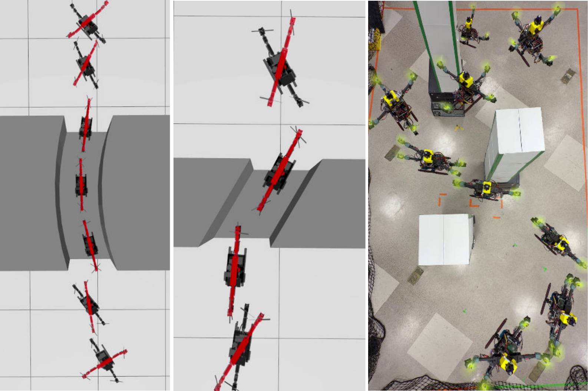{width="100%"}

::: caption
MoprhoCopter autonomously navigating through ultra-narrow passages using proposed MPC-based motion planning in simulations and experiments
:::
::::

Several methodologies consider some form of dynamic feasibility for planning the trajectories around obstacles for fixed-frame drones. The framework described in [@morphocopter_narrow_gap_1] uses onboard sensing to plan an aggressive trajectory to pass through tilted narrow gaps. However, it is a local motion planner to just pass through a single narrow gap and requires a large space before and after the narrow gap to execute the planned trajectory. For flying through a cluttered environment, [@morphocopter_planning_fixed_fast_autonomous_trajectory] and [@morphocopter_planning_fixed_fast_autonomous_trajectory2] generate a robust trajectory for fixed frame quadrotors. They first generate kinodynamically feasible B-spline trajectory candidates and then perform collision detection to discard the collision-prone candidates. Method in [@morphocopter_planning_safety_corridor_point_cloud] uses 3D point cloud data to construct a safety corridor between obstacles to plan dynamically feasible trajectories. However, it ensures dynamic feasibility by limiting velocity and acceleration up to a maximum limit and does not consider explicit model-based feasibility. The method in [@morphocopter_planning_narrow_gap_disturbances_fixed_frame] plans a trajectory through narrow gaps under disturbances for fixed-frame drones.

For morphing drones, there are some studies to plan the trajectories among narrow gaps in a cluttered environment. The planner in [@morphocopter_motion_configuration_control] is a B-spline-based trajectory planner for morphing quadrotors. It considers a point cloud-based safe corridor construction, but does not consider changing moments of inertia for planning the optimum trajectory through obstacles. [@morphocopter_folding_UAV5] is a trajectory planner and controller that plans a morphing strategy using a pre-constructed point cloud map of the environment. But it cannot replan the trajectory for unknown/changed obstacles. [@morphocopter_planning_MPC_lowlevel] is a low-level attitude controller for the morphing quadrotors, but does not incorporate trajectory planning or obstacle avoidance.

On the other hand, Model Predictive Control (MPC) has been widely used for controlling dynamic systems, particularly where actuator and environmental constraints must be rigorously respected. As an optimization-based control framework, MPC operates by predicting future system behavior over a receding horizon and solving constrained optimization problems online. This enables it to generate optimal control inputs that minimize tracking error and control effort while ensuring constraint satisfaction. Its ability to incorporate system models and handle nonlinearities makes it an attractive choice for morphing quadtrotors, which inherently involve changing dynamics and strong coupling between structure and control.

[@morphocopter_planning_chance_constrained_MPC] is an example of planning the trajectory using MPC for a fixed-frame quadrotor. It introduces a trajectory generation through moving obstacles using chance constraints (i.e. by restricting collision probability). It considers a constraint of minimum safety distance from the nearest obstacle in the MPC. For morphing drones, [@morphocopter_planning_MPCMDPI], [@morphocopter_planning_shape_adaptive_astar], and [@morphocopter_planning_NMPC_narrowgaps] utilize various MPC-based approaches to plan the trajectories and are very close to our method presented here. [@morphocopter_planning_MPCMDPI] uses the minimum snap trajectory planning with augmented MPC and considers moments of inertia of the morphing quadrotor. However, it assumes a static environment and does the planning before the flight. [@morphocopter_planning_shape_adaptive_astar] uses a modified A$^*$ algorithm to plan and generate a trajectory through extremely narrow gaps, along with nonlinear MPC to ensure the dynamical feasibility. However, this methodology also assumes a static environment and does not have online replanning capability. [@morphocopter_planning_NMPC_narrowgaps] is a similar approach with high level planner and nonlinear model predictive control for reconfigurable drones passing through narrow gaps. However, it considers only cubic or cylindrical well-defined narrow gaps, and also cannot plan through unknown obstacles.

The obstacle avoidance cost functions introduced in prior methodologies loosely resemble the Artificial Potential Field (APF) first introduced by Khatib [@khatib_APF]. The APF utilizes the concept of repulsive force from the obstacles. However, the classic APF-based cost functions fail to plan a trajectory through extremely narrow gaps [@Koren_APF_narrow_issue; @Tilove_APF_narrow_issue] as the space within the narrow gap is extremely close to the obstacles. This results in motion planners being unable to find a solution through narrow gaps, even if feasible collision-free paths exist. The other constraint-based approaches typically use control barrier functions or signed-distance constraints to guarantee safety [@Wang_MPC_CBF; @Ali_MPC_CBF]. These methods provide strong safety guarantees, but can introduce non-convex constraints and increase computational complexity.

To overcome the issues mentioned, our methodology uses the following:

1.  We introduce an exponential baseline obstacle avoidance cost function, which has a smooth gradient for optimizers without any hard distance cutoff.

2.  The cost function incorporates a novel cost reduction factor, which results in a low cost within extremely narrow gaps, enabling traversal where traditional repulsive potentials would create artificial barriers.

3.  Operate using limited 2D LiDAR perception, which can plan the trajectory around arbitrarily shaped obstacles.

4.  The methodology has been applied to a morphing quadrotor (MorphoCopter) to autonomously navigate throgh cluttered environment with automatic folding and unfolding.

By embedding this cost formulation within an acados-based [@acados] nonlinear MPC framework, the proposed approach combines real-time dynamic feasibility with gap-aware obstacle cost shaping, enabling robust navigation through arbitrarily shaped obstacles under limited sensing. The implementation is done on the morphing quadrotor platform MorphoCopter [@harsh_morphocopter].

The rest of the article is organized as follows: Section [2](#section:implementation_framework){reference-type="ref" reference="section:implementation_framework"} introduces the overall implementation framework. Section [3](#section: MPC Formulation){reference-type="ref" reference="section: MPC Formulation"} introduces the MPC formulation and novel cost function proposed in this article. Section [4](#section:results){reference-type="ref" reference="section:results"} showcases the simulation and experiment results with the applied methodology and compares with a baseline cost function. Section [5](#section:conclusion){reference-type="ref" reference="section:conclusion"} concludes the article.

# Implementation Framework {#section:implementation_framework}

The implementation framework used is summarized in Fig. [2](#fig:framework){reference-type="ref" reference="fig:framework"}. We combine a high-level planner, a trajectory planner, and a low-level trajectory follower to develop the holistic framework. The high-level planner plans a rough path around previously known static obstacles, the trajectory planner plans a precise trajectory online around any present obstacles, and the low-level trajectory follower running at high frequency ensures that the MorphoCopter is following the planned trajectory.

:::: {#fig:framework .figure latex-placement="htbp"}
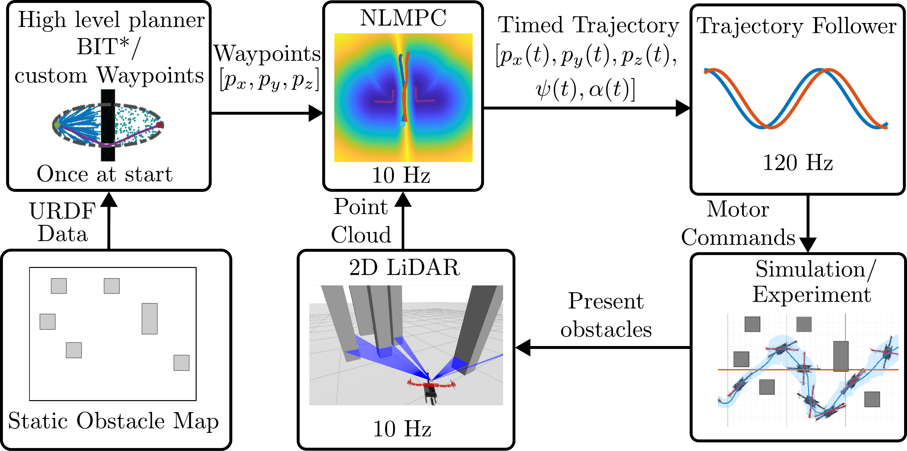{width="95%"}

::: caption
Implementation framework, partial image source: [@BIT_star]
:::
::::

The purpose of the high-level planner is to plan a reference trajectory around the previously known static obstacles. We are using Batch Informed Trees (BIT$^*$) [@BIT_star] algorithm for high-level path planning due to its higher convergence speed, informed sampling, and being an anytime algorithm. The BIT$^*$ is implemented using the Open Motion Planning Library (OMPL). The search is performed for position $x$ ($p_x$), position y ($p_y$), position z ($p_z$), and yaw in the BIT$^*$. The joint angle is kept constant at $\pi/2$ rad corresponding to the minimum width of the MorphoCopter. This ensures that the BIT$^*$ can find the solution even in the extremely narrow gaps. After the solution is found, the 3D waypoints are stored in the CSV file to be utilized by the online trajectory planner discussed next. It is important to note that we do not need to use a specific high-level planner; the online MPC planner (main contribution of this work) just needs a reference trajectory to follow a general direction. In some of our simulations and experiments, we just provide the straight line reference to demonstrate the ability of the online planner.

We use Model Predictive Control (MPC) as the trajectory planner with the following advantages:

- MPC can consider varying dynamics of the MorphoCopter explicitly and only plan a feasible trajectory at a given configuration.

- We can provide a custom cost function to minimize the trajectory errors and control costs while avoiding obstacles.

- We can provide a reference folding angle such that it prefers an unfolded, more efficient configuration, and only folds into a compact configuration if required to avoid obstacles.

For a low-level trajectory follower, the PID controller as described in [@harsh_morphocopter] is used. The trajectory follower runs at a much higher rate (120 Hz) compared to the MPC (10 Hz). The low-level controller ensures that the MorphoCopter remains stable even in the event of a delay in calculation from the MPC-based trajectory planner.

In the next section, we will describe the MPC formulation and introduce the novel obstacle avoidance cost function.

# MPC with Novel Cost Function {#section: MPC Formulation}

The necessary components for the MPC are system dynamics, cost function or objective function, and reference trajectory. We will discuss each of them for our MPC formulation in the upcoming subsections.

## System Dynamics

The MPC for MorphoCopter has 14 states as described in table [1](#tab:states){reference-type="ref" reference="tab:states"}. Compared to a standard quadrotor MPC, we have 2 extra states corresponding to the joint angle. Out of these, we consider $p_x$. $p_y$. $p_z$. $\psi$, and $\alpha$ as outputs of the MPC. The inputs are 4 motor thrusts ($u_1, u_2, u_3, u_4$) and the joint angle torque $u_{\alpha}$.

::: {#tab:states}
              State                      Symbol                     Description
  ------------------------------ ---------------------- ------------------------------------
     $\boldsymbol{x}(1,2,3)$        $p_x, p_y, p_z$            Positions in $x, y, z$
     $\boldsymbol{x}(4,5,6)$        $v_x, v_y, v_z$           Velocities in $x, y, z$
    $\boldsymbol{x}(7, 8, 9)$     $\phi, \theta, \psi$       Roll, pitch and yaw angles
   $\boldsymbol{x}(10, 11, 12)$        $p, q, r$         Angular rates about body $x, y, z$
     $\boldsymbol{x}(13, 14)$     $\alpha, \dot\alpha$   Joint angle and its rate of change

  : MPC States
:::

These states evolve with time as shown in equations below: $$\begin{equation}
    \begin{split}
        \dot{\boldsymbol{x}}(1) = \dot{p_x} = v_x = \boldsymbol{x}(4) \\
        \dot{\boldsymbol{x}}(2) = \dot{p_y} = v_y = \boldsymbol{x}(5) \\
        \dot{\boldsymbol{x}}(3) = \dot{p_z} = v_z = \boldsymbol{x}(6) \\
    \end{split}
\end{equation}$$

$$\begin{equation}
    \begin{bmatrix} 
        \dot{\boldsymbol{x}}(4) \\
        \dot{\boldsymbol{x}}(5) \\
        \dot{\boldsymbol{x}} (6) \\
    \end{bmatrix} = 
    \begin{bmatrix}
        \ddot{p_x} \\
        \ddot{p_y} \\
        \ddot{p_z} \\
    \end{bmatrix} = 
    \begin{bmatrix}
        0 \\
        0 \\
        g \\
    \end{bmatrix}
    + \frac{\mathbf{R}}{m} 
    \begin{bmatrix}
        0 \\
        0 \\
        -T \\
    \end{bmatrix}
\end{equation}$$

where $g$ is the gravitational constant, $\mathbf{R}$ is the rotation matrix from world frame to MorphoCopter body frame, and $m$ is the MorphoCopter mass. The total thrust $T$ in the body $z$ axis is given by: $$\begin{equation}
    T = (u_1 + u_2 + u_3 + u_4)\cdot \cos(\delta)
\end{equation}$$ where $\delta$ is the fixed tilt of the motor as described in [@harsh_morphocopter]. $$\begin{equation}
    \begin{bmatrix} 
        \dot{\boldsymbol{x}}(7) \\
        \dot{\boldsymbol{x}}(8) \\
        \dot{\boldsymbol{x}} (9) \\
    \end{bmatrix} = 
    \begin{bmatrix}
        \dot{\phi} \\
        \dot{\psi} \\
        \dot{\theta} \\
    \end{bmatrix} = 
    \mathbf{N}^{-1} 
    \begin{bmatrix}
        p \\
        q \\
        r \\
    \end{bmatrix}
\end{equation}$$ where $\mathbf{N}$ is the matrix relating Euler angles with body angular rates given by: $$\begin{equation}
    \mathbf{N} = 
    \begin{bmatrix}
        1 & 0 & \sin(\theta) \\
        0 & \cos(\phi) & \cos(\theta)\sin(\phi)\\
        0 & -\sin(\phi) & \cos(\theta)\cos(\phi)
    \end{bmatrix}
\end{equation}$$ $$\begin{equation}
    \begin{bmatrix}
        \dot{\boldsymbol{x}}(10)\\
        \dot{\boldsymbol{x}}(11)\\
        \dot{\boldsymbol{x}}(12)\\
    \end{bmatrix} = 
    \begin{bmatrix}
        \dot{p}\\
        \dot{q}\\
        \dot{r}\\
    \end{bmatrix} = 
    \boldsymbol{I}^{-1}
    \left( 
    \begin{bmatrix}
        \tau_x \\
        \tau_y \\
        \tau_z \\
    \end{bmatrix} - 
    \begin{bmatrix}
        p \\
        q \\
        r \\
    \end{bmatrix} \times 
    \boldsymbol{I} 
    \begin{bmatrix}
        p \\
        q \\
        r \\
    \end{bmatrix}
    \right)
\end{equation}$$ where, $\boldsymbol{I}$ is the inertia matrix, $\tau_x, \tau_y, \tau_z$ are body moment generated around body $x, y, z$ axes respectively. $$\begin{equation}
    \begin{split}
        \dot{\boldsymbol{x}}(13) = \dot{\alpha} = \boldsymbol{x}(14)\\
        \dot{\boldsymbol{x}}(14) = \ddot{\alpha} = \frac{u_{\alpha}}{\boldsymbol{I}(3,3)}
    \end{split}
\end{equation}$$

## Cost Function

The cost function at each stage (timestep) is constructed using a combination of trajectory deviation cost, control cost, and obstacle avoidance cost as: $$\begin{equation}
J_j = J_{y,j} + J_{u,j} + J_{o,j}
\end{equation}$$ where $J_{y,j}$ is the cost penalizing the trajectory deviation from the reference trajectory, $J_{u,j}$ penalizes the control inputs that deviate from the hover controls, and $J_{o,j}$ is the obstacle avoidance cost. $J_{y,j}$ and $J_{u,j}$ are standard nonlinear least square cost terms. $J_{y,j}$ is given by: $$\begin{equation}
\label{eq:traj_cost}
    J_{y,j} = \tfrac{1}{2}
\big( \boldsymbol{y}_j - \boldsymbol{y}^{\text{ref}}_j \big)^\top 
\boldsymbol{W}_{y,j}
\big( \boldsymbol{y}_j - \boldsymbol{y}^{\text{ref}}_j \big)
\end{equation}$$ Here $\boldsymbol{W}_{y,j} \in \mathbb{R}^{n_y\times n_y}$ is a tunable trjaectory deviation cost weight matrix. $\boldsymbol{y}_j$ is the output state of the MPC at stage $j$, and $\boldsymbol{y}_j^{\text{ref}}$ is the reference output state. $J_{u,j}$ is given by: $$\begin{equation}
\label{eq:control_cost}
    J_{u,j} = \tfrac{1}{2}
\big( \boldsymbol{u}_j - \boldsymbol{u}^{\text{ref}}_j \big)^\top 
\boldsymbol{W}_{u,j}
\big( \boldsymbol{u}_j - \boldsymbol{u}^{\text{ref}}_j \big)
\end{equation}$$ Here $\boldsymbol{W}_{u,j} \in \mathbb{R}^{n_u\times n_u}$ is a control cost weight matrix. $\boldsymbol{u}_j$ is the control input at stage $j$ and $\boldsymbol{u}_j^{\text{ref}}$ is the reference control input, which corresponds to the hover controls in our case. The obstacle avoidance cost function proposed in this article, $J_{o,j}$, is given by: $$\begin{equation}
    \label{eq:obstacle_avoidance_cost}
    J_o = W_o \cdot (1-(\mu^2-1)^2)\cdot exp\left(1-\frac{d^{\star^2}}{d^2_0}\right)
\end{equation}$$ Here $W_o \in \mathbb{R}$ is the obstacle avoidance weight parameter. $d^{\star}$ is the distance to the closest detected obstacle from the prediction location. $d_0$ is the distance where the cost is the same as the weight $W_o$. The cost increases as $d^{\star}$ approaches 0 and decreases as it approaches infinity. The cost term does not have any sharp cutoff, resulting in a smoother gradient in the whole region, unlike standard APF-like cost functions. $\mu$ is the novel cost reduction factor responsible for reducing the cost in narrow passages, which eliminates the problem faced in the standard APF-like cost functions. We will discuss the cost reduction factor in the next subsection.

## Cost Reduction Factor

The cost reduction factor ($\mu$) reduces the obstacle cost in the narrow passages, even if the points inside the passage are very close to the obstacles. This is done to ensure that the MPC can generate trajectories through extremely narrow gaps. The calculation of the cost reduction factor is explained using Algorithm [\[alg:line_segment_extraction\]](#alg:line_segment_extraction){reference-type="ref" reference="alg:line_segment_extraction"}, Algorithm [\[alg:crf_calculation\]](#alg:crf_calculation){reference-type="ref" reference="alg:crf_calculation"}, and Fig. [3](#fig:crf_explanation_new_less_figures){reference-type="ref" reference="fig:crf_explanation_new_less_figures"} with an example. The detailed methodology is described below.

:::: algorithm
::: algorithmic
Clustered 3D points $\mathcal{D}$, clustering threshold $\varepsilon$ Set of merged line segments $\mathcal{L}$

Sort points in $C_i$ by original index Detect break points $\mathcal{B}$ based on distance trends and discontinuities Split $C_i$ into sub-clusters $\{S_1, S_2, \ldots, S_m\}$ at $\mathcal{B}$ Fit a 3D line via linear regression Store its endpoints as a line segment $\boldsymbol{L}_k$ Merge adjacent line segments if nearly parallel and spatially close $\mathcal{L}$
:::
::::

In the pre-processing, the 2D LiDAR point cloud is processed to generate line segments corresponding to the detected obstacles using Algorithm [\[alg:line_segment_extraction\]](#alg:line_segment_extraction){reference-type="ref" reference="alg:line_segment_extraction"}. First, the LiDAR point cloud data is clustered using the DBSCAN algorithm. The clustering threshold ($\epsilon$) can be tuned as per the size of the robot, so that the gaps smaller than the size of the robot do not result in different clusters. These clusters are then further divided if the angle between the consecutive points is more than the threshold (i.e. $20^\circ$). Using this threshold, we can approximate curved shapes using line segments. Then, for each cluster, line segments are fitted using linear regression. These line segments represent the obstacle boundaries facing the LiDAR sensor.

:::: {#fig:crf_explanation_new_less_figures .figure latex-placement="htbp"}
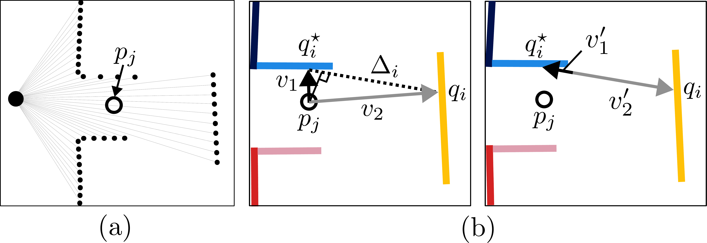{width="100%"}

::: caption
\(a\) 2D LiDAR scan (b) Cost reduction factor calculation (see Algorithm [\[alg:crf_calculation\]](#alg:crf_calculation){reference-type="ref" reference="alg:crf_calculation"})
:::
::::

The extracted line segments are provided to the acados MPC loop to calculate the cost reduction factor using Algorithm [\[alg:crf_calculation\]](#alg:crf_calculation){reference-type="ref" reference="alg:crf_calculation"}, which can be graphically visualized in Fig. [3](#fig:crf_explanation_new_less_figures){reference-type="ref" reference="fig:crf_explanation_new_less_figures"}. From each MPC prediction position ($p_j$), we determine the closest point on each obstacle line segment ($q_i$) and calculate the vectors ($\boldsymbol{v_i}$) connecting $p_j$ to the closest points on each line segment. Out of all these vectors, we make the pairs of the smallest vector ($\boldsymbol{v_1} = \boldsymbol{v_i^\star}$) with every other vector $\boldsymbol{v_i}$. Now, for each such pair, we project the vectors onto the line ($\Delta_i$) connecting the respective points on the line segments. Then, we take the normalized vector sum of these projections ($s_i$). The final cost reduction factor for timestep $j$ is the minimum of all such normalized vector sums from all the line segments.

:::: algorithm
::: algorithmic
Line segments $\mathcal{L}$, 2D part of MPC predicted positions $p_j$ Cost reduction factor $\mu_j$ for each MPC prediction timestep $j$

Let $p_j$ be the predicted position at timestep $j$

Compute closest point $q_i$ on segment $i$ to $p_j$ Compute distance between $p_j$ and $q_i$

Select index $i^\star$ with minimum distance Let $q^\star \gets q_{i^\star}$

Initialize $\mu_j \gets 1$

Compute closest point $q_i$ to $p_j$

Compute passage direction $\Delta_i \gets q^\star - q_i$

Compute vectors from predicted position to obstacle points: $\boldsymbol{v_1} \gets q^\star - p_j$, $\boldsymbol{v_2} \gets q_i - p_j$

Project $\boldsymbol{v_1}$ and $\boldsymbol{v_2}$ onto $\Delta_i$ as $\boldsymbol{v'_1}$ and $\boldsymbol{v'_2}$ Compute passage scaling using normalized sum of projections $s_i \gets \frac{||\boldsymbol{v'_1} + \boldsymbol{v'_2}||}{||\boldsymbol{v'_1}||+||\boldsymbol{v'_2}||}$ Update $\mu_j \gets \min(\mu_j, s_i)$

$\{\mu_j\}$
:::
::::

With this algorithm, the cost reduction factor for a given location is 0 if it is exactly in the middle of the narrow passage and is 1 if a given point has an obstacle only on one side (i.e., it's not a narrow passage). $\mu = 0$ will result in the obstacle avoidance cost of 0 as per ([\[eq:obstacle_avoidance_cost\]](#eq:obstacle_avoidance_cost){reference-type="ref" reference="eq:obstacle_avoidance_cost"}), allowing the MPC to plan the trajectory inside a narrow passage. $\mu = 1$ will not affect the obstacle avoidance cost, resulting in the obstacle cost same as the base cost.

:::: {#fig:crf_nocrf_example .figure latex-placement="htbp"}
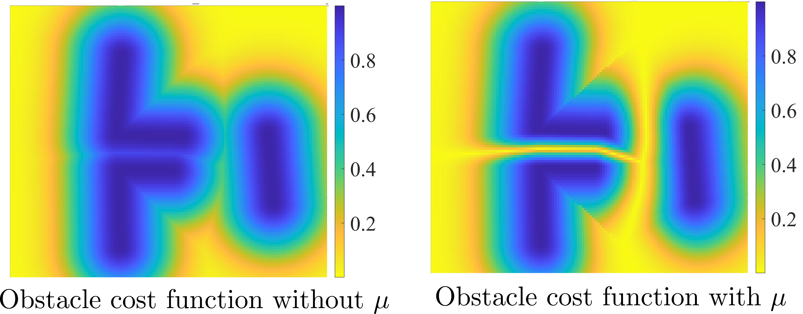{width="90%"}

::: caption
Comparison of the obstacle avoidance cost function without and with cost reduction factor
:::
::::

Fig. [4](#fig:crf_nocrf_example){reference-type="ref" reference="fig:crf_nocrf_example"} shows the effect of the cost reduction factor on the obstacle cost. As shown in this comparison, the obstacle avoidance cost is very high (close to maximum) inside the narrow gap if the cost reduction factor is not used. This is due to the distance between the points inside the narrow passage and the obstacles being very small. But with the cost reduction factor, the cost function has a passage corresponding to the opening among the obstacles. If the cost reduction factor is not considered, the MPC will not be able to find paths through the narrow gap.

## Reference Trajectory

As previously mentioned, the reference trajectory is provided by the BIT$^*$ algorithm or by custom waypoints. We only use 3D location data from the reference trajectory and directly feed it into $\boldsymbol{y}^{\text{ref}}_j$ in ([\[eq:traj_cost\]](#eq:traj_cost){reference-type="ref" reference="eq:traj_cost"}). For yaw reference and joint angle reference, we utilize the MPC trajectory generated in the previous MPC iteration:

### Yaw Reference

$$\begin{equation}
    \psi_{j}^{\text{ref}} = tan^{-1}\left(\frac{p_{y_{j+1}}-p_{y_{j}}}{p_{x_{j+1}}-p_{x_{j}}}\right) for\ 1<j<n-1
\end{equation}$$ and for $j = n$, we consider $\psi_n^{\text{ref}} = \psi_{n-1}^{\text{ref}}$. Here $n$ is the number of timesteps used in MPC.

### Joint Angle Reference

For determining the joint angle reference, we first calculate the maximum half-width of the MorphoCopter using: $$\begin{equation}
    w = max(d^{\star}_{b_y} - d_{min},p_l/2)
\end{equation}$$ Here, $p_l$ is the propeller diameter, $d^{\star}_{b_y}$ is the distance to the closest obstacle projected along the body $y$ axis, and $d_{min}$ is the safety distance desired between the MorphoCopter and the nearest obstacle.

Now, if $w > l \cdot cos(\pi/4) + p_l/2$, then the reference location does not need any folding and hence $\alpha_j^{\text{ref}} = 0$. Here, $l$ is the distance from the center of mass of the MorphoCopter to the propeller center. If $w <= l \cdot cos(\pi/4) + p_l/2$, we can calculate the reference joint angle using: $$\begin{equation}
    \alpha_j^{\text{ref}} = \frac{\pi}{2} - 2\cdot sin^{-1}\left(\frac{w - p_l/2}{l}\right)
\end{equation}$$

The 3D location reference received from BIT$^*$, $\psi_j^{\text{ref}}$, and $\alpha_j^{\text{ref}}$ combined make the the reference trajectory $\boldsymbol{y}_j^{\text{ref}}$, which is enterned into ([\[eq:traj_cost\]](#eq:traj_cost){reference-type="ref" reference="eq:traj_cost"}).

## Longitudinal and Lateral Cost Weights

In order to allow the MPC trajectory to deviate from the reference trajectory for avoiding the obstacles, while still following the reference trajectory's general direction, we use different cost weights in the longitudinal and lateral directions. The lateral direction cost is generally desired to be much lower than the longitudinal direction cost. As the MPC requires standard x-y cost, we convert the longitudinal-lateral cost weights into x-y cost weights for each timestep using the following:

$$\begin{align}
    \begin{split}
    &\boldsymbol{W}^{p_x,p_y}_{y,j} =  \\
        &\begin{bmatrix}
            w_{v} \cdot c^2(\psi_j) + w_{h}\cdot s^2(\psi_j) & (w_{v}-w_{h})\cdot s(\psi_j)c(\psi_j)\\
            (w_{v}-w_{h})\cdot s(\psi_j)c(\psi_j) & w_{v} \cdot s^2(\psi_j) + w_{h}\cdot c^2(\psi_j)\\
        \end{bmatrix}
    \end{split}
\end{align}$$

where $w_v$ is the tunable parameter for the longitudinal cost and $w_h$ is the tunable parameter for the lateral cost. $c$ represents $\cos$ and $s$ represents $\sin$.

## Constraints

One of the advantages of the MPC is the explicit use of the constraints. We use the following constraints in our formulation:

1.  $T_{idle} \leq u_i \leq T_{max}\ for\ i = 1,2,3,4$; where $T_{idle}$ is the thrust generated by motors while idling and $T_{max}$ is the physical limit of the thrust the specific motors can produce.

2.  $u_{\alpha} \leq \tau_{\alpha,max}$; where $\tau_{\alpha,max}$ is the torque limit of the joint angle servo motor used.

3.  $0 \leq \alpha \leq \pi/2$; where $\alpha$ is the joint angle.

These constraints ensure that the planned trajectory respects the control limits and remains within the hardware structural limit. Next, we will discuss the results from the simulations and experiments conducted using the framework described here.

# Results {#section:results}

We implement the framework with the proposed obstacle avoidance cost function in various challenging scenarios in simulations and experiments to validate the performance and to compare with standard APF-like cost functions. This includes navigating through various narrow passages and previously unknown obstacles (unknown to BIT$^*$). The tunable parameters used in our specific case are described in Table [2](#tab:parameters){reference-type="ref" reference="tab:parameters"}. We will delve into the details of the simulations and experiments in the subsections below. For better visualization, please refer to the accompanying video.

::: {#tab:parameters}
     Description                         Parameters                                         Values
  ----------------- ---------------------------------------------------- ---------------------------------------------
     MPC Runtime                        $n, t_{del}$                                       25, 0.1 s
   Trajectory cost   $w_{v},w_{h},\boldsymbol{W}^{z, \psi, \alpha}_{y}$       $0.53, 0.026, diag(4.0, 2.0, 20.0)$
    Control cost                     $\boldsymbol{W}_u$                   $diag(0.9, 0.9, 0.9, 0.9, 9.5\cdot10^{-5})$
    Obstacle cost                   $d_{min}, d_0, W_o$                             $0.16\ m, 0.6\ m, 1.0$

  : Tunable parameters Used
:::

## Simulations

The simulations are performed in high fidelity simulator Gazebo using PX4 firmware. Virtual LiDAR sensor is added on top of the MorphoCopter to detect the obstacles in the environment. For some cases, straight path references are considered instead of using BIT$^*$ to make the scenarios more challenging for MPC.

:::: {#fig: sim_horz_curve_sequence_and_cost .figure latex-placement="!htbp"}
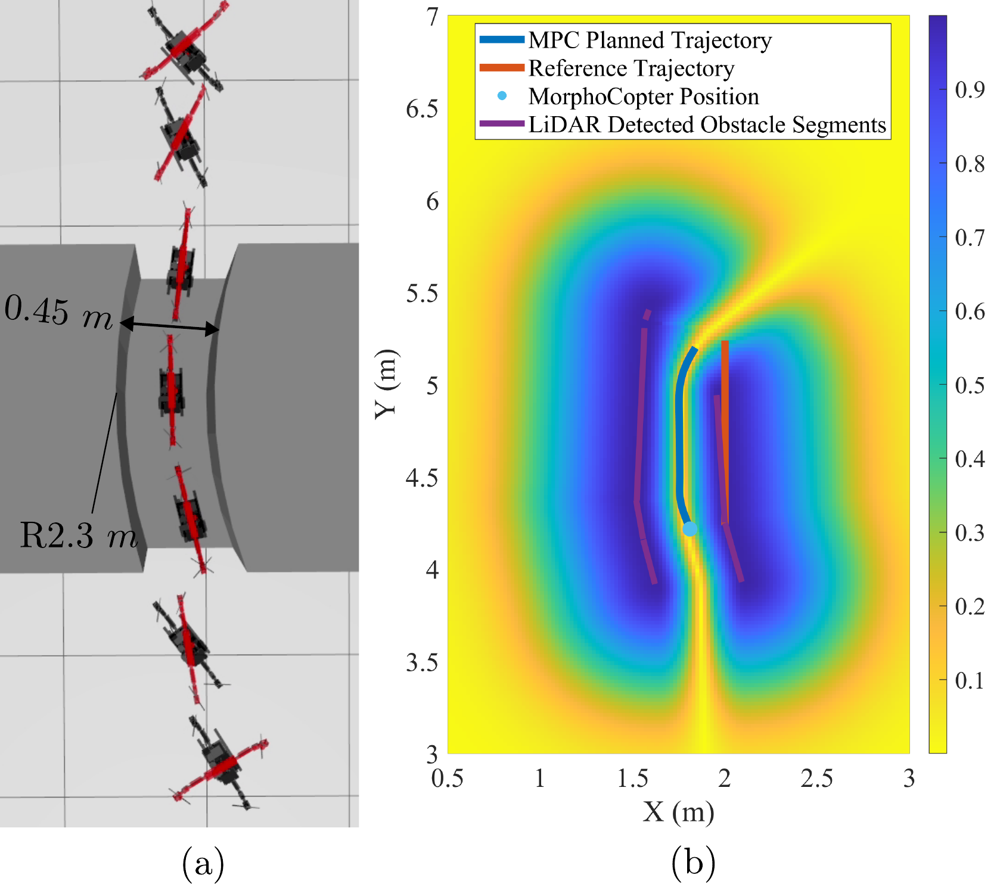{width="85%"}

::: caption
\(a\) MorphoCopter navigating using MPC through curved narrow passage in simulation (b) Obstacle avoidance cost function for one of the iterations
:::
::::

### Curved and inclined narrow passages

In the first simulation scenario, extremely narrow gaps (less than the size of the MorphoCopter) of curved and inclined surfaces are generated as shown in Fig. [5](#fig: sim_horz_curve_sequence_and_cost){reference-type="ref" reference="fig: sim_horz_curve_sequence_and_cost"} (a) and Fig. [6](#fig: sim_horz_inclined_sequence_and_cost){reference-type="ref" reference="fig: sim_horz_inclined_sequence_and_cost"} (a). The curved narrow passage is of $0.45\ m$ width and has a radius of $2.3\ m$. The width of the narrow gap is narrower than the size of the MorphoCopter in the unfolded configuration, hence it has to morph to a narrower configuration to pass through the narrow gap. Fig. [5](#fig: sim_horz_curve_sequence_and_cost){reference-type="ref" reference="fig: sim_horz_curve_sequence_and_cost"} (a) shows the sequence of the MorphoCopter navigating through the narrow gap, and Fig. [5](#fig: sim_horz_curve_sequence_and_cost){reference-type="ref" reference="fig: sim_horz_curve_sequence_and_cost"} (b) shows the obstacle avoidance cost function for one of the iterations. A narrow path corresponding to the middle of the gap is generated in the cost map using the cost reduction factor introduced in this article. Even with limited 2D LiDAR sensing, the cost function is adequate to navigate through this challenging environment. Please note that all the cost maps shown in this article are generated for illustrative purposes. The MPC does not need to compute the whole cost map, but calculates the cost just for the predicted positions.

:::: {#fig: sim_horz_inclined_sequence_and_cost .figure latex-placement="!htbp"}
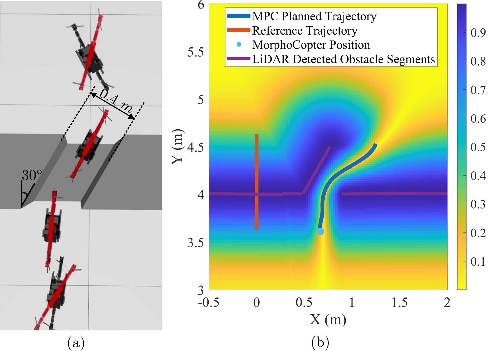{width="85%"}

::: caption
\(a\) MorphoCopter navigating using MPC through inclined narrow passage in simulation (b) Obstacle avoidance cost function for one of the iterations
:::
::::

Similarly, Fig. [6](#fig: sim_horz_inclined_sequence_and_cost){reference-type="ref" reference="fig: sim_horz_inclined_sequence_and_cost"} (a) shows the sequence of the MorphoCopter passing through $0.4\ m$ horizontally inclined passage, and Fig. [6](#fig: sim_horz_inclined_sequence_and_cost){reference-type="ref" reference="fig: sim_horz_inclined_sequence_and_cost"} (b) shows the cost function for one of the iterations. The reference trajectory was deliberately chosen to be offset from the narrow passage and of a straight path to showcase the ability of the MPC framework to find the safe path through the corridor.

### Cluttered obstacles

:::: {#fig: sim_cluttered_sequence_and_plot .figure latex-placement="!htbp"}
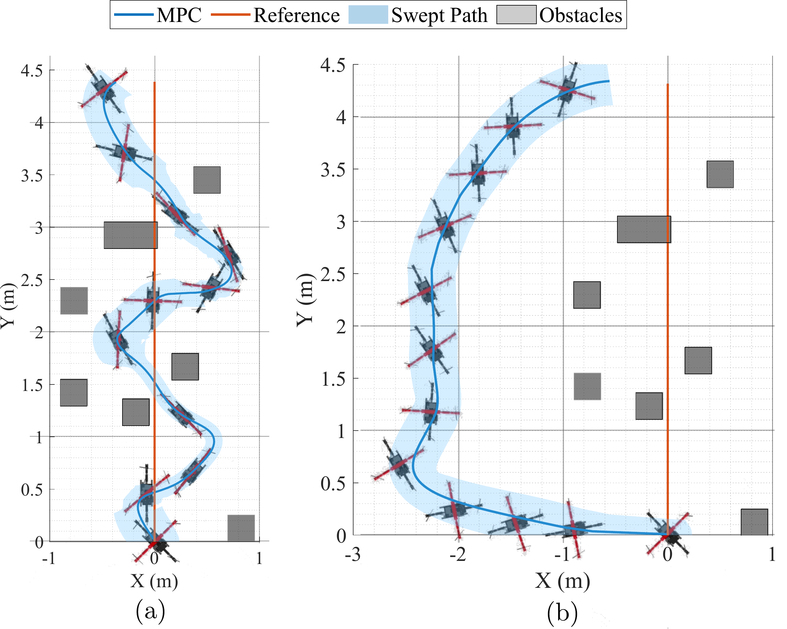{width="90%"}

::: caption
MorphoCopter navigating through a cluttered environment in simulations using (a) proposed cost function (b) standard repulsive cost function
:::
::::

:::: {#fig: sim_cluttered_cost_comparison .figure latex-placement="!htbp"}
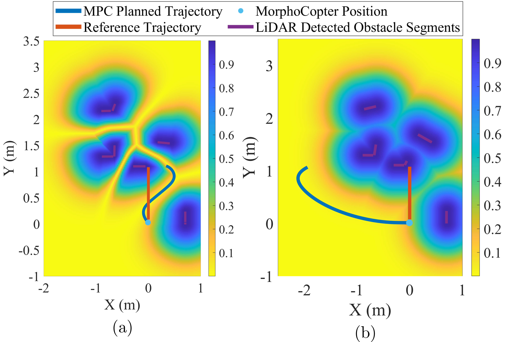{width="95%"}

::: caption
\(a\) Proposed cost function with cost reduction factor (b) Standard repulsive cost function
:::
::::

In this simulation scenario, a cluttered obstacle environment with multiple obstacles placed very close to each other was generated. There are various narrow passages among the obstacles that are narrower than the width of the MorphoCopter in the unfolded configuration. In this simulation also, we provide a straight line reference trajectory without using BIT$^*$ to demonstrate the ability of the MPC. Fig. [7](#fig: sim_cluttered_sequence_and_plot){reference-type="ref" reference="fig: sim_cluttered_sequence_and_plot"} (a) shows the MorphoCopter navigating through this environment. The figure also shows the swept path by the MorphoCopter, which covers the envelope of the size of the MorphoCopter, considering the folding angle. We can see that with the proposed framework, it is able to navigate through this environment comfortably while folding as needed. For benchmark purposes, the simulation without a cost reduction factor was also performed as shown in Fig. [7](#fig: sim_cluttered_sequence_and_plot){reference-type="ref" reference="fig: sim_cluttered_sequence_and_plot"} (b). Without the cost reduction factor, MPC cannot find a path between obstacles and has to plan around to avoid them. This results in the average deviation of $2.6\ m$ from the reference trajectory, which is only $0.41\ m$ in the case where we use the cost reduction factor.

The effect of the cost reduction factor can be more easily visualized in Fig. [8](#fig: sim_cluttered_cost_comparison){reference-type="ref" reference="fig: sim_cluttered_cost_comparison"}. Fig. [8](#fig: sim_cluttered_cost_comparison){reference-type="ref" reference="fig: sim_cluttered_cost_comparison"} (a) shows the initial cost function with cost reduction factor, while Fig. [8](#fig: sim_cluttered_cost_comparison){reference-type="ref" reference="fig: sim_cluttered_cost_comparison"} (b) shows the cost function without cost reduction factor. The figure clearly illustrates that there is no opening in the "no cost reduction factor\" case, forcing the MPC trajectory around the obstacles.

### Realistic room

:::: {#fig: sim_realistic_room_human_no_human_swept_paths .figure latex-placement="!htbp"}
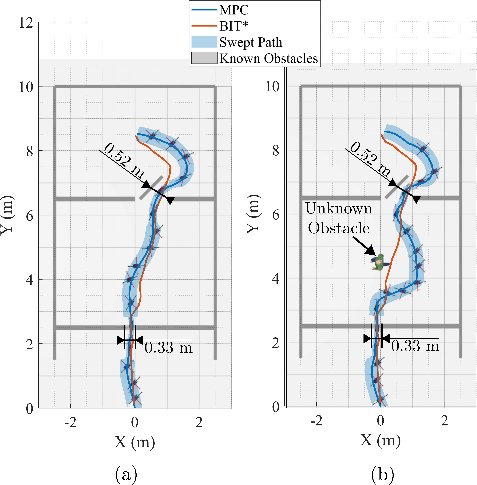{width="90%"}

::: caption
MorphoCopter navigating through a realistic room environment in simulations (a) without an unknown obstacle (b) with an unknown obstacle
:::
::::

In this simulation scenario, a realistic room with a window and an ajar door was constructed as shown in Fig. [9](#fig: sim_realistic_room_human_no_human_swept_paths){reference-type="ref" reference="fig: sim_realistic_room_human_no_human_swept_paths"}. The window creates a narrow gap with $0.33\ m$ width, and the ajar door creates an inclined narrow passage of $0.52\ m$ width. In this simulation, we utilize BIT$^*$ to generate the reference trajectory. Fig. [9](#fig: sim_realistic_room_human_no_human_swept_paths){reference-type="ref" reference="fig: sim_realistic_room_human_no_human_swept_paths"} (a) shows the environment obstacles, BIT$^*$ reference trajectory, and the MPC trajectory along with the swept path considering the size of the MorphoCopter and the snapshots from the simulation. The BIT$^*$ trajectory passes very close to obstacles at multiple locations, but MPC plans a smooth and dynamically feasible trajectory to avoid them.

Fig. [9](#fig: sim_realistic_room_human_no_human_swept_paths){reference-type="ref" reference="fig: sim_realistic_room_human_no_human_swept_paths"} (b) has one unknown obstacle, through which the BIT$^*$ trajectory is passing, as the obstacle was not present while generating the reference trajectory. MPC plans a smooth trajectory around the new obstacle. The replanned trajectory does not trigger morphing as the available space is still large enough to accommodate the unfolded configuration.

## Experiments

We validate the performance of the proposed framework in the experiments using MorphoCopter hardware. In addition to the design shown in [@harsh_morphocopter], a 2D LiDAR sensor has been added to facilitate onboard obstacle sensing for deriving the obstacle avoidance cost function. We conduct experiments in 2 different environments. The first environment is an extremely narrow passage, and the other is a cluttered space with obstacles and tight spaces among them.

:::: {#fig: old_obstacle_sequence_and_swept_path .figure latex-placement="!htbp"}
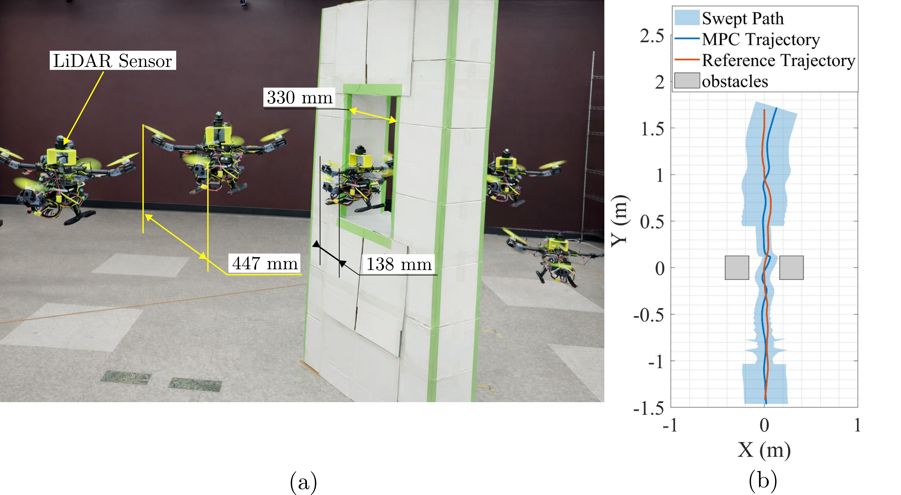{width="95%"}

::: caption
MorphoCopter passing through an extremely narrow gap using online MPC trajectory planning with LiDAR perception (a) experiment video sequence (b) trajectories and swept path
:::
::::

:::: {#fig: cost_both_exp .figure latex-placement="!htbp"}
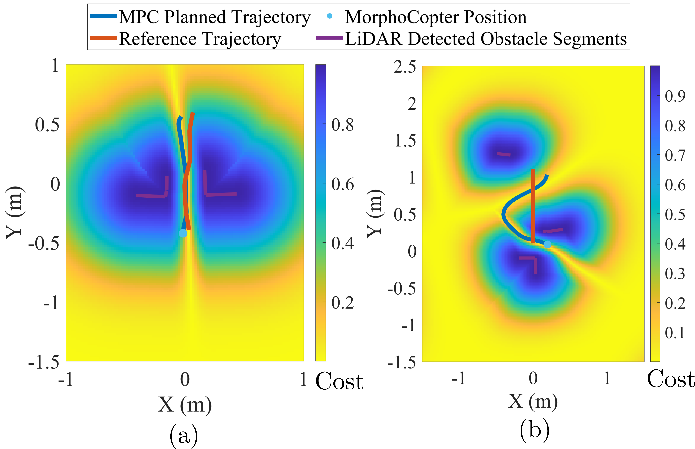{width="90%"}

::: caption
Obstacle avoidance cost function for one of the iterations in experiments (a) extremely narrow gap environment (b) cluttered obstacles environment
:::
::::

### Extremely Narrow Gap

In this experiment, a narrow passage of the width $0.33\ m$ has been constructed as shown in Fig. [10](#fig: old_obstacle_sequence_and_swept_path){reference-type="ref" reference="fig: old_obstacle_sequence_and_swept_path"} (a). The figure shows the MorphoCopter safely passing through this challenging obstacle using the proposed MPC framework. Fig. [10](#fig: old_obstacle_sequence_and_swept_path){reference-type="ref" reference="fig: old_obstacle_sequence_and_swept_path"} (b) shows the reference trajectory, MPC trajectory, and the swept path. The swept path illustrates that the MorphoCopter folds before entering the narrow gap at a safe distance and unfolds just after safely passing through it. Fig. [11](#fig: cost_both_exp){reference-type="ref" reference="fig: cost_both_exp"} (a) shows the obstacle avoidance cost function for one of the iterations. In this figure, we can see that the line segments and cost are generated properly even with noisy measurements with the actual hardware, indicating the robustness of the framework.

### Cluttered Obstacles

:::: {#fig: sequence_with_overlay .figure latex-placement="!htbp"}
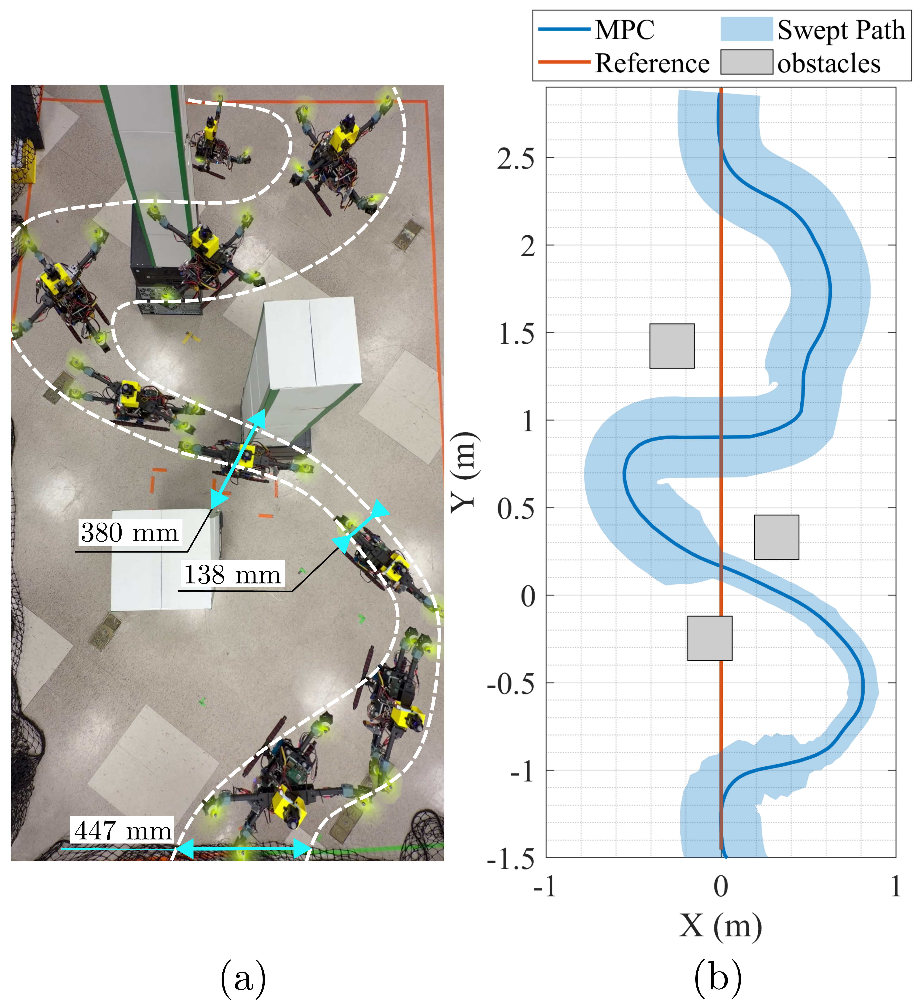{width="70%"}

::: caption
MorphoCopter passing through a cluttered obstacles environment using online MPC trajectory planning with LiDAR perception (a) experiment video sequence (b) trajectories and swept path
:::
::::

In this experimental setup, 3 cluttered obstacles, as shown in Fig. [12](#fig: sequence_with_overlay){reference-type="ref" reference="fig: sequence_with_overlay"} (a), are arranged with narrow gaps among them. The narrowest passage is of the $0.38\ m$ width, and it is at around $45^\circ$ angle with respect to the reference trajectory. In order to demonstrate the capability of the proposed MPC framework, the straight line reference connecting the start and goal is used, and the MPC is fully responsible for planning the trajectory and folding to avoid the obstacles. The MorphoCopter also has to adjust yaw and joint angle simultaneously. Fig. [11](#fig: cost_both_exp){reference-type="ref" reference="fig: cost_both_exp"} (b) shows the snapshot of the MPC planning for one of the iterations along with the cost function. We can clearly see that the MPC trajectory has been adjusted by a large amount in the X direction to avoid the obstacles. Fig. [12](#fig: sequence_with_overlay){reference-type="ref" reference="fig: sequence_with_overlay"} (b) shows the comparison of the reference trajectory with the MPC trajectory and the swept path. In the X direction, the MPC trajectory is deviating by around $0.75\ m$ from the reference trajectory at one point to avoid the obstacles, demonstrating the obstacle cost function safely guiding the MorphoCopter among the obstacles.

# CONCLUSIONS {#section:conclusion}

This article introduces a novel general-purpose obstacle avoidance cost function that has a low cost in the ultra-narrow passages and uses only onboard 2D LiDAR data. The cost function has been implemented in the real-time application of planning the trajectory and morphing for the MorphoCopter. The simulations and experiments evaluated the performance of the framework and compared it with standard APF-like cost functions. The limitations of the current methodology include replanning only 2D space and the inability to predict the motion of the moving obstacles. We plan to address these issues in the future to make the methodology more robust.

::: thebibliography
99

D. Falanga, K. Kleber, S. Mintchev, D. Floreano and D. Scaramuzza, \"The Foldable Drone: A Morphing Quadrotor That Can Squeeze and Fly,\" in *IEEE Robotics and Automation Letters*, vol. 4, no. 2, pp. 209-216, April 2019, doi: 10.1109/LRA.2018.2885575

H. Modi, H. Su, X. Liang, and M. Zheng, \"MorphoCopter: Design, Modeling, and Control of a New Transformable Quad--Bi Copter,\" in IEEE/ASME Transactions on Mechatronics, doi: 10.1109/TMECH.2025.3643609

C. -X. Li, H. -N. Wu and T. Yang, \"Coordinated Control of Flight and Morphing for Morphing Quadrotor via Reinforcement Learning,\" in IEEE Transactions on Aerospace and Electronic Systems, vol. 61, no. 5, pp. 12755-12766, Oct. 2025, doi: 10.1109/TAES.2025.3574295.

Y. Xie, M. Lu, R. Peng, and P. Lu, "Learning agile flights through narrow gaps with varying angles using onboard sensing," *IEEE Robot. Autom. Lett.*, vol. 8, no. 9, pp. 5424--5431, 2023.

J. Lin, L. Wang, F. Gao, S. Shen, and F. Zhang, "Flying through a narrow gap using neural network: An end-to-end planning and control approach," in *Proc. IEEE/RSJ Int. Conf. Intell. Robots Syst. (IROS)*, 2019, pp. 3526--3533, doi: 10.1109/IROS40897.2019.8967944.

D. Falanga, E. Mueggler, M. Faessler, and D. Scaramuzza, "Aggressive quadrotor flight through narrow gaps with onboard sensing and computing using active vision," in *Proc. IEEE Int. Conf. Robot. Autom. (ICRA)*, 2017, pp. 5774--5781, doi: 10.1109/ICRA.2017.7989679.

B. Zhou, F. Gao, L. Wang, C. Liu, and S. Shen, "Robust and efficient quadrotor trajectory generation for fast autonomous flight," *IEEE Robot. Autom. Lett.*, vol. 4, no. 4, pp. 3529--3536, 2019.

M. Ryll, J. Ware, J. Carter, and N. Roy, "Efficient trajectory planning for high speed flight in unknown environments," in *Proc. IEEE Int. Conf. Robot. Autom. (ICRA)*, 2019, pp. 732--738.

F. Gao and S. Shen, "Online quadrotor trajectory generation and autonomous navigation on point clouds," in *Proc. IEEE Int. Symp. Safety, Security, and Rescue Robot. (SSRR)*, 2016, pp. 139--146.

Z. Liu and L. Cai, "Simultaneous planning and execution for quadrotors flying through a narrow gap under disturbance," *IEEE Trans. Control Syst. Technol.*, vol. 31, no. 6, pp. 2644--2659, 2023, doi: 10.1109/TCST.2023.3283446.

A. Aikebaier, Q. Wang, Y. Bai, and Q. Wang, "Motion configuration planning method of morphing quadrotor," in *Proc. IEEE Int. Conf. Unmanned Syst. (ICUS)*, 2024, pp. 1597--1602, doi: 10.1109/ICUS61736.2024.10839796.

G. Cui, R. Xia, X. Jin, and Y. Tang, "Motion planning and control of a morphing quadrotor in restricted scenarios," *IEEE Robot. Autom. Lett.*, vol. 9, no. 6, pp. 5759--5766, Jun. 2024, doi: 10.1109/LRA.2024.3396109.

N. Zhao, Y. Luo, C. Qin, X. Luo, R. Chen, and Y. Shen, "Attitude control for morphing quadrotor through model predictive control with constraints," in *Proc. IEEE Int. Conf. Robot. Autom. (ICRA)*, 2024, pp. 10489--10495, doi: 10.1109/ICRA57147.2024.10610512.

X. Zhang, J. Ma, Z. Cheng, S. Huang, S. S. Ge, and T. H. Lee, "Trajectory generation by chance-constrained nonlinear MPC with probabilistic prediction," *IEEE Trans. Cybern.*, vol. 51, no. 7, pp. 3616--3629, 2021, doi: 10.1109/TCYB.2020.3032711.

C. Qin, N. Zhao, Q. Wang, Y. Luo, and Y. Shen, "Minimum snap trajectory planning and augmented MPC for morphing quadrotor navigation in confined spaces," *Drones*, vol. 9, no. 4, Art. no. 304, 2025, doi: 10.3390/drones9040304.

Y. Wu, Z. Han, X. Wu, Y. Zhou, J. Wang, Z. Fang, and F. Gao, "Shape-adaptive planning and control for a deformable quadrotor," *arXiv preprint arXiv:2505.15010*, 2025.

A. Papadimitriou, S. S. Mansouri, C. Kanellakis, and G. Nikolakopoulos, "Geometry aware NMPC scheme for morphing quadrotor navigation in restricted entrances," in *Proc. European Control Conf. (ECC)*, 2021, pp. 1597--1603, doi: 10.23919/ECC54610.2021.9655205.

O. Khatib, "Real-time obstacle avoidance for manipulators and mobile robots," The International Journal of Robotics Research, vol. 5, no. 1, pp. 90--98, 1986.

Y. Koren and J. Borenstein, \"Potential field methods and their inherent limitations for mobile robot navigation,\" in Proceedings. 1991 IEEE International Conference on Robotics and Automation, Sacramento, CA, USA, 1991, pp. 1398-1404, doi: 10.1109/ROBOT.1991.131754

R. B. Tilove, "Local obstacle avoidance for mobile robots based on the method of artificial potentials," in Proc. IEEE Int. Conf. Robot. Autom. (ICRA), 1990, pp. 566--571.

D. Wang, L. Mu, B. Wang, Q. Li, and X. Xue, "UAV obstacle avoidance algorithm based on model predictive control and control barrier functions," IFAC-PapersOnLine, vol. 59, no. 20, pp. 405--410, 2025.

A. M. Ali, H. A. Hashim, and C. Shen, "MPC-based linear equivalence with control barrier functions for VTOL-UAVs," in Proc. American Control Conf. (ACC), 2024.

R. Verschueren, M. Zanon, R. Quirynen, and M. Diehl, "acados: A modular open-source framework for fast embedded optimal control," Mathematical Programming Computation, vol. 14, pp. 147--183, 2022.

J. D. Gammell, T. D. Barfoot, and S. S. Srinivasa, "Batch informed trees (BIT\*): Informed asymptotically optimal anytime search," *Int. J. Robot. Res.*, vol. 39, no. 5, pp. 543--567, 2020.
:::

[^1]: This work was partially supported by U.S. National Science Foundation (Grants: No. 2422698). Correspondence to Minghui Zheng.

[^2]: $^{1}$Harsh Modi `harsh.modi@tamu.edu` and Minghui Zheng `mhzheng@tamu.edu` are with the Department of Mechanical Engineering, Texas A$\&$M University, College Station, TX 77843, USA.

[^3]: $^{2}$Xiao Liang `xliang@tamu.edu` is with the Department of Civil & Environmental Engineering, Texas A$\&$M University, College Station, TX 77843, USA.
