**Keywords:**motion planning, kinodynamic planner, replanning, asymptotically optimal

# INTRODUCTION

As robotics continues to move from controlled settings into the real world, motion planning in dynamic environments has emerged as a key barrier to autonomy. Robots deployed in logistics hubs, urban streets, and homes must not only plan optimal paths but also adapt swiftly to unexpected changes from moving obstacles to human interactions. This demands planners that are both computationally efficient and responsive to environmental dynamics.

Despite significant progress in sampling-based motion planning, many high-performance algorithms remain tailored for static worlds. However, real-world robotics applications often present non-static, partially known, or rapidly changing environments. For example, autonomous vehicles must handle sudden changes in traffic, while warehouse robots operate alongside human workers whose movements are unpredictable and unstructured.

For robotic systems to function effectively in these dynamic settings, planning algorithms must solve two core problems simultaneously, navigating between configurations while continuously adapting to environmental changes, and doing so with sufficient computational efficiency to maintain real‑time performance. The stakes are particularly high in applications like self‑driving cars or surgical robots, where planning delays or failures could have life‑threatening consequences.

Traditional approaches to dynamic planning typically oscillate between two problematic extremes. Static precomputation methods become immediately obsolete, while complete replanning from scratch carries prohibitive computational costs. While foundational sampling-based algorithms provide a strong basis for optimal planning, their original designs were conceived for static environments, led by two different philosophies. The sequential, tree-growing expansion of RRT$^{\ast}$ [@karaman2011sampling], and the structured, batch-processing approach of the Fast Marching Tree (FMT$^{\ast}$) [@janson2015fast]. FMT$^{\ast}$, in particular, often demonstrates superior performance due to its unique design; by performing a lazy dynamic programming recursion, it strategically defers expensive collision checks, and its global, wavefront-like expansion makes it less susceptible to challenging geometries that can hinder RRT$^{\ast}$-like planners. The primary limitation of these foundational planners, however, is their static nature. The very efficiency of FMT$^{\ast}$, for instance, is derived from its rigid, one-pass construction that processes each node only once, a design that inherently prohibits the path revisions required for dynamic replanning. The key principle for efficient replanning and locally repairing a search structure instead of restarting, was pioneered in the separate domain of graph-based search by algorithms like Lifelong Planning A$^{\ast}$ (LPA$^{\ast}$) [@Koenig2004LifelongPA] and D$^{\ast}$ Lite [@Koenig2005FastRF]. This powerful strategy of incremental repair was subsequently adapted to sampling-based planning in developments like RRT^X^ [@otte2016rrtx], which applies selective rewiring to the RRT$^{\ast}$ framework. Crucially, because the effectiveness of a repair strategy is deeply coupled to its underlying planner, the stark architectural differences between RRT$^{\ast}$'s sequential expansion and FMT$^{\ast}$'s structured wavefront propagation demand that each be given a distinct, tailored solution for dynamic replanning.

Building on these insights, this work presents FMT^X^, an extension of the Fast Marching Tree (FMT$^{\ast}$) algorithm that bridges computational efficiency and dynamic adaptability for motion planning ([1](#fig:static){reference-type="ref+label" reference="fig:static"}). FMT^X^ retains FMT$^{\ast}$'s sampling efficiency and lazy collision‑checking while introducing two key innovations: (1) incremental graph updates that methodically repair locally invalidated regions instead of discarding the entire planning tree, and (2) a revisit condition enabling re‑evaluation of suboptimal nodes when lower‑cost paths emerge through modified FMT$^{\ast}$ expansion rules. This hybrid approach preserves FMT$^{\ast}$'s scalability in static environments while adding robust dynamic replanning which is critical for systems where delayed responses risk catastrophic failure.

Empirical evaluation demonstrates that FMT^X^ outperforms RRT^X^ in replanning speed, reducing the average update time required for dynamic replanning.

# Related Work

The field of motion planning is largely built upon two foundational paradigms that define the core trade-offs between optimality, completeness, and computational efficiency. The first, search-based planning, operates by discretizing the environment into a graph and finding optimal paths within that structure. The second, sampling-based planning, avoids explicit discretization by building probabilistic roadmaps or trees, making it highly effective for complex, high-dimensional problems [@Orthey2023SamplingBasedMP]. This section reviews key algorithms from both of these domains, as they provide the direct context for the contributions of this paper.

## Search--Based Planners

### Classical Planning Algorithms

Graph‐based planners discretize the robot's continuous configuration space into a weighted graph, typically through uniform grids, visibility graphs, or other tessellations, and compute shortest paths over this graph structure. Uninformed search methods such as [@dijkstra1959note]'s algorithm ensure optimality by exploring in order of increasing path cost. In contrast, informed search techniques like A\* [@hart1968formal] accelerate planning by combining the cost-to-come with an admissible heuristic estimate of the cost-to-go.

These classical approaches are primarily suited to static and fully known environments, where the graph remains unchanged throughout the planning process.

### Replanning and Dynamic Search Algorithms

In real-world settings, environments often change or are only partially known, motivating the need for planners that can efficiently respond to updates. Algorithms such as D\* [@Stentz1994TheDA] and D\* Lite [@Koenig2002Dlite] propagate cost changes backward from the goal to efficiently repair affected parts of the search tree, rather than rebuilding it from scratch.

Lifelong Planning A\* (LPA\*) [@Koenig2004LifelongPA] extends A\* to sequences of related queries by preserving and updating only modified sections of the search tree. Adaptive A\* [@koenig2006real] further speeds up repeated queries by updating heuristics based on previous expansions.

These algorithms often incorporate ideas such as lazy edge evaluations and local repair mechanisms, which are conceptually influential beyond grid-based planning.

Among these, D\*, D\* Lite, and LPA\* are especially influential, as they introduce efficient local repair and reuse of search effort techniques that directly inform modern sampling-based replanners. Ideas such as lazy edge evaluation, cost propagation, and bounded suboptimality serve as conceptual bridges between graph-based and sampling-based planning.

While powerful in low-dimensional settings, graph-based planners rely on discretization and do not scale well in high-DOF continuous environments. This limitation motivated the development of sampling-based approaches, which extend incremental repair principles to continuous spaces, laying the groundwork for planners like FMT^X^.

:::: {#fig:static .figure latex-placement="!t"}
\

::: caption
Simulation of the FMT^X^ algorithm navigating a dynamic environment with appearing and disappearing obstacles. The trial used 10,000 samples, and the theoretical lower bound for the neighborhood radius constant, $\gamma^*$, was scaled by a multiplier of $C = 1.5$. All obstacles were inflated with a 2-meter safety margin.
:::
::::

## Sampling--Based Planners

### Static Sampling-Based Planners

Early sampling-based motion planners established probabilistic completeness for static environments. The Probabilistic Roadmap (PRM) [@kavraki1996probabilistic] and Rapidly-Exploring Random Tree (RRT) [@LaValle1998RapidlyexploringRT] are foundational sampling-based motion planning algorithms. PRM constructs a multi-query graph by randomly sampling the configuration space and connecting nearby collision-free configurations, effectively capturing the connectivity of the free space. RRT, on the other hand, incrementally builds a tree rooted at the start configuration, using random samples to efficiently explore high-dimensional spaces, with a bias towards unexplored regions due to its strategy of expanding from the nearest existing node to each random sample. Asymptotically optimal variants PRM$^{\ast}$ and RRT$^{\ast}$ [@karaman2011sampling] introduced incremental rewiring to guarantee path quality over time. RRT^\#^ [@Arslan2013UseOR; @Arslan2015DynamicPG] enhances RRT$^{\ast}$ by integrating a vertex consistency mechanism inspired by LPA\*, ensuring that the constructed tree maintains up-to-date cost-to-come values for all vertices, thereby accelerating convergence to the optimal path. Fast Marching Tree (FMT$^{\ast}$) [@janson2013fmt; @janson2015fast] departs from incremental rewiring by performing lazy batch wavefront updates, resembling Dijkstra's propagation in a sampling context, and converges faster than PRM$^{\ast}$ and RRT$^{\ast}$.

To reduce computational overhead in environments with expensive collision checking, lazy algorithms delay edge validation until a candidate path is identified. The original Lazy PRM [@Bohlin2000PathPU] defers collision checking until query time, avoiding unnecessary validations during roadmap construction. Building upon this idea, [@Hauser2015LazyCC] introduced Lazy PRM$^{\ast}$ and Lazy RRG$^{\ast}$, which combine lazy evaluation with asymptotically optimal graph search, achieving both efficiency and path quality guarantees.

In addition to algorithmic enhancements aimed at reducing runtime, bidirectional planners accelerate the search for a feasible path by concurrently expanding two trees initialized at the start and goal states. A classic example is RRT-Connect [@Kuffner2000RRTconnectAE], which aggressively attempts to join these trees at each extension step. Its asymptotically optimal counterpart, RRT$^{\ast}$-Connect [@Klemm2015RRTConnectFA], further incorporates an incremental rewiring mechanism akin to RRT$^{\ast}$ to continuously improve path quality as more samples are drawn. This combination of bidirectional growth and local rewiring guarantees that, given sufficient time, the solution converges almost surely to the optimal path.

These foundational algorithms have been extensively studied and proven effective in static environments, providing strong theoretical guarantees and serving as the basis for many modern planners. However, their core assumption of a static world limits direct applicability in dynamic scenarios with moving obstacles or changing goals. Consequently, to maintain performance and responsiveness in such environments, these planners need to be extended or adapted, motivating the development of dynamic replanning variants that build on these solid foundations.

Informed RRT$^{\ast}$ [@Gammell2014InformedRO; @Gammell2017InformedSF] enhances the convergence rate of RRT$^{\ast}$ by focusing the sampling process within a prolate hyperspheroid that encompasses all possible paths shorter than the current best solution. This informed sampling strategy reduces exploration of irrelevant regions, accelerating path optimization. Building upon this concept, Batch Informed Trees (BIT$^{\ast}$) [@Gammell2017BatchIT; @Gammell2014BatchIT] combines the batch processing approach of FMT$^{\ast}$ with informed sampling and lazy collision checking to provide an anytime, asymptotically optimal planner. BIT$^{\ast}$ incrementally refines its solution by processing batches of samples and employing truncated rewiring to improve efficiency.

Although highly effective in static settings, informed algorithms like Informed RRT$^{\ast}$ and BIT$^{\ast}$ prune samples globally based on a fixed obstacle configuration, making them ill-suited for dynamic replanning where relevant regions shift unpredictably. This limitation extends to their direct successors, including more advanced heuristic planners like ABIT$^{\ast}$ [@Strub2020AdvancedB], AIT$^{\ast}$ [@Strub2020AdaptivelyIT] and EIT$^{\ast}$ [@Strub2021AdaptivelyIT], which are built upon the same core principles of informed search.

### Kinodynamic Sampling-Based Planners

Kinodynamic motion planning addresses the challenge of generating trajectories that are not only collision-free but also dynamically feasible with respect to a robot's differential constraints, such as limits on velocity, acceleration, or torque [@Gammell2020AsymptoticallyOS]. These constraints reduce the connectivity of the state space, making the problem significantly more complex than its geometric counterpart. Two primary paradigms have emerged to solve this problem: forward-propagation-based methods and steering-based methods [@Orthey2023SamplingBasedMP].

Forward-propagation planners explore the state space by sampling control inputs and integrating the system's dynamics forward in time [@Orthey2023SamplingBasedMP]. The seminal work on the Rapidly-Exploring Random Tree (RRT) algorithm by [@lavalle2001randomized] established this as a powerful method for kinodynamic planning by incrementally building a tree of trajectories through random state exploration . However, solving the two-point boundary value problem (BVP) is computationally intensive and often impractical for complex systems [@li2016asymptotically]. To address this, the stable sparse RRT (SST) algorithm was introduced, demonstrating that asymptotic (near-)optimality is achievable without a BVP solver by combining random propagation with a selective pruning mechanism [@li2016asymptotically].

In contrast, steering-based planners rely on a function that solves the BVP to compute a dynamically feasible path between two states. Foundational work extended asymptotically optimal planners to this domain, with [@Karaman2010OptimalKM] establishing the theoretical basis for a kinodynamic RRT$^{\ast}$ . [@Webb2012KinodynamicRO] then generalized this for any system with controllable linear dynamics by introducing a fixed-final-state-free-final-time controller capable of exactly and optimally connecting any two states . In parallel, [@Schmerling2014OptimalSM] provided a similar framework for FMT$^{\ast}$ under differential constraints, proving its asymptotic optimality.

### Dynamic Sampling--Based Replanning

Dynamic sampling planners handle moving obstacles and goals by reusing precomputed samples and selectively repairing only those parts of their structure affected by environmental changes.

RT--FMT [@Silveira2023RealTimeFM] pre‑samples a set of nodes like FMT$^{\ast}$ and then, in hard real‑time loops, interleaves global tree expansion with eager local path extraction. It continuously rewires around dynamic obstacles and keeps the tree root adjacent to the robot so that the same tree supports multiple changing goals with minimal latency.

RT--RRT$^{\ast}$ [@Naderi2015RTRRTAR] incrementally grows its RRT$^{\ast}$‑based tree on‑the‑fly, moving the root with the agent and performing localized rewiring both randomly and from the root to rapidly adapt to goal shifts and avoid obstacles, without RT--FMT's upfront sampling.

DRRT [@Ferguson2006ReplanningWR] adapts RRT for dynamic environments by reversing the tree's growth direction from the goal towards the robot, and incrementally repairing only the affected branches when obstacles change. This approach allows for efficient replanning without rebuilding the entire tree, making it suitable for scenarios with frequent environmental updates.

RRT^X^ [@otte2016rrtx] retains RRT$^{\ast}$'s asymptotic optimality through a global, dynamic‑programming‑style graph repair. Similar to DRRT, it reverses the tree growth direction, growing the tree from the goal towards the start, and upon any obstacle update, fires a cascading rewiring across the entire search graph, maintaining shortest‑path consistency across the graph. This makes it best suited for single‑query scenarios, in contrast to the multi‑goal flexibility but lack of global consistency guarantees in planners like RT--FMT and RT--RRT$^{\ast}$.

FMT^X^ builds on these ideas by extending the batch-update efficiency of FMT$^{\ast}$ through the integration of graph-search-inspired local repairs to efficiently handle dynamic obstacle changes. It adapts RRT^X^'s incremental repair paradigm which it self motivated by algorithms such as RRT^\#^, LPA\*, and D\* Lite, to update only perturbed subgraphs instead of rebuilding the entire graph. Additionally, it preserves FMT$^{\ast}$'s lazy batch-wavefront expansion strategy but confines updates to corrupted regions, enabling fast replanning without sacrificing optimality. Unlike informed optimal planners (e.g., BIT$^{\ast}$, Informed RRT$^{\ast}$) that prune samples globally based on a static environment, FMT^X^ preserves all samples for continual reuse amidst dynamic obstacle changes. Furthermore, unlike hierarchical real-time frameworks that trade optimality for speed or have computationally expensive rewiring, FMT^X^ remains a single-layer, sampling-based planner, simple, scalable, and rapidly adaptive in dynamic domains.

# Problem Statement: Shortest‑Path Replanning

Let $\mathcal{X} \subset \mathbb{R}^d$ denote the configuration space, with time-varying obstacle and free regions given by $\mathcal{X}_{\mathrm{obs}}(t) \subset \mathcal{X}$ and $\mathcal{X}_{\mathrm{free}}(t) = \mathcal{X} \setminus \mathcal{X}_{\mathrm{obs}}(t)$. Following [@otte2016rrtx], given initial robot state $x_{\mathrm{bot}}(0) = x_{\mathrm{start}}$ and fixed goal $x_{\mathrm{goal}} \in \mathcal{X}_{\mathrm{free}}(0)$, we model obstacle changes as $\Delta\mathcal{X}_{\mathrm{obs}} = f(t, x_{\mathrm{bot}}([0,t]))$, capturing dynamic environments or sensor updates. The objective is to maintain a collision-free, minimum-length trajectory to the goal: $$\begin{gather*}
        \pi^*(t)
        = \operatorname*{arg\,min}_{\substack{
                \pi\subset\mathcal{X}_{\mathrm{free}}(t)\\
                \pi(0)=x_{\mathrm{bot}}(t),\;\pi(1)=x_{\mathrm{goal}}}}
        \mathrm{Length}(\pi)
\end{gather*}$$ and replan whenever $\Delta\mathcal{X}_{\mathrm{obs}} \neq \emptyset$.

::: algorithm
**Initialization:**\
$V \leftarrow \{v_{\text{init}},v_{\text{goal}}\} \cup \mathtt{Sample}(n)$, $E \leftarrow \emptyset$\
$V_{\text{open}} \leftarrow \{v_{\text{goal}}\}$\
$O_{\text{prev}}, O_{\text{new}} \leftarrow \emptyset$\
$r_n \leftarrow \mathtt{ComputeRadius}(|V|)$
:::

# The FMT^X^ Algorithm

The FMT^X^ algorithm is presented in Algorithm [\[alg:fmtx\]](#alg:fmtx){reference-type="ref" reference="alg:fmtx"} with its primary subroutines defined in Algorithms [\[alg:UpdateObstacles\]](#alg:UpdateObstacles){reference-type="ref" reference="alg:UpdateObstacles"} to [\[alg:FMTStarExpand\]](#alg:FMTStarExpand){reference-type="ref" reference="alg:FMTStarExpand"}. The core control loop (lines 6--12 in Algorithm [\[alg:fmtx\]](#alg:fmtx){reference-type="ref" reference="alg:fmtx"}) continues until the robot reaches its goal.

The algorithm begins with an initialization phase (lines 2--5), where a set of $n$ samples is drawn from the environment, a neighborhood radius $r_n$ is computed using a function of the sample count, and the goal state is added to the open set $V_{\text{open}}$ as the root of the tree.

During each iteration, the algorithm performs the following key operations:

- It updates the robot's current position (line 7).

- It retrieves the current obstacle configuration based on new information (line 8).

- The $\mathtt{UpdateObstacles}$ subroutine (Algorithm [\[alg:UpdateObstacles\]](#alg:UpdateObstacles){reference-type="ref" reference="alg:UpdateObstacles"}) incrementally updates the search tree to reflect dynamic changes in the environment: it detects edges that become invalid when newly appearing obstacles intersect them, also identifies nodes that can regain connectivity once obstacles are removed, and then reinitializes the affected subtrees accordingly.

- The $\mathtt{FMT\textsuperscript{*}Expand}$ subroutine (Algorithm [\[alg:FMTStarExpand\]](#alg:FMTStarExpand){reference-type="ref" reference="alg:FMTStarExpand"}) performs cost-ordered graph expansion using a modified re-evaluation condition to enable efficient, localized replanning.

::: algorithm
$O^{+} \leftarrow O_{\text{new}} \setminus O_{\text{prev}}$ $O^{-} \leftarrow O_{\text{prev}} \setminus O_{\text{new}}$
:::

The algorithm manages environmental dynamics by tracking obstacles in two sets: $O_{\text{prev}}$ for the previous state and $O_{\text{new}}$ for the current one. The $\mathtt{UpdateObstacles}$ routine (Algorithm [\[alg:UpdateObstacles\]](#alg:UpdateObstacles){reference-type="ref" reference="alg:UpdateObstacles"}) orchestrates this response.

When new obstacles appear, the $\mathtt{AddObstacles}$ subroutine (Algorithm [\[alg:AddObstacles\]](#alg:AddObstacles){reference-type="ref" reference="alg:AddObstacles"}) identifies tree edges that are now blocked. The child node of each blocked edge, along with its entire descendant subtree, is pruned from the search tree by removing the nodes from the open list and resetting their costs to infinity. Subsequently, the set of all impacted nodes is passed to $\mathtt{QueueNeighbors}$.

Conversely, for disappearing obstacles, the $\mathtt{RemoveObstacles}$ subroutine (Algorithm [\[alg:RemoveObstacles\]](#alg:RemoveObstacles){reference-type="ref" reference="alg:RemoveObstacles"}) identifies edges that become newly unobstructed. It then collects the nodes at the endpoints of these restored edges to be processed by $\mathtt{QueueNeighbors}$.

In both cases, $\mathtt{QueueNeighbors}$ (Algorithm [\[alg:QueueNeighbors\]](#alg:QueueNeighbors){reference-type="ref" reference="alg:QueueNeighbors"}) ensures the open set reflects all eligible candidates for future expansion and for repairing the graph by adding the valid, connected neighbors of the affected nodes to the queue.

To maintain tree structure and ensure correct parent-child relationships, the $\mathtt{UpdateParent}$ routine (Algorithm [\[alg:UpdateParent\]](#alg:UpdateParent){reference-type="ref" reference="alg:UpdateParent"}) updates ancestry as needed.

The $\mathtt{FMT\textsuperscript{*}Expand}$ subroutine (Algorithm [\[alg:FMTStarExpand\]](#alg:FMTStarExpand){reference-type="ref" reference="alg:FMTStarExpand"}) performs the cost-ordered graph expansion central to the FMT$^{\ast}$ framework. To adapt to a dynamic environment, this routine replaces the standard unvisited check from the original algorithm [@janson2015fast] with a cost-based re-evaluation condition. A neighboring node $x$ is considered for an update only if a potentially better path is discovered through another node $z$, i.e., if $c(x) > c(z) + \mathrm{Cost}(z, x)$. This change is fundamental for enabling lazy replanning, as it allows the algorithm to repair the tree by propagating cost improvements or finding new routes for nodes affected by changing obstacles.

Furthermore, the satisfaction of this inequality serves as a proof that the current cost of node $x$ is suboptimal. This proof justifies the subsequent, more computationally intensive step of searching for the absolute best parent, $y_{\min}$, among all of $x$'s open neighbors, ensuring any resulting connection is locally optimal. Finally, to conserve computational effort, the expansion process is focused on the portion of the tree most relevant to the robot's progress. A formal analysis of this approach is presented in Section [5](#sec:runtime_analysis){reference-type="ref" reference="sec:runtime_analysis"}.

By incorporating dynamic obstacle management directly into the planning loop, our approach adapts the Fast Marching Tree framework to efficiently generate optimal paths in environments with changing geometry. This method preserves the core philosophy of FMT$^*$ specifically, its lazy evaluation strategy where collision checks are deferred until an edge is actively considered for inclusion in the tree.

::: algorithm
:::

::: algorithm
:::

::: algorithm
:::

# Runtime Analysis {#sec:runtime_analysis}

In this section, we provide a theoretical analysis of FMT^X^, proving that our extension for dynamic environments retains the asymptotic optimality (AO) of the original FMT$^{\ast}$ algorithm. Our analysis crucially adopts the FMT$^{\ast}$ notion of AO convergence in probability, which is well-suited for batch-sampling planners and enables tighter theoretical bounds than the almost-everywhere convergence used for sequential planners like RRT$^{\ast}$. Our proof strategy is to first establish that the core modifications of FMT^X^ behave identically to FMT$^{\ast}$ in the static, obstacle-free case. To do this, we begin by proving a foundational lemma on the equivalence of our proposed cost-based update rule and the original FMT$^{\ast}$'s unvisited-set criterion. Building on this, we then show that the mechanisms for handling dynamic obstacles are guaranteed to produce a solution whose cost is no greater than that of a from-scratch run of FMT$^{\ast}$ on the current environment. Together, these results establish that FMT^X^ recovers an asymptotically optimal path during any static interval between environmental changes, thus preserving the strong theoretical guarantees of its predecessor while adding the vital capability of dynamic replanning.

::: algorithm
$\mathtt{parent}(x) \leftarrow y_{\text{new}}$
:::

## Equivalence of Neighbor‐Selection Rules in FMT$^{\ast}$ in Obstacle-Free Environments {#subsec:equivalence-neighbor-selection}

We demonstrate that the cost-based neighbor-selection criterion used in our $\mathtt{FMT\textsuperscript{*}Expand}$ procedure is equivalent to the standard unvisited-set criterion of the original FMT$^{\ast}$ algorithm. This equivalence is proven to hold throughout the algorithm's execution within, obstacle-free environments.

::: lemma
**Lemma 1** (Equivalence of Neighbor-Selection Rules). *Let the following sets be defined:*

- *$V_{\rm open}$: The min-heap of discovered vertices, ordered by cost-to-come $c(\cdot)$.*

- *$V_{\rm closed}$: The set of already processed vertices.*

- *$V_{\rm unvisited}$: The set $V \setminus (V_{\rm open}\cup V_{\rm closed})$, where $c(x)=+\infty$ for any $x\in V_{\rm unvisited}$.*

*For any node $z$ expanded from $V_{\rm open}$ and a given connection radius $r_n>0$, we define the following sets: $$\begin{alignat*}
{2}
            & N_z                  &&= \bigl\{\,x\in V\setminus\{z\}\mid \|x-z\|\le r_n\bigr\}. \\
            & X_{\rm unvisited}(z) &&= N_z \cap V_{\rm unvisited}, \\
            & X_{\rm cost}(z)      &&= \bigl\{\,x\in N_z \mid c(x)>c(z)+\mathrm{Cost}(z,x)\bigr\},
\end{alignat*}$$ Under the standard update rule $c(x) = \min_{y\in V_{\rm open}}\bigl\{\,c(y)+\mathrm{Cost}(y,x)\bigr\}$, we claim the two selection rules produce identical sets: $$X_{\rm cost}(z) = X_{\rm unvisited}(z).$$*
:::

::: proof
*Proof.* The proof is established by showing the two required set inclusions separately. The logic relies on key properties of the FMT$^{\ast}$ expansion, particularly the invariants established in its original formulation.

**1. Proof of $X_{\rm unvisited}(z) \subseteq X_{\rm cost}(z)$:** This inclusion is straightforward. If a node $x \in X_{\rm unvisited}(z)$, its cost is infinite, $c(x) = +\infty$. Since $z$ is a node being processed from the open set, its cost $c(z)$ is finite. Therefore, the inequality $c(x) > c(z) + \mathrm{Cost}(z,x)$ is trivially satisfied, which means $x \in X_{\rm cost}(z)$.

**2. Proof of $X_{\rm cost}(z) \subseteq X_{\rm unvisited}(z)$:** This is proven by contradiction. Assume that $x \in X_{\rm cost}(z)$ but that $x$ has already been discovered, i.e., $c(x) < +\infty$. This implies that at the moment $z$ is processed, $x$ must be in either $V_{\rm open}$ or $V_{\rm closed}$. We can first dismiss the possibility that $x \in V_{\rm closed}$, as the lowest-cost-first expansion of FMT$^{\ast}$ ensures $c(x) \le c(z)$, which contradicts the condition for $x \in X_{\rm cost}(z)$. Therefore, we only need to consider the case where $x \in V_{\rm open}$ when $z$ is processed. We analyze two sub-cases based on the state of the system when $x$ was first discovered:

1.  $z \in V_{\rm open}$ at the time of $x$'s discovery. When $x$ is discovered, its cost is set according to the Bellman optimality principle. This process is formally captured by Invariant 2 of the FMT$^{\ast}$ algorithm, which ensures nodes are added to the open set with their shortest paths computed from the current tree. Thus, we must have: $$c(x) \leq c(z) + \mathrm{Cost}(z,x).$$ This directly contradicts the condition for $x \in X_{\rm cost}(z)$.

2.  $z \notin V_{\rm open}$ at the time of $x$'s discovery. This implies $z$ was unvisited when $x$ was discovered. By Invariant 1 of the FMT$^{\ast}$ algorithm, the optimal path to any unvisited node must pass through the current open set. Therefore, $z$ must have a parent chain in the final tree, denoted $z \leftarrow y' \leftarrow \dots \leftarrow y^{(k)}$, leading back to an ancestor, $y^{(k)}$, that was in $V_{\rm open}$ at the time of $x$'s discovery. The costs along this chain are related by: $$c(z) = c(y^{(k)}) + \sum_{i=1}^k \mathrm{Cost}(y^{(i)}, y^{(i-1)}).$$ The cost from this ancestor $y^{(k)}$ to $x$ can be bounded by repeatedly applying the triangle inequality along the parent chain from $y^{(k)}$ to $z$: $$\begin{align*}
                    \mathrm{Cost}(y^{(k)}, x) \leq \sum_{i=1}^k \mathrm{Cost}(y^{(i)}, y^{(i-1)}) + \mathrm{Cost}(z, x).
    \end{align*}$$ Since $y^{(k)}$ was in $V_{\rm open}$ when $x$ was discovered, we have $c(x) \le c(y^{(k)}) + \mathrm{Cost}(y^{(k)}, x)$. Combining these results gives: $$\begin{align*}
                    c(x) &\leq c(y^{(k)}) + \mathrm{Cost}(y^{(k)}, x) \\
                    &\leq c(y^{(k)}) + \left( \sum_{i=1}^k \mathrm{Cost}(y^{(i)}, y^{(i-1)}) + \mathrm{Cost}(z, x) \right) \\
                    &= c(z) + \mathrm{Cost}(z, x).
    \end{align*}$$ This again contradicts the condition $c(x) > c(z) + \mathrm{Cost}(z,x)$.

Since all possibilities lead to a contradiction, our assumption must be false. Therefore, if $x \in X_{\rm cost}(z)$, it must be that $x \in X_{\rm unvisited}(z)$. Combining both inclusions, we conclude that $X_{\rm cost}(z) = X_{\rm unvisited}(z)$. ◻
:::

::: algorithm
$z \leftarrow \mathtt{ExtractMin}(V_{\text{open}})$
:::

## Suboptimal Connections and Rewiring in FMT^X^ with Obstacles

In environments with obstacles, the Fast Marching Tree (FMT$^{\ast}$) algorithm can, under specific circumstances, establish a suboptimal connection. This suboptimality arises if the algorithm fails to connect a node $x$ to its true collision-free optimal parent, say $u_1$, because another potential parent $u_2$ appears to offer a better path based on cost (i.e., $c(u_2) + \mathrm{Cost}(u_2, x) < c(u_1) + \mathrm{Cost}(u_1, x)$), but the edge $u_2 \rightarrow x$ is subsequently found to be obstructed. For this failure mode to occur, thereby losing $u_1$ as it is moved to $V_{\mathrm{closed}}$ because $c(u_1)<c(u_2)$, four distinct conditions must simultaneously be met. Janson et al. note that the combination of those conditions to make such suboptimal connections are quite rare, and that the fraction of samples near obstacles, where such issues may arise diminishes as the number of samples $n \to \infty$. Given this possibility of suboptimal connections, a neighbor-selection condition based on the inequality $c(x) > c(z) + \mathrm{Cost}(z, x)$ (as proposed to replace the explicit $V_{\mathrm{unvisited}}$ set) could, in theory, lead to revisiting an already-connected node $x$. However, the likelihood of such a rewiring event is very low. It is first conditioned on the rare occurrence of the aforementioned suboptimal connection scenario, which results in an inflated cost $c(x)$. Subsequently, for a rewire to occur, another node $z'$ must be discovered and processed such that its cost $c(z')$ is less than the inflated $c(x)$ (allowing $z'$ to be popped from $V_{\mathrm{open}}$ before $x$), $z'$ must be a neighbor of $x$, and the inequality $c(z') + \mathrm{Cost}(z', x) < c(x)$ must hold. The joint probability of this entire sequence of events is therefore expected to be negligible. Furthermore, Theorem 4.1 in Janson et al. establishes the asymptotic optimality of FMT$^{\ast}$. This implies that as $n \to \infty$, the probability of the solution path deviating significantly from the true optimal path tends to zero. While this theorem concerns the final path cost, it also supports the idea that persistent, correctable suboptimality within the graph structure becomes increasingly unlikely. In such an asymptotically optimal regime, once a node $x$ is connected (even via a standard Bellman update in an obstacle-free graph), the probability that a later node $z'$ satisfies $c(x) > c(z') + \mathrm{Cost}(z', x)$ diminishes as $c(x)$ itself approaches its true optimal value.

## Asymptotic Optimality of $\text{FMT}^{\text{x}}$

We prove that $\text{FMT}^{\text{x}}$, the extension of FMT$^{\ast}$ to handle dynamic obstacle changes, retains asymptotic optimality (AO) for any static phase of the environment. This is based on the same sampling assumptions as static FMT$^{\ast}$. We adopt the FMT$^{\ast}$ notion of AO (convergence in probability of the found path cost to the optimal cost). The strategy is to demonstrate that after dynamic changes are processed by $\mathtt{UpdateObstacles}()$, the subsequent $\mathtt{FMT\textsuperscript{*}Expand}()$ procedure yields a path cost that is at least as good as, or better than, what standard FMT$^{\ast}$ would achieve on the same static graph. The AO property for FMT^X^ then follows from the established AO of standard FMT$^{\ast}$.

::: {#lemma:static_segment_path_quality .lemma}
**Lemma 2** (Static-Segment Path Quality of FMT^X^). *Let $G_n^k = (V, E_k)$ be the $r_n$-disk graph representing the free space $\mathcal{X}_{\text{free}}^k$ based on $n$ samples $V$ during a static environmental phase $k$. Let the set of node costs $\{c(x) \mid x \in V\}$ and the open set $V_{\text{open}} \subseteq V$ be the state produced by the $\mathtt{UpdateObstacles}()$ procedure to reflect $G_n^k$. Let $c_{\text{FMT}^{\text{x}},n}(G_n^k)$ be the cost of the path to $v_{\text{robot}}$ found by the subsequent execution of the $\mathtt{FMT\textsuperscript{*}Expand}()$ procedure on $G_n^k$ starting from this state. Let $c_{\text{FMT}^{*},n}(G_n^k)$ be the path cost that standard $\text{FMT}^{*}$ would find if run from scratch on $G_n^k$. Then, $c_{\text{FMT}^{\text{x}},n}(G_n^k) \le c_{\text{FMT}^{*},n}(G_n^k)$.*
:::

::: proof
*Proof.* This proof demonstrates the lemma by comparing the fundamental operations of the standard $\text{FMT}^{*}$ algorithm and the $\text{FMT}^{\text{X}}$ expansion procedure. We will show that the update rule in $\text{FMT}^{\text{X}}$ is a superset, or a relaxation, of the rule in $\text{FMT}^{*}$, and therefore its resulting cost cannot be worse. Let $c_*(v)$ and $c_X(v)$ denote the final cost-to-come for any node $v \in V$ as computed by a from-scratch run of standard $\text{FMT}^{*}$ and the $\text{FMT}^{\text{X}}$ expand procedure, respectively. Both algorithms rely on the same fundamental Bellman update to compute the cost of a node $x$. When a cost for $x$ is computed, it is set by finding the minimum-cost parent among its neighbors currently in the open set ($V_{\text{open}}$): $$y_{\min} \leftarrow \operatorname*{arg\,min}_{y \in \mathtt{Near}(x) \cap V_{\text{open}}} (c(y) + \mathrm{Cost}(y, x))$$

The critical difference lies in the *conditions* that trigger this update for a node $x$:

1.  **Standard $\text{FMT}^{*}$:** Triggers this Bellman update for a node $x$ if and only if $x$ is in the set of *unvisited* nodes. Once a node is processed and moved to the closed set, its cost and parentage are final and are never re-evaluated.

2.  **$\text{FMT}^{\text{X}}$:** Triggers this Bellman update for a node $x$ whenever an expanding neighbor $z$ satisfies the condition $c(x) > c(z) + \mathrm{Cost}(z, x)$. This condition is met under two circumstances:

    - If $x$ is unvisited ($c(x) = \infty$), the condition is trivially true, and $x$ undergoes its initial Bellman update, identical to standard $\text{FMT}^{*}$.

    - If $x$ has already been connected (i.e., $c(x) < \infty$), the condition provides the mechanism for $x$ to be re-evaluated and rewired should a new, cheaper path be discovered.

From this comparison, we can see that the set of update operations performed by $\text{FMT}^{\text{X}}$ is a superset of those performed by standard $\text{FMT}^{*}$. $\text{FMT}^{\text{X}}$ considers every connection that standard $\text{FMT}^{*}$ would and potentially more. Let $P^*$ be the sequence of connections in the solution path found by standard $\text{FMT}^{*}$ with a final cost of $c_{\text{FMT}^{*},n}$. Since $\text{FMT}^{\text{X}}$'s rules encompass those of $\text{FMT}^{*}$, it has the ability to find at least this same path $P^*$. Therefore, the solution found by $\text{FMT}^{\text{X}}$ can be no worse than $c_{\text{FMT}^{*},n}$. Furthermore, the rewiring capability means that if $\text{FMT}^{\text{X}}$ starts with a suboptimal path (e.g., one inherited from a previous environment state), it has a mechanism to repair it by accepting cost improvements. Each update to an existing node's cost can only lower it. Since $\text{FMT}^{\text{X}}$ performs a cost minimization over a set of possible connections that is at least as large as that of standard $\text{FMT}^{*}$, its final minimized cost for any node cannot be higher. Thus, for the path to the robot, we have: $$c_{\text{FMT}^{\text{X}},n}(G_n^k) \le c_{\text{FMT}^{*},n}(G_n^k)$$ This completes the proof. ◻
:::

::: {#cor:static_segment_ao .corollary}
**Corollary 3** (Static-Segment AO of FMT^X^). *Let $G_n^k$ be the $r_n$-disk graph on $n$ samples for a static environmental phase $k$, with $r_n = \gamma (\frac{\log n}{n})^{1/d}$ for a suitable $\gamma > 0$. Let $c_k^*$ be the true optimal path cost in the continuous free space $\mathcal{X}_{\text{free}}^k$. Let $c_{\text{FMT}^{\text{x}},n}(G_n^k)$ be the cost of the path from $v_{\text{goal}}$ to $v_{\text{robot}}$ found by $\text{FMT}^{\text{x}}$ after its procedures have converged for $G_n^k$. Then, for any $\epsilon > 0$: $$\Pr\left(c_{\text{FMT}^{\text{x}},n}(G_n^k) > (1+\epsilon)c_k^*\right) \to 0 \quad \text{as } n \to \infty.$$*
:::

::: proof
*Proof.* The proof is a direct consequence of Lemma [2](#lemma:static_segment_path_quality){reference-type="ref" reference="lemma:static_segment_path_quality"} and the established asymptotic optimality of the standard FMT$^{\ast}$ algorithm. Theorem 4.1 in Janson et al. establishes that standard FMT$^{\ast}$ is asymptotically optimal under the notion of convergence in probability. This means the probability of its returned path cost, $c_{\text{FMT}^{*},n}$, being greater than $(1+\epsilon)c_k^*$ tends to zero as the number of samples $n$ approaches infinity: $$\lim_{n\to\infty}\mathbb{P}(c_{\text{FMT}^{*},n}(G_n^k) > (1+\epsilon)c_k^{*}) = 0$$ Furthermore, the preceding lemma proves that for any environmental phase $k$, the path cost found by FMT^X^ is bounded above by the path cost found by standard FMT$^{\ast}$: $$c_{\text{FMT}^{\text{x}},n}(G_n^k) \le c_{\text{FMT}^{*},n}(G_n^k)$$ This inequality implies that the event that FMT^X^ finds a path with a cost greater than $(1+\epsilon)c_k^*$ is a subset of the event that standard FMT$^{\ast}$ finds such a path. Consequently, the probability of the former event can be no greater than the probability of the latter: $$\mathbb{P}(c_{\text{FMT}^{\text{x}},n}(G_n^k) > (1+\epsilon)c_k^{*}) \le \mathbb{P}(c_{\text{FMT}^{*},n}(G_n^k) > (1+\epsilon)c_k^{*})$$ As $n \to \infty$, the right-hand side of this inequality approaches zero due to the proven optimality of standard FMT$^{\ast}$. It therefore follows that the left-hand side must also approach zero. This demonstrates that FMT^X^ converges in probability to the optimal solution for any static segment of the environment, proving it is asymptotically optimal. The repair-and-expand mechanism successfully preserves the optimality guarantees of its predecessor. ◻
:::

# Complexity Analysis of FMT^x^ {#sec:complexity_analysis_summary}

In this section, we analyze the computational complexity of the FMT^x^ algorithm, focusing on its dynamic update capabilities. Our analysis relies on the following standard assumptions for a set of $n$ samples: (i) priority queue ($V_{\text{open}}$) operations are performed in $O(\log n)$ time; (ii) the cost of a single collision check is denoted by $T_{\text{coll}}$; and (iii) neighbor lists are queried from an efficient spatial data structure, where a single $r_n$-ball query costs $O(\log n)$ and yields an expected $O(\log n)$ neighbors.

:::: {#fig:scenario .figure latex-placement="htbp"}
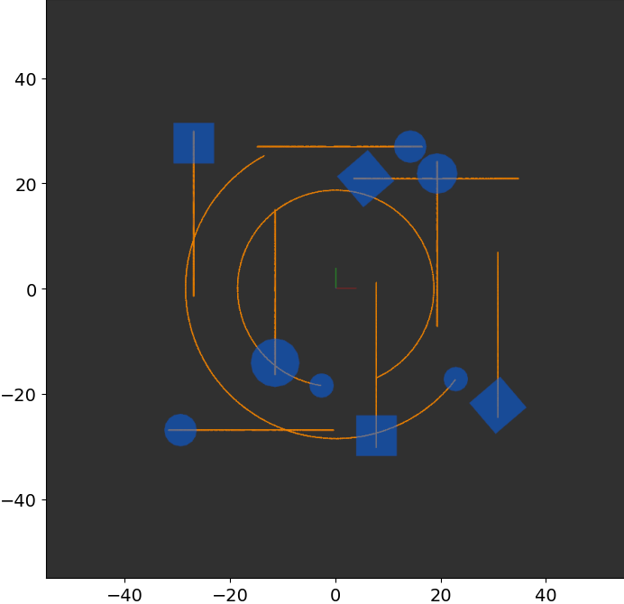{width="32%"} 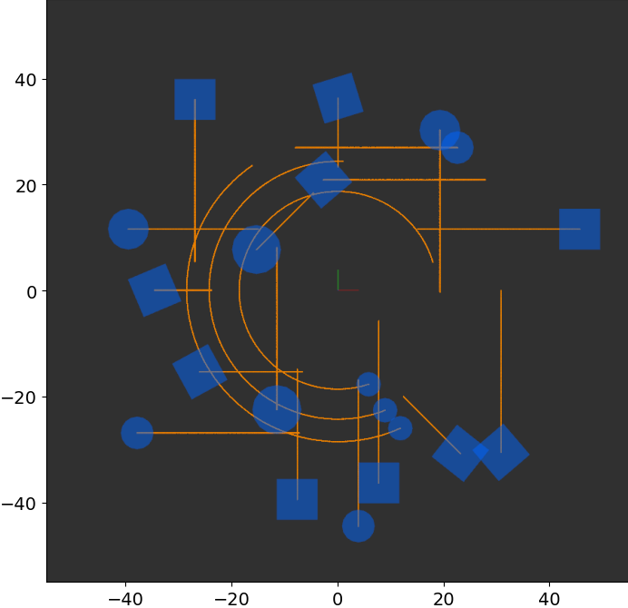{width="32%"} 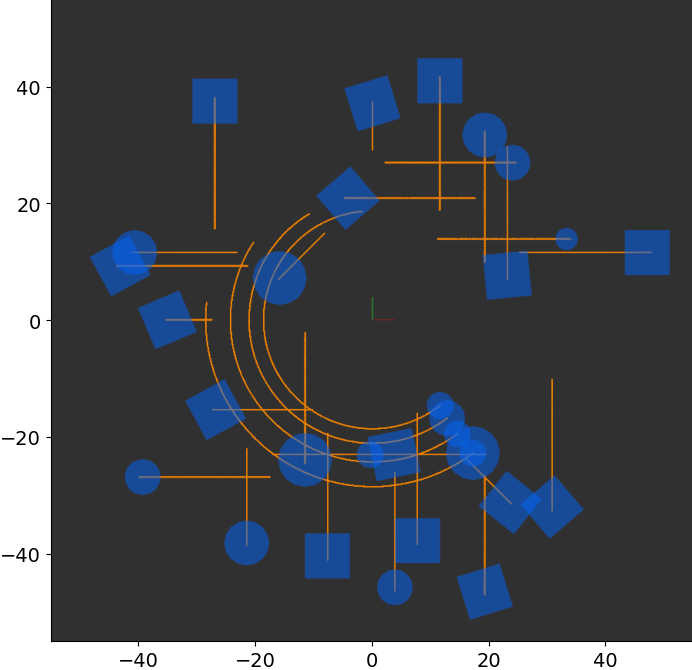{width="32%"}

::: caption
Visualization of dynamic environments with increasing obstacle density: (Left) 10 obstacles, (Middle) 20 obstacles, (Right) 30 obstacles. All environments are 100m × 100m in size, ranging from $-50$ to $50$ along both the $x$- and $y$-axes. Each obstacle follows a dynamic trajectory, and their last 1500 positions are shown to visualize their movement over time.
:::
::::

:::::::::::::::: {#fig:planner_evolution .figure latex-placement="!t"}
:::: minipage
::: picture
(0,0) (5,90)**1**
:::

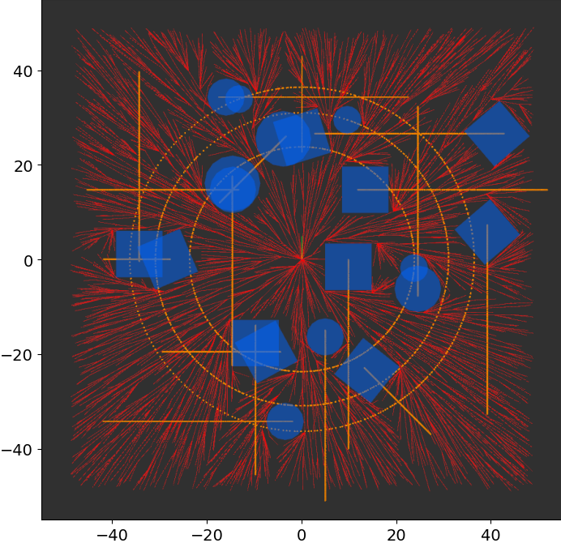{width="\\linewidth" height="18%"}
::::

:::: minipage
::: picture
(0,0) (5,90)**2**
:::

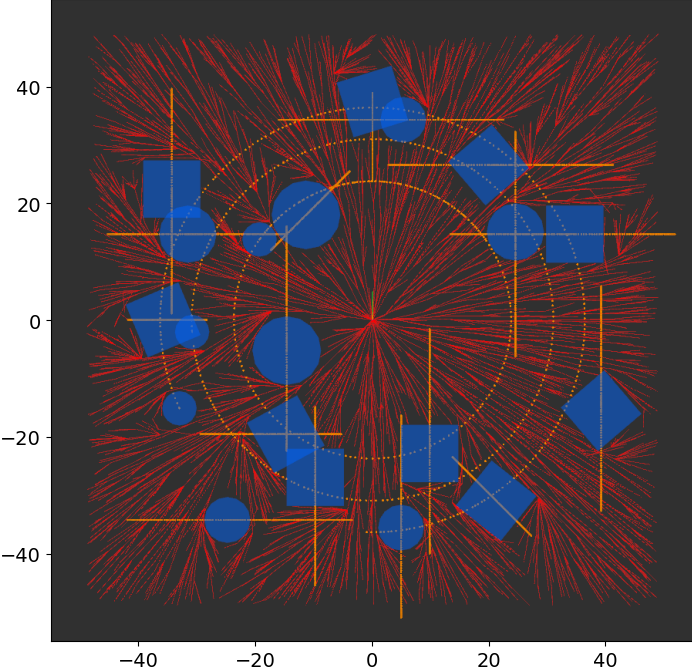{width="\\linewidth" height="18%"}
::::

:::: minipage
::: picture
(0,0) (5,90)**3**
:::

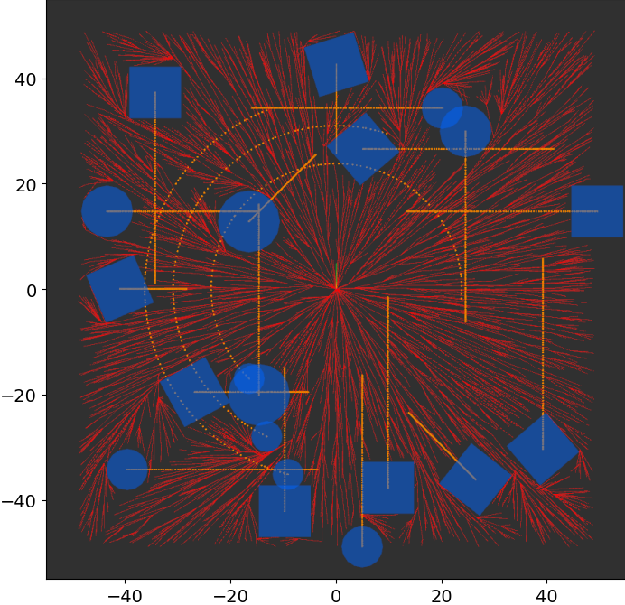{width="\\linewidth" height="18%"}
::::

:::: minipage
::: picture
(0,0) (5,90)**4**
:::

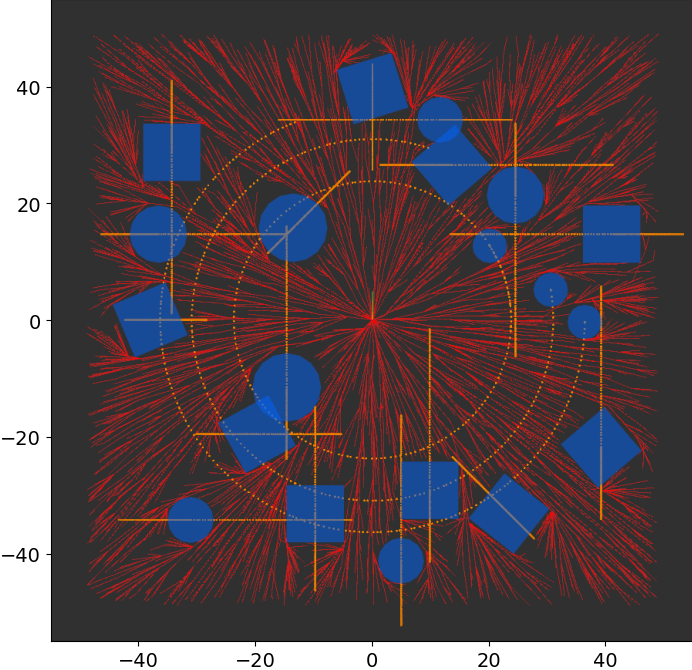{width="\\linewidth" height="18%"}
::::

:::: minipage
::: picture
(0,0) (5,90)**5**
:::

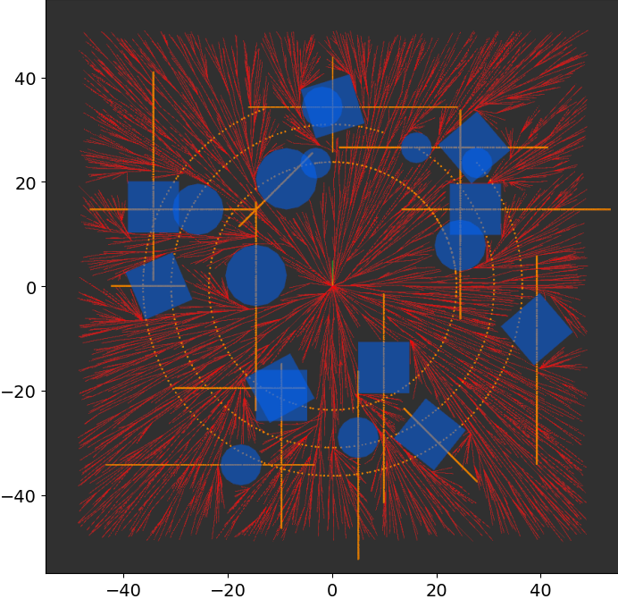{width="\\linewidth" height="18%"}
::::

:::: minipage
::: picture
(0,0) (5,90)**6**
:::

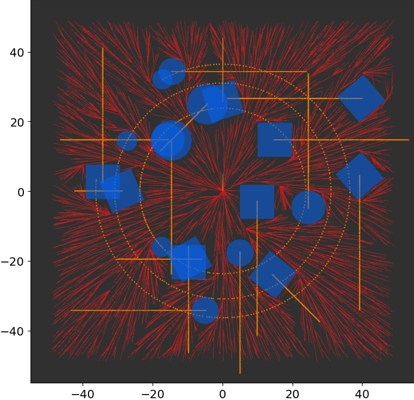{width="\\linewidth" height="18%"}
::::

::: caption
Evolution of the sampling‑based planner as the dynamic obstacle moves.
:::
::::::::::::::::

## Dynamic Update Event Complexity in FMT^x^

A dynamic update in FMT^x^ involves two main stages after initial change detection:

1.  $\mathtt{UpdateObstacles}$: This stage processes environmental changes. Its core component, $\mathtt{QueueNeighbors(U)}$, identifies $N_C$ unique, valid neighbors to be added to $V_{\text{open}}$. The cost of this subroutine is composed of gathering candidate neighbors from the $N_{aff}$ source nodes, which costs $O(N_{aff} \log n)$, and inserting the $N_C$ candidates into the priority queue, which costs $O(N_C \log n)$. This results in a total cost for $\mathtt{QueueNeighbors}$ of $O(N_{aff} \log n + N_C \log n)$, which is bounded by $O(n \log n)$ in the worst case and reduces to $O((\log n)^2)$ for minimal localized updates. The overall $\mathtt{UpdateObstacles}$ cost is therefore dominated by this procedure.

2.  $\mathtt{FMT\textsuperscript{*}Expand}$: This routine propagates cost updates and reconnections. If $k$ nodes are effectively processed from $V_{\text{open}}$, its amortized complexity is $O(k \log n + k T_{\text{coll}})$. This leverages FMT$^{\ast}$'s efficiency, including its typical $O(k)$ collision checks for $k$ processed nodes. The analysis is amortized because the potentially expensive cost of rewiring a suboptimal node is averaged over the many cheaper, standard expansions.

The total complexity for an FMT^x^ dynamic update is $O(N_{aff} \log n + N_C \log n + k \log n + k T_{\text{coll}})$. In the worst-case scenario where a global update affects most of the $n$ samples (i.e., $N_{aff}, N_C, k \approx n$), this simplifies to $O(n \log n + n T_{\text{coll}})$.

The performance of FMT^x^ is best contextualized by comparison to RRT^x^, an established asymptotically optimal replanner. For large-scale global updates, both algorithms exhibit comparable worst-case complexity; RRT^x^ requires $O(n \log n)$ time for its information transfer cascade , a bound that aligns with the $O(n \log n + n T_{\text{coll}})$ of FMT^x^. The primary distinction arises in the handling of localized updates. RRT^x^ employs an integrated rewiring cascade with a cost of $O(N_{aff} \log n)$, where $N_{aff}$ is the number of nodes in the affected descendant tree. In contrast, FMT^x^ utilizes a two-phase response: a preparatory $\mathtt{QueueNeighbors}$ step, which can cost $O((\log n)^2)$ for minimal changes, followed by the main $\mathtt{FMT\textsuperscript{*}Expand}()$ routine. A key structural difference between the planners lies in their collision checking strategies. FMT^x^ inherits the lazy evaluation of FMT$^{\ast}$, performing only $O(k)$ collision checks for $k$ processed nodes . In contrast, RRT^x^ employs a more proactive, region-based approach when handling new obstacles, checking all neighboring edges of the $k_n$ nodes in the vicinity of the change, which can result in $O(k_n \log n)$ checks . While these strategies are structurally different, the overall efficiency for any given local update will depend on the total number of nodes processed by each algorithm's cascade and, critically, on the performance of their respective collision checking schemes within the specific dynamic scenario.

# Experiments

To empirically evaluate the performance of FMT^X^, we conducted a series of comparative experiments against the replanner RRT^X^ [@otte2016rrtx]. The evaluation is divided into two parts: (1) a comprehensive analysis in a 2D geometric workspace to isolate the performance of the core graph-repair mechanisms, and (2) a focused analysis on several kinodynamic models to assess performance on more realistic, dynamically-constrained problems.

## Experimental Setup

### General Methodology and Parameters

To isolate and compare the core graph-repair capabilities of the algorithms, the experimental design makes several abstractions. The setup assumes full visibility, where both algorithms receive global updates about the state of obstacles at each time step. A persistent vertex set is used, fixed at the start of each trial, with obstacles following predefined motion patterns. This abstracted setup allows for a direct and fair comparison of the graph-maintenance mechanisms.

A critical parameter in sampling-based planners is the connection radius, which relies on a scaling factor $\gamma$. The theoretical lower bounds for this factor, $\gamma^*$, differ between FMT$^{\ast}$ and RRT$^{\ast}$. For these experiments, the larger RRT$^{\ast}$-based theoretical bound was used as the baseline $\gamma^*$ for both algorithms to ensure comparable neighborhood sizes. The experimental radius was then defined as $r_n = C \cdot \gamma^* (\frac{\log n}{n})^{1/d}$, where $C$ is a multiplier. For RRT^X^, the steering saturation distance (step size) $\delta$ was set to the final neighborhood radius $r_n$ at the end of the static phase. While carefully matching these parameters helps create a controlled basis for comparison, the fundamentally different architectures of FMT^X^ and RRT^X^ still produce distinct graph topologies; the goal was to control for external variables to better isolate the performance of their respective rewiring strategies.

### Geometric Replanning

To establish a clear performance baseline, a comprehensive evaluation was conducted in a 100m $\times$ 100m 2D geometric workspace ($x,y \in [-50,50]$) with 10, 20, and 30 dynamic obstacles, as visualized in Figure [2](#fig:scenario){reference-type="ref" reference="fig:scenario"}. To analyze the effect of graph density on scalability, performance was evaluated across four sample sizes ($n \in \{2500, 5000, 10000, 20000\}$) and three neighborhood scaling factors ($C \in \{1.0, 1.5, 2.0\}$).

### Kinodynamic Replanning

To evaluate performance under differential constraints, we adapted several standard kinodynamic models. Planning for such systems is fundamentally different from the geometric case, as the cost and feasibility of a trajectory between two states often depends on the direction of travel. This asymmetry necessitates replacing the simple, symmetric `near()` function with a more nuanced understanding of reachability. This is formally handled by defining distinct forward-reachable and backward-reachable sets, which contain all states that can be reached from, or can reach, a given state $x$ within a certain cost threshold $r$ [@Schmerling2014OptimalSM]. This leads to two corresponding neighbor-finding functions, $Near^{+}$ and $Near^{-}$, for forward and backward searches. Since FMT^X^ grows the tree from the goal towards the start, the roles of these functions in the core expansion procedure are reversed. The first neighbor search, which identifies potential children for an expanding node, becomes a search for nodes that can reach it (a backward-reachable or $Near^{-}$ query). Conversely, the second search, which finds the best parent for a candidate child, becomes a search for nodes reachable from that child (a forward-reachable or $Near^{+}$ query). The kinodynamic tests were conducted in environments with 10 and 20 moving obstacles, as visualized in Figure [6](#fig:kino_environments){reference-type="ref" reference="fig:kino_environments"}. An example of the resulting replanning process in action is shown in Figure [7](#fig:thruster_evolution){reference-type="ref" reference="fig:thruster_evolution"}, which illustrates the evolution of the solution tree for the second-order thruster model over time.

:::: {#fig:kino_environments .figure latex-placement="t"}
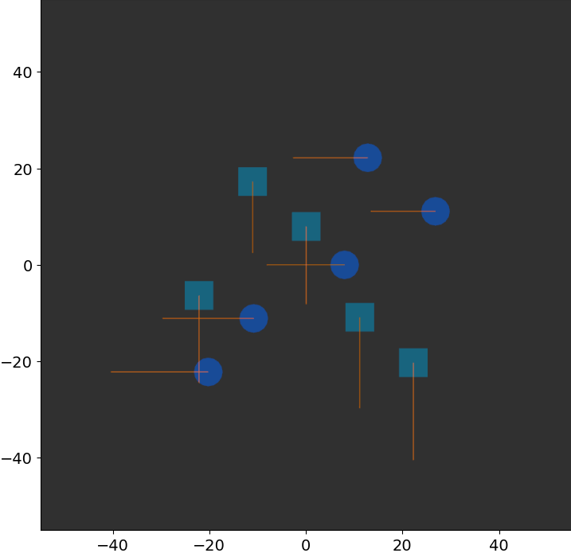{#fig:10obs_env width="\\textwidth"}

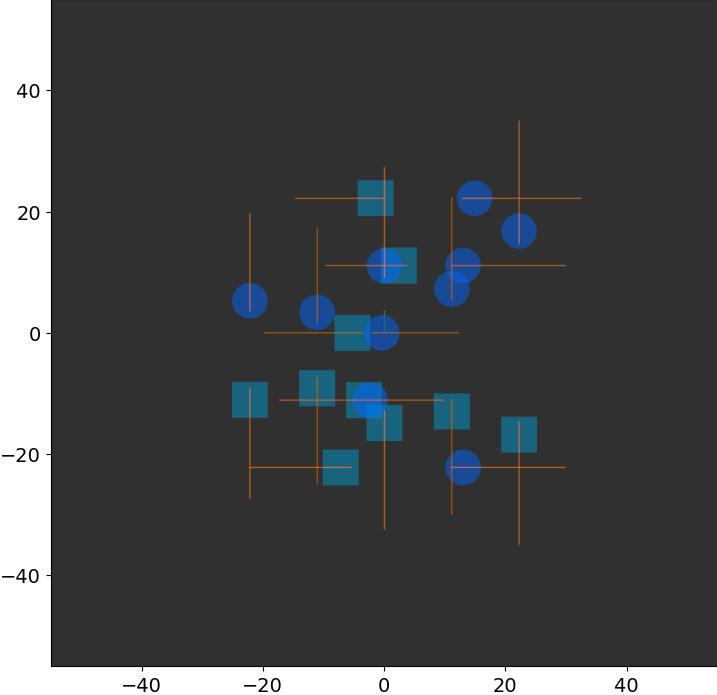{#fig:20obs_env width="\\textwidth"}

::: caption
Visualization of the 100m $\times$ 100m test environment (x, y $\in [-50, 50]$) used for kinodynamic replanning. Obstacles move back and forth at constant velocities selected from the range $[20, 30]$ m/s. The scenarios depict setups with (a) 10 and (b) 20 obstacles.
:::
::::

:::: {#fig:thruster_evolution .figure latex-placement="t"}
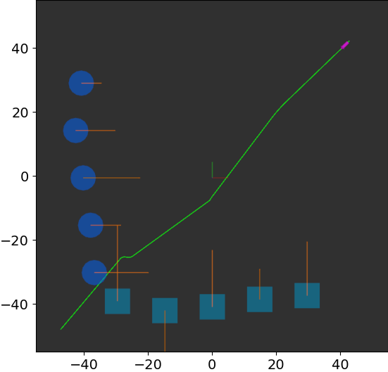{width="\\textwidth"}

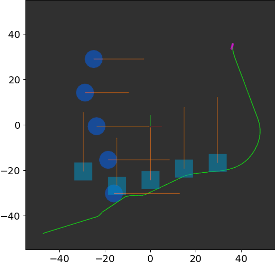{width="\\textwidth"}

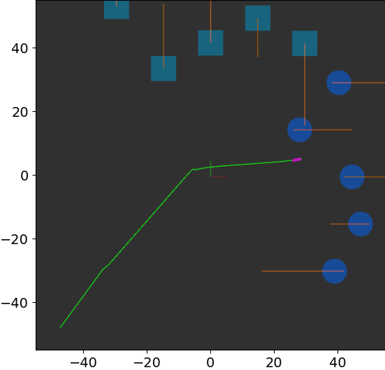{width="\\textwidth"}

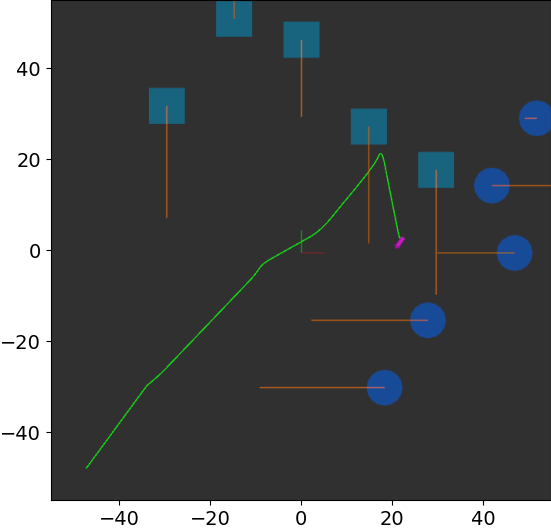{width="\\textwidth"}

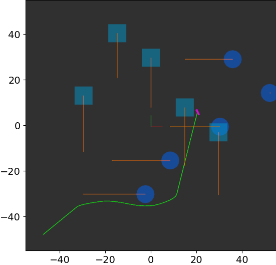{width="\\textwidth"}

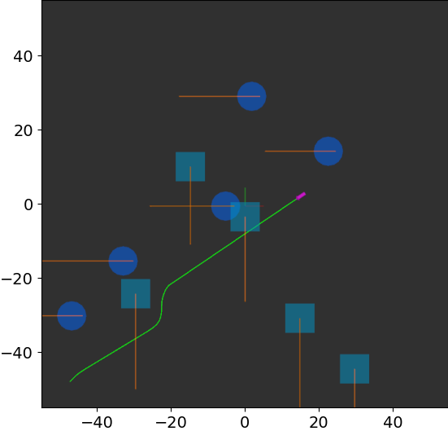{width="\\textwidth"}

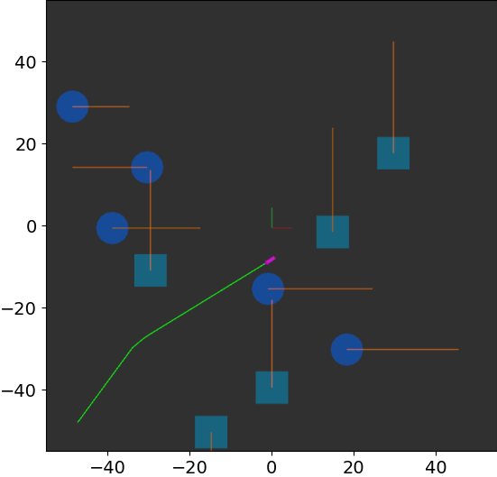{width="\\textwidth"}

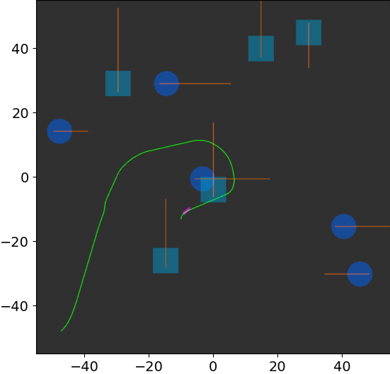{width="\\textwidth"}

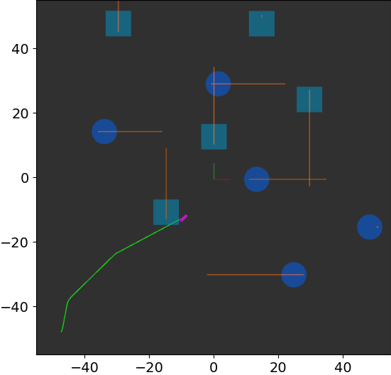{width="\\textwidth"}

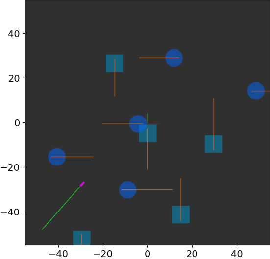{width="\\textwidth"}

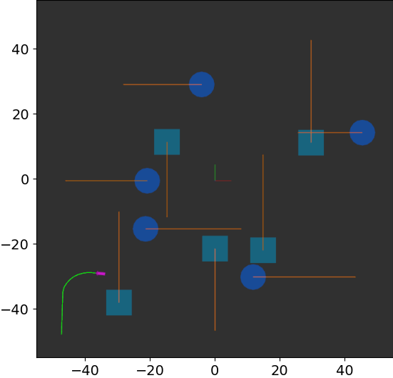{width="\\textwidth"}

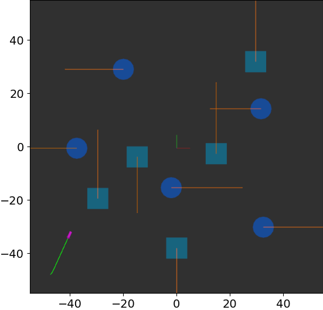{width="\\textwidth"}

::: caption
A sequential visualization of the FMT^X^ replanning process for the second-order thruster model as the robot and obstacles move through the environment. This trial used 1,500 samples and a neighborhood radius multiplier of $C = 2.5$.
:::
::::

The kinodynamic tests were conducted in an environment with 10 and 20 moving obstacles. The specific models and parameters are:

- **Holonomic Robot in $\mathbb{R}^{2}\times\mathbb{T}$:** This model tests planning in state-time space, essential for avoiding moving obstacles. The state space is $\mathcal{X}\subset\mathbb{R}^{2}\times\mathbb{T}$, where $\mathbb{T}$ is the time dimension. The experiments were run with 5000 samples and a neighborhood scaling factor of $C=2.0$.

- **Extended Dubins Vehicle in $\mathbb{R}^{2}\times\mathbb{S}^{1}\times\mathbb{T}$:** This model extends the classic non-holonomic car-like robot to state-time space, allowing for variable speed while respecting a minimum turning radius. The tests used 2500 samples and $C=2.0$.

- **2nd order Thruster Vehicle $\mathbb{R}_x^2 \times \mathbb{R}_{\dot{x}}^2 \times \mathbb{T}$:** This model simulates a system with momentum, using a 5-dimensional state space (position, velocity, time). The vehicle is controlled by applying constant acceleration inputs. These tests used 1000 samples and $C=2.0$.

### System Specifications and Metrics

All experiments were conducted on an Intel^®^ Core i7-4750HQ @ 2.00GHz system with 16GB DDR3 memory running Ubuntu 24.04 LTS[^2]. To ensure a statistically robust comparison, each experimental condition was repeated for 30 trials. Within any single trial, replanning times can vary significantly due to the dynamic nature of the obstacles, creating occasional outlier events with very high durations. To capture the typical performance of each trial while remaining robust to these outliers, we selected the median replanning time as the representative metric for each individual run. Consequently, all summary statistics presented in our results including the median and standard deviation are computed from the resulting distribution of these 30 per-trial medians. This methodology provides a direct assessment of inter-trial stability, quantifying how consistently the algorithm performs across multiple independent experiments. Crucially, this approach isolates the algorithm's performance consistency from the inherent intra-trial variability dictated by the specific obstacle movement patterns, allowing for a more focused and meaningful comparison of the planners' core capabilities.

## Experimental Results

### Geometric Replanning Results

The quantitative results from the geometric experiments are summarized in Table [\[tab:replanning_times_subcols\]](#tab:replanning_times_subcols){reference-type="ref" reference="tab:replanning_times_subcols"}. The data reveals several clear trends. While RRT^X^ shows a competitive edge in scenarios with low sample counts and few obstacles, particularly with a smaller neighborhood scaling factor ($C=1.0$), FMT^X^ consistently achieves a lower median replanning time across most other tested configurations. As expected, the absolute replanning time for both algorithms increases with higher sample counts and greater obstacle density. To better visualize these performance trends, Figure [8](#fig:all_boxplots){reference-type="ref" reference="fig:all_boxplots"} presents box plots comparing the planners across a range of obstacle counts and neighborhood scaling factors.

:::: {#fig:all_boxplots .figure latex-placement="h"}
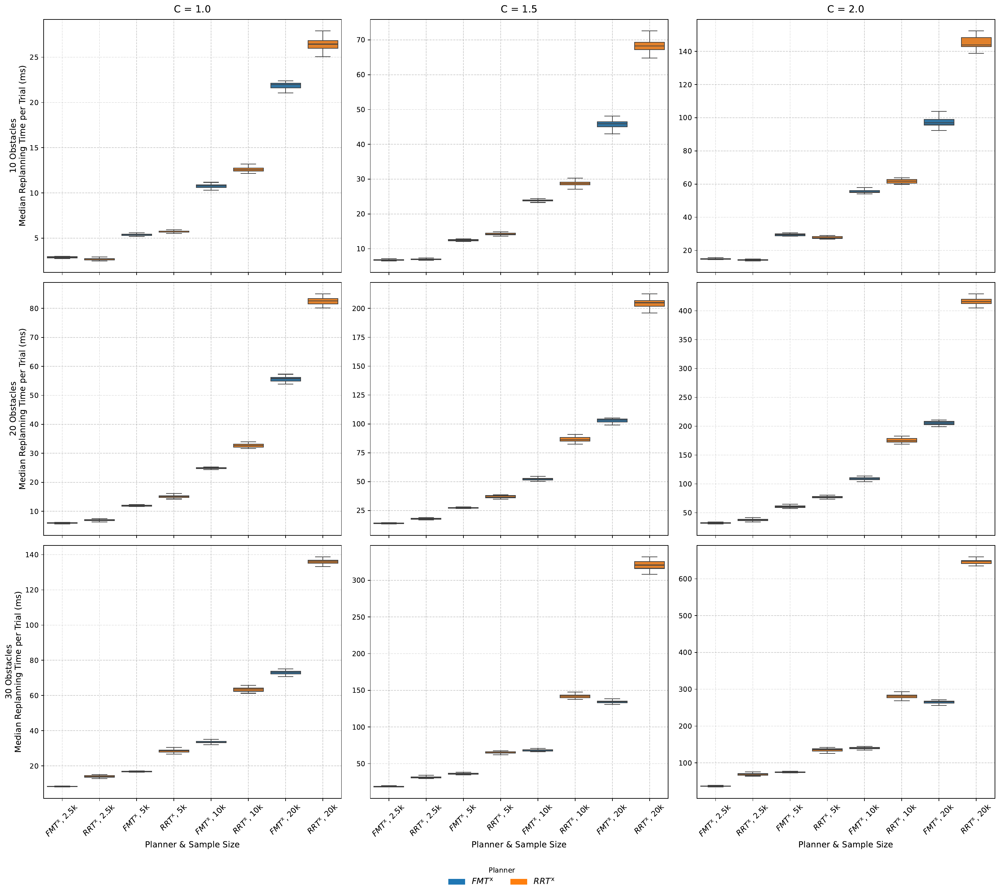{width="95%"}

::: caption
Box-plot comparison of replanning times for FMT^X^ vs. RRT^X^. The grid compares performance across different obstacle counts (rows: 10, 20, 30) and neighborhood scaling factors (columns: C=1.0, 1.5, 2.0). Each subplot evaluates the planners at various sample sizes.
:::
::::

Most notably, the performance gap between FMT^X^ and RRT^X^ widens significantly as the neighborhood scaling factor $C$ increases. To provide a comprehensive overview of this performance advantage, Figure [9](#fig:ratio_heatmap){reference-type="ref" reference="fig:ratio_heatmap"} presents the performance ratio (Time~RRTx~ / Time~FMTx~) in a series of heatmaps, clearly illustrating the conditions under which FMT^X^'s advantage is most pronounced. A larger $C$ value results in a denser graph with more neighbors per node. This disproportionately penalizes RRT^X^, whose performance is more sensitive to the number of edges considered in its incremental repair cascade. For instance, in the most complex scenario with 20,000 samples and 30 obstacles, when $C$ increases from 1.0 to 2.0, the median replanning time for FMT^X^ increases from 73.18ms to 265.65ms. For RRT^X^, however, the same change causes a much more dramatic increase from 135.83ms to 647.49ms. The performance gap thus grows from approximately 62ms to over 381ms. This suggests that as the graph becomes denser, the compounding efficiency of FMT^X^'s batch-oriented repair, which processes updates in a structured, cost-ordered wavefront, is more scalable than the incremental, node-by-node cascade employed by RRT^X^.

:::: {#fig:ratio_heatmap .figure latex-placement="t"}
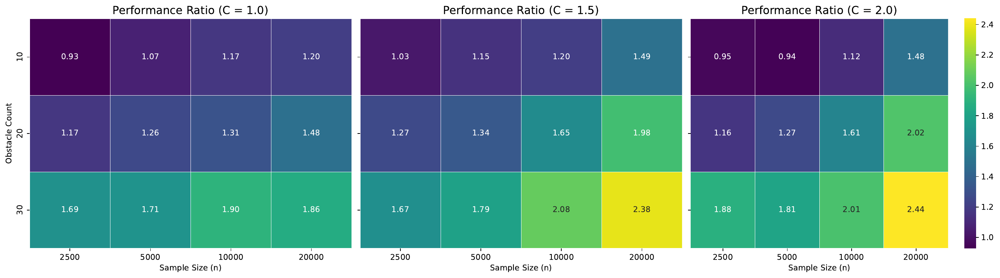{width="\\textwidth"}

::: caption
Heatmap comparison of the performance ratio between FMT^X^ and RRT^X^, defined as the median replanning time of RRT^X^ divided by that of FMT^X^. A value greater than 1.0 indicates a faster replanning time for FMT^X^. Each subplot corresponds to a different neighborhood scaling factor ($C$), showing the performance ratio across varying sample sizes and obstacle densities. The results clearly indicate that the advantage of FMT^X^ grows with increased sample size, obstacle count, and a larger neighborhood radius, with the most significant performance gains observed in the most complex scenarios.
:::
::::

### Kinodynamic Replanning Results

The results from the kinodynamic replanning experiments, summarized in **Table [1](#tab:kinodynamic_replanning_times){reference-type="ref" reference="tab:kinodynamic_replanning_times"}** and visualized in **Figure [13](#fig:all-duration-plots){reference-type="ref" reference="fig:all-duration-plots"}**, confirm that FMT^X^'s efficiency extends to dynamically-constrained systems. A clear trend emerges: as the complexity of the system dynamics increases, the performance advantage of FMT^X^ over RRT^X^ becomes more pronounced.

:::: {#fig:all-duration-plots .figure latex-placement="h"}
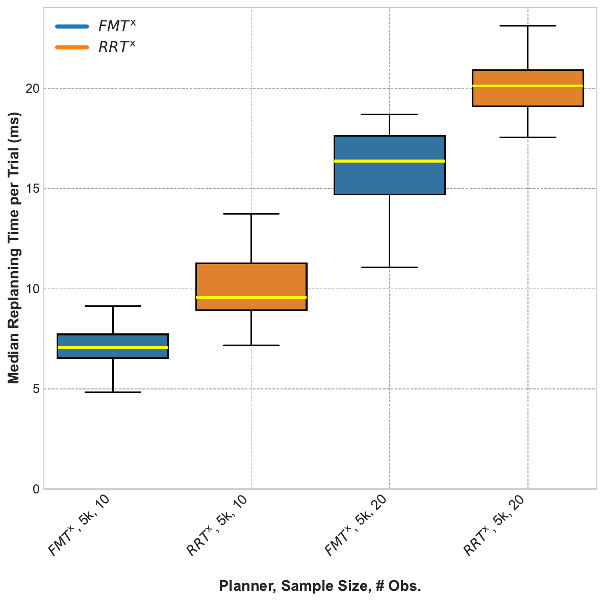{#fig:r2t-duration width="\\textwidth"}

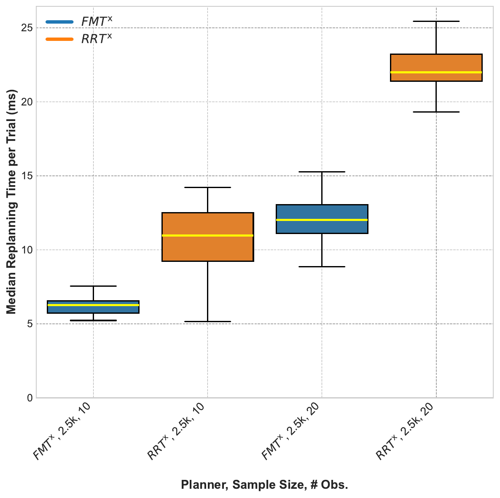{#fig:dubins-duration width="\\textwidth"}

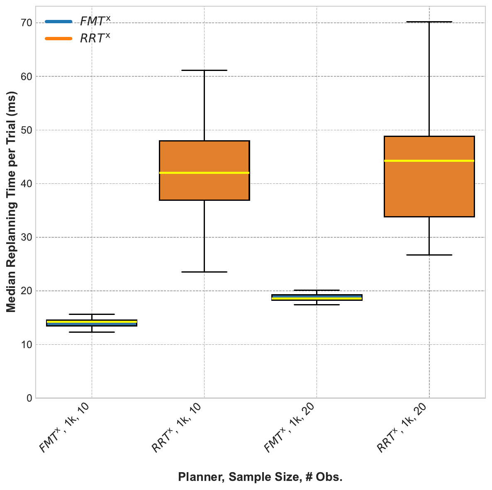{#fig:thruster-duration width="\\textwidth"}

::: caption
Median replanning times per trial for the Holonomic, Dubins, and Thruster state-space models. These results were generated using a neighborhood radius multiplier of $C=2.0$ with 5k, 2.5k, and 1k samples for each model, respectively.
:::
::::

For the simple Holonomic model in state-time space, FMT^X^ was already consistently faster, outperforming RRT^X^ by a factor of approximately 1.35 in the 10-obstacle scenario. This advantage grows for the non-holonomic Dubins vehicle, where FMT^X^ was roughly 1.75 times faster. The trend culminates with the second-order thruster model, where the performance difference is most stark: FMT^X^ was nearly 3 times faster than RRT^X^. This strong correlation suggests that the structured, batch-oriented repair mechanism of FMT^X^ is particularly adept at handling the expensive, asymmetric neighborhood queries inherent to complex kinodynamic systems, making it a more scalable solution than the incremental approach of RRT^X^.

# Discussion

This work introduced FMT^X^, an extension of FMT$^{\ast}$ designed for efficient dynamic replanning. The experimental results, showing that FMT^X^ outperforms RRT^X^ in replanning time, can be understood by analyzing the total computational work required by each algorithm's repair mechanism. This section interprets these findings, discusses the underlying algorithmic advantages, and outlines future research directions.

## Interpretation of Results

The superior performance of FMT^X^, as evidenced by the experimental data, can be directly attributed to its core architectural philosophy, which extends the highly efficient, lazy evaluation strategy of FMT$^{\ast}$ to a dynamic context. The difference in performance is not just incremental; it stems from a fundamental divergence in how the two algorithms approach the problem of graph repair.

RRT^X^ employs a region-based repair strategy. When an obstacle change occurs, it proactively assesses the entire local neighborhood, performing a large number of collision checks to build a complete picture of the new local connectivity. While this provides comprehensive information about the immediate area, it can result in significant wasted computation, as it checks many edges that are ultimately irrelevant to the final solution.

However, the proactive approach of RRT^X^ can be advantageous in scenarios with low graph density and few obstacles, as our geometric results suggest. In such cases, the computational cost of its comprehensive local check is minimal. The repair strategy of FMT^X^, in contrast, is fundamentally based on delayed collision checking. It first identifies only the nodes whose optimal paths have been invalidated and then uses a cost-ordered, wavefront expansion to find the most promising new parent before performing the expensive collision check. This lazy approach channels computational effort exclusively toward connections that are not only low-cost but also likely to be part of the new optimal solution. Nonetheless, the underlying cost-based architecture of FMT^X^ is notably flexible and could even be adapted to incorporate the proactive checks used by RRT^X^.

This architectural advantage becomes even more pronounced in kinodynamic planning, where the cost to validate any single connection is far greater. In these systems, validating an edge is no longer a simple, straight-line collision check; it requires first generating a dynamically-feasible trajectory with a computationally expensive steering function, and then checking that entire path for collisions. Consequently, RRT^X^'s strategy of checking many potential connections incurs a massive computational burden with each query. Conversely, by delaying this intensive, multi-step validation until a single, optimal parent is found, FMT^X^ minimizes these expensive operations. This explains the widening performance gap observed as model complexity increased from the simple Holonomic model to the high-dimensional Thruster vehicle, where the efficiency of this lazy evaluation was most evident.

## Limitations and Future Work

While this work establishes FMT^X^ as a robust and efficient replanner, its analysis also highlights several avenues for future research. A key limitation of the current implementation is that it operates on a fixed set of pre-sampled points and is therefore not an anytime algorithm. However, the cost-based re-evaluation mechanism inherent to FMT^X^ provides a natural foundation for developing this capability. Future work could allow for the continuous addition of new samples, which the algorithm could seamlessly integrate to indefinitely refine its solution. Additionally, exploring a bidirectional search strategy, inspired by previous work on Bidirectional FMT$^{\ast}$ [@Starek2015AnAS], could accelerate pathfinding in large environments by growing two search trees simultaneously. Another area for study is the integration of A$^{\ast}$-like heuristics to accelerate convergence. This is not a trivial extension, as introducing a heuristic to the cost function would alter the wavefront-like expansion of the open set, making it behave more like a depth-first search. This change in search order increases the probability of the planner making rare suboptimal connections, as a node with a low heuristic value might be expanded prematurely, causing the true optimal parent for a neighbor to be processed and closed. Therefore, research in this area would need to investigate new mechanisms to mitigate this effect. Finally, while our analysis shows FMT^X^ is more computationally efficient, a hybrid approach remains a compelling topic. Such a planner could combine the global efficiency of FMT^X^ with a proactive, RRT^X^-style check, to gain richer local information for enhanced safety in critical encounters.

# Conclusion

This paper introduced FMT^X^, a novel modification of the Fast Marching Tree (FMT$^{\ast}$) algorithm, engineered for efficient and asymptotically optimal replanning in dynamic environments. By integrating a mechanism for selective path updates via a cost-ordered priority queue and a cost-based re-evaluation condition, FMT^X^ dynamically adapts its solution as improved connections or environmental changes emerge. The activation of this condition serves as an implicit proof that a given node's cost is suboptimal by revealing the potential for a better path through an expanding neighbor. This insight then justifies the subsequent computational expense of a focused search for a new, truly optimal connection in the local neighborhood, ensuring that repairs are both targeted and effective.

::: {#tab:kinodynamic_replanning_times}
+-----------+------------+-------------+---------------------+---------------------+
| **#Obs.** | **System** | **Samples** | **FMT^x^**          | **RRT^x^**          |
+:=========:+:===========+:===========:+:========:+:========:+:========:+:========:+
| 4-7       |            |             | **Med.** | **Std.** | **Med.** | **Std.** |
+-----------+------------+-------------+----------+----------+----------+----------+
| 10        | Holonomic  | 5k          | 7.06     | 1.18     | 9.57     | 1.83     |
|           +------------+-------------+----------+----------+----------+----------+
|           | Dubins     | 2.5k        | 6.27     | 0.70     | 10.97    | 2.57     |
|           +------------+-------------+----------+----------+----------+----------+
|           | Thruster   | 1k          | 14.22    | 0.76     | 42.03    | 8.30     |
+-----------+------------+-------------+----------+----------+----------+----------+
| 20        | Holonomic  | 5k          | 16.37    | 2.12     | 20.11    | 1.27     |
|           +------------+-------------+----------+----------+----------+----------+
|           | Dubins     | 2.5k        | 12.02    | 1.45     | 21.98    | 2.08     |
|           +------------+-------------+----------+----------+----------+----------+
|           | Thruster   | 1k          | 18.59    | 0.72     | 44.24    | 12.23    |
+-----------+------------+-------------+----------+----------+----------+----------+

: Kinodynamic Replanning Performance. Median and standard deviation of per-trial median replanning times (ms) across 30 trials.
:::

Our theoretical analysis confirmed that FMT^X^ upholds the asymptotic optimality guarantees of its predecessor. More significantly, the comprehensive comparative experiments revealed a nuanced performance landscape. While RRT^X^ was competitive in geometric scenarios with low graph density, FMT^X^ demonstrated superior scalability as the problem complexity grew. This performance gap became most pronounced in kinodynamic planning. The efficiency of FMT^X^'s lazy evaluation in managing the expensive, complex validation checks required by these systems gave it a decisive advantage over RRT^X^, which widened dramatically as the model's dynamic constraints increased.

The development of FMT^X^ addresses a critical need in robotics, the ability to navigate complex, changing environments rapidly and reliably. Its architecture also opens promising avenues for future work, including the development of a true anytime planner that continually incorporates new information. By successfully merging the computational advantages of sampling-based planning with a robust selective repair mechanism, FMT^X^ provides an effective solution for a wide array of applications requiring agile and optimal motion planning.

::: thebibliography
99 urlstyle

Arslan O and Tsiotras P (2013) Use of relaxation methods in sampling-based algorithms for optimal motion planning. *2013 IEEE International Conference on Robotics and Automation* : 2421--2428URL `https://api.semanticscholar.org/CorpusID:14282741`. Arslan O and Tsiotras P (2015) Dynamic programming guided exploration for sampling-based motion planning algorithms. *2015 IEEE International Conference on Robotics and Automation (ICRA)* : 4819--4826URL `https://api.semanticscholar.org/CorpusID:12488088`. Bohlin R and Kavraki LE (2000) Path planning using lazy prm. *Proceedings 2000 ICRA. Millennium Conference. International Conference on Robotics and Automation. Symposia Proceedings (Cat. No.00CH37065)* 1: 521--528 vol.1. URL `https://api.semanticscholar.org/CorpusID:206541645`. Dijkstra EW (1959) A note on two problems in connexion with graphs. *Numerische Mathematik* 1(1): 269--271. DOI:10.1007/BF01386390. Ferguson D, Kalra N and Stentz A (2006) Replanning with rrts. *Proceedings 2006 IEEE International Conference on Robotics and Automation, 2006. ICRA 2006.* : 1243--1248URL `https://api.semanticscholar.org/CorpusID:12375387`. Gammell JD, Barfoot TD and Srinivasa SS (2017a) Batch informed trees (bit\*): Informed asymptotically optimal anytime search. *The International Journal of Robotics Research* 39: 543 -- 567. URL `https://api.semanticscholar.org/CorpusID:700325`. Gammell JD, Barfoot TD and Srinivasa SS (2017b) Informed sampling for asymptotically optimal path planning. *IEEE Transactions on Robotics* 34: 966--984. URL `https://api.semanticscholar.org/CorpusID:3241650`.

Gammell JD, Srinivasa SS and Barfoot TD (2014a) Batch informed trees (bit\*): Sampling-based optimal planning via the heuristically guided search of implicit random geometric graphs. *2015 IEEE International Conference on Robotics and Automation (ICRA)* : 3067--3074URL `https://api.semanticscholar.org/CorpusID:15776115`. Gammell JD, Srinivasa SS and Barfoot TD (2014b) Informed rrt\*: Optimal sampling-based path planning focused via direct sampling of an admissible ellipsoidal heuristic. *2014 IEEE/RSJ International Conference on Intelligent Robots and Systems* : 2997--3004URL `https://api.semanticscholar.org/CorpusID:12233239`. Gammell JD and Strub MP (2020) Asymptotically optimal sampling-based motion planning methods. *Annu. Rev. Control. Robotics Auton. Syst.* 4: 295--318. URL `https://api.semanticscholar.org/CorpusID:231592912`.

Hart PE, Nilsson NJ and Raphael B (1968) A formal basis for the heuristic determination of minimum cost paths. *IEEE transactions on Systems Science and Cybernetics* 4(2): 100--107. Hauser KK (2015) Lazy collision checking in asymptotically-optimal motion planning. *2015 IEEE International Conference on Robotics and Automation (ICRA)* : 2951--2957URL `https://api.semanticscholar.org/CorpusID:14989369`. Janson L and Pavone M (2013) Fast marching trees: A fast marching sampling-based method for optimal motion planning in many dimensions. In: *Proceedings of the International Symposium on Robotics Research (ISRR)*. Janson L, Schmerling E, Clark A and Pavone M (2015) Fast marching tree: A fast marching sampling-based method for optimal motion planning in many dimensions. *The International journal of robotics research* 34(7): 883--921. Karaman S and Frazzoli E (2010) Optimal kinodynamic motion planning using incremental sampling-based methods. *49th IEEE Conference on Decision and Control (CDC)* : 7681--7687URL `https://api.semanticscholar.org/CorpusID:1555207`. Karaman S and Frazzoli E (2011) Sampling-based algorithms for optimal motion planning. *The international journal of robotics research* 30(7): 846--894. Kavraki LE, Svestka P, Latombe JC and Overmars MH (1996) Probabilistic roadmaps for path planning in high-dimensional configuration spaces. *IEEE transactions on Robotics and Automation* 12(4): 566--580.

Klemm S, Oberländer J, Hermann A, Rönnau A, Schamm T, Zöllner JM and Dillmann R (2015) Rrt\*-connect: Faster, asymptotically optimal motion planning. *2015 IEEE International Conference on Robotics and Biomimetics (ROBIO)* : 1670--1677URL `https://api.semanticscholar.org/CorpusID:14621822`. Koenig S and Likhachev M (2002) D\*lite. In: *AAAI/IAAI*. URL `https://api.semanticscholar.org/CorpusID:208940224`. Koenig S and Likhachev M (2005) Fast replanning for navigation in unknown terrain. *IEEE Transactions on Robotics* 21: 354--363. URL `https://api.semanticscholar.org/CorpusID:15664344`.

Koenig S, Likhachev M and Furcy D (2004) Lifelong planning a. *Artif. Intell.* 155: 93--146. URL `https://api.semanticscholar.org/CorpusID:7828197`.

Koenig, Sven and Likhachev, Maxim (2006) Real-time adaptive a. In: *Proceedings of the fifth international joint conference on Autonomous agents and multiagent systems*. pp. 281--288. Kuffner JJ and LaValle SM (2000) Rrt-connect: An efficient approach to single-query path planning. *Proceedings 2000 ICRA. Millennium Conference. IEEE International Conference on Robotics and Automation. Symposia Proceedings (Cat. No.00CH37065)* 2: 995--1001 vol.2. URL `https://api.semanticscholar.org/CorpusID:17124403`. LaValle SM (1998) Rapidly-exploring random trees : a new tool for path planning. *The annual research report* URL `https://api.semanticscholar.org/CorpusID:14744621`.

LaValle SM and Kuffner Jr JJ (2001) Randomized kinodynamic planning. *The international journal of robotics research* 20(5): 378--400. Li Y, Littlefield Z and Bekris KE (2016) Asymptotically optimal sampling-based kinodynamic planning. *The International Journal of Robotics Research* 35(5): 528--564. Naderi K, Rajamäki J and Hämäläinen P (2015) Rt-rrt\*: a real-time path planning algorithm based on rrt\*. *Proceedings of the 8th ACM SIGGRAPH Conference on Motion in Games* URL `https://api.semanticscholar.org/CorpusID:6223542`. Orthey A, Chamzas C and Kavraki LE (2023) Sampling-based motion planning: A comparative review. *ArXiv* abs/2309.13119. URL `https://api.semanticscholar.org/CorpusID:262459959`.

Otte M and Frazzoli E (2016) Rrtx: Asymptotically optimal single-query sampling-based motion planning with quick replanning. *The International Journal of Robotics Research* 35(7): 797--822. Schmerling E, Janson L and Pavone M (2014) Optimal sampling-based motion planning under differential constraints: The drift case with linear affine dynamics. *2015 54th IEEE Conference on Decision and Control (CDC)* : 2574--2581URL `https://api.semanticscholar.org/CorpusID:2267285`. Silveira J, Cabral KM, Givigi SN and Marshall JA (2023) Real-time fast marching tree for mobile robot motion planning in dynamic environments. *2023 IEEE International Conference on Robotics and Automation (ICRA)* : 7837--7843URL `https://api.semanticscholar.org/CorpusID:259339259`. Starek JA, Gómez JV, Schmerling E, Janson L, Moreno LE and Pavone M (2015) An asymptotically-optimal sampling-based algorithm for bi-directional motion planning. *2015 IEEE/RSJ International Conference on Intelligent Robots and Systems (IROS)* : 2072--2078URL `https://api.semanticscholar.org/CorpusID:5808032`. Stentz A (1994) The d\* algorithm for real-time planning of optimal traverses. URL `https://api.semanticscholar.org/CorpusID:14389316`. Strub MP and Gammell JD (2020a) Adaptively informed trees (ait\*): Fast asymptotically optimal path planning through adaptive heuristics. *2020 IEEE International Conference on Robotics and Automation (ICRA)* : 3191--3198URL `https://api.semanticscholar.org/CorpusID:211133126`. Strub MP and Gammell JD (2020b) Advanced bit\* (abit\*): Sampling-based planning with advanced graph-search techniques. *2020 IEEE International Conference on Robotics and Automation (ICRA)* : 130--136URL `https://api.semanticscholar.org/CorpusID:211132476`. Strub MP and Gammell JD (2021) Adaptively informed trees (ait\*) and effort informed trees (eit\*): Asymmetric bidirectional sampling-based path planning. *The International Journal of Robotics Research* 41: 390 -- 417. URL `https://api.semanticscholar.org/CorpusID:250221473`. Webb DJ and van den Berg JP (2012) Kinodynamic rrt\*: Optimal motion planning for systems with linear differential constraints. *ArXiv* abs/1205.5088. URL `https://api.semanticscholar.org/CorpusID:3170122`.
:::

[^1]: Email: soheil.e.nia@gmail.com

[^2]: The source code for the implementation and to reproduce all experiments is publicly available at: <https://github.com/sohail70/motion_planning>
