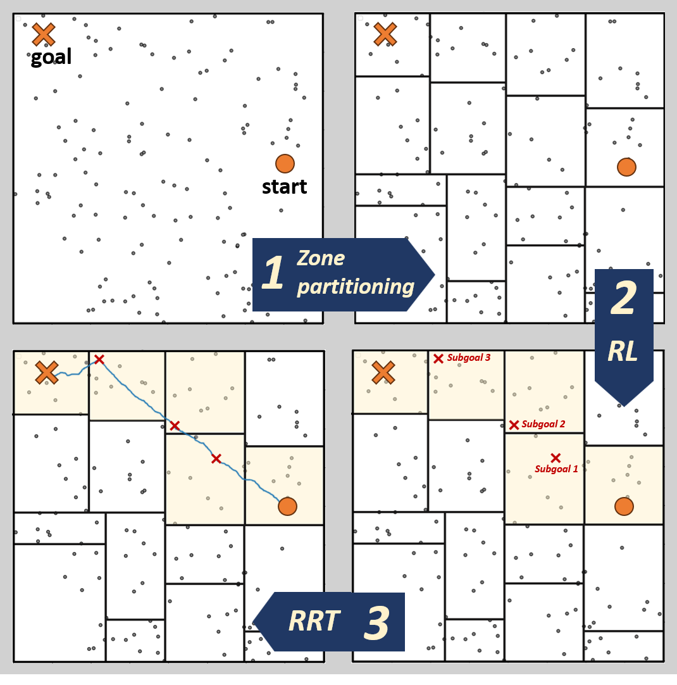
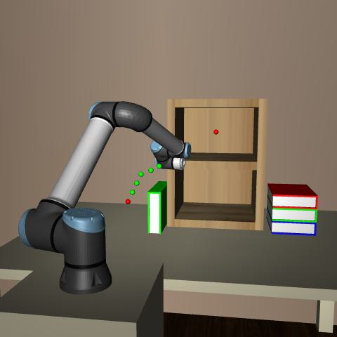
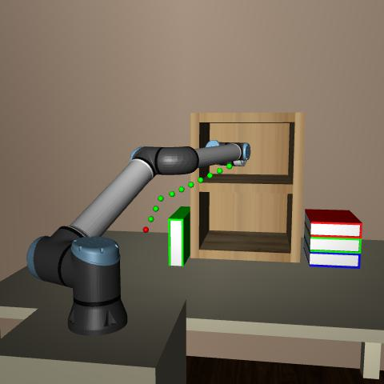

# Introduction

Path planning involves computing a collision-free trajectory from a start configuration to a goal configuration within an environment containing obstacles. Numerous strategies have been developed to efficiently handle complex and highly constrained environments while remaining general enough to perform effectively across diverse settings and optimization criteria, such as travel time, path length, or maximizing safety. Current path-planning algorithms are broadly classified into several categories. Graph-based algorithms model the environment as a network, seeking the shortest path, such as Dijkstra's algorithm [@b45], A\*[@b47], and D\* [@b46]. Although these methods guarantee an optimal path, their application in high-dimensional spaces incurs a significant increase in memory demands and computational expense.

:::: {#fig .figure latex-placement="htbp"}
{width="70%"}

::: caption
*Illustration of our Zonal RL-RRT approach. The input is the map including locations of all obstacles, start location, and goal positions. We partition the map into multiple zones using a kd-tree and establishes a state-action space accounting for the connectivity between zones. Our approach determines the optimal sequence of zones to traverse from the start to the goal. Finally, we utilize the Rapidly-exploring Random Trees (RRT) method low-level path planning within these zones and generate the final route.*
:::
::::

The Artificial Potential Field (APF) method [@b48] generates virtual force fields to facilitate smooth navigational adjustments for agents but is significantly limited by its tendency to become trapped in local minima. Emerging learning-based solutions, including data-driven approaches that computationally enhance traditional methodologies [@b51; @b52; @b53], have been introduced. However, these techniques often struggle with generalizability to unseen scenarios. Reinforcement Learning (RL) [@b19], characterized by environment-driven learning, optimizes complex objectives with minimal oversight but requires extensive training data for effective convergence in intricate settings [@b1; @b2; @b3]. Sampling-based methods like RRT [@b10], RRT\* [@b54], and their derivatives are popular for their efficacy in navigating high-dimensional, constrained spaces; nevertheless, their random sampling nature introduces suboptimality in path generation, with solution quality contingent on the number of samples produced.

Despite these challenges, the computational advantages of RRT are significant, leading to the development of numerous hybrid sampling algorithms. These enhancements fall into two main categories. First, heuristically guided search augments traditional graph-based methods with efficient sampling techniques, such as A\*-RRT [@b16], BIT\* [@b13], Informed RRT\* [@b57], and Theta\*-RRT [@b55]. However, issues with memory consumption and processing time persist in large and complex maps. Second, learning-enhanced approaches [@b24; @b26; @b49; @b50], particularly those employing Reinforcement Learning (RL) [@b25; @b26; @b56], aim to enhance sampling efficiency by determining sampling regions or facilitating cost-aware sampling within the RRT framework. While these methods show promising results, they often overlook the importance of high-level environmental interpretation, including the overall configuration and spatial distribution of obstacles. Leveraging this understanding allows planning algorithms to adapt their strategies to the specific characteristics of the environment, effectively handling complex obstacle configurations, optimizing path planning at a global level, and ultimately achieving more adaptable and efficient performance across challenging scenarios.

In this paper, we introduce a novel approach that combines Reinforcement Learning with the RRT framework. Utilizing a kd-tree for environmental decomposition, our method partitions the map into zones reflecting obstacle concentration, facilitating optimal policy derivation via Q-Learning for zone traversal from start to goal. Within these zones, sampling identifies subgoals, and the RRT algorithm serves as a local planner to construct a coherent path through these waypoints, ensuring an unobstructed trajectory from the start to the target. This technique merges spatial segmentation with pathfinding efficiency, providing a robust solution for complex navigation challenges. Our main contributions are as follows:

- By incorporating the spatial distribution of obstacles and partitioning the map, we effectively reduce complexity, especially in highly dense and cluttered environments. In 2D, our algorithm shows a 64% average improvement in running time against baselines (RRT, RRT\*, BIT\*, and Informed RRT\*) in densely cluttered forest-like maps. In 3D, it achieves a 38% average improvement with a similar success rate. In a 6D robotic environment using the UR10e manipulator, our algorithm demonstrates faster performance compared to BIT\* on average.

- Compared to prominent learning-based approaches like MPNet and Neural RRT\*, as well as heuristic methods like RRT\*J, our algorithm exhibits competitive runtime performance, with an average improvement of 33%. Unlike these methods, which are often trained on specific data from known environments and rely heavily on them, our algorithm does not depend on specific environment types or agents, enhancing its versatility and adaptability across various scenarios.

- By leveraging zone partitioning and Reinforcement Learning for high-level planning, our algorithm demonstrates flexibility in adapting to different path planning strategies. It performs effectively in both conservative scenarios, where the agent avoids obstacles by navigating through free zones, and greedy scenarios, where the agent takes more direct routes through zones closer to the goal. This flexibility suggests that our method is adaptable to various planning objectives and environmental challenges in future applications.

# Related works

## Sampling-Based Planning Methods

Sampling-based methods leverage continuous spaces and randomized characteristics for enhanced exploration capabilities. At the forefront of these methods stands the Rapidly-exploring Random Tree (RRT), a foundational algorithm from which many other algorithms in this field are derived[@b10]. RRT efficiently navigates complex environments by rapidly exploring high-dimensional spaces, addressing algebraic constraints from obstacles[@b11]. Despite these advantages, basic sampling-based methods like RRT cannot consistently ensure optimal solutions, as the quality of outcomes significantly depends on the sampling strategy employed. Specifically, reliance on uniform sampling may inadequately represent an environment's connectivity, frequently overlooking essential narrow pathways due to its generalized, non-discriminative sampling distribution[@b12]. To address the inherent limitations of the basic RRT algorithm and enhance convergence speed and memory usage, recent developments have emerged, categorizable into distinct groups.

### Heuristically Guided Search

Heuristically guided searches such as Theta\*-RRT, A\*-RRT, Informed RRT\*, and Batch Informed Trees (BIT\*) have enhanced the efficacy of path planning in complex environments. Theta\*-RRT hierarchically merges any-angle search with RRT, guiding tree expansion toward strategically sampled states that encapsulate geometric path information[@b14]. A\*-RRT and A\*-RRT\* refine this concept by sampling along A\* paths, with the latter distributing samples around the path to minimize costs effectively[@b16]. BIT\* unifies the graph-based search's ordered nature with the scalability of sampling-based methods by interpreting a set of samples as an implicit random geometric graph (RGG)[@b15]. Additionally, RRT\*J introduces a novel non-uniform sampling technique that leverages a generalized Voronoi graph (GVG) and discretizes the heuristic path to construct multiple potential functions (MPF), which further guide exploration toward optimal solutions[@b60]. Furthermore, advancements such as those in [@b17; @b18] augment RRT with Artificial Potential Fields, steering random samples toward the goal through a biased approach. Although these approaches improve planning by directing exploration towards areas identified as promising through predefined heuristics, this focused approach can unintentionally restrict the exploration breadth, particularly in settings with intricate constraints or clutter, where the heuristic might not accurately reflect spatial complexities. Moreover, the efficiency of these methods tends to diminish with increasing map sizes or state space dimensionality, especially when they rely on detailed environmental information or precomputed data structures, which can be computationally expensive.

### Learning-Enhanced Sampling

Enhanced Sampling through Learning incorporates methods that use Deep Learning, Reinforcement Learning, or Neural Networks [@b26; @b27] to refine the sampling process, thereby increasing the efficiency of path-planning algorithms. In [@b22], they have developed a method that employs reinforcement learning techniques to enhance the sampling strategy within a discretized workspace environment. In [@b23], a technique is introduced that utilizes conditional variational autoencoders (CVAEs) to create a specific sampling distribution optimized for motion planning applications. In [@b24], the authors introduced MPNet, which leverages Neural Networks to derive near-optimal path planning heuristics from environmental data and robot configurations, enabling bidirectional path generation. In [@b26], NRRT\* has been proposed, utilizing a CNN model to predict the probability distribution of the optimal path. This model, trained on data generated by the A\* algorithm, guides the sampling process to enhance path planning efficiency. While these learning-enhanced sampling methodologies exhibit improved performance compared to classical approaches, they are confronted with significant challenges. Learning-based methods trained on heuristic-guided algorithms (such as A\*) often inherit the limitations of these heuristics, impeding generalization to new, unseen environments. This reliance reduces their flexibility to adapt dynamically when confronted with novel obstacles or complex environmental features.

## Reinforcement Learning

Reinforcement Learning (RL) is an essential component of machine learning for path planning applications, where agents learn a policy $\pi$ mapping states $S$ to actions $A$ to maximize accumulated rewards. Agents gain rewards or incur penalties for each action, predicated on a reward function $R(s, a)$ [@b10]. The ultimate aim is identifying an optimal policy $\pi^*$ that maximizes expected returns, denoted by $G_t = \sum_{k=0}^{\infty} \gamma^k R_{t+k+1}$, where $\gamma$ represents the discount factor.\
Temporal difference methods such as Q-learning [@b29; @b30; @b31; @b32; @b33] and SARSA [@b34; @b35; @b36] play a crucial role in computing Value-State functions [@b37; @b38], typically utilized in less complex environments and dimensions. For navigating through continuous states or actions, advancements like Proximal Policy Optimization (PPO)[@b39], Deep Deterministic Policy Gradient (DDPG)[@b41; @b42], and Asynchronous Actor-Critic Agents (A3C)[@b40] have emerged, broadening the scope of RL in intricate action domains. Yet, tackling real-world issues characterized by subtle rewards and extended durations poses a significant hurdle.

## Zonal Partitioning Strategies

Several partitioning strategies have been developed to enhance the zonal division of maps for path-planning purposes. Uniform Grid (UG) partitioning [@b8] divides the environment into equally sized grid cells, offering straightforward implementation, but it can be memory-intensive and inefficient in sparse environments due to equal allocation of space to both occupied and unoccupied regions. Quadtrees [@b7; @b8] recursively subdivide the environment into quadrants, adjusting to varying obstacle densities. However, their method of always dividing regions into equal parts may not align with the environment's spatial layout, potentially leading to suboptimal space usage. Shape-dependent partitioning strategies, such as Exact Cell Decomposition (ECD) [@b7] and Coarse Grid Partition [@b9], create precise environmental representations by constructing zones that conform to obstacle shapes, resulting in highly accurate configuration spaces. The primary challenge with these methods is their unsuitability for environments where obstacles may not have well-defined or regular shapes. The kd-tree algorithm uses binary space partitioning to adaptively divide the environment into zones based on the spatial distribution of obstacles. It offers benefits like better scalability in high-dimensional spaces and more efficient memory usage, addressing limitations of UG and shape-dependent approaches. Unlike quadtrees, kd-trees do not require uniform division, allowing greater flexibility in cell size and shape, making them particularly useful in environments with varying obstacle densities and sizes. While existing algorithms exhibit commendable performance, the challenge of efficiently planning paths in high-constraint environments within a reasonable timeframe and ensuring adaptive policies persists.

# Our Approach

In this section, we will give an overview of our methodology, followed by technical details.

## Formulations

The path planning process begins with a predefined ***A***gent's start point, goal point, and the positions of obstacles within the environment space ***E***. $$\begin{equation}
A_{start} = (x_{start}^1, \dots, x_{start}^n),\quad \\ A_{goal} = (x_{goal}^1, \dots, x_{goal}^n)
\end{equation}$$

where $n$ represents the number of dimensions in the environment. Obstacles within the environment can take various shapes, such as circles, rectangles, spheres or boxes, depending on the dimensionality of the space. The set of obstacles $O_i$, where $i=1,\dots,N$, can be represented as:

$$\begin{equation}
O_i = \{ p \in \mathbb{R}^n \mid f(p, C_i, P_i) \leq 0 \}
\end{equation}$$ where $C_i$ denotes the position of the $i^{th}$ obstacle's centroid, $P_i$ represents the parameters defining the shape and size of the obstacle (such as radius for circles and spheres, or side lengths for rectangles and boxes), and $f(p, C_i, P_i)$ is a function that describes the boundary condition of the obstacle, depending on its shape and dimensionality. This generalized formulation allows the framework to be applied across 2D and 3D environments with various obstacle geometries. Let the environment ***E*** be partitioned into $k$ unique zones, with each zone distinguished by specific constraints and attributes. The set of all zones is denoted by $\mathbf{Z}$, where: $$\begin{equation}
\small
E = \bigcup_{i=1}^{k} Z_i \quad\text{with}\quad Z_i \cap Z_j = \varnothing, \quad \forall i \neq j, \; i, j \in \{1,\ldots, k\}
\end{equation}$$

## Overview

The goal is to define an optimal sequence of zones $Z_o = \{ Z_{\text{start}}, Z_{i1}, \dots, Z_{im}, Z_{\text{goal}} \}$, where $A_{\text{start}}$ is in $Z_{\text{start}}$ and $A_{\text{goal}}$ is in $Z_{\text{goal}}$. The intermediate zones are determined using a Q-learning framework, and RRT is subsequently employed as a local planner to generate the path within these zones.

## Methodology

### Reward Function

The rewards for zones are influenced by various parameters reflecting their characteristics, which depend on the specifics of the scenario. We suggest a set of fundamental criteria that should be considered in all scenarios.[@b1; @b2; @b3; @b4; @b5]

#### Collision Probability ($R_{\rho}$)

The parameter $R_{\rho}$, captures the obstacle density within a zone, indicating collision likelihood---higher values suggest increased risk, defined as: $$\begin{equation}
R_{\text{$\rho$}} \propto -  A_{\text{obstacles}} / A_{\text{zone}}
\end{equation}$$ This metric effectively gauges the probability of collision, with denser areas posing a higher risk to the agent.

#### Distance to goal$(R_d)$

This reward component, which accounts for distance, is structured to reflect the proximity of a zone's center to the target. This encourages strategies that favor shorter, more direct trajectories across fewer zones. $$\begin{equation}
R_{\text{$d$}} \propto -  \lVert Z_{center}- A_{goal} \lVert
\end{equation}$$

Now, by considering all parameters, the final reward function is enhanced to: $$\begin{equation}
 R = \omega_1 \cdot R_{\text{$d$}} + \omega_2 \cdot R_{\text{$\rho$}} +  \omega_3  \times I[\text{goal\_reached}]
\end{equation}$$ where $\omega_1,\omega_2 ,\omega_3$ are weighting factors for the respective components of the reward function, and the indicator function $I[\text{goal\_reached}]$ takes a value of 1 when the goal is reached, contributing positively to the reward, and 0 otherwise.

### kd-tree Algorithm Formulation

The kd-tree algorithm partitions the environment space ***E*** into zones dynamically, based on the distribution and density of obstacles. This partitioning is mathematically represented as: $$\begin{multline}
\small
\text{Partition}(E, \text{depth}) = \\
\begin{cases} 
   \text{Split}(E, \text{median}(C_{\text{axis}}), \text{axis}) & \text{if depth} \leq \text{MaxDepth} \\
   E & \text{otherwise}
\end{cases}
\end{multline}$$

where $\text{Split}(E, \text{median}(C_{\text{axis}}), \text{axis})$ divides $E$ at the median of obstacle centers along the current axis. $C_{\text{axis}}$ represents the coordinates of obstacle centers on the chosen axis, which alternates between $x$ and $y$ in 2D, and between $x$, $y$, and $z$ in 3D, with increasing depth. The kd-tree's dynamic partitioning approach allows for adaptive zone sizing, which can be directly incorporated into the reward function by $R_{\rho}$, as it can more accurately reflect the density of obstacles within dynamically determined zones. This leads to a reward system that is sensitive to the spatial distribution and density of obstacles, enhancing the path-planning process.

### Zone Connectivity

After dividing the map into zones with a kd-tree, we establish an action state space for Q-Learning to derive an optimal high-level strategy. Zones $i$ and $j$ are deemed inaccessible to each other if they lack a common border or if their border is blocked by obstacles. To verify obstacle-induced blockage, a specific procedure is employed (Algorithm 2): We delineate a narrow area along the zones' shared boundary, defined by $\delta$, and assess the largest gap between obstacles within this region. If the maximum distance between any two adjacent points $x_i$ and $x_{i+1}$ falls below a set threshold $\gamma_{C}$, indicative of no viable passage, those zones are considered disconnected. This threshold should at least match the agent's radius, ensuring navigability. The order of complexity of this algorithm is $O(n \times \log(n))$, where $n$ represents the number of points falling within the narrow border region between zones, which is a fraction of the total points in the map.

### Q-Learning

Given the discrete maps with a limited number of zones from kd-tree partitioning, Q-Learning emerges as the ideal choice for its proficiency in handling environments with well-defined, finite state spaces, thus facilitating efficient policy optimization. The update equation for Q-values is as follows: $$\begin{multline}
\small
Q (Z_t, A_t) \gets Q (Z_t, A_t) \\
+ \alpha [R_{t+1} + \gamma \max_{A'} Q (Z_{t+1}, A') - Q (Z_t, A_t)]
\end{multline}$$ Where $\alpha$ is the learning rate, and $\gamma$ is the discount factor. The policy $\pi$ is derived by selecting actions that maximize the Q-value for each zone, aiming for the optimal path that maximizes the cumulative reward. $$\begin{equation}
\small
Q^{*}(z, a) = \max_{\pi} \mathbb{E} \left[ \sum_{k=0}^{\infty} \gamma^{k} r_{t+k+1} | z_t = z, a_t = a, \pi \right]
\end{equation}$$ Algorithm 1 combines kd-tree partitioning and Q-Learning policy to guide an agent from start to goal. It determines zones through policy, then identifies a secure subgoal within the upcoming zone by evaluating $m$ number of potential candidates. This process involves calculating each potential next node's proximity to the obstacles within the zone and deeming a subgoal as safe if it maintains a distance greater than the safety threshold, $\gamma_s$. The order of complexity of this algorithm is $O(n)$, where $n$ represents the number of obstacles evaluated within the zone. Once the agent enters the goal zone, it proceeds to establish a direct route to the goal.

:::: algorithm
::: algorithmic
**Let** $P_v =$ **sort** $P_v$ based on y-coordinate **return** False **Let** $P_h =$ = **sort** $P_h$ based on x-coordinate **return** False **return** True
:::
::::

:::: algorithm
::: algorithmic
$path \leftarrow RRT\*(start, goal, Obstacles)$ break $subgoal \gets \Call{Choose SubGoal}{nextGrid}$ $path \gets RRT(start,subgoal,\mathcal O)$ $NextZone \gets Policy \ \pi$ $start \gets subgoal$
:::
::::

# Evaluation

This section presents a comprehensive evaluation of our proposed algorithm, demonstrating its performance across diverse environments and algorithmic configurations, such as varying kd-tree depths, and providing comparisons against established path-planning algorithms in 2D, 3D, and eventually deploying it on a 6DOF robot manipulator. The Q-learning hyperparameters are set as follows: $\gamma = 0.9$, $\epsilon = 0.9$, and $\alpha = 0.1$. Also, we utilized standard OMPL [@b59] implementations for classic, well-known planners, including RRT, RRT\*, BIT\*, and Informed RRT\*.

::: {#my-label}
  No. Obstacles   Algorithm                     Avg.Time    Sr (%)
  --------------- ----------------------------- ---------- --------
  200             RRT                           1.26          93
                  RRT\*                         1.51          83
                  BIT\*                         0.51          95
                  Informed RRT\*                1.61          84
                  **ZRL-RRT, depth=3 (Ours)**   0.61          98
                  **ZRL-RRT, depth=4 (Ours)**   0.39          99
  500             RRT                           3.52          90
                  RRT\*                         4.03          78
                  BIT\*                         1.53          94
                  Informed RRT\*                10.12         89
                  **ZRL-RRT, depth=3 (Ours)**   1.9           93
                  **ZRL-RRT, depth=4 (Ours)**   1.18         100
  1000            RRT                           8.58          92
                  RRT\*                         14.08         72
                  BIT\*                         7.09          87
                  Informed RRT\*                30.06         85
                  **ZRL-RRT, depth=3 (Ours)**   3.68          95
                  **ZRL-RRT, depth=4 (Ours)**   2.75          99

  : Performance Comparison of Path Planning Algorithms in 2D Forest map
:::

## 2D Environment

First, classical sampling-based methods and Zonal RL-RRT are evaluated across 100 randomly generated $200 \times 200$ 2D forest maps, each featuring varying numbers of circular obstacles. The evaluated methods include RRT, RRT\*, BIT\*, and Informed RRT\*, with runtime and success rate as the two main metrics, and these maps are consistently used across all algorithms to ensure fair and unbiased comparisons. Time thresholds were set to ensure that algorithms could find an initial path with a fair success rate and reasonable computational demands, particularly for those without specific termination criteria, like BIT\*, which starts refining the path after quickly finding its initial solution. Experiments conducted in Python 3.10.12 were evaluated using an Intel i7 CPU with 12 GB of RAM running on Ubuntu 22.04.4.

:::: {#fig:example .figure latex-placement="ht"}
  ----------- ----------- -----------
   **Map 1**   **Map 2**   **Map 3**
  ----------- ----------- -----------

  ------------------ ------------------ ------------------
       *RRT\*J*         *NRRT\*-S2*         *MPNetSMP*
                                        
   \(a\) t = 0.058s   \(b\) t = 0.095s   \(c\) t = 0.210s
                                        
      *ZRL-RRT*          *ZRL-RRT*          *ZRL-RRT*
                                        
   \(d\) t = 0.037s   \(e\) t = 0.040s   \(f\) t = 0.089s
  ------------------ ------------------ ------------------

::: caption
*Comparative analysis of path planning algorithms in three different map scenarios. Top row: performance of baseline planners, including RRT\*J (a), NRRT\*-S2 (b), and MPNetSMP (c). Bottom row: performance of the proposed Zonal RL-RRT algorithm for the same maps (d, e, f).*
:::
::::

As observed in Table I, we evaluated the performance of various algorithms on forest-like maps with obstacle counts ranging from 200 to 1000. In low-constraint environments, such as those with 200 obstacles, the algorithms exhibit relatively close running times and robust success rates. However, as the number of obstacles and the complexity of the environment increase, there is a noticeable decline in the performance of some algorithms, indicating challenges in handling highly constrained maps. Meanwhile, Zonal RL-RRT consistently maintains its success rate and demonstrates a clear advantage in running time over the baseline algorithms. For example, in the map with 500 obstacles, Zonal RL-RRT with a depth of 4 shows a 22% improvement in running time and a 5% higher success rate compared to BIT\*. In the 1000-obstacle map, this difference grows to a 61% improvement in running time and a 10% higher success rate. Overall, in the 1000-obstacle map, Zonal RL-RRT with depth 3 demonstrates a 57% improvement in running time over RRT, 74% over RRT\*, 48% over BIT\*, and 88% over Informed RRT\*. Additionally, comparing the performance of Zonal RL-RRT with different kd-tree depths reveals that a depth of 4 offers a 25-35% improvement in running time while maintaining a relatively similar success rate over depth 3. This phenomenon illustrates the effectiveness of reducing map complexity by partitioning it into several zones.

The Zonal RL-RRT algorithm is evaluated against a variety of recent heuristic and learning-based approaches, including the heuristic RRT\*J [@b59] and the learning-based algorithms MPNet [@b24] and Neural RRT [@b26]. The evaluation focuses on running time efficiency as reported in their respective studies. In each study, four different maps were used to assess the algorithms' running time performance. As shown in Table II, we compared the average running time of our algorithm after 100 iterations with a 100% success rate to the average performance of these approaches across all proposed maps. Figure 2 provides visual representations of the generated maps. Our results demonstrate that Zonal RL-RRT achieves competitive running time efficiency compared to both heuristic and learning-based algorithms.

::: {#my-label}
  Dimension   Algorithm                     Avg.Time
  ----------- ----------------------------- ----------
  2D          MPNet SMP                     0.18
              **ZRL-RRT, depth=4 (Ours)**   0.09
  2D          NRRT\*-S2                     0.12
              **ZRL-RRT, depth=4 (Ours)**   0.12
  2D          RRT\*J                        0.05
              **ZRL-RRT, depth=3 (Ours)**   0.03
  3D          MPNet SMP                     0.23
              **ZRL-RRT, depth=4 (Ours)**   0.13
  6D          BIT\*                         0.54
              **ZRL-RRT, depth=3 (Ours)**   0.34

  : Comparison of Algorithms Based on Average Time
:::

:::: {#fig:example .figure latex-placement="ht"}
  ----------- -----------
   **Map 1**   **Map 2**
  ----------- -----------

  ----------------- -----------------
     *MPNetSMP*        *MPNetSMP*
                    
   \(a\) t = 0.22s   \(b\) t = 0.18s
      *ZRL-RRT*         *ZRL-RRT*
                    
   \(d\) t = 0.05s   \(e\) t = 0.09s
  ----------------- -----------------

::: caption
*Comparative analysis of path planning algorithms on two 3D maps.*
:::
::::

## 3D Environment

In this evaluation, we assessed the performance of Zonal RL-RRT against baseline algorithms within a 200×200×200 3D map populated with randomly distributed box-shaped obstacles(see Table III). To extend the kd-tree partitioning into 3D, we adjusted the depth and splitting strategy accordingly. For a depth of 2, the Z-axis is split into 2 parts, decomposing the map into 8 zones. For depths of 3 and 4, the Z-axis is further divided using the medians of Z coordinates, resulting in 32 and 64 zones, respectively. The algorithms exhibited similar behavior to what was observed in the 2D random maps from the previous section. For example, in the map with 500 obstacles, BIT\* slightly outperformed Zonal RL-RRT (depth = 3) with a 2% faster running time. However, in the map with 1000 obstacles, Zonal RL-RRT (depth=3) overtook BIT\* with an 18% improvement in running time while maintaining the same success rate. In comparison to neural planners like MPNet, we evaluated the average performance of our algorithm against the four proposed maps from the baseline paper, as shown in Table II. Refer to Fig. 3 for a comparison of the paths and running times of MPNetSMP and Zonal RL-RRT on two 3D maps.

## Flexibility in Strategy Selection

The Q-learning framework for high-level planning over the zones lays the groundwork for incorporating different strategies. Figure 5 clearly illustrates the different types of strategies we can employ. By setting $R_d$ to zero and keeping the $R_{\rho}$ parameter non-zero---thereby prioritizing the avoidance of zones with higher collision probability---the agent navigates around obstacles and prefers traversing through free zones. Conversely, by setting the $R_{\rho}$ parameter to zero and keeping $R_d$ non-zero, the agent adopts a more direct, goal-oriented approach, moving through zones closer to the goal. This flexibility and adaptability in strategy, based on diverse environmental configurations, highlight the potential of our algorithm to efficiently handle a wide range of scenarios and requirements.

:::: {#fig:example .figure latex-placement="ht"}
  --------------------------- ---------------------------- --------------------------
         
  --------------------------- ---------------------------- --------------------------

::: caption
*An example of the sequence of configurations during the path planning process for a UR10e robot arm in the MuJoCo environment.*
:::
::::

::: {#my-label}
  No. Obstacles   Algorithm                      Avg.Time   Sr (%)  
  --------------- ----------------------------- ---------- -------- --
  200             RRT                              0.47       98    
                  RRT\*                            0.8        98    
                  BIT\*                            0.25       99    
                  Informed RRT\*                   0.78      100    
                  **ZRL-RRT, depth=3 (Ours)**      0.43      100    
                  **ZRL-RRT, depth=4 (Ours)**      0.33      100    
  500             RRT                              1.39       97    
                  RRT\*                            2.52       97    
                  BIT\*                            0.75       99    
                  Informed RRT\*                   2.02      100    
                  **ZRL-RRT, depth=3 (Ours)**      0.77      100    
                  **ZRL-RRT, depth=4 (Ours)**      1.07      100    
  1000            RRT                              5.41       91    
                  RRT\*                           10.08       97    
                  BIT\*                            2.32       99    
                  Informed RRT\*                   2.84       99    
                  **ZRL-RRT, depth=3 (Ours)**      1.91      100    
                  **ZRL-RRT, depth=4 (Ours)**      1.75      100    

  : Performance Comparison of Path Planning Algorithms in 3D Forest map
:::

:::: {#fig:example .figure latex-placement="ht"}
  ----------- -----------
   **Map 1**   **Map 2**
  ----------- -----------

  ------------------------- -------------------------
   *ZRL-RRT: $R_{\rho}=0$*   *ZRL-RRT: $R_{\rho}=0$*
                            
   \(a\) path length= 262    \(b\) path length= 286
    *ZRL-RRT: $R_{d}=0$*      *ZRL-RRT: $R_{d}=0$*
                            
   \(d\) path length= 309    \(e\) path length= 385
  ------------------------- -------------------------

::: caption
*Illustration of Zonal RL-RRT's flexibility with different rewards. In both maps, when $R_d \neq 0$, the agent takes a direct path, while $R_{\rho} \neq 0$ leads the agent around obstacles.*
:::
::::

## Zonal RL-RRT on 6-DOF Manipulator

For further testing, we deployed Zonal RL-RRT on a UR10e robot arm with 6 degrees of freedom (DOF), including 6 rotating joints. We tested the algorithm's performance across 5 different environments, with the results presented in Table II. The running time of BIT\* and ZRL-RRT were recorded based on initial path, which achieved a 100% success rate across 100 experiments.Additionally, we ran a simulation in the MuJoCo environment to further evaluate its effectiveness.(Figure 4)

# Conclusion and future works

In this work, we introduced Zonal RL-RRT, a novel path-planning algorithm designed for efficiently navigating high-dimensional environments. Evaluations from 2D to 6D demonstrated that the algorithm consistently generates feasible paths with high success rates and competitive running times compared to baseline approaches. Future work could explore extending the algorithm to dynamic environments and optimizing reward function parameters for specific mission objectives. Additionally, expanding the approach to multi-agent systems could unlock the algorithm's high-level planning potential, enabling effective collaboration and coordination among agents in shared environments, which is crucial for complex, cooperative tasks in scenarios such as large-scale autonomous vehicle fleets.

::: thebibliography
00

Kim, Sanghyun and Park, Jongmin and Yun, Jae-Kwan and Seo, Jiwon. (2020). Motion Planning by Reinforcement Learning for an Unmanned Aerial Vehicle in Virtual Open Space with Static Obstacles. Yan, Chao & Xiaojia, Xiang & Wang, Chang. (2020). Towards Real-Time Path Planning through Deep Reinforcement Learning for a UAV in Dynamic Environments. Journal of Intelligent & Robotic Systems. 98. 10.1007/s10846-019-01073-3. Yang, Laiyi & Bi, Jing & Yuan, Haitao. (2022). Dynamic Path Planning for Mobile Robots with Deep Reinforcement Learning. IFAC-PapersOnLine. 55. 19-24. 10.1016/j.ifacol.2022.08.042. Bae, Hyansu, Gidong Kim, Jonguk Kim, Dianwei Qian, and Sukgyu Lee. 2019. \"Multi-Robot Path Planning Method Using Reinforcement Learning\" Applied Sciences 9, no. 15: 3057. https://doi.org/10.3390/app9153057 Zhou, Xinyuan & Wu, Peng & Zhang, Haifeng & Guo, Weihong & Liu, Yuanchang. (2019). Learn to Navigate: Cooperative Path Planning for Unmanned Surface Vehicles Using Deep Reinforcement Learning. IEEE Access. PP. 1-1. 10.1109/ACCESS.2019.2953326. Zhaoying L, Ruoling S, Zhao Z. A new path planning method based on sparse A\* algorithm with map segmentation. Transactions of the Institute of Measurement and Control. 2022;44(4):916-925. A. Yahja, A. Stentz, S. Singh and B. L. Brumitt, \"Framed-quadtree path planning for mobile robots operating in sparse environments,\" Proceedings. 1998 IEEE International Conference on Robotics and Automation (Cat. No.98CH36146), Leuven, Belgium, 1998, pp. 650-655 vol.1, doi: 10.1109/ROBOT.1998.677046. keywords: Path planning;Mobile robots;Navigation;Orbital robotics;System testing;Computational modeling;Mobile computing;Databases;Remotely operated vehicles;Robot sensing systems, Debnath, Sanjoy & Omar, Rosli & Bagchi, Susama & elia nadira, Sabudin & Shee Kandar, Mohd Haris Asyraf & Foysol, K. & Chakraborty, Tapan. (2021). Different Cell Decomposition Path Planning Methods for Unmanned Air Vehicles-A Review. 10.1007/978-981-15-5281-6_8. Wang, Chien-Yen & Yang, Chan-Yun & Banitaan, Shadi & Luo, Chaomin & Galsanbadam, Sainzaya. (2019). Coarse grid partition to speed up A\* robot navigation. Journal of the Chinese Institute of Engineers. 43. 1-14. 10.1080/02533839.2019.1694444. LaValle, Steven M.. "Rapidly-exploring random trees : a new tool for path planning." The annual research report (1998): n. pag. J. J. Kuffner and S. M. LaValle, \"RRT-connect: An efficient approach to single-query path planning,\" Proceedings 2000 ICRA. Millennium Conference. IEEE International Conference on Robotics and Automation. Symposia Proceedings (Cat. No.00CH37065), San Francisco, CA, USA, 2000, pp. 995-1001 vol.2, doi: 10.1109/ROBOT.2000.844730. keywords: Path planning;Computer science;Space exploration;Algorithm design and analysis;Humans;Animation;Robotic assembly;Buildings;Tree graphs;Kinematics, M. Elbanhawi and M. Simic, \"Sampling-Based Robot Motion Planning: A Review,\" in IEEE Access, vol. 2, pp. 56-77, 2014, doi: 10.1109/ACCESS.2014.2302442. J. D. Gammell, S. S. Srinivasa and T. D. Barfoot, \"Batch Informed Trees (BIT\*): Sampling-based optimal planning via the heuristically guided search of implicit random geometric graphs,\" 2015 IEEE International Conference on Robotics and Automation (ICRA), Seattle, WA, USA, 2015, pp. 3067-3074, doi: 10.1109/ICRA.2015.7139620. keywords: Planning;Probabilistic logic;Robots;Search problems;Heuristic algorithms;Convergence;Image edge detection, L. Palmieri, S. Koenig and K. O. Arras, \"RRT-based nonholonomic motion planning using any-angle path biasing,\" 2016 IEEE International Conference on Robotics and Automation (ICRA), Stockholm, Sweden, 2016, pp. 2775-2781, doi: 10.1109/ICRA.2016.7487439. keywords: Trajectory;Aerospace electronics;Planning;Mobile robots;Robot kinematics, J. D. Gammell, S. S. Srinivasa and T. D. Barfoot, \"Batch Informed Trees (BIT\*): Sampling-based optimal planning via the heuristically guided search of implicit random geometric graphs,\" 2015 IEEE International Conference on Robotics and Automation (ICRA), Seattle, WA, USA, 2015, pp. 3067-3074, doi: 10.1109/ICRA.2015.7139620. keywords: Planning;Probabilistic logic;Robots;Search problems;Heuristic algorithms;Convergence;Image edge detection, Brunner, Michael & Brüggemann, Bernd & Schulz, Dirk. (2013). Hierarchical Rough Terrain Motion Planning using an Optimal Sampling-Based Method. Proceedings - IEEE International Conference on Robotics and Automation. 10.1109/ICRA.2013.6631372. H. An, J. Hu and P. Lou, \"Obstacle Avoidance Path Planning Based on Improved APF and RRT,\" 2021 4th International Conference on Advanced Electronic Materials, Computers and Software Engineering (AEMCSE), Changsha, China, 2021, pp. 1028-1032, doi: 10.1109/AEMCSE51986.2021.00210. Qureshi, A.H., Ayaz, Y. Potential functions based sampling heuristic for optimal path planning. Auton Robot 40, 1079--1093 (2016). https://doi.org/10.1007/s10514-015-9518-0 Kober, Jens & Bagnell, J. & Peters, Jan. (2013). Reinforcement Learning in Robotics: A Survey. The International Journal of Robotics Research. 32. 1238-1274. 10.1177/0278364913495721. L. Dong, Z. He, C. Song and C. Sun, \"A review of mobile robot motion planning methods: from classical motion planning workflows to reinforcement learning-based architectures,\" in Journal of Systems Engineering and Electronics, vol. 34, no. 2, pp. 439-459, April 2023, doi: 10.23919/JSEE.2023.000051. Kaelbling, Leslie Pack, Michael L. Littman and Andrew W. Moore. "Reinforcement Learning: A Survey." J. Artif. Intell. Res. 4 (1996): 237-285. M. Zucker, J. Kuffner and J. A. Bagnell, \"Adaptive workspace biasing for sampling-based planners,\" 2008 IEEE International Conference on Robotics and Automation, Pasadena, CA, USA, 2008, pp. 3757-3762, doi: 10.1109/ROBOT.2008.4543787. Brian Ichter, James Harrison, and Marco Pavone. 2018. Learning Sampling Distributions for Robot Motion Planning. In 2018 IEEE International Conference on Robotics and Automation (ICRA). IEEE Press, 7087--7094. https://doi.org/10.1109/ICRA.2018.8460730 Qureshi, A. H., Yinglong Miao, Anthony Simeonov and Michael C. Yip. "Motion Planning Networks: Bridging the Gap Between Learning-Based and Classical Motion Planners." IEEE Transactions on Robotics 37 (2019): 48-66. D. Lin and J. Zhang, \"A Reinforcement Learning based RRT Algorithm with Value Estimation,\" 2022 3rd International Conference on Big Data, Artificial Intelligence and Internet of Things Engineering (ICBAIE), Xi'an, China, 2022, pp. 619-624, doi: 10.1109/ICBAIE56435.2022.9985840. J. Wang, W. Chi, C. Li, C. Wang and M. Q. . -H. Meng, \"Neural RRT\*: Learning-Based Optimal Path Planning,\" in IEEE Transactions on Automation Science and Engineering, vol. 17, no. 4, pp. 1748-1758, Oct. 2020, doi: 10.1109/TASE.2020.2976560. Y. Li, R. Cui, Z. Li and D. Xu, \"Neural Network Approximation Based Near-Optimal Motion Planning With Kinodynamic Constraints Using RRT,\" in IEEE Transactions on Industrial Electronics, vol. 65, no. 11, pp. 8718-8729, Nov. 2018, doi: 10.1109/TIE.2018.2816000. R. Franceschini, M. Fumagalli and J. C. Becerra, \"Learn to efficiently exploit cost maps by combining RRT\* with Reinforcement Learning,\" 2022 IEEE International Symposium on Safety, Security, and Rescue Robotics (SSRR), Sevilla, Spain, 2022, pp. 251-256, doi: 10.1109/SSRR56537.2022.10018735. A. Konar, I. Goswami Chakraborty, S. J. Singh, L. C. Jain and A. K. Nagar, \"A Deterministic Improved Q-Learning for Path Planning of a Mobile Robot,\" in IEEE Transactions on Systems, Man, and Cybernetics: Systems, vol. 43, no. 5, pp. 1141-1153, Sept. 2013. Ee Soong Low, Pauline Ong, Kah Chun Cheah, Solving the optimal path planning of a mobile robot using improved Q-learning, Robotics and Autonomous Systems, Volume 115, 2019. Abderraouf Maoudj, Abdelfetah Hentout, Optimal path planning approach based on Q-learning algorithm for mobile robots, Applied Soft Computing,2020. C. Yan and X. Xiang, \"A Path Planning Algorithm for UAV Based on Improved Q-Learning,\" 2018 2nd International Conference on Robotics and Automation Sciences (ICRAS), Wuhan, China, 2018, pp. 1-5, doi: 10.1109/ICRAS.2018.8443226. S. Li, X. Xu and L. Zuo, \"Dynamic path planning of a mobile robot with improved Q-learning algorithm,\" 2015 IEEE International Conference on Information and Automation, Lijiang, China, 2015, pp. 409-414, doi: 10.1109/ICInfA.2015.7279322. C. S. Arvind and J. Senthilnath, \"Autonomous RL: Autonomous Vehicle Obstacle Avoidance in a Dynamic Environment using MLP-SARSA Reinforcement Learning,\" 2019 IEEE 5th International Conference on Mechatronics System and Robots (ICMSR), Singapore, 2019, pp. 120-124. L. Harwin and S. P., \"Comparison of SARSA algorithm and Temporal Difference Learning Algorithm for Robotic Path Planning for Static Obstacles,\" 2019 Third International Conference on Inventive Systems and Control (ICISC), Coimbatore, India, 2019, pp. 472-476, doi: 10.1109/ICISC44355.2019.9036354. D. Xu, Y. Fang, Z. Zhang and Y. Meng, \"Path Planning Method Combining Depth Learning and Sarsa Algorithm,\" 2017 10th International Symposium on Computational Intelligence and Design (ISCID), Hangzhou, China, 2017, pp. 77-82, doi: 10.1109/ISCID.2017.145. L. C. Garaffa, M. Basso, A. A. Konzen and E. P. de Freitas, \"Reinforcement Learning for Mobile Robotics Exploration: A Survey,\" in IEEE Transactions on Neural Networks and Learning Systems, vol. 34, no. 8, pp. 3796-3810, Aug. 2023. Jens Kober, Andrew Bagnell and Jan Peters, Reinforcement Learning in Robotics: A survey, The International Journal of Robotics Research, Sep. 2013. Z. Wang, Z. Hu, Y. Yang and Y. Yin, \"Research on PPO algorithm in solving AUV path planning problems,\" 2021 2nd International Seminar on Artificial Intelligence, Networking and Information Technology (AINIT), Shanghai, China, 2021, pp. 73-79, doi: 10.1109/AINIT54228.2021.00024. Z. Wang, Z. Hu, Y. Yang and Y. Yin, \"Research on PPO algorithm in solving AUV path planning problems,\" 2021 2nd International Seminar on Artificial Intelligence, Networking and Information Technology (AINIT), Shanghai, China, 2021, pp. 73-79, doi: 10.1109/AINIT54228.2021.00024. Y. Dong and X. Zou, \"Mobile Robot Path Planning Based on Improved DDPG Reinforcement Learning Algorithm,\" 2020 IEEE 11th International Conference on Software Engineering and Service Science (ICSESS), Beijing, China, 2020, pp. 52-56, doi: 10.1109/ICSESS49938.2020.9237641. Y. Zhao, X. Wang, R. Wang, Y. Yang and F. Lv, \"Path Planning for Mobile Robots Based on TPR-DDPG,\" 2021 International Joint Conference on Neural Networks (IJCNN), Shenzhen, China, 2021, pp. 1-8, doi: 10.1109/IJCNN52387.2021.9533570. A. Azzalini & A. Capitanio, 1999. \"Statistical applications of the multivariate skew normal distribution,\" Journal of the Royal Statistical Society Series B, Royal Statistical Society, vol. 61(3), pages 579-602. B. Siciliano and O. Khatib, Eds., Springer Handbook of Robotics. Springer, 2016. Huijuan Wang, Yuan Yu and Quanbo Yuan, \"Application of Dijkstra algorithm in robot path-planning,\" 2011 Second International Conference on Mechanic Automation and Control Engineering, Hohhot, 2011, pp. 1067-1069, doi: 10.1109/MACE.2011.5987118. O. Souissi, R. Benatitallah, D. Duvivier, A. Artiba, N. Belanger and P. Feyzeau, \"Path planning: A 2013 survey,\" Proceedings of 2013 International Conference on Industrial Engineering and Systems Management (IESM), Agdal, Morocco, 2013, pp. 1-8. P. E. Hart, N. J. Nilsson and B. Raphael, \"A Formal Basis for the Heuristic Determination of Minimum Cost Paths,\" in IEEE Transactions on Systems Science and Cybernetics, vol. 4, no. 2, pp. 100-107, July 1968, doi: 10.1109/TSSC.1968.300136. Khatib, Oussama. "Real-Time Obstacle Avoidance for Manipulators and Mobile Robots." The International Journal of Robotics Research 5 (1985): 90 - 98. I. Baldwin and P. Newman, "Non-parametric learning for natural plan generation," in Proc. IEEE/RSJ Int. Conf. Intell. Robots Syst., Oct. 2010, pp. 4311--4317. Brian Ichter, James Harrison, and Marco Pavone. 2018. Learning Sampling Distributions for Robot Motion Planning. In 2018 IEEE International Conference on Robotics and Automation (ICRA). IEEE Press, 7087--7094. https://doi.org/10.1109/ICRA.2018.8460730 Bency, Mayur Joseph, Ahmed Hussain Qureshi and Michael C. Yip. "Neural Path Planning: Fixed Time, Near-Optimal Path Generation via Oracle Imitation." 2019 IEEE/RSJ International Conference on Intelligent Robots and Systems (IROS) (2019): 3965-3972. Yonetani, Ryo, Tatsunori Taniai, Mohammadamin Barekatain, Mai Nishimura and Asako Kanezaki. "Path Planning using Neural A\* Search." International Conference on Machine Learning (2020). Bhardwaj, Mohak, Sanjiban Choudhury and Sebastian A. Scherer. "Learning Heuristic Search via Imitation." Conference on Robot Learning (2017). Karaman, Sertac & Frazzoli, Emilio. (2011). Sampling-based Algorithms for Optimal Motion Planning. International Journal of Robotic Research - IJRR. 30. 846-894. 10.1177/0278364911406761. Luigi Palmieri, Sven Koenig, and Kai O. Arras. 2016. RRT-based nonholonomic motion planning using any-angle path biasing. In 2016 IEEE International Conference on Robotics and Automation (ICRA). IEEE Press, 2775--2781. https://doi.org/10.1109/ICRA.2016.7487439 Chiang, Hao-Tien Lewis, Jasmine Hsu, Marek Fiser, Lydia Tapia and Aleksandra Faust. "RL-RRT: Kinodynamic Motion Planning via Learning Reachability Estimators From RL Policies." IEEE Robotics and Automation Letters 4 (2019): 4298-4305. J. D. Gammell, S. S. Srinivasa and T. D. Barfoot, \"Informed RRT\*: Optimal sampling-based path planning focused via direct sampling of an admissible ellipsoidal heuristic,\" 2014 IEEE/RSJ International Conference on Intelligent Robots and Systems, Chicago, IL, USA, 2014, pp. 2997-3004, doi: 10.1109/IROS.2014.6942976. Sakai, Atsushi, Daniel Ingram, Joseph Dinius, Karan Chawla, Antonin Raffin and Alexis Paques. "PythonRobotics: a Python code collection of robotics algorithms." ArXiv abs/1808.10703 (2018): n. pag. I. A. Sucan, M. Moll and L. E. Kavraki, \"The Open Motion Planning Library,\" in IEEE Robotics & Automation Magazine, vol. 19, no. 4, pp. 72-82, Dec. 2012, doi: 10.1109/MRA.2012.2205651.

J. Wang and M. Q. . -H. Meng, \"Optimal Path Planning Using Generalized Voronoi Graph and Multiple Potential Functions,\" in IEEE Transactions on Industrial Electronics, vol. 67, no. 12, pp. 10621-10630, Dec. 2020, doi: 10.1109/TIE.2019.2962425. keywords: Path planning;Nonuniform sampling;Convergence;Cost function;Probabilistic logic;Robots;Acceleration;Generalized Voronoi graph and potential function (PF);path planning,
:::

[^1]: $^{1}$Purdue University, USA. Email: {atahmasb, aniketbera}@purdue.edu

[^2]: $^{2}$Northeastern University, USA. Email: faghfoorian.m@northeastern.edu

[^3]: $^{3}$Sharif University of Technology, Iran. Email: khodaygan@sharif.edu
