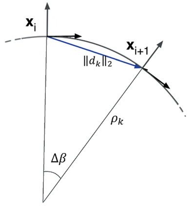
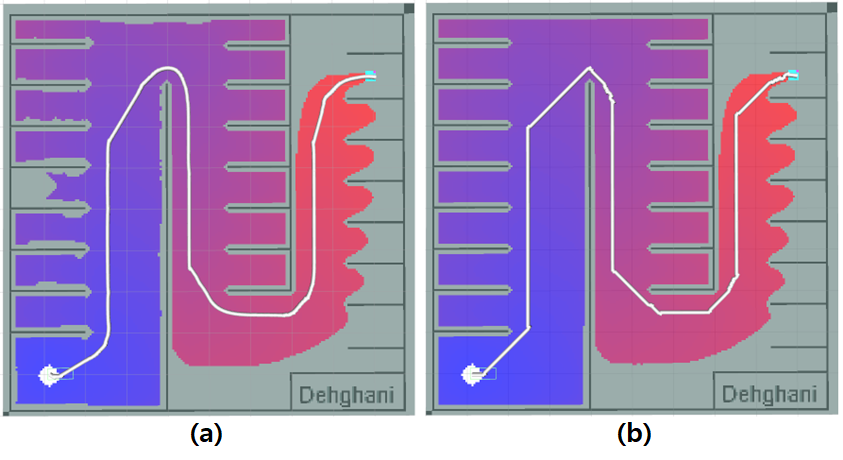
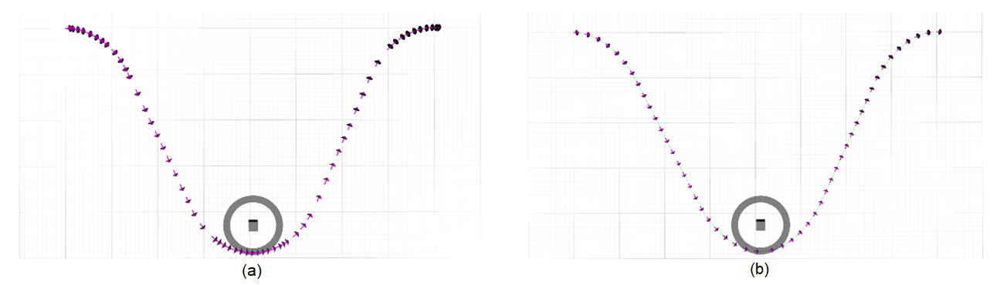

# Methodology

In this study, the global planning method employed is the $A^*$ algorithm, enhanced with a gradient descent optimizer. Initially, the $A^*$ algorithm is applied to assign values to all map grids using a function, effectively creating an analogous discrete potential field within the environment. Subsequently, the gradient descent method is utilized to extract a favourable path from the origin to the destination based on these values. For local planning tasks, the timed elastic band method is preferred due to its numerous advantages over alternative motion planning approaches.

## Proposed algorithm for global planning

The proposed approach for global planning in this research involves utilizing the $A^*$ algorithm to assess a portion of the map and employing a decreasing gradient optimizer to determine the path. The $A^*$ algorithm is adept at finding the shortest path based on the distance criterion from the goal, making it suitable for global planning in both structured and unstructured environments. Incorporating heuristic criteria in this method significantly reduces computational complexity. By employing this approach, higher-probability path segments within the map are prioritized, effectively creating a representation akin to a discrete potential field in the environment. Subsequently, the gradient descent method is employed to derive the shortest path from the starting point to the destination. The $A^*$ algorithm leverages heuristic criteria to streamline calculations, while the use of gradients facilitates the discovery of smoother paths, enhancing its comparative value over other planning methods.The implementation of the $A^*$ algorithm in this research is outlined in Algorithm [\[Alg1\]](#Alg1){reference-type="ref" reference="Alg1"}.

## $A^*$ planner

In the global planning method applied to the generated map, as integrated within the $A^*$ algorithm, the procedure entails receiving the cost map coordinates corresponding to the starting and ending points, and subsequently deriving the path from the end point. Initially, the path finder initializes the path array by placing the destination point. It then examines the eight neighbouring cell, selecting the one with the lowest value as the subsequent waypoint along the path. This iterative process persists until the starting point is reached.

## Gradient descent method

In this study, the gradient descent method is employed for path finding. Gradient descent is an iterative mathematical optimization algorithm utilized to locate the minimum of a function. It involves taking steps proportional to the negative gradient (or estimated gradient) of the function at the current point. If steps in the positive gradient direction are taken, the algorithm approaches the maximum of the function, known as the incremental gradient process. Here, the function of interest is discrete and two-dimensional, derived as a map from the A\* method. The following pseudocode outlines the process of estimating the gradient on this map and determining the path:

Due to the heuristic criterion employed in the $A^*$ algorithm, only the map regions, where the presence of a path is more probable, are valued. Consequently, a potential error arises at the border between the valued area and the non-valued area when using the decreasing gradient method. This issue is addressed by adding the fourth and fifth lines, thereby rectifying the error.

## Proposed algorithm for local planning

After establishing the global path from the origin to the destination, accounting for static obstacles, the next step involves local planning to fine-tune the final trajectory for the vehicle. In this research, the local trajectory is defined as a sequence of vehicle positions along with the corresponding time intervals. Each position is characterized by four parameters detailing the vehicle's location and orientation.

:::: algorithm
::: algorithmic
Initialize the overall cost-map with the start and goal locations. Form an array of ordered pairs, where the first component denotes the cell index and the second component represents the cell value. Set the initial value of all map points (except the starting point, which is set to zero) to a large value. Place the starting point with a value of zero in the first position of the queue. Extract the cell with the highest value from the queue. Terminate the process. Remove the cell from consideration. Remove the cell from consideration. Calculate the new value for the cell. Compute the Euclidean distance from the cell to the end point. Store the cell index, its new value, and the sum of the new value.
:::
::::

:::: algorithm
::: algorithmic
Begin from the destination point. Continue until reaching the starting point: Move to the neighboring cell with the lowest value. Compute the numerical approximation of the potential gradient. An error has occurred. Move half a cell in the direction of the negative gradient.
:::

$^*POT\_HIGH$: A very high initial value
::::

## Setting the trajectory density

The proposal outlined in this article aims to enhance trajectory quality while mitigating computational burden by augmenting the number of waypoints in critical sections, such as bends or turns. This is achieved by integrating a dynamic term into the time intervals within the fastest time cost function, enabling trajectory accuracy adjustments along specific segments. The cost function for the fastest route is introduced as Eq. [\[eq:formula1\]](#eq:formula1){reference-type="ref" reference="eq:formula1"}.

::: minipage
$$\begin{equation}
f_k = \sum_{k=1}^{n-1} \left( \Delta T_k \right)^2
\label{eq:formula1}
\end{equation}$$
:::

::: minipage
$$\begin{equation}
f_k = \sum_{k=1}^{n-1} w_k \left( \Delta T_k \right)^2
\label{eq:formula2}
\end{equation}$$
:::

By selecting this cost function and employing the Lagrange coefficient, the inclination is to establish uniform time intervals throughout the path. However, assigning specific coefficients to individual time intervals allows for customization of their durations. Thus, the revised cost function is as Eq.[\[eq:formula2\]](#eq:formula2){reference-type="ref" reference="eq:formula2"}.

The larger the $w_k$ weight is, the smaller its corresponding time interval $\Delta T_k$ will be, and as a result, the accuracy of the trajectory will increase. Since the turns and curves of the route are among its sensitive parts[@li2022autonomous], in this research, the accuracy of the path has been increased in the turns and curves of the route, and in the parts where the car moves in a straight line, in order to reduce the computational burden, a smaller number of waypoints have been used. The Eq.[\[eq:formula3\]](#eq:formula3){reference-type="ref" reference="eq:formula3"} is used to identify the path curves, which is obtained according to Fig.[1](#fig:PathCurvature){reference-type="ref" reference="fig:PathCurvature"}.

{#fig:PathCurvature width="20%"}

$$\begin{equation}
\rho_k = \frac{\|d_k\|_2}{|2\sin\left(\frac{\Delta\beta_k}{2}\right)|} \quad (\text{since } \Delta\beta_k \ll 1) \quad \rho_k = \frac{\|d_k\|_2}{|\Delta\beta_k|} \geq \rho_{\text{min}}
\label{eq:formula3}
\end{equation}$$

This equation gives the radius of curvature of the path, the smaller the radius of curvature of the path, the more winding the path is. Therefore, according to the equation (4), the inverse value obtained from (3) is considered as the weight and is used for $w_k$ in the (5).

$$\begin{equation}
w_k = \frac{|\Delta\beta_k|}{\|d_k\|_2} 
\label{eq:formula4}
\end{equation}$$

## Obstacle dynamics in local planning

For dynamic obstacle tracking, the position of the obstacle center is calculated every time the cost map is updated and given to the Kalman filter. A critical difference between motion planning for vehicles and mobile robots lies in the nature of the environment they navigate. In the case of vehicles, the planning environment encompasses fast moving vehicles, necessitating consideration of accelerated obstacle movement models. The Kalman filter emerges as a robust tool for providing scientific and engineering predictions regarding the future states of dynamic systems, particularly in scenarios where information about the system is imprecise. Notably, the Kalman filter boasts efficiency, requiring minimal memory as it relies solely on past state information. In this study, the Kalman filter leverages a constant acceleration motion model to estimate obstacle movement, thus yielding the following dynamic system equation.

$$\begin{equation}
\text{Pos\_est} = \text{Pos\_old} + V_{\text{rel}} \Delta t + \frac{1}{2} A_{\text{rel}} \Delta t^2 
\label{eq:formula5}
\end{equation}$$

where, is the estimated position of the obstacle, is the previous position of the obstacle, $V_{\text{rel}}$ is the relative speed of the obstacle, $A_{\text{rel}}$ is the obstacle acceleration and $\Delta t$ represents the time interval between both iterations of the algorithm. To estimate the position, speed and acceleration of the obstacle, the relationship between these three parameters should be written in a standard way. The following equations contain these relationships.

$$\begin{align}
\begin{bmatrix}
\text{Pos}_{n+1} \\
\text{Vel}_{n+1}
\end{bmatrix}
&= 
\begin{bmatrix}
1 & t \\
0 & 1
\end{bmatrix}
\begin{bmatrix}
\text{Pos}_n \\
\text{Vel}_n
\end{bmatrix}
+
\begin{bmatrix}
\frac{t^2}{2} \\
t
\end{bmatrix}
\text{Acc}_n + \mathbf{w}_n  \\
Z_{n+1}
&= 
\begin{bmatrix}
1 & 0
\end{bmatrix}
\begin{bmatrix}
\text{Pos}_{n+1} \\
\text{Vel}_{n+1}
\end{bmatrix}
+ v_{n+1}
\end{align}$$

$w_n$ is process noise and $v_n+1$ is observation noise, which are considered as white with zero mean. Considering that the above equation has an uncertain input of acceleration, the following equations can be used.

$$\begin{align}
\begin{bmatrix}
\text{Pos}_{n+1} \\
\text{Vel}_{n+1} \\
\text{Acc}_{n+1}
\end{bmatrix}
&= 
\begin{bmatrix}
1 & t & \frac{t^2}{2} \\
0 & 1 & t \\
0 & 0 & 1
\end{bmatrix}
\begin{bmatrix}
\text{Pos}_n \\
\text{Vel}_n \\
\text{Acc}_n
\end{bmatrix}
+ \mathbf{w}_n \\
Z_{n+1}
&= 
\begin{bmatrix}
1 & t & \frac{t^2}{2}
\end{bmatrix}
\begin{bmatrix}
\text{Pos}_n \\
\text{Vel}_n \\
\text{Acc}_n
\end{bmatrix}
+ \mathbf{w}_n + v_{n+1}
\end{align}$$

Table 1 shows the necessary definitions to use in Kalman equations.

::: table*
  System state vector                   $x_{\text{aug}}(n) = \begin{bmatrix} \text{Pos}_n \\ \text{Vel}_n \\ \text{Acc}_n \end{bmatrix}$
  ------------------------------------- -----------------------------------------------------------------------------------------------------
  State transition model matrix         $F_{\text{aug}}(n) = \begin{bmatrix} 1 & t & \frac{t^2}{2} \\ 0 & 1 & t \\ 0 & 0 & 1 \end{bmatrix}$
  Effect of noise level                 $G_{\text{aug}}(n) = \begin{bmatrix} 1 \\ 1 \\ 1 \end{bmatrix}$
  Observation model vector              $H_{\text{aug}}(n) = \begin{bmatrix} 1 & t & \frac{t^2}{2} \end{bmatrix}$
  Observation noise                     $v_{\text{aug}}(n) = w_n + v_{n+1}$
  Process noise covariance              $Q_{\text{aug}}(n) = E\{w_{\text{aug}}(n) w_{\text{aug}}^T(n)\} = Q(n)$
  Covariance of observation noise       $R_{\text{aug}}(n) = E\{v_{\text{aug}}(n) v_{\text{aug}}^T(n)\}$
                                        $= H(n)G(n)Q(n)G^T(n)H^T(n) + R(n)$
  Correlation matrix of process noise   $T_{\text{aug}}(n) = E\{w_{\text{aug}}(n) v_{\text{aug}}^T(n)\} = Q(n)G^T(n)H^T(n)$
:::

The following equations show the Kalman relations necessary to calculate the speed.

$$\begin{multline}
\hat{x}{\ }_{\text{aug}}(n|n-1) = F_{\text{aug}}(n) \hat{x}{\ }_{\text{aug}}(n-1|n-1) \\
\mathrm{\Sigma}_{\text{aug}}(n|n-1) = F_{\text{aug}}(n) \mathrm{\Sigma}_{\text{aug}}(n-1|n-1) F_{\text{aug}}^T(n) \\
+ G_{\text{aug}}(n) Q_{\text{aug}}(n) G_{\text{aug}}^T(n) \\
y\hat{(n)} = Z_{\text{aug}}(n) - H_{\text{aug}}(n) \hat{x}{\ }_{\text{aug}}(n|n-1) \\
K_{\text{aug}}(n) = [\mathrm{\Sigma}_{\text{aug}}(n|n-1) H_{\text{aug}}^T(n) \\
+ G_{\text{aug}}(n) T_{\text{aug}}(n)] R_{\text{aug}}^{-1}(n) \\
\hat{x}{\ }_{\text{aug}}(n|n) = \hat{x}{\ }_{\text{aug}}(n|n-1) + K_{\text{aug}}(n)y\hat{(n)} \\
\mathrm{\Sigma}_{\text{aug}}(n|n) = \mathrm{\Sigma}_{\text{aug}}(n|n-1) \\
- K_{\text{aug}}(n) H_{\text{aug}}(n) \mathrm{\Sigma}_{\text{aug}}(n|n-1)
\end{multline}$$

In the above equations, $\hat{x}_{\text{aug}}$ is the estimated state vector, $\Sigma_{\text{aug}}$ is the covariance matrix of the estimation error, and $K_{\text{aug}}$ is the Kalman gain.

How to design the covariance noise process (Q matrix) is explained below. In practice, a lot of time is spent simulating and evaluating the collected data to choose the right value for Q. In general, the process model will be in the following form:

::: minipage
$$\begin{equation}
\dot{x} = Ax + Bu + w
\end{equation}$$
:::

::: minipage
$$\begin{equation}
f(x) = Fx + \Gamma w
\end{equation}$$
:::

where $w$ is the process noise.

The desired dynamic system is modeled using position, speed, and acceleration. Now it is assumed that the acceleration, which is larger than the order, is constant in specific time intervals that are independent of each other and changes at the end of each interval. In other words, the acceleration jumps in each time interval and is modeled as below:

::: minipage
$$\begin{equation}
F = \begin{bmatrix}
1 & t & \frac{t^2}{2} \\
0 & 1 & t \\
0 & 0 & 1
\end{bmatrix}
\end{equation}$$
:::

::: minipage
$$\begin{equation}
\Gamma = \begin{bmatrix}
\frac{\Delta t^2}{2} \\
\Delta t \\
1
\end{bmatrix}
\end{equation}$$
:::

where $\Gamma$ is the system noise gain and $w$ is the desired continuous piece acceleration. The transfer matrix of the system is also defined as follows.

Therefore, the covariance matrix of the system will be as follows.

::: minipage
$$\begin{equation}
Q = \mathbb{E}[\Gamma w(t) w(t) \Gamma^T] = \Gamma \sigma_v^2 \Gamma^T
\end{equation}$$
:::

::: minipage
$$\begin{equation}
Q = \begin{bmatrix}
\frac{\Delta t^4}{4} & \frac{\Delta t^3}{2} & \frac{\Delta t^2}{2} \\
\frac{\Delta t^3}{2} & \Delta t^2 & \Delta t \\
\frac{\Delta t^2}{2} & \Delta t & 1
\end{bmatrix}
\end{equation}$$
:::

# Experiments

Fig.[2](#fig:smootherpath){reference-type="ref" reference="fig:smootherpath"} illustrates the scenario involving a parking lot, showcasing two planning methods: normal $A^*$ and gradient descent. Comparing the paths generated by these methods reveals that the gradient descent approach yields a notably smoother and optimal path compared to the conventional $A^*$ method. It's worth noting that while the global planning may exhibit suboptimal outcomes, the local planner effectively mitigates many of its drawbacks, this means that the imperfections are acceptable and do not need special care when putting the plan into action. In designing the global planner, the paramount considerations include ensuring completeness, accuracy, and reducing computational complexity. Simulations validate that the proposed algorithm in this study satisfactorily fulfills these criteria, making it well-suited for global path planning.

{#fig:smootherpath width="\\linewidth"}

Fig.[3](#fig:trajectory density){reference-type="ref" reference="fig:trajectory density"} illustrates the impact of path density enhancement. Here, the origin is located at (-4, 0) and the destination at (+4, 0), while the obstacle has shifted from a position above the horizontal axis to (0, -4.5). Each arrow along the path indicates specific positions and directions for the car to traverse towards reaching the destination. Despite local optimization efforts and the path's continuous shape alteration, without multipath optimization, the resulting path remains suboptimal. This scenario was conducted solely to introduce curvature into the path and evaluate improvements in this aspect. Higher curvature regions entail more waypoints, thus increasing path density accordingly.

{#fig:trajectory density width="\\linewidth"}

To assess the effectiveness of the Kalman filter, various scenarios were examined involving moving obstacles with diverse velocities and accelerations. Their positions were calculated, and this data was subsequently fed into the Kalman filter to extract the motion model of the obstacle.

## First scenario: The obstacle moves at a constant speed in the vertical (y) direction

In this scenario, the moving obstacle is positioned ahead of the vehicle and travels along the y-axis (Fig.[4](#fig:scenarios){reference-type="ref" reference="fig:scenarios"}(a)). The obstacle's displacement is such that its linear velocity in the x-axis is zero, while its linear velocity in the y-axis changes completely randomly.

:::: {#fig:scenarios .figure}
\

::: caption
\(a\) Path planning in the presence of an obstacle moving in the y direction (b) Evaluation of the Kalman filter for the moving obstacle in the y direction (c) moving obstacle in the x direction (d) Kalman filter for the moving obstacle with constan (e) moving obstacle with different constant accelerations (f) Evaluation of the Kalman filter for an accelerated moving obstacle
:::
::::

To confine the obstacle within the planning environment, its movement is constrained to a defined interval, with its direction changed upon reaching upper and lower limits. Despite large error in the perception phase and challenges in calculating the obstacle's position, the Kalman filter adeptly estimates the speed and acceleration of the obstacle system.(Fig.[4](#fig:scenarios){reference-type="ref" reference="fig:scenarios"}(d))

## Second scenario: The obstacle moves at a constant speed in the vertical (x) direction

In this scenario, the obstacle is positioned ahead of the vehicle and travels along the x-axis.(Fig.[4](#fig:scenarios){reference-type="ref" reference="fig:scenarios"}(b)) Its displacement is designed so that its linear velocity in the y-direction remains zero while its linear velocity in the x-direction varies randomly. To ensure the obstacle remains within the routing environment, its movement is confined to a specific interval, and its direction is altered upon reaching the left and right boundaries. Despite significant error in calculating the obstacle's position, the Kalman filter effectively estimates the speed and acceleration of the obstacle system.(Fig.[4](#fig:scenarios){reference-type="ref" reference="fig:scenarios"}(e)) This scenario was tested to demonstrate the algorithm's robustness to variations in the obstacle's movement direction.

## Third scenario: The obstacle moves with a constant acceleration

To assess the Kalman filter's performance in scenarios involving accelerated motion, a moving obstacle was subjected to constant acceleration within the environment. To limit the obstacle's movement within the designated area, its linear velocities in the $x$ and $y$ directions were modulated using triangular functions. Depending on the frequency and amplitude of these functions, the trajectory of the obstacle varied. Despite the challenges in accurately calculating the obstacle's position, the Kalman filter effectively estimated its speed and acceleration, highlighting its robustness even in the presence of significant error in the perception phase.(Fig.[4](#fig:scenarios){reference-type="ref" reference="fig:scenarios"}(c)(f))

# Motion planning in the presence of moving obstacles

## First test: Static obstacles

In order to test the performance of the algorithm, the initial values specified in Table [\[tab:combined_scenario\]](#tab:combined_scenario){reference-type="ref" reference="tab:combined_scenario"} have been used.

The maximum number of homotopy classes is limited at 5 to control the computational workload. Consequently, 5 trajectories are simultaneously generated, and the one with the lowest cost is chosen. In the fig.[5](#fig:fig5){reference-type="ref" reference="fig:fig5"}(a) red arrows denote the waypoints for the vehicle to traverse from the origin to the destination. The obstacles are considered as points and the circle around them indicates the safety margin. Obstacles can have any shape and be placed in any position. In order to show how the obstacles affect the path, it has been tried to place the obstacles at a point that has the greatest impact on the path. The final trajectory comprises 81 states, with an estimated time of arrival at 20.14 seconds. The average path computation time is 14.91milliseconds, which is considered efficient for a computer equipped with a dual-core processor running at 1.8 GHz. The green paths along by the optimal trajectory are homotopy paths.

:::: {#fig:fig5 .figure}
::: caption
\(a\) Two-dimensional position over time, perspective view, from above, from the front, and from the left in the presence of static obstacles (b) in the presence of constant speed obstacles (c) in the presence of constant acceleration obstacles
:::
::::

## Second scenario: moving obstacles at a constant speed

In order to test the performance of the algorithm, the initial values specified in Table [\[tab:combined_scenario\]](#tab:combined_scenario){reference-type="ref" reference="tab:combined_scenario"} have been used in this scenario.

The maximum number of homotopy classes is set to four to avoid the increase in the computational cost. Therefore, four trajectories are designed simultaneously and the one that has a lower cost is selected. In the fig.[5](#fig:fig5){reference-type="ref" reference="fig:fig5"}(b) the red arrows show the situations that the car must go through to go from the origin to the destination. The obstacles are simplified to points, with a surrounding circle denoting the safety margin. These obstacles are versatile, capable of assuming any shape and position. To demonstrate their influence on the path, obstacles are strategically positioned to show their maximum impact. The resulting route includes 75 states and the time to reach the destination will be 19.22 seconds. The average time required to calculate the path is 23.1 milliseconds, which is a good time for a computer with a dual-core processor with a frequency of 1.8 GHz.

## Third test: Accelerated moving obstacles

In order to test the performance of the algorithm, the initial values specified in Table [\[tab:combined_scenario\]](#tab:combined_scenario){reference-type="ref" reference="tab:combined_scenario"} have been used.

The resulting route includes 85 states and the time to reach the destination will be 21.12 seconds. The average time required to calculate the route is 27.32 seconds, which is a good time for a computer with a dual-core processor with a frequency of 1.8 GHz. Fig.[5](#fig:fig5){reference-type="ref" reference="fig:fig5"}(c) illustrates the scenario of accelerated obstacles.

# Conclusion

This research introduces the novel concept of \"Trajectory density\" to assess the quality of generated paths by vehicle motion planning algorithms. By defining a new objective function and applying dynamic coefficients, this criterion is enhanced. Given that increasing the number of track conditions escalates computational load, it's impractical to boost trajectory density throughout its entirety. Hence, the technique proposed in this study detects sensitive areas of the route, such as bends, and adjusts the density accordingly. Motion planning in the proposed method incorporates dynamics of moving obstacles. To identify obstacles and their locations, a new method is employed, amalgamating sensor data to produce a local cost-map. Computer vision methods are then utilized to differentiate between fixed and moving obstacles, with the latter's location provided at a specific frequency enabling dynamic obstacle tracking. This information is integrated into the Kalman filter to estimate speed and acceleration, enabling extraction of obstacle dynamics.
