::: IEEEkeywords
Path planning; Field robotics; Aerial robots; Ground robots; Underwater robots;
:::

:::: {#fig:intro .figure latex-placement="t"}
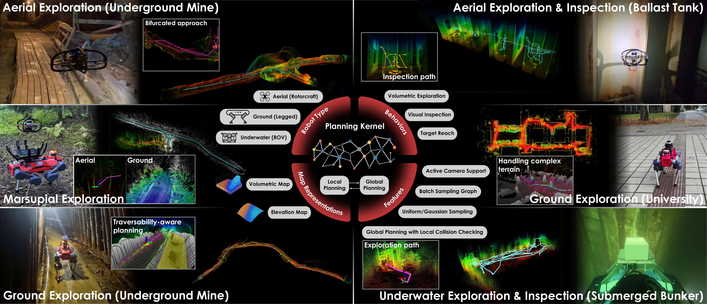{width="100%"}

::: caption
An overview of the [omniplanner]{acronym-label="omniplanner" acronym-form="singular+abbrv"} core functionalities and features along with instances of field deployments. [omniplanner]{acronym-label="omniplanner" acronym-form="singular+abbrv"} has been deployed across aerial, ground, and underwater robots in a diverse set of environments. Various aspects of the planner, such as the planning behaviors, embodiment-specific adaptations, and the bifurcated local-global is shown through instances of field-deployments.
:::
::::

# INTRODUCTION

robotic operation in complex and unstructured environments requires the ability to actively acquire spatial information and systematically observe structures of interest. From underground mines [@dang2020graph] and industrial plants [@hutter2017towards] to subsea infrastructures [@jacobi2015autonomous] and disaster zones [@balta2017integrated], robots of diverse morphologies are increasingly deployed to perceive, map, and assess their surroundings, potentially without external supervision. These capabilities underpin applications such as search and rescue [@delmerico2019current], infrastructure monitoring [@bircher2015structural], and environmental surveying [@popovic2020informative], where human access is unsafe, impractical, or impossible.

A large body of prior work has addressed autonomous planning for these tasks, typically by tailoring solutions to specific domains or robot classes. Representative examples include volumetric exploration strategies for aerial robots [@zhou2021fuel; @lindqvist2024tree], traversability-aware planning for ground systems [@dixit2024step; @lee2025trgplanner], and coverage-oriented approaches for underwater inspection [@zacchini2022sensor; @amer2025react]. While such methods achieve strong performance within their target domains, they are often tightly coupled to assumptions about the robot morphology, including the associated vehicle dynamics, sensing modalities, and environmental structure. Consequently, adapting these planners to new robot types or tasks typically requires substantial redesign, reparameterization, or parallel development of separate planning pipelines. Moreover, exploration and inspection are commonly treated as distinct problems, with limited support for transitioning between them within a unified planning architecture. This fragmentation restricts scalability and limits the transfer of autonomy across diverse robotic platforms.

Despite the apparent diversity of robotic morphologies and domains, many of the underlying planning requirements remain shared. Aerial and underwater robots are both floating-base platforms operating in 3D space. Ground platforms, despite other morphological differences, must simultaneously reason both for obstacle avoidance and traversability over uneven terrain and complex geometries. Across morphologies, robots must repeatedly solve a common set of problems: selecting collision-free motions, reasoning over partially observed environments, and choosing viewpoints that maximize task-relevant information. These shared objectives suggest that autonomy across domains need not rely on fundamentally different planners, but rather on a unified planning core that can be specialized through modular interfaces.

Motivated by these observations, this paper introduces [omniplanner]{acronym-label="omniplanner" acronym-form="singular+abbrv"}, a unified planning framework centered around a domain-agnostic planning kernel. The proposed framework decouples the core planning logic from robot-specific constraints, map representations, and task objectives. The planning kernel serves as a shared backbone for global and local planning, while behaviors such as volumetric exploration, visual inspection, and target reach are realized through modular objective functions. Robot-specific characteristics --including aerial, ground, and underwater embodiments-- are incorporated through lightweight adaptation layers, enabling the same planning kernel to be reused across platforms with minimal domain-specific tuning.

The main contributions of this work are summarized as follows:

- **Planning Kernel architecture**: A unified, domain-agnostic planning kernel that serves as a shared core for global and local planning behaviors across heterogeneous robotic platforms.

- **Modular behavior integration**: A behavior abstraction that unifies volumetric exploration, visual inspection, and target reach within a unified planning framework, enabling a multitude of tasks and the autonomous switching between behaviors without external intervention.

- **Cross-domain validation**: Extensive simulation studies benchmark [omniplanner]{acronym-label="omniplanner" acronym-form="singular+abbrv"} against state-of-the-art methods, while experimental field deployments on aerial, ground, and underwater robots demonstrate its effectiveness across diverse environments, including underground mines, forests, submarine bunkers, industrial facilities, and structured outdoor settings.

The above position [omniplanner]{acronym-label="omniplanner" acronym-form="singular+abbrv"} in a distinct category compared to other methods that are limited in their ability to generalize regarding the robot morphologies they can guide and the operational domains (air, land, sea) they can successfully operate. The implementation of the method, alongside the environments used for evaluations in simulation and the datasets from field testing shall be openly released and associated with the paper when it otherwise does not conflict with the rules of double-blind review.

The remainder of this paper is organized as follows. Section [2](#sec:related_work){reference-type="ref" reference="sec:related_work"} reviews related work on exploration, inspection, and unified planning approaches. Section [3](#sec:problem_statement){reference-type="ref" reference="sec:problem_statement"} formulates the planning problem and introduces the abstraction used to represent heterogeneous robots and environments. Section [4](#sec:proposed_approach){reference-type="ref" reference="sec:proposed_approach"} details the proposed planning kernel and its associated adaptation layers. Section [5](#sec:simulation_studies){reference-type="ref" reference="sec:simulation_studies"} presents simulation-based evaluations, while Section [6](#sec:field_experiments){reference-type="ref" reference="sec:field_experiments"} reports the results of extensive field experiments conducted with aerial, ground, and underwater robots. Finally, Section [7](#sec:conclusion){reference-type="ref" reference="sec:conclusion"} concludes the paper and discusses directions for future research.

# RELATED WORK {#sec:related_work}

This section outlines relevant literature, organized around the exploration, inspection, and target reach behaviors.

## Exploration Planning

Autonomous exploration has been extensively studied under two dominant approaches, the frontier-based exploration and [nbv]{acronym-label="nbv" acronym-form="singular+short"} planning. Frontier-based methods select goals on the boundary between known free space and unknown space, originating from the seminal work in [@yamauchi1997frontier] and later extended to multi-robot exploration [@yamauchi1998frontier]. More recent frontier formulations have focused on enabling rapid exploration for agile aerial robots, e.g., by designing frontier selection strategies that support high-speed flight [@cieslewski2017rapid]. Several studies have also compared frontier-based variants to highlight their trade-offs across representative environments and deployment conditions [@jain2017comparative]. Exploiting implicit grouping of frontier voxels, the work in [@dai2020fast] improves computational performance.

[nbv]{acronym-label="nbv" acronym-form="singular+abbrv"} planning instead chooses sensing configurations by optimizing an information objective, and has roots in early work on determining the next best view [@connolly1985determination]. [nbv]{acronym-label="nbv" acronym-form="singular+abbrv"} principles are broadly applicable across domains, including underwater perception, where view selection must respect sensing and visibility constraints [@sheinin2016next]. Modern [nbv]{acronym-label="nbv" acronym-form="singular+abbrv"} systems often adopt receding-horizon formulations, such as NBVP [@bircher2016receding], and have been accelerated through sampling-based improvements tailored to [mav]{acronym-label="mav" acronym-form="singular+short"} platforms [@respall2021fast]. A well-known limitation of purely local [nbv]{acronym-label="nbv" acronym-form="singular+abbrv"} selection is susceptibility to local minima, where a planner exhausts locally informative viewpoints and fails to relocate to distant informative regions. This limitation is explicitly discussed and addressed in large-scale 3D exploration settings [@selin2019efficient]. Simultaneously, approaches such as  [@bircher2016receding] that rely on sampling-based methods but build a single tree face computational challenges as the scale of the environment increases. Complementary approaches have explored motion-primitive libraries to enable fast, dynamically feasible exploration behaviors [@dharmadhikari2020motion]. Since many exploration pipelines rely on sampling-based planning, improving sampling efficiency remains an active area, including methods that reduce computational overhead for online informative planning in unknown environments [@schmid2020efficient]. Recent work has also proposed the ERRT framework, a tree-based next-best-trajectory formulation for 3-D UAV exploration, which explicitly optimizes informative motion over a branching trajectory tree while maintaining real-time feasibility [@lindqvist2024tree].

To mitigate local-minima behavior and improve scalability, hierarchical and integrated exploration planners combine local planning with global reasoning. Representative local--global frameworks include GBPlanner 2.0 [@kulkarni2022autonomous], TARE [@cao2021tare], DSVP [@zhu2021dsvp], and FUEL [@zhou2021fuel], which typically maintain global structures (e.g., graphs or frontier sets) to support long-horizon repositioning while using local planners for collision-free execution. More recent works have further targeted global optimality and robustness, e.g., by incorporating frontier-omission awareness and altitude-stratified planning [@zhang2023go], or by exploiting submap structures to maintain exploration progress under severe odometry drift [@schmid2021unified]. In parallel, information-theoretic exploration [@tabib2021autonomous] has advanced through objectives based on mutual information and its tractable approximations, including Bayesian optimization for informative view selection [@bai2016information], state-lattice planning with information measures for subterranean environments [@tabib2016computationally], and real-time information-theoretic exploration using Gaussian mixture model maps [@tabib2019real]. Exploration in dynamic environments has also been studied, e.g., by leveraging roadmap-style representations that enable efficient re-querying as the environment changes [@tabib2019real]. Finally, learning-based exploration has gained traction, including imitation learning approaches derived from expert behavior in subterranean settings [@reinhart2020learning] and broader learning-based formulations for adaptive informative path planning [@popovic2024learning]. At the systems level, MAexp provides a generic high-efficiency platform for RL-based multi-agent exploration, combining continuous point-cloud environments, multiple MARL algorithms, and faster sampling to support more reproducible cross-scenario evaluation and improved sim-to-real fidelity [@zhu2024maexp].

A related thread is uncertainty-aware exploration and active [slam]{acronym-label="slam" acronym-form="singular+short"}, where the objective is not only map coverage but also improved localization and state estimation. Early active [slam]{acronym-label="slam" acronym-form="singular+abbrv"} work framed viewpoint selection through model predictive control and attractor-based exploration [@leung2006active], while later approaches incorporated information measures such as Kullback--Leibler divergence to guide exploration under particle-filter [slam]{acronym-label="slam" acronym-form="singular+abbrv"} [@carlone2010application]. Active vision has also been used to improve localization quality via controllable sensing, for example through an active stereo head [@davison2002simultaneous]. Uncertainty-aware planners such as RHEMPlanner explicitly consider estimation uncertainty during exploration and mapping [@papachristos2017uncertainty], and recent surveys summarize the broader active [slam]{acronym-label="slam" acronym-form="singular+abbrv"} landscape and open challenges [@placed2023survey].

## Inspection and Coverage Planning

Inspection and coverage planning differ from exploration in that the objective is typically to observe a known or partially known target surface under sensing constraints, rather than only to expand the free-space map. Classical 3D coverage path planning methods usually assume a prior model and decompose the problem into viewpoint generation and route optimization. An early sampling-based formulation proposed in [@englot2012sampling] addresses full-surface inspection in cluttered, occluded environments and provides probabilistic completeness guarantees for coverage planning. A representative online extension is the receding-horizon framework in [@bircher2018receding], which offers volumetric exploration and surface inspection, albeit not integrated within a single autonomous mission. Analogous to [@bircher2016receding], the method faces computational challenges in spatially extended missions as it samples a single random tree. In a more inspection-specific setting, ASSCPP uses an existing 3D reference model and sensor noise models to adaptively sample viewpoints toward low-coverage and low-accuracy regions, thereby improving both path efficiency and expected model quality [@almadhoun2018coverage].

A major challenge in aerial inspection is scalability in large and cluttered 3D scenes. HCPP addresses this through a hierarchical decomposition that partitions the environment into subspaces, computes a global traversal order, and then solves local coverage paths within each subspace [@cao2020hierarchical]. More recently, FC-Planner improves this idea through skeleton-guided space decomposition and specialized viewpoint generation, reducing redundant sampling and yielding faster coverage planning in complex scenes [@feng2024fc]. Beyond geometric coverage alone, recent work has also emphasized visibility and reconstruction quality. Star-convex visibility planning constrains the trajectory to remain within safe-and-visible regions during inspection [@liu2022star], while GS-Planner uses 3D Gaussian Splatting to evaluate reconstruction completeness together with geometric and textural quality online, enabling quality-aware active reconstruction [@jin2024gsplanner].

Another recent trend is to unify coverage and exploration for online modeling of unknown structures. SEAC departs from the conventional explore-then-exploit pipeline by jointly optimizing local coverage of low-quality surfaces and global exploration of unseen regions within a hierarchical framework, improving both reconstruction quality and efficiency [@zhang2025seac]. Practical deployment has also motivated model-informed and cooperative variants, including BIM-supported path planning for building exterior inspection and multi-robot systems for 3-D surface reconstruction [@huang2023bim; @hardouin2023multirobot]. At the evaluation level, CARIC highlights the growing importance of realistic benchmarking for inspection planners, especially in multi-UAV settings, by emphasizing not only completeness and efficiency but also inspection quality under practical constraints such as heterogeneous sensing and communication limits [@cao2025cooperative]. Overall, the literature shows a clear shift from offline model-based coverage toward scalable, visibility-aware, and quality-driven online inspection planning.

## Target Reach Planning

Target-reach planning considers the problem of navigating a robot to a specified goal as quickly and safely as possible, typically in partially known or unknown environments. Recent work has increasingly adopted integrated global--local formulations to balance long-horizon route selection with fast local replanning. FAR Planner is representative of this direction, which incrementally builds a polygonal map and dynamically updates a visibility graph, enabling low-latency "attemptable" routing toward a goal while adapting to newly observed obstacles and dead ends [@yang2022far]. For aerial robots, FASTER combines global guidance with local trajectory optimization and explicitly maintains a safe backup trajectory in known free space while planning a faster exploratory trajectory toward the goal, improving speed without sacrificing safety [@tordesillas2019faster].

A closely related line of work targets aggressive goal-reaching in cluttered unknown environments. Bubble Planner improves high-speed local replanning through overlapping sphere corridors and a receding-horizon corridor reuse strategy, increasing replanning success and enabling smooth, dynamically feasible flight [@ren2022bubble]. More recently, SUPER extends this safety-assured paradigm by planning directly on LiDAR point clouds and using differentiable trajectory optimization, achieving high-speed and robust waypoint navigation in complex unknown environments [@ren2025safety]. In parallel, perception-driven local planners reduce reliance on explicit mapping by reasoning directly from onboard sensing. For example, depth-conditioned N-MPC embeds a learned collision model into receding-horizon control for real-time obstacle avoidance during waypoint reaching [@jacquet2024n], while reinforcement learning with deep collision encoding maps compressed depth observations, robot state, and goal information directly to low-latency control commands [@kulkarni2024reinforcement]. Overall, recent target-reach methods have shifted toward integrated global--local and perception-aware formulations that better trade off speed, safety, and online adaptability.\
Despite the strong performance of recent exploration, inspection, and target-reach planners, most remain specialized either to a single task or to a specific robot embodiment, sensing stack, and map representation. Exploration methods primarily optimize information gain, inspection methods emphasize surface visibility and coverage quality, and target-reach methods often focus on fast local navigation under behavior-specific assumptions. As a result, transferring these approaches across tasks or platforms typically requires separate implementations, substantial redesign, or extensive retuning. In contrast, our work departs from this fragmented view by introducing a unified, domain-agnostic planning kernel in which volumetric exploration, visual inspection, and target reach are instantiated as modular objectives within the same bifurcated local--global architecture. Coupled with lightweight embodiment adaptation layers, this enables a single planning framework to operate across heterogeneous aerial, ground, and underwater robots.

# PROBLEM STATEMENT {#sec:problem_statement}

This work considers autonomous path planning under partial observability, where information about the environment is acquired through motion while respecting embodiment-specific motion and sensing constraints. The problem is formulated in a domain-agnostic manner to support a unified planning kernel that can be instantiated across heterogeneous robotic platforms and task objectives.

Let $V \subset \mathbb{R}^3$ denote a bounded environment volume. The robotic platform is characterized by its embodiment morphology $R_{\mu}$ and associated motion constraints $C_{\mu}$, which define the set of collision-free configurations $\Xi$. A configuration $\boldsymbol{\xi}\in \Xi$ is defined as the robot position $[p^x,p^y,p^z]$ and yaw angle $\psi$, and when available, further includes a single rotational degree of freedom corresponding to the pitch angle $\vartheta_a$ of an actuated onboard sensor ($\boldsymbol{\xi}=[p^x,p^y,p^z,\psi]$ or $\boldsymbol{\xi}=[p^x,p^y,p^z,\psi,\vartheta_a]$). In this work, a set of onboard sensing modalities $\pazocal{S}= \{\pazocal{D},\pazocal{C}\}$, corresponding to a depth and a camera sensor (possibly but not necessarily realized on the same device), respectively, are characterized by bounded [fovs]{acronym-label="fov" acronym-form="plural+short"}, finite sensing range, and configuration-dependent visibility constraints. These properties induce geometric observability relations between robot configurations and environment regions.

The environment is represented by a spatial map that combines a voxelized [sdf]{acronym-label="sdf" acronym-form="singular+short"} grid $\mathcal{M}$ (also referred to as volumetric map) with fixed resolution $r_V$ and (optionally) a $2.5$D grid-based elevation map $\mathcal{H}$ (for ground robots) with fixed resolution $r_H$. Each voxel $m \in \mathcal{M}$ encodes the belief state of the corresponding spatial region as free, occupied, or unknown, as well as the distance to the closest surface (referred to as [sdf]{acronym-label="sdf" acronym-form="singular+short"} distance). The function $\text{SDF}(\mathbf{x})$ returns the [sdf]{acronym-label="sdf" acronym-form="singular+short"} distance of the voxel in which $\mathbf{x}\in \mathbb{R}^3$ lies. This representation supports collision checking, visibility reasoning, and information-theoretic evaluation within the planning process. The elevation map $\pazocal{H}$ is implemented as a $2.5$D sliding-window map of dimensions $[d_h^x, d_h^y]$, centered at the current robot location. Each grid cell $h \in \pazocal{H}$ stores the estimated ground elevation at the corresponding $[x,y]$ coordinate. This representation enables traversability-aware planning for ground robots.

Due to the inherent limitations of range-based and view-constrained sensing, which primarily observe surface boundaries and are subject to occlusions, certain regions of the environment may remain fundamentally unobservable. Let $\Xi_m^{\mathcal{D}} \subset \Xi$ denote the set of collision-free configurations from which a voxel $m$ is observable by the depth sensor $\mathcal{D}$. Similarly, let $\Xi_m^{\mathcal{C}} \subset \Xi$ denote the set of configurations from which an occupied voxel $m$ is observable by the camera sensor $\mathcal{C}$. Definitions [1](#def:residual_volume){reference-type="ref" reference="def:residual_volume"} and [2](#def:residual_surface){reference-type="ref" reference="def:residual_surface"} capture intrinsic limits of environment observability imposed by the robot's embodiment and sensing modalities.

::: {#def:residual_volume .definition}
**Definition 1** (Residual Volume). *The residual volume $V_{\mathrm{res}}\subset V$ is defined as the subset of the environment volume consisting of voxels that cannot be observed by the depth sensor from any collision-free configuration: $$\begin{equation}
            V_{\mathrm{res}} = \bigcup_{m \in \mathcal{M}} \left( m \mid \Xi_m^{\mathcal{D}} = \emptyset \right).
\end{equation}$$*
:::

::: {#def:residual_surface .definition}
**Definition 2** (Residual Surface). *Let $\mathcal{M}_{\mathrm{occ}} \subset \mathcal{M}$ denote the set of occupied voxels corresponding to observed surfaces. The residual surface $S_{\mathrm{res}}$ is defined as the subset of occupied voxels that cannot be observed by the camera from any collision-free configuration: $$\begin{equation}
            S_{\mathrm{res}} = \bigcup_{m \in \mathcal{M}_{\mathrm{occ}}} \left( m \mid \Xi_m^{\mathcal{C}} = \emptyset \right).
\end{equation}$$*
:::

Based on the above definitions, the planning problem addressed in this work is overarchingly formulated at the kernel level, independently of any specific task or behavior.

::: problem
**Problem 1** (Overarching Planning Problem). *Given a bounded environment volume $V$, a robot with configuration space $\Xi$ and motion constraints $C_{\mu}$, and sensing modalities $\mathcal{S}$, determine a collision-free trajectory $\sigma$ that respects all motion and sensing constraints and optimizes an extrinsic objective $\mathcal{J}$ over the environment. As objective we consider target reach or information tasks and specifically exploration and inspection. For the latter two cases, the objective evaluates how effectively the robot's trajectory acquires task-relevant information through sensing, based on a volumetric map representation $\mathcal{M}$.*
:::

::: objective
**Objective 1** (Exploration). *As the exploration objective, the method considers the planning of a path and viewpoints to unveil all possible volume within a defined bounded box, given no prior information and subject to the considered sensing and motion model.*
:::

::: objective
**Objective 2** (Inspection). *As the inspection objective, the method considers the planning of a path and viewpoints to enable the coverage of all possible surfaces within a defined bounded box, given a representation of the underlying map (possibly through the exploration step).*
:::

::: objective
**Objective 3** (Target Reach). *As the target reach objective, the method considers the planning of a path to reach a user-defined target destination, with or without any prior map information and subject to the considered sensing and motion model.*
:::

Subsequently, we present how [omniplanner]{acronym-label="omniplanner" acronym-form="singular+abbrv"} addresses the considered problem and accordingly gives rise to task-specific autonomous behaviors realized by instantiating different objective functions, constraints, and termination conditions on top of this shared planning kernel, without modifying its underlying structure. Formal definitions for each of [omniplanner]{acronym-label="omniplanner" acronym-form="singular+abbrv"} behaviors are also provided.

# PROPOSED APPROACH {#sec:proposed_approach}

![[omniplanner]{acronym-label="omniplanner" acronym-form="singular+abbrv"} -- a platform-agnostic planning kernel supports global and local planning, while adaptation layers abstract robot embodiments and map representations. Task-specific behaviors are instantiated as objectives and features on top of the shared kernel, enabling reusable autonomy across heterogeneous platforms.](figures/overview.pdf){#fig:overview width="100%"}

This section presents [omniplanner]{acronym-label="omniplanner" acronym-form="singular+abbrv"}, a unified planning framework, which is structured around a domain- and morphology-agnostic planning kernel. The kernel provides a shared backbone for path planning across heterogeneous robotic platforms, while autonomous behaviors are realized through modular objective functions and feature extensions layered on top of this core, as shown in Fig. [2](#fig:overview){reference-type="ref" reference="fig:overview"}.

## Planning Kernel {#sec:planning_kernel}

The planning kernel operates on the robot configuration space $\Xi$ and an incrementally constructed volumetric map $\mathcal{M}$ and elevation map $\pazocal{H}$, independent of task specification and robot embodiment. It adopts a bifurcated planning structure, inspired by [@kulkarni2022autonomous], composed of tightly coupled local and global planning modules that enable scalable planning in large-scale three-dimensional environments.

### **Local Planning Module**

The local planning module constructs a bounded, sampling-based dense graph $\mathbb{G}_L$ in a box of dimensions $\mathbf{B}_L = [b_L^x, b_L^y, b_L^z]$ around the robot's current configuration $\boldsymbol{\xi}_0$. The purpose of this graph is to represent the locally reachable subset of the configuration space $\Xi$ under embodiment-specific motion and sensing constraints, while maintaining bounded computational complexity.

Given the volumetric map $\pazocal{M}$, elevation map $\pazocal{H}$, and a bounding box $\mathbf{B}_R = [b_R^x, b_R^y, b_R^z]$ encoding the robot's physical extent, a set $\Xi_{\mathbf{B}_L}$ of collision-free configurations within $\mathbf{B}_L$ are randomly sampled. [omniplanner]{acronym-label="omniplanner" acronym-form="singular+abbrv"} supports three different sampling distributions:

- *Uniform*: Uniform distribution along each axis within $\mathbf{B}_L$. This is the most generic distribution that can be used to enable efficient planning in a wide variety of environments.

- *Gaussian*: Gaussian distribution centered at $\boldsymbol{\xi}_0$ with a user-defined covariance $\mathbf{\Lambda}$. This distribution can enable improved reachability when operating in narrow environments, as the planner samples densely around the robot, at the cost of worse reach in the volume further away.

- *Hybrid*: Combination of *Uniform* and *Gaussian*. In this distribution, $\eta~\%$ samples are sampled using the *Gaussian* distribution and the rest using *Uniform*. This creates a balance between operating in narrow environments while maintaining the coverage of the uniform distribution.

The samples in $\Xi_{\mathbf{B}_L}$ are connected by admissible edges to form the local graph $\mathbb{G}_L$ along with its vertex and edge sets $\pazocal{V}_L$, $\pazocal{E}_L$ respectively. An edge is admissible if it lies entirely in the collision-free part of the volumetric map $\pazocal{M}_{\mathrm{free}} \subset \pazocal{M}$ and respects the robot motion constraints $C_{\mu}$ (further details presented in Section [4.2](#subsec:adapt){reference-type="ref" reference="subsec:adapt"}). The planner supports two strategies for building $\mathbb{G}_L$ using $\Xi_{\mathbf{B}_L}$:

- *Basic*: Analogous to [@kulkarni2022autonomous; @dang2020graph], in this method, one robot configuration is sampled and added to $\mathbb{G}_L$ at a time. Specifically, a random sample $\boldsymbol{\xi}_r$ is sampled inside $\mathbf{B}_L$ using the selected sampling distribution. The closest vertex $\nu_c \in \pazocal{V}_L$ to $\boldsymbol{\xi}_r$ is selected, and if $\boldsymbol{\xi}_r$ is further than the maximum allowed edge length $e_{\max}$, $\boldsymbol{\xi}_r$ is moved closer to $\nu_c$ along the line joining them to create the new vertex $\nu_r$. Next, the vertices $\{ \nu_{nb} \} \in \pazocal{V}_L$ within a radius $e_{\max}$ of $\nu_r$ are connected if the straight line edges are admissible. The process is then repeated until the number of vertices or edges in $\mathbb{G}_L$ reaches the user-defined limits $n^{\pazocal{V}}_{\max},~ n^{\pazocal{E}}_{\max}$.

- *Batch*: The *Batch* approach is the newly implemented approach in which the planner samples a batch of $n^{\pazocal{V}}_{\max}$ samples at a time. The vertices within a radius of $e_{\max}$ of each other are connected if admissible straight line edges exist. The parts of $\mathbb{G}_L$ disconnected from the vertex $\nu_0$ corresponding to $\boldsymbol{\xi}_0$ are pruned. This process is then repeated until the number of vertices or edges in $\mathbb{G}_L$ reaches the user-defined limits $n^{\pazocal{V}}_{\max},~ n^{\pazocal{E}}_{\max}$.

### **Global Planning Module**

The global planning module maintains a sparse, incrementally constructed graph $\mathbb{G}_G = \{\mathcal{V}_G,\mathcal{E}_G\}$ that captures the connectivity of the mapped configuration space over time. In contrast to the local planning graph, which is transient and restricted to a bounded planning volume, the global graph persists across planning iterations and grows as the robot moves through previously unmapped regions of the environment.

In each local planning iteration $i$, shortest paths $\{ \sigma \}$ in the graph $\mathbb{G}_L^i$ are calculated using Dijkstra's algorithm [@dijkstra2022note] from $\nu_0^i$ to each vertex $\nu \in \pazocal{V}_L^i$ ($(\cdot)^i$ represents the variable corresponding to iteration $i$). These paths are clustered based on path similarity to form a sparse subset $\mathbb{G}_{L, \mathrm{sparse}}^i \subset \mathbb{G}_L^i$ that spans $\mathbf{B}_L$. Each vertex and edge from $\mathbb{G}_{L, \mathrm{sparse}}^i$ is added to $\mathbb{G}_G$ such that $\mathbb{G}_G = \mathbb{G}_G \bigcup \mathbb{G}_{L, \mathrm{sparse}}^i$. Each vertex in $\mathbb{G}_{L, \mathrm{sparse}}^i$ is connected to vertices in $\mathbb{G}_G$ within a radius $e_{\max}$.

Through this incremental aggregation of locally validated motion structure, the resulting graph remains lightweight while providing a meaningful approximation of the traversable configuration space. It enables efficient long-horizon path queries between arbitrary previously visited configurations, while maintaining bounded memory usage and computational complexity without requiring dense sampling of the entire configuration space. Furthermore, the Global Planning Module keeps track of the robot's endurance to provide safe return to home functionality. In each local planning iteration, the global planner calculates a path $\sigma_{\mathrm{home}}$ from the current robot location to the start location $\nu_{\mathrm{home}} \in \pazocal{V}_G$, along $\mathbb{G}_G$. If $\mathrm{len}(\sigma_{\mathrm{home}}) / v_{\mathrm{nom}} \geq T_{\mathrm{thr}} - t$, where $\mathrm{len}(\sigma)$ is the length of the path $\sigma$, $v_{\mathrm{nom}}$ the nominal commanded speed, $T_{\mathrm{thr}}$ the robot's endurance (or mission time limit), $t$ the current time, then the robot is commanded to execute the homing path $\sigma_{\mathrm{home}}$.

To handle potential unseen obstacles or inadmissible segments of the global path $\sigma_G$, the Local Planning Module is used to track $\sigma_G$. A point $\mathbf{p}_g$ at a distance $d_g$ from the current robot location $\boldsymbol{\xi}_0$ along $\sigma_G$ is selected as the goal point. The local graph $\mathbb{G}_L$ is built, and the set of shortest paths $\Sigma_L$ from $\boldsymbol{\xi}_0$ is calculated. The path $\sigma_L \in \Sigma_L$ that takes the robot closest to $\mathbf{p}_g$ is selected and commanded to the robot. Upon execution, $\mathbf{p}_g$ is updated and the process is repeated until the robot reaches the end of $\sigma_G$.

## Embodiment Adaptation Layer {#subsec:adapt}

The embodiment adaptation layer specializes the domain-agnostic planning kernel for different robotic platforms by instantiating primitives and criteria for vertex sampling, collision checking, and edge validation during graph construction, parameterized by the robot morphology $R_{\mu}$, motion constraints $C_{\mu}$, and sensing-limited observability constraints. This design preserves a unified planning kernel while enabling consistent operation across heterogeneous robotic systems. It thus allows one to depart from platform-specific approaches and associated non-generic implementations as in [@kulkarni2022autonomous; @cao2021tare]. Specifically, [omniplanner]{acronym-label="omniplanner" acronym-form="singular+abbrv"} supports multi-rotors, legged robots, differential drive robots, and holonomic underwater robots. Embodiments such as airplanes and non-holonomic ground or underwater robots are not beyond the scope of this work and will be considered for future extensions of the method.

### **Aerial Robot Adaptation**

For aerial robots such as multirotors and other rotorcrafts, graph construction is performed directly in the three-dimensional free space encoded by the volumetric map $\mathcal{M}$. In this embodiment, $C_{\mu}$ does not introduce additional constraints beyond those implied by the platform dynamics at the planning-kernel level. Vertices are sampled from the local planning domain as collision-free configurations $\boldsymbol{\xi}\in \Xi$. A configuration $\boldsymbol{\xi}$ is accepted if the robot's bounding box $\mathbf{B}_R$ is fully contained within the free space $\pazocal{M}_{\mathrm{free}} \subset \pazocal{M}$. Given two vertices $\nu_i, \nu_j \in \pazocal{V}_k, k\in\{ L,G \}$, an edge $e_{ij}$ is admissible if the straight-line path $\boldsymbol{\gamma}_{ij}(s)~=~(1-s)\boldsymbol{\xi}_i + s\boldsymbol{\xi}_j$, $s \in [0,1]$, is collision-free when discretized and evaluated against $\mathcal{M}$.

### **Ground Robot Adaptation**

For ground robots such as legged systems, graph construction leverages the elevation map $\pazocal{H}$ (built following [@fankhauser2018probabilistic]) to enforce terrain support and inclination limits in addition to collision avoidance. These requirements define the ground-specific motion constraints $C_{\mu}$. We refer to the elevation-derived portion as $C_H \subset C_{\mu}$, which requires valid elevation at the footprint query locations and enforces a maximum slope $\theta_{\max}$.

Each candidate sample $\boldsymbol{\xi}\in \Xi$ is projected onto $\mathcal{H}$ by querying the elevation at the footprint center and at a set of offsets corresponding to the footprint corners. If elevation data is unavailable or invalid at any queried location, the sample is rejected. For valid projections, the configuration height is set to $z = \mathcal{H}(x,y) + h_0$, where $h_0$ is a nominal clearance representing the robot's height. The sample is accepted only if the inclination between the center and corner elevation values does not exceed a maximum allowable slope $\theta_{\max}$.

Given two vertices $\nu_i, \nu_j \in \pazocal{V}_k, k\in\{ L,G \}$, the candidate edge $e_{ij}$ is evaluated by discretizing the straight-line path between them and projecting each intermediate point onto $\mathcal{H}$. The resulting sequence of projected points defines a ground-consistent polyline $\hat{\boldsymbol{\gamma}}_{ij}$. The edge is rejected if any projected point lacks valid elevation data or if the incremental slope between successive points exceeds $\theta_{\max}$. If $\hat{\boldsymbol{\gamma}}_{ij}$ lies in $\pazocal{M}_{\mathrm{free}}$ (evaluation similar to that for aerial robot), $e_{ij}$ is considered admissible, else rejected.

### **Underwater Robot Adaptation**

For underwater robots such as thruster-based [rovs]{acronym-label="rov" acronym-form="plural+short"}, graph construction follows the same kernel mechanism of sampling vertices within a local planning volume and connecting them via feasible edges as that for aerial robots. However, admissibility criteria are adapted to underwater sensing and operational constraints, while $C_{\mu}$ continues to denote motion constraints only.

A sampled configuration $\boldsymbol{\xi}\in \Xi$ is accepted only if lies in $\pazocal{M}_{\mathrm{free}}$ and its Euclidean distance to the nearest occupied voxel in $\mathcal{M}_{\mathrm{occ}}$ is below a predefined proximity threshold $d_{\max}$. This constraint restricts graph expansion to regions sufficiently close to observed structure, thereby prohibiting the robot from entering open-water volumes.

Given two vertices $\nu_i, \nu_j \in \pazocal{V}_k, k\in\{ L,G \}$, a candidate edge $e_{ij}$ is evaluated by discretizing the straight-line path between them and performing collision checking against $\mathcal{M}$ using the robot bounding volume $\mathbf{B}_R$, analogous to the aerial robot.

## Behavior Objectives

The planning kernel described in the previous section is task-agnostic and operates solely on the configuration space $\Xi$ and the environment representations $\pazocal{M}$ and $\pazocal{H}$. Task-specific behaviors are realized by instantiating different objective functions, path evaluation criteria, and termination conditions on top of this shared kernel. Unlike most current planning methods, such as [@kulkarni2022autonomous; @dharmadhikari2023gvi; @cao2021tare; @yang2022far], that present a monolithic architecture for a single behavior, [omniplanner]{acronym-label="omniplanner" acronym-form="singular+abbrv"} operates on the common planning kernel which can facilitate multiple behaviors without modifying its underlying planning structure. In this work, three behavior objectives are considered: (i) [ve]{acronym-label="ve" acronym-form="singular+short"}, (ii) [vi]{acronym-label="vi" acronym-form="singular+short"}, and (iii) [tr]{acronym-label="tr" acronym-form="singular+short"}.

### **Volumetric Exploration (VE) Behavior** {#subsec:ve_behavior}

:::: algorithm
::: algorithmic
$\boldsymbol{\xi}_0 \gets \textbf{GetCurrentConfiguration}()$ $\mathbb{G}_L \gets \textbf{BuildLocalGraph}(\boldsymbol{\xi}_0)$ $\Sigma_L \gets \textbf{GetShortestPaths}(\mathbb{G}_L, \nu_0)$ $\mathbf{G}_{E,L} \gets \textbf{ComputeExplorationGain}(\Sigma_L)$ $\sigma_L^* \gets \textbf{GetBestLocalPath}(\Sigma_L, \mathbf{G}_{E,L})$ $\sigma_E \gets 
                            \sigma_L^*$ $\Sigma_{G,\mathcal{F}} \gets \textbf{GetShortestPaths}(\nu_{0,G}, \mathcal{F}, \mathbb{G}_G)$ $\Sigma_{G,\mathrm{home}} \gets \textbf{GetShortestPaths}(\mathcal{F}, \nu_{\mathrm{home}}, \mathbb{G}_G)$ $\mathbf{G}_{E,G} \gets \textbf{ComputeGlobalGain}(\Sigma_{G,\mathcal{F}}, \Sigma_{G,\mathrm{home}})$ $\sigma_{G}^* \gets \textbf{GetBestGlobalPath}(\Sigma_{G,\mathcal{F}}, \mathbf{G}_{E,G})$ $\sigma_E \gets 
                            \texttt{effectiveExploration}~?~\sigma_{G}^*:\sigma_{\mathrm{home}}$ $\sigma_E$
:::

[]{#alg:exploration label="alg:exploration"}
::::

The [ve]{acronym-label="ve" acronym-form="singular+short"} behavior instantiates the planning kernel with the objective of incrementally classifying the environment volume using depth sensing $\mathcal{D}$, under the robot's motion and sensing constraints.

::: behavior
**Behavior 1** (Volumetric Exploration). *Given a bounded environment volume $V$ and an initial robot configuration $\boldsymbol{\xi}_{\mathrm{init}} \in \Xi$, determine a collision-free path $\sigma_E$ that enables the classification of the environment into free space $V_{free} \subset V$ and occupied space $V_{occ} \subset V$, based on observations acquired by the depth sensor $\mathcal{D}$. Exploration is considered complete when no further reachable, collision-free configuration exists from which any remaining unclassified portion of the environment can be observed, i.e., $V_{free} \cup V_{occ} = V \setminus V_{\mathrm{res}}$. The generated paths must satisfy the robot's motion constraints $C_{\mu}$ at all times.*
:::

Let $\mathbb{G}_L = \{\mathcal{V}_L, \mathcal{E}_L\}$ denote the local planning graph constructed by the planning kernel, rooted at the current robot configuration $\boldsymbol{\xi}_0$. At each planning iteration, the shortest paths $\Sigma_L$ are calculated using Dijkstra's algorithm from the root vertex $\nu_0$, corresponding to the configuration $\boldsymbol{\xi}_0$, to all vertices in the graph. For a configuration $\boldsymbol{\xi}\in \Xi$, let $\Gamma_{\mathrm{VE}}(\boldsymbol{\xi})$ denote the volumetric information gain, defined as the number of previously unknown voxels in $\mathcal{M}$ that would become observable by the depth sensor $\mathcal{D}$ if the robot were to be in the configuration $\boldsymbol{\xi}$, accounting for sensor [fov]{acronym-label="fov" acronym-form="singular+abbrv"} $[F_H^{\mathcal{D}}, F_V^{\mathcal{D}}]$, maximum range $d_{\max}^{\mathcal{D}}$, and visibility constraints.

The exploration objective evaluates candidate paths $\sigma_L\in\Sigma_L$ based on the cumulative information gain along the path: $$\begin{equation}
                \mathcal{J}_{\mathrm{VE}}^L(\sigma_L) = e^{-\mu_d \lambda_d(\sigma_L)} \sum_{k=1}^{N} \Gamma_{\mathrm{VE}}(\boldsymbol{\xi}_k) e^{-\mu_l \lambda_l(\nu_0, \nu_k)},
\end{equation}$$ where $\lambda_l(\nu_0,\nu_k)$ denotes the path length from the root $\nu_0$ to vertex $\nu_k$ along $\mathbb{G}_L$ and $\mu_l > 0$ is a distance-based penalty factor. $\lambda_d(\sigma_L)$, with the direction-based penalty factor $\mu_d>0$, is a function that penalizes deviation from the current exploration direction similar to [@kulkarni2022autonomous; @dang2020graph]. Among all feasible paths $\sigma_L \in \Sigma_L$ extracted from the local planning graph, the [ve]{acronym-label="ve" acronym-form="singular+short"} behavior selects $$\begin{equation}
                \sigma_L^* = \arg\max_{\sigma_L\in\Sigma_L}\mathcal{J}_{\mathrm{VE}}^L(\sigma_L).
\end{equation}$$

The [ve]{acronym-label="ve" acronym-form="singular+short"} behavior terminates locally when all candidate paths in the local planning graph $\mathbb{G}_L$ yield negligible cumulative information gain, i.e., when $\sum_{k=1}^{N}\Gamma_{\mathrm{VE}}(\boldsymbol{\xi}_k)$ is negligible for all $\sigma_L\in\Sigma_L$, indicating that no further reduction of environmental uncertainty is achievable within the local planning volume (`effectiveExploration = False` in line 6 of Alg. [\[alg:exploration\]](#alg:exploration){reference-type="ref" reference="alg:exploration"}). In this case, the global planning graph $\mathbb{G}_G$ is queried to compute a collision-free repositioning path to another previously explored region. This maneuver is called "Global Repositioning". In the [ve]{acronym-label="ve" acronym-form="singular+short"} behavior, the global graph maintains a set of vertices $\pazocal{F}$ called "frontier" vertices that have $\Gamma_{\mathrm{VE}} > \Gamma_{\mathrm{thr}, \pazocal{F}}$, where $\Gamma_{\mathrm{thr}, \pazocal{F}}$ is the threshold on the volumetric information gain for a vertex to qualify as frontier. When the local exploration is exhausted, the planner repositions the robot to one of the vertices in $\pazocal{F}$. To select the best frontier, first, the set $\Sigma_{G,\pazocal{F}}$ of the shortest paths from the vertex $\nu_{0,G} \in \pazocal{V}_G$ corresponding to $\boldsymbol{\xi}_0$ to all vertices in $\pazocal{F}$ is calculated. Next, the shortest paths $\Sigma_{G,\mathrm{home}}$ from each vertex in $\pazocal{F}$ to the home vertex $\nu_{\mathrm{home}}$ are calculated. To select the best frontier vertex, a Global Gain is calculated for each vertex $\nu_f \in \pazocal{F}$ as:

$$\begin{equation}
                \mathcal{J}_{\mathrm{VE}}^G(\nu_f) = \pazocal{T}(\nu_{0,G}, \nu_f) \Gamma_{\mathrm{VE}}(\boldsymbol{\xi}_f) e^{-\mu_l \lambda_l(\nu_{0,G}, \nu_f)},
\end{equation}$$ where $\boldsymbol{\xi}_f$ is the robot configuration corresponding to $\nu_f$, $\mu_l, \lambda_l$ are same as those for $\mathcal{J}_{\mathrm{VE}}^L$, and $\Gamma_{\mathrm{VE}}$ is the volumetric information gain. $\pazocal{T}(\nu_{0,G}, \nu_f)$ is a function that estimates the remaining exploration time and is defined as:

$$\begin{equation}
                \pazocal{T}(\nu_{0,G}, \nu_f) = T_{\mathrm{thr}} - \frac{\lambda_l(\nu_{0,G}, \nu_f)}{v_{\mathrm{nom}}} - \frac{\lambda_l(\nu_f, \nu_{\mathrm{home}})}{v_{\mathrm{nom}}}.
\end{equation}$$ If no frontiers exist in $\mathbb{G}_G$ the planner concludes that the exploration is completed, a safe path $\sigma_{\mathrm{home}}$ from $\nu_{0,G}$ to $\nu_{\mathrm{home}}$ is calculated and commanded to the robot.

### **Visual Inspection (VI) Behavior** {#subsec:vi_behavior}

:::: algorithm
::: algorithmic
$\boldsymbol{\xi}_0 \gets \textbf{GetCurrentConfiguration}()$ $P_I \gets \textbf{SamplePointsInVolume}(\mathbf{B}_{\mathrm{VI}})$ $\Xi_I \gets \emptyset$ $O_v \gets \textbf{ComputeOrientations}(\mathbf{p}_v,\pazocal{M}_I,\mathcal{C})$ $\boldsymbol{\xi}_v \gets [p_v^x,p_v^y,p_v^z,\psi,\vartheta_a]$ $\Xi_I \gets \Xi_I \cup \{\boldsymbol{\xi}_v\}$ $\Xi_I^\star \gets \textbf{GreedyCoverageSelection}(\Xi_I, S_I, \mathcal{C})$ $\emptyset$

$\mathbb{G}_L \gets \textbf{BuildLocalGraph}(\boldsymbol{\xi}_0,\mathbf{B}_L=\mathbf{B}_{\mathrm{VI}})$ $\pazocal{V}_I^\star \gets \textbf{InsertAndConnectViewpoints}(\mathbb{G}_L,\Xi_I^\star)$ $\mathbf{D} \gets \textbf{AllPairsShortestPathLengths}(\mathbb{G}_L,\pazocal{V}_I^\star)$ $\pi^\star \gets \textbf{SolveTSP}(\mathbf{D})$ $\sigma_I^\star \gets \textbf{ConcatenateShortestPaths}(\mathbb{G}_L,\pi^\star,\pazocal{V}_I^\star)$ $\sigma_I \gets \sigma_I^\star$ $\sigma_I$
:::

[]{#alg:inspection label="alg:inspection"}
::::

The [vi]{acronym-label="vi" acronym-form="singular+short"} behavior addresses the problem of systematically observing a specified subset of visible surface regions in the environment while respecting camera sensing constraints. The inspection task is formally defined as follows.

::: behavior
**Behavior 2** (Visual Inspection). *Given a target surface set $S_I$ related to the associated target volumetric map $\pazocal{M}_I \subset \mathcal{M}_{\mathrm{occ}}$ to be inspected, determine a collision-free path $\sigma_I$ such that the camera sensor $\mathcal{C}$ observes all elements of $S_I$ within its [fov]{acronym-label="fov" acronym-form="singular+short"} $[F^{\pazocal{C}}_H, F^{\pazocal{C}}_V]$ and effective sensing range $[d_{\min}^{\mathcal{C}}, d_{\max}^{\mathcal{C}}]$. The inspection process terminates when no collision-free configuration exists from which any remaining unobserved surface region $S_I \setminus S_{\mathrm{res}}$ can be perceived.*
:::

Candidate inspection viewpoints are generated in the free space surrounding $S_I$ using $\pazocal{M}$. First, a set $P_I$ of $3$D points are sampled within a bounded inspection domain $\mathbf{B}_{\mathrm{VI}}$ enclosing $\mathcal{M}_I$. A point $\mathbf{p}_v \in P_I$ is accepted if its signed distance satisfies $d_{\min}^{\mathcal{C}} \leq \text{SDF}(\mathbf{p}_v) \leq d_{\max}^{\mathcal{C}}$, ensuring collision-free placement within the effective sensing range. For each point $\mathbf{p}_v = [p_v^x, p_v^y, p_v^z]$, the set $O_v$ of robot orientation and camera pitch (if available) combinations $\{\psi, \vartheta_a\}$ is computed such that all occupied voxels $m \in \pazocal{M}_I$ lying within a solid spherical shell centered at $\mathbf{p}_v$, with inner and outer radii $d^C_{\min}$ and $d^C_{\max}$ respectively, are observable. A set $\Xi_v$ of viewpoint configurations $\boldsymbol{\xi}_v^i$ corresponding to each $\langle \psi_v^i, \vartheta_{a,v}^i \rangle ~\in~ O_v$ is generated such that $\boldsymbol{\xi}_v^i = [p_v^x, p_v^y, p_v^z, \psi_v^i, \vartheta_{a,v}^i]$. The set $\Xi_I$ of all viewpoint candidates for the [vi]{acronym-label="vi" acronym-form="singular+short"} behavior is: $$\begin{equation}
                \Xi_I = \bigcup_{\mathbf{p}_v \in P_I} \Xi_v
\end{equation}$$ To reduce redundancy, the initial viewpoint set $\Xi_I$ is reduced to a coverage-optimal subset $\Xi_I^\star$ using a greedy gain-driven strategy. At each iteration, the viewpoint providing the largest incremental coverage of previously unobserved surface elements is selected. Formally, $$\begin{equation}
                \Xi_I^\star = \arg\max_{\Xi_s \subseteq \Xi_I} \left| \bigcup_{\boldsymbol{\xi}\in \Xi_s} \mathrm{Vis}(\boldsymbol{\xi}) \right|,
\end{equation}$$ where $\mathrm{Vis}(\boldsymbol{\xi})$ denotes the subset $S_I$ visible from configuration $\boldsymbol{\xi}$ under the sensor constraints.

To enable path planning between selected viewpoints, a local planning graph $\mathbb{G}_L$ is constructed by sampling collision-free configurations within $\mathbf{B}_{\mathrm{VI}}$ using the Local Planning Module with $\mathbf{B}_L = \mathbf{B}_{\mathrm{VI}}$. For each viewpoint $\boldsymbol{\xi}_v \in \Xi_I^\star$, a vertex $\nu_v$ is explicitly inserted and connected to nearby vertices of $\mathbb{G}_L$ via admissible edges forming the set of viewpoint vertices $\pazocal{V}_I^\star$.

The inspection trajectory is obtained by solving a shortest path problem over $\mathbb{G}_L$ that visits all viewpoints in $\Xi_I^\star$. The optimal inspection path $$\begin{equation}
                \sigma_I^\star = \arg\min_{\sigma \in \Sigma_I} \sum_{k=1}^{|\sigma|-1} d_l(\boldsymbol{\xi}_k, \boldsymbol{\xi}_{k+1}),
\end{equation}$$ where $|\sigma|$ is the number of configurations in $\sigma$ and $d_l(\boldsymbol{\xi}_k,\boldsymbol{\xi}_{k+1})$ denotes the path length between successive configurations. The solution is required to satisfy the coverage constraint $$\begin{equation}
                \bigcup_{\boldsymbol{\xi}_k \in \sigma} \mathrm{Vis}(\boldsymbol{\xi}_k) \supseteq \mathcal{M}_{\mathrm{occ}} \setminus S_{\mathrm{res}},
\end{equation}$$ where $\mathrm{Vis}(\boldsymbol{\xi}_k)$ denotes the surface region visible from $\boldsymbol{\xi}_k$ and $S_{\mathrm{res}}$ is the residual surface defined in Section [3](#sec:problem_statement){reference-type="ref" reference="sec:problem_statement"}. The planner calculates $\sigma_I^{\star}$ by solving the [tsp]{acronym-label="tsp" acronym-form="singular+short"} to find the ordering between the viewpoints $\boldsymbol{\xi}_v \in \Xi_I^{\star}$. The cost of traveling $d(\boldsymbol{\xi}_i, \boldsymbol{\xi}_j)$ between $\boldsymbol{\xi}_i, \boldsymbol{\xi}_j \in \Xi_I^{\star}$ is the length of the shortest path between the corresponding vertices $\nu_i, \nu_j \in \pazocal{V}_I^{\star}$ in $\mathbb{G}_L$. We utilize the Lin-Kernighan-Helsgaun (LKH) heuristic [@helsgaun2000effective] to solve the [tsp]{acronym-label="tsp" acronym-form="singular+short"}. The final inspection trajectory is obtained by concatenating the shortest collision-free paths between successive viewpoints along $\sigma_I^\star$. The inspection behavior terminates when no additional collision-free viewpoints yield positive visual gain, indicating that all observable surface regions have been inspected.

### **Target Reach (TR) Behavior** {#subsec:tr_behavior}

:::: algorithm
::: algorithmic
$\boldsymbol{\xi}_0 \gets \textbf{GetCurrentConfiguration}()$ $\emptyset$

$\nu_0 \gets \textbf{GetGlobalVertex}(\mathbb{G}_G,\boldsymbol{\xi}_0)$ $\nu_c \gets \textbf{NearestVertexWithinRadius}(\mathbb{G}_G,\mathbf{p}_t,\rho_t)$ $\nu_{\mathrm{best}} \gets \nu_c$ $\emptyset$ $\nu_{\mathrm{best}} \gets \textbf{GetBestVertex}(\mathbf{p}_t,\nu_0,\pazocal{F},\mathbb{G}_G)$ $\sigma_{\mathrm{guide}} \gets \textbf{GetShortestPath}(\mathbb{G}_G,\nu_0,\nu_{\mathrm{best}})$ $\mathbf{p}_{\mathrm{lh}} \gets \textbf{SelectLookaheadPoint}(\sigma_{\mathrm{guide}},\rho_{\mathrm{lh}})$ $\mathbf{p}_{\mathrm{lh}} \gets \mathbf{p}_t$ $\mathbb{G}_L \gets \textbf{BuildLocalGraph}(\boldsymbol{\xi}_0)$ $\Sigma_L \gets \textbf{GetShortestPaths}(\mathbb{G}_L,\nu_0)$ $\sigma_T^\star \gets \textbf{GetBestPathToLookahead}(\Sigma_L,\mathbf{p}_{\mathrm{lh}})$ $\sigma_T \gets \sigma_T^\star$

$\sigma_T$
:::

[]{#alg:target_reach label="alg:target_reach"}
::::

The [tr]{acronym-label="tr" acronym-form="singular+short"} behavior instantiates the planning kernel with the objective of guiding the robot toward a user-defined target position $\mathbf{p}_t \in \mathbb{R}^3$ (potentially in unknown space), while respecting the robot's motion and sensing constraints. Unlike conventional methods [@ren2025super], [omniplanner]{acronym-label="omniplanner" acronym-form="singular+abbrv"} is able to reach targets in unknown space in complex, $3$D environments (e.g., Figure [7](#fig:aerial_robot_target_reach){reference-type="ref" reference="fig:aerial_robot_target_reach"}) due to the bifurcated local-global architecture of the planning kernel.

::: behavior
**Behavior 3** (Target Reach). *Given a bounded environment volume $V$, an initial robot configuration $\boldsymbol{\xi}_{\mathrm{init}} \in \Xi$, and a predefined target position $\mathbf{p}_t \in \mathbb{R}^3$, determine a collision-free path $\sigma_T$ that guides the robot toward the target. The selected path must satisfy the robot's motion constraints $C_{\mu}$ at all times and is chosen such that its terminal configuration minimizes the Euclidean distance to the target. The target reach behavior is considered complete when the robot reaches the target within a predefined tolerance $\rho_{\mathrm{reach}}$ or when no further reachable, collision-free configuration exists that reduces the distance to the target.*
:::

In the [tr]{acronym-label="tr" acronym-form="singular+short"} behavior, the planner iteratively calculates paths to take the robot closer to the target $\mathbf{p}_t$. Let $\mathbb{G}_G = \{ \pazocal{V}_G, \pazocal{E}_G \}$ be the graph built by the Global Planning Module, and $\mathbb{G}_L = \{ \pazocal{V}_L, \pazocal{E}_L \}$ be the graph built by the Local Planning Module of the planning kernel in each planning iteration. Similar to the [ve]{acronym-label="ve" acronym-form="singular+short"} behavior, the planner keeps track of the set $\pazocal{F}$ of frontier vertices in $\mathbb{G}_G$ that have the volumetric gain $\Gamma_{\mathrm{VE}}~>~\Gamma_{\mathrm{thr},\pazocal{F}}$. In each planning iteration, the planner selects the best vertex $\nu_{\mathrm{best}}$ in $\mathbb{G}_G$ to advance toward $\mathbf{p}_t$, calculates a guiding path $\sigma_{\mathrm{guide}}$ towards it, and then computes a collision-free path, using the Local Planning Module, to advance along the guiding path.

More specifically, the planner first checks if $\mathbf{p}_t$ is close to the explored space by searching for the closest vertex $\nu_c$ to $\mathbf{p}_t$ within a distance $\rho_t$ in $\mathbb{G}_G$. If found, $\nu_{\mathrm{best}} = \nu_c$ and the shortest path from the vertex $\nu_0$, corresponding to the current robot configuration $\boldsymbol{\xi}_0$, to $\nu_{\mathrm{best}}$ along $\mathbb{G}_G$ is calculated and used as the guiding path $\sigma_{\mathrm{guide}}$ to reach $\mathbf{p}_t$. If $\nu_c$ is not found, then $\mathbf{p}_t$ is sufficiently far away from the explored space. In this case, the planner finds the best frontier vertex in $\mathbb{G}_G$ to visit to make progress towards the target. For a frontier vertex $\nu_f$, let $d_f^l$ be the shortest path length from $\nu_0$ to $\nu_f$ along $\mathbb{G}_G$ and $d_f^u$ be the Euclidean distance between the position of $\nu_f$ and $\mathbf{p}_t$. Then, the best frontier to visit is selected as follows:

$$\begin{equation}
                \nu_{\mathrm{best}} = \arg\min_{\nu_f \in \mathcal{F}} \; d_f^l + \lambda_{\mathrm{bal}} d_f^u,
\end{equation}$$ where $\lambda_{\mathrm{bal}} = 1 + \frac{d_f^u}{d_f^u + d_f^l}$ is a balancing term that trades off the cost of reaching a frontier against its proximity to $\mathbf{p}_t$. The shortest path from the vertex $\nu_0$ to $\nu_{\mathrm{best}}$ along $\mathbb{G}_G$ is calculated and used as the guiding path $\sigma_{\mathrm{guide}}$ to reach $\mathbf{p}_t$.

Once the guiding path is calculated, the Local Planning Module is used to calculate a local, collision-free path to reach $\nu_{\mathrm{best}}$. First, a lookahead point $\mathbf{p}_{\mathrm{lh}}$ on $\sigma_{\mathrm{guide}}$ is selected at a distance $\rho_{\mathrm{lh}}$ along the path (note that this is the distance along the path, not Euclidean distance between the current robot location and the point on the path). If the target position $\mathbf{p}_t$ is within the local planning volume $\mathbf{B}_L$, then $\mathbf{p}_{\mathrm{lh}} = \mathbf{p}_t$. Dijkstra's algorithm is applied to the local planning graph $\mathbb{G}_L$ to compute the shortest paths $\Sigma_L$ from the root configuration $\boldsymbol{\xi}_0$ to all vertices in the graph. For a configuration $\boldsymbol{\xi}\in \Xi$, let $\Gamma_{\mathrm{TR}}(\boldsymbol{\xi})$ denote the lookahead distance metric, defined as the Euclidean distance between the position component of $\boldsymbol{\xi}$ and the lookahead position $\mathbf{p}_{\mathrm{lh}}$: $$\begin{equation}
                \Gamma_{\mathrm{TR}}(\boldsymbol{\xi}) = \left| \mathrm{pos}(\boldsymbol{\xi}) - \mathbf{p}_{\mathrm{lh}} \right|_2.
\end{equation}$$ The [tr]{acronym-label="tr" acronym-form="singular+short"} objective evaluates candidate paths $\sigma_L \in \Sigma_L$ based on the distance between the lookahead and the terminal (leaf) configuration $\boldsymbol{\xi}_N$ of the path: $$\begin{equation}
                \mathcal{J}_{\mathrm{TR}}(\sigma_L) = \Gamma_{\mathrm{TR}}(\boldsymbol{\xi}_N),
\end{equation}$$ where $\boldsymbol{\xi}_N$ denotes the final configuration along the path $\sigma_L$. Among all feasible paths $\sigma_L \in \Sigma_L$ extracted from $\mathbb{G}_L$, the [tr]{acronym-label="tr" acronym-form="singular+short"} behavior selects $$\begin{equation}
                \sigma_T^* = \arg\min_{\sigma_L \in \Sigma_L} \mathcal{J}_{\mathrm{TR}}(\sigma_L).
\end{equation}$$

The [tr]{acronym-label="tr" acronym-form="singular+short"} behavior terminates when either a) the robot reaches within a user-defined distance $\rho_{\mathrm{reach}}$ of $\mathbf{p}_t$, b) no frontier exists ($\pazocal{F}= \emptyset$), or c) no terminal vertex in $\Sigma_L$ takes the robot closer to $\mathbf{p}_t$ for $n$ consecutive planning iterations.

# SIMULATION STUDIES {#sec:simulation_studies}

This section presents simulation-based validation of the proposed planning framework. We first perform a feature-specific evaluation to qualitatively assess the impact of key design choices in the planning kernel. We then demonstrate the behavior of the complete system in representative simulation scenarios. Finally, we quantitatively compare the proposed framework against state-of-the-art planning methods.

## Planning Feature Evaluation

This subsection provides evaluations of individual planning features. The objective of this study is to demonstrate how specific design choices influence the planner's behavior and performance under representative conditions.

### **Sampling Strategies**

The Local Planning Module supports three sampling strategies within the bounded planning volume $\mathbf{B}_L$: (i) Uniform, (ii) Gaussian, and (iii) Hybrid. All methods operate within the same $\mathbf{B}_L$ and differ only in how candidate configurations are distributed prior to collision checking and graph construction. To analyze their impact on reachable-space representation, we consider a representative T-shaped corridor environment, shown in Fig. [3](#fig:sampling_strategies){reference-type="ref" reference="fig:sampling_strategies"}. This geometry contains narrow passages and branching connectivity. For each strategy, identical sample counts are used, and we record the spatial distribution of valid and rejected samples.

As illustrated in Fig. [3](#fig:sampling_strategies){reference-type="ref" reference="fig:sampling_strategies"}a, Uniform sampling distributes candidate configurations evenly throughout $\mathbf{B}_L$. In this environment, many samples fall inside unreachable regions and are rejected during collision checking, while only a sparse subset of valid samples lie within the narrow corridors. This behavior promotes broad coverage in open spaces but reduces efficiency in constrained geometries. Fig. [3](#fig:sampling_strategies){reference-type="ref" reference="fig:sampling_strategies"}b shows that Gaussian sampling concentrates samples around the current robot configuration $\boldsymbol{\xi}_0$, resulting in dense clusters of valid samples along nearby corridor segments. This improves local connectivity and increases the probability of discovering feasible motions in narrow passages, but reduces sampling density near distant corridor branches, limiting outward exploration. Hybrid sampling, shown in Fig. [3](#fig:sampling_strategies){reference-type="ref" reference="fig:sampling_strategies"}c, combines both effects by allocating a portion of samples near the robot while preserving uniform coverage across the planning volume.

### **Graph Construction Strategies**

:::: {#fig:sampling_strategies .figure latex-placement="t"}
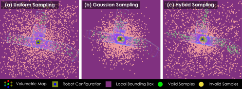{width="100%"}

::: caption
Indicative visualization of local sampling strategies within the bounded planning volume. Green points denote collision-free valid samples, yellow points indicate invalid samples rejected during collision checking, and the underlying point cloud represents the current volumetric map. (a) Uniform sampling distributes configurations evenly throughout the local bounding box, promoting broad spatial coverage. (b) Gaussian sampling concentrates samples around the current robot configuration, yielding dense local connectivity in constrained regions. (c) Hybrid sampling combines Uniform and Gaussian distributions to balance local maneuverability and global reach.
:::
::::

This subsection evaluates the two local graph construction strategies introduced in Section [4.1](#sec:planning_kernel){reference-type="ref" reference="sec:planning_kernel"}, namely the Basic incremental construction and the Batch construction methods. Both strategies operate on the same bounded planning volume $\mathbf{B}_L$, and differ only in how the collision-free vertices are added and connected during graph generation. To study their effect on reachable-space representation, we consider two representative environments: (i) a multi-room building layout consisting of six interconnected rooms arranged around a central corridor, and (ii) a multi-branch mine topology containing six tunnel branches connected at a junction. For each strategy, experiments are performed with eight different sample counts ranging from $100$ to $800$, each repeated over 20 trials. For every trial, we record the computation time required to build the local graph and the number of distinct reachable regions discovered by the graph (rooms or branches).

The curves in Fig. [4](#fig:graph_construction_rooms){reference-type="ref" reference="fig:graph_construction_rooms"} and Fig. [5](#fig:graph_construction_mine){reference-type="ref" reference="fig:graph_construction_mine"} report the computation time and the mean number of reachable regions covered by each strategy. The Batch method identifies multiple reachable regions more quickly, particularly at lower computation times, owing to its broader sampling of the planning volume prior to edge pruning. In contrast, the Basic strategy expands incrementally from the current robot configuration, requiring more time to reach distant regions but producing structured graph growth that closely follows feasible corridors. As the number of samples increases, both strategies converge to similar coverage once all reachable regions are discovered. The bottom visualizations in Figs. [4](#fig:graph_construction_rooms){reference-type="ref" reference="fig:graph_construction_rooms"} and [5](#fig:graph_construction_mine){reference-type="ref" reference="fig:graph_construction_mine"} show representative local graph instances generated by the two strategies within the same planning volume. These examples illustrate the qualitative difference between the methods: Basic construction produces corridor-following branches that reflect reachable paths, while Batch construction yields denser connectivity and faster region discovery in both multi-room and multi-branch environments.

:::: {#fig:graph_construction_rooms .figure latex-placement="h!"}
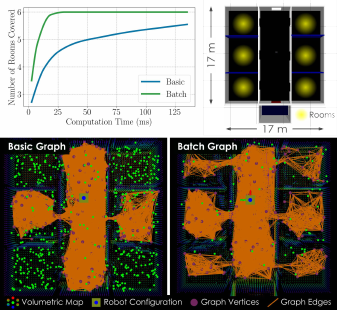{width="100%"}

::: caption
Comparison of local graph construction strategies in a multi-room building environment. Top-left: average number of rooms covered as a function of computation time for Basic and Batch graph construction. For each strategy, experiments were performed with eight different numbers of sampled points, each repeated over 20 trials. The plotted curves report the mean computation time and the mean number of reachable rooms covered by the local graph. Top-right: layout and dimensions of the evaluation environment. Bottom: representative local graph instances generated by the two strategies within the same planning volume.
:::
::::

:::: {#fig:graph_construction_mine .figure latex-placement="h!"}
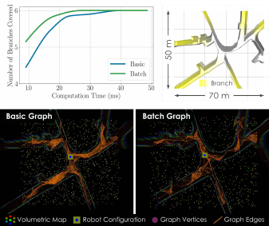{width="100%"}

::: caption
Comparison of local graph construction strategies in a multi-branch mine environment. Top-left: average number of branches covered as a function of computation time for Basic and Batch graph construction. For each strategy, experiments were performed with five different numbers of sampled points, each repeated over 20 trials. The plotted curves report the mean computation time and the mean number of reachable branches covered by the local graph. Top-right: layout and dimensions of the evaluation environment. Bottom: representative local graph instances generated by the two strategies within the same planning volume.
:::
::::

### **Camera Sensing Strategies**

:::: {#fig:camera_strategies .figure latex-placement="t"}
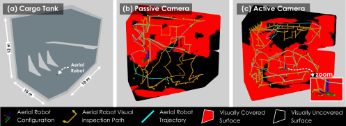{width="100%"}

::: caption
Passive vs. Active camera strategies for visual inspection in a cargo tank. (a) Cargo tank geometry and operating area for the aerial robot. (b) Representative inspection instance with a passive fixed-pitch camera. (c) Representative inspection instance with an actively actuated camera pitch. The passive camera achieves $62.16 \pm 9.01\%$ coverage, whereas the active camera achieves $88.01 \pm 5.36\%$ coverage.
:::
::::

To assess the impact of camera actuation on the [vi]{acronym-label="vi" acronym-form="singular+short"} behavior, we compare two sensing strategies in a cargo tank inspection scenario (Fig. [6](#fig:camera_strategies){reference-type="ref" reference="fig:camera_strategies"}a): (i) a Passive (body-fixed) Camera and (ii) an Active Camera with controllable pitch. Both strategies follow the inspection pipeline described in Section [4.3.2](#subsec:vi_behavior){reference-type="ref" reference="subsec:vi_behavior"} and differ only in the camera model used to instantiate $\mathrm{Vis}(\cdot)$ and the associated viewpoint orientation set $O_v$.

With a passive camera, the sensor is rigidly mounted with a fixed pitch. Consequently, each sampled position $\mathbf{p}_v$ admits an orientation set $O_v$ that varies only in yaw. This limits the visible surface per viewpoint and typically requires additional viewpoints to mitigate occlusions and unfavorable viewing angles (Fig. [6](#fig:camera_strategies){reference-type="ref" reference="fig:camera_strategies"}b). In contrast, the active camera allows pitch actuation, and $O_v$ includes feasible yaw--pitch pairs ${\psi,\vartheta_a}$ that satisfy the camera [fov]{acronym-label="fov" acronym-form="singular+short"} and range constraints. This expands the achievable visibility from the same spatial samples, allowing the greedy selection to cover larger portions of $S_I$ with fewer redundant viewpoints and yielding more effective inspection routes (Fig. [6](#fig:camera_strategies){reference-type="ref" reference="fig:camera_strategies"}c).

We performed $5$ independent trials per strategy using identical planning budgets and inspection settings. Coverage is reported as the fraction of the target surface observed along the executed inspection trajectory. The passive camera achieves $62.16 \pm 9.01\%$ coverage, whereas the active camera improves coverage to $88.01 \pm 5.36\%$. Fig. [6](#fig:camera_strategies){reference-type="ref" reference="fig:camera_strategies"}b-[6](#fig:camera_strategies){reference-type="ref" reference="fig:camera_strategies"}c shows representative trial instances for both strategies.

## Simulation Scenarios

We conduct a set of evaluations on aerial, ground, and underwater robots demonstrating the performance of [omniplanner]{acronym-label="omniplanner" acronym-form="singular+abbrv"} across morphologies, environments and tasks.

### **Aerial Robot: Target Reach Behavior**

:::: {#fig:aerial_robot_target_reach .figure latex-placement="t"}
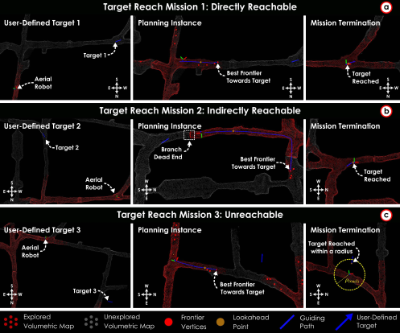{width="100%"}

::: caption
Target reach behavior for an aerial robot in a cave environment under three representative missions. Each row shows (left) the user-defined target location in the partially explored map, (middle) a planning instance highlighting the selected best frontier (red) and the global guiding path $\sigma_{\mathrm{guide}}$ (blue) with its lookahead point $\mathbf{p}_{\mathrm{lh}}$ (orange), and (right) the mission termination state. (a) Directly reachable target. (b) Indirectly reachable target requiring global frontier selection to avoid a dead-end branch. (c) Unreachable target: the planner advances toward the closest attainable region and terminates when no further progress is possible,a within the tolerance radius $\rho_{\mathrm{reach}}$.
:::
::::

We demonstrate the proposed [tr]{acronym-label="tr" acronym-form="singular+short"} behavior in a cave-like environment using three representative missions (Fig. [7](#fig:aerial_robot_target_reach){reference-type="ref" reference="fig:aerial_robot_target_reach"}). In all cases, a user-defined target position $\mathbf{p}_t$ is specified in initially unknown space. The planner first reasons on the global graph $\mathbb{G}_G$ to select a guiding point, either a vertex near $\mathbf{p}_t$ when it becomes reachable from the explored space, or an intermediate frontier vertex that best advances toward $\mathbf{p}_t$ when the target is still far from any explored region. A guiding path $\sigma_{\mathrm{guide}}$ is then computed on $\mathbb{G}_G$, and the local planning module generates collision-free motions by tracking a lookahead point $\mathbf{p}_{\mathrm{lh}}$ along $\sigma_{\mathrm{guide}}$.

Fig. [7](#fig:aerial_robot_target_reach){reference-type="ref" reference="fig:aerial_robot_target_reach"}a illustrates Mission 1, where the user-defined target lies outside the currently explored volume but is directly reachable in the sense that progress toward $\mathbf{p}_t$ does not require intermediate global repositioning (e.g., detours to alternative branches). The planner expands exploration along the guiding direction until the target becomes reachable and terminates once the robot arrives within the user-defined tolerance $\rho_{\mathrm{reach}}$. Fig. [7](#fig:aerial_robot_target_reach){reference-type="ref" reference="fig:aerial_robot_target_reach"}b shows Mission 2, where the target is indirectly reachable. Although the target lies in free space, continuing along the most direct exploratory route leads into a dead-end branch. The planner therefore navigates to a different frontier to resume progress toward $\mathbf{p}_t$, ultimately enabling target reachability. Fig. [7](#fig:aerial_robot_target_reach){reference-type="ref" reference="fig:aerial_robot_target_reach"}c shows Mission 3, where the target is unreachable from the robot's connected free space. In this case, the planner advances toward the closest attainable region and terminates when no further collision-free path can reduce the distance to $\mathbf{p}_t$, reporting completion once the robot reaches the closest achievable configuration within $\rho_{\mathrm{reach}}$ of the target.

### **Ground Robot: Exploration Behavior**

:::: {#fig:ground_robot_sim .figure latex-placement="t"}
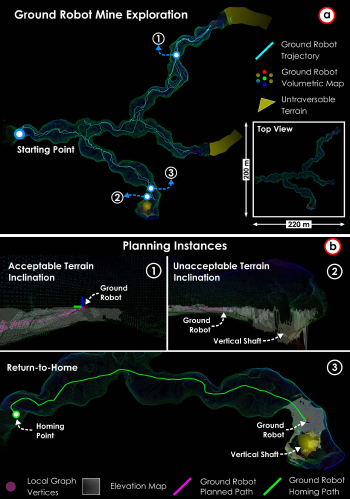{width="100%"}

::: caption
Simulation experiment for ground robot exploration in a large-scale mine tunnel network. (a) Full volumetric map reconstructed by the ground robot, showing the executed trajectory, untraversable terrain regions, and representative planning events during exploration. (b) Key planning instances illustrating terrain-aware sampling, where configurations on acceptable terrain inclinations are retained while samples on excessively steep or unsupported terrain are rejected based on elevation-map constraints. The figure also demonstrates return-to-home behavior, in which the planner computes a safe homing path through the explored mine structure.
:::
::::

We demonstrate ground robot exploration using [omniplanner]{acronym-label="omniplanner" acronym-form="singular+abbrv"} in a large-scale mine tunnel network environment (Fig. [8](#fig:ground_robot_sim){reference-type="ref" reference="fig:ground_robot_sim"}). The robot operates in initially unknown terrain while incrementally constructing both a volumetric map $\mathcal{M}$ and an elevation map $\mathcal{H}$ used to enforce terrain feasibility constraints. At each planning iteration, the local planning module generates collision-free motions that satisfy terrain inclination and embodiment constraints. In this mission, the robot traverses a total path length of $1260.9$ m over $736.8$ s.

Fig. [8](#fig:ground_robot_sim){reference-type="ref" reference="fig:ground_robot_sim"}a shows the full exploration trajectory in a mine environment spanning approximately $220 \times 200$ m. The robot incrementally maps the tunnel network while avoiding untraversable regions identified from elevation data. Representative planning events are highlighted to illustrate how the planner selects feasible frontier directions in branching tunnel structures. The resulting trajectory demonstrates sustained exploration across multiple tunnel segments without entering terrain that violates slope or support constraints.

Fig. [8](#fig:ground_robot_sim){reference-type="ref" reference="fig:ground_robot_sim"}b presents selected local planning instances illustrating terrain-aware sampling. Candidate configurations are projected onto the elevation map $\mathcal{H}$, and samples whose projected footprint violates the maximum allowable slope $\theta_{\max}$ or lacks terrain support are rejected. This mechanism prevents the planner from proposing motions across excessively steep or unsupported terrain while maintaining connectivity along feasible corridors.

Finally, Fig. [8](#fig:ground_robot_sim){reference-type="ref" reference="fig:ground_robot_sim"}c demonstrates global repositioning and return-to-home behavior. When the time budget runs out, the planner computes a safe homing path along $\mathbb{G}_G$, allowing the robot to reliably return to the start location through previously validated terrain.

### **Underwater Robot: Exploration-Inspection Behavior**

:::: {#fig:underwater_robot_sim .figure latex-placement="t"}
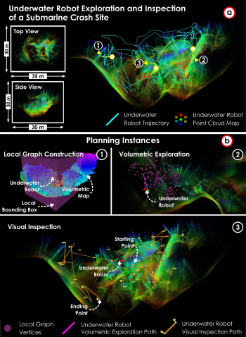{width="100%"}

::: caption
Simulation experiment for underwater robot exploration and inspection of a submarine crash site. (a) Point-cloud map reconstructed during the mission, showing the executed trajectory in a $35 \times 30 \times 30$ m environment. (b) Representative planning instances illustrating local graph construction within the bounded planning volume, where sampled configurations are constrained to remain close to observed structure. The figure also shows examples of the volumetric exploration and visual inspection behaviors, in which the planner selects informative paths to expand into previously unseen regions and inspection viewpoints along the structure to maximize surface coverage.
:::
::::

We demonstrate underwater exploration and inspection using [omniplanner]{acronym-label="omniplanner" acronym-form="singular+abbrv"} in a simulated submarine crash-site environment (Fig. [9](#fig:underwater_robot_sim){reference-type="ref" reference="fig:underwater_robot_sim"}). The robot operates in initially unknown space while incrementally constructing a volumetric map $\mathcal{M}$ used for collision avoidance and inspection planning. At each planning iteration, the local planning module generates collision-free motions subject to embodiment constraints, while the inspection objective selects informative viewpoints to maximize surface coverage. In this mission, the robot traveled a total path length of $973.9$ m over $1401.9$ s.

Fig. [9](#fig:underwater_robot_sim){reference-type="ref" reference="fig:underwater_robot_sim"}a shows the reconstructed point-cloud map of the crash site from top and side views, along with the executed trajectory. The planner incrementally explores the environment while maintaining proximity to observed structure to satisfy underwater sensing constraints. The resulting trajectory demonstrates sustained exploration across complex geometry without entering large open-water regions.

Fig. [9](#fig:underwater_robot_sim){reference-type="ref" reference="fig:underwater_robot_sim"}b presents representative planning instances. It first illustrates local graph construction within the bounded planning volume, where collision-free configurations are sampled near observed structure and connected through admissible edges to enable safe expansion in cluttered geometry. The same subfigure also shows example instances of the two behaviors considered in this scenario: (i) volumetric exploration, in which the planner selects informative paths to reduce the unseen regions, and (ii) visual inspection, in which the planner selects viewpoints along the structure to maximize surface coverage while respecting sensing range and safety constraints.

## Comparison with State-of-the-Art Planning Methods

This subsection compares the proposed planner with state-of-the-art exploration methods for aerial, ground, and underwater robots in simulation, using explored volume over time and aggregate efficiency metrics. Comparison with exploration planning is prioritized due to the prevalence of exploration planning, while in [omniplanner]{acronym-label="omniplanner" acronym-form="singular+abbrv"} the inspection behavior has the distinct feature of being able to immediately utilize the online result of exploration.

### **Simulation Setup**

We quantitatively compare the proposed framework against representative state-of-the-art exploration planners. The aerial and ground robot simulations are conducted in the Gazebo Classic [@gazbeoclassic; @2004gazebo] simulator, whereas the underwater robot simulations were done in the HoloOcean [@Potokar22icraholoocean; @romrell2025previewholoocean20] simulator. For each environment, all methods are initialized from the same robot configuration. A run terminates when the corresponding planner declares mission completion, which may occur due to (i) full environment exploration, (ii) planner failure or deadlock (e.g., getting stuck), or (iii) premature termination despite incomplete exploration.

We evaluate performance across multiple simulated environments with increasing structural complexity. For aerial robots, we consider two representative settings: (i) cave environments with single-branch and multi-branch topologies (Fig. [10](#fig:aerial_robot_comparisons){reference-type="ref" reference="fig:aerial_robot_comparisons"}), and (ii) a ballast water tank environment (Fig. [11](#fig:aerial_comp_bwt){reference-type="ref" reference="fig:aerial_comp_bwt"}). For ground robots, we evaluate in a mine environment consisting of multiple traversable corridors and junctions (Fig. [12](#fig:ground_robot_comparisons){reference-type="ref" reference="fig:ground_robot_comparisons"}). For the underwater robot, we conduct the simulations in a submarine crash site. The parameters used by [omniplanner]{acronym-label="omniplanner" acronym-form="singular+abbrv"} are listed in Table [\[tab:sim_comparative_params\]](#tab:sim_comparative_params){reference-type="ref" reference="tab:sim_comparative_params"}.

### **Baselines**

We include the following baselines to cover complementary exploration paradigms and to enable comparison against established methods for each embodiment.

- **ERRT** [@lindqvist2024tree]: A purely local exploration planner for aerial robots that expands a rapidly-exploring random tree in the robot's reachable space and selects motions based on local information gain. We include ERRT as a representative local-only baseline to assess performance in the absence of explicit global memory or repositioning.

- **GBPlanner 2.0** [@kulkarni2022autonomous]: A hierarchical graph-based exploration planner that couples a local volumetric exploration layer with a global graph used for frontier-based repositioning. We include GBPlanner 2.0 because it is a widely adopted local--global baseline for exploration in complex environments and is closely related in spirit to our graph-based formulation.

- **FUEL** [@zhou2021fuel]: A viewpoint-based aerial robot exploration method that samples candidate viewpoints, evaluates them using a gain--cost utility (expected newly observed volume versus travel cost), and replans online as the map is updated. We include FUEL to compare against a representative utility-driven viewpoint selection strategy that directly balances information gain and motion cost.

- **TARE** [@cao2021tare]: A ground-robot exploration framework that integrates local planning with global reasoning and revisit mechanisms to improve long-range progress in large environments. We include TARE as a strong ground-specific baseline that is widely used for autonomous exploration in mine-like settings.

- **DSVP** [@zhu2021dsvp]: A ground-robot exploration planner based on decision-space/viewpoint reasoning, designed to improve coverage and navigation efficiency in cluttered environments. We include DSVP to represent an alternative ground exploration formulation that differs from TARE in its planning abstraction and decision-making strategy.

- **NBVP** [@bircher2016receding]: A receding horizon next-best-view exploration planner. Although the original authors of this method showed results on aerial robots, prominent works have utilized this method for underwater robot exploration [@2020sureshuwnbvp] as well. Hence, this method is chosen as the baseline among the small set of underwater exploration planning literature.

::: table*
  **Parameter**                               **Aerial: Cave**      **Aerial: Confined**             **Ground: Mine**            **Underwater: Submarine Crash Site**
  ---------------------------------------- ----------------------- ----------------------- ------------------------------------ --------------------------------------
  $F^{\pazocal{D}}_H, F^{\pazocal{D}}_V$    $360^\circ, 90^\circ$   $100^\circ, 70^\circ$         $360^\circ, 90^\circ$                  $90^\circ, 90^\circ$
  $r_V$                                      $\SI{0.2}{\meter}$      $\SI{0.2}{\meter}$             $\SI{0.3}{\meter}$                    $\SI{0.4}{\meter}$
  $r_H$                                              \-                      \-                     $\SI{0.2}{\meter}$                            \-
  $d^x_h, d^y_h$                                     \-                      \-             $\SI{40}{\meter}, \SI{40}{\meter}$                    \-
  $\mathbf{B}_R$ (m)                          $[0.6, 0.6, 0.6]$       $[0.3, 0.3, 0.2]$             $[0.4, 0.4, 0.2]$                     $[1.0, 1.0, 1.0]$
  $h_0$                                              \-                      \-                    $\SI{0.75}{\meter}$                            \-
  Sampling distribution                           `Uniform`               `Uniform`                     `Uniform`                             `Uniform`
  Graph construction                               `Basic`                 `Batch`                       `Batch`                               `Basic`
  $n^{\pazocal{V}}_{\max}$                          $400$                   $500$                         $400$                                 $400$
  $n^{\pazocal{E}}_{\max}$                         $7000$                  $17000$                       $14000$                                $7000$
  $\mu_l$                                          $0.01$                  $0.05$                         $0.1$                                 $0.01$
  $\mu_d$                                          $0.05$                  $0.01$                         $0.15$                                $0.15$
:::

### **Aerial Robot Evaluation**

::: {#tab:aerial_robot_comparison_efficiency}
  **Metric**                **ERRT**    **GBPlanner 2.0**    **[omniplanner]{acronym-label="omniplanner" acronym-form="singular+abbrv"}**
  ----------------------- ------------ -------------------- ------------------------------------------------------------------------------
  AUC                      $100.00\%$       $111.55\%$                                   $\mathbf{146.90\%}$
                                           ($+11.55\%$)                                 ($\mathbf{+46.90\%}$)
  Exploration Time         $100.00\%$       $89.53\%$                                     $\mathbf{66.25\%}$
  (% of ERRT)                           ($10.47\%$ faster)                           ($\mathbf{33.75\%}$ faster)
  Computation Time (ms)     $1362.6$         $210.6$                                           $153.8$

  : Aerial robot evaluation in a large-scale environment: Performance relative to ERRT
:::

::: {#tab:aerial_robot_comparison_efficiency_fuel}
  **Metric**                **FUEL**    **[omniplanner]{acronym-label="omniplanner" acronym-form="singular+abbrv"}**
  ----------------------- ------------ ------------------------------------------------------------------------------
  AUC                      $100.00\%$                                    $131.00\%$
                                                                   ($\mathbf{+31.00\%}$)
  Exploration Time         $100.00\%$                                    $52.00\%$
  (% of FUEL)                                                   ($\mathbf{48.00\%}$ faster)
  Computation Time (ms)     $54.39$                                       $278.15$

  : Aerial robot evaluation in a confined environment: Performance relative to FUEL
:::

:::: {#fig:aerial_robot_comparisons .figure latex-placement="h"}
::: caption
Aerial robot exploration performance comparison of [omniplanner]{acronym-label="omniplanner" acronym-form="singular+abbrv"}, GBPlanner 2.0, and ERRT over 10 independent runs in cave environments of varying structural complexity. The explored volume is reported as a function of time. Solid lines denote the median performance across runs, while shaded regions indicate the 10th--90th percentile range. In (a), ERRT, as a purely local planner, becomes trapped and fails to continue exploration, whereas planners with global repositioning capabilities successfully escape local minima and achieve full cave exploration. In (b), a simplified single-branch cave environment that does not require global repositioning is evaluated to enable a fair comparison among all methods.
:::
::::

:::: {#fig:aerial_comp_bwt .figure latex-placement="t"}
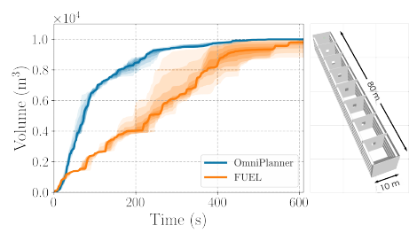{width="100%"}

::: caption
Aerial robot exploration performance comparison of [omniplanner]{acronym-label="omniplanner" acronym-form="singular+abbrv"} and FUEL over 5 independent runs in a custom-designed ballast water tank, comprising 8 compartments connected via manholes (openings). The explored volume is reported as a function of time. Solid lines denote the median performance across runs, while shaded regions indicate the 10th--90th percentile range.
:::
::::

**Large-scale Environment**. We compare [omniplanner]{acronym-label="omniplanner" acronym-form="singular+abbrv"} against GBPlanner 2.0 and ERRT to evaluate aerial exploration performance in large-scale cave environments. Experiments are conducted in two settings: (i) a multi-branch cave spanning approximately $520 \times 460$ m and (ii) a single-branch cave spanning approximately $450 \times 290$ m, as shown in Fig. [10](#fig:aerial_robot_comparisons){reference-type="ref" reference="fig:aerial_robot_comparisons"}. For each environment, all methods are evaluated over $10$ independent trials with identical initial conditions and planning budgets. In this study, a $3$D LiDAR sensor model with $[F^{\pazocal{D}}_H, F^{\pazocal{D}}_V] = [360^{\circ}, 90^{\circ}]$ and $d^{\pazocal{D}}_{\max} = 20\textrm{m}$ was used as the depth sensor.

Figure [10](#fig:aerial_robot_comparisons){reference-type="ref" reference="fig:aerial_robot_comparisons"} reports the explored volume as a function of time, where solid curves indicate the median performance across runs and shaded regions denote the $10^{\mathrm{th}}$--$90^{\mathrm{th}}$ percentile range. In the multi-branch cave (Fig. [10](#fig:aerial_robot_comparisons){reference-type="ref" reference="fig:aerial_robot_comparisons"}a), ERRT exhibits early stagnation after exhausting locally reachable informative viewpoints. In contrast, both GBPlanner 2.0 and [omniplanner]{acronym-label="omniplanner" acronym-form="singular+abbrv"} sustain exploration by leveraging global repositioning to escape local minima and relocate to informative frontier regions. Moreover, [omniplanner]{acronym-label="omniplanner" acronym-form="singular+abbrv"} achieves faster exploration progress, which we attribute to its execution design, that is, the local planning module is triggered proactively while the robot is still traversing the current path segment, reducing idle time and avoiding stop--plan--go behavior at path endpoints.

To enable a fair comparison with ERRT, which is purely local and does not perform global repositioning, we additionally evaluate the single-branch cave (Fig. [10](#fig:aerial_robot_comparisons){reference-type="ref" reference="fig:aerial_robot_comparisons"}b), where repositioning is not needed. We summarize exploration efficiency using the area under the explored-volume curve (AUC) and the total exploration time. Relative to ERRT, [omniplanner]{acronym-label="omniplanner" acronym-form="singular+abbrv"} increases AUC by $46.90\%$ and reduces the exploration time to $66.25\%$ of ERRT (i.e., $33.75\%$ faster). GBPlanner 2.0 increases AUC by $11.55\%$ and reduces the exploration time to $89.53\%$ of ERRT (i.e., $10.47\%$ faster) as shown in Table [1](#tab:aerial_robot_comparison_efficiency){reference-type="ref" reference="tab:aerial_robot_comparison_efficiency"}.

**Confined Environment**.We compare [omniplanner]{acronym-label="omniplanner" acronym-form="singular+abbrv"} with FUEL, a representative exploration planner for aerial robots, to evaluate performance in confined environments. Experiments are conducted in a custom-designed ballast water tank comprising eight compartments connected via narrow manholes (openings). FUEL is selected as the baseline method due to its high efficiency demonstrated in small-scale environments such as the ballast tank, as opposed to the other baselines (ERRT, GBPlanner2.0), which are geared more towards large-scale settings. The environment spans approximately $80 \times 10$ m and represents a constrained setting with limited maneuvering space and narrow inter-compartment passages. Both planners were deployed from the same starting points with identical planning budgets over five independent trials. In this study, a depth camera sensor model with $[F^{\pazocal{D}}_H, F^{\pazocal{D}}_V] = [100^{\circ}, 70^{\circ}]$ and $d^{\pazocal{D}}_{\max} = 7.5\textrm{m}$ was used as the depth sensor.

Figure [11](#fig:aerial_comp_bwt){reference-type="ref" reference="fig:aerial_comp_bwt"} reports the explored volume as a function of time, where solid lines indicate the median performance across runs and shaded regions denote the $10^{\mathrm{th}}$--$90^{\mathrm{th}}$ percentile range. We summarize exploration efficiency using the area under the explored-volume curve (AUC) and the time required to reach $90\%$ coverage. Relative to FUEL, [omniplanner]{acronym-label="omniplanner" acronym-form="singular+abbrv"} increases AUC by $31\%$ and reduces the time-to-coverage to $52\%$ of FUEL (i.e., $48\%$ faster) as shown in Table [2](#tab:aerial_robot_comparison_efficiency_fuel){reference-type="ref" reference="tab:aerial_robot_comparison_efficiency_fuel"}. Both planners ultimately achieve comparable final explored volume, however, the higher AUC and reduced time-to-coverage indicate that [omniplanner]{acronym-label="omniplanner" acronym-form="singular+abbrv"} explores the confined tank environment more efficiently.

### **Ground Robot Evaluation**

:::: {#fig:ground_robot_comparisons .figure latex-placement="t"}
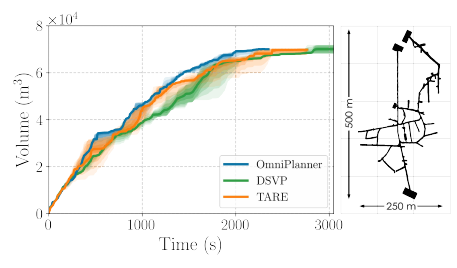{width="100%"}

::: caption
Ground robot exploration performance comparison of [omniplanner]{acronym-label="omniplanner" acronym-form="singular+abbrv"}, DSVP, and TARE over 5 independent runs in mine environment. The explored volume is reported as a function of time. Solid lines denote the median performance across runs, while shaded regions indicate the 10th--90th percentile range.
:::
::::

::: {#tab:ground_robot_comparison_efficiency}
  **Metric**                **DSVP**        **TARE**        **[omniplanner]{acronym-label="omniplanner" acronym-form="singular+abbrv"}**
  ----------------------- ------------ ------------------- ------------------------------------------------------------------------------
  AUC                      $100.00\%$      $100.00\%$                                        $100.00\%$
  Exploration Time         $100.00\%$       $92.02\%$                                    $\mathbf{77.22\%}$
  (% of DSVP)                           ($6.98\%$ faster)                           ($\mathbf{22.88\%}$ faster)
  Computation Time (ms)     $410.80$        $364.24$                                          $74.57$

  : Ground robot evaluation in a mine environment: Performance relative to DSVP
:::

We compare [omniplanner]{acronym-label="omniplanner" acronym-form="singular+abbrv"} against DSVP and TARE to evaluate ground robot exploration performance in a large-scale mine environment. The environment spans approximately $500 \times 250$ m, as shown in Fig. [12](#fig:ground_robot_comparisons){reference-type="ref" reference="fig:ground_robot_comparisons"}. All methods are evaluated over $5$ independent trials using identical initial conditions and planning budgets. In this study, a $3$D LiDAR sensor model with $[F^{\pazocal{D}}_H, F^{\pazocal{D}}_V] = [360^{\circ}, 90^{\circ}]$ and $d^{\pazocal{D}}_{\max} = 20\textrm{m}$ was used as the depth sensor. To enable fair comparison, the Gazebo Classic-based Autonomous Exploration Development Environment [@cao2022cmuenv] was used for this evaluation.

Figure [12](#fig:ground_robot_comparisons){reference-type="ref" reference="fig:ground_robot_comparisons"} reports the explored volume as a function of time, where solid curves indicate the median performance across trials and shaded regions denote the $10^{\mathrm{th}}$--$90^{\mathrm{th}}$ percentile range. Across runs, [omniplanner]{acronym-label="omniplanner" acronym-form="singular+abbrv"} exhibits faster exploration progress and reaches the explored-volume plateau earlier than the baselines, with reduced run-to-run variability. Using DSVP as the reference, [omniplanner]{acronym-label="omniplanner" acronym-form="singular+abbrv"} reduces the median exploration time by $22.88\%$, while TARE reduces it by $6.98\%$ as shown in Table [3](#tab:ground_robot_comparison_efficiency){reference-type="ref" reference="tab:ground_robot_comparison_efficiency"}. These results indicate that, when instantiated with terrain-consistent sampling and motion constraints, the proposed planning kernel provides an effective ground exploration strategy.

### **Underwater Robot Evaluation**

:::: {#fig:underwater_robot_comparisons .figure latex-placement="t"}
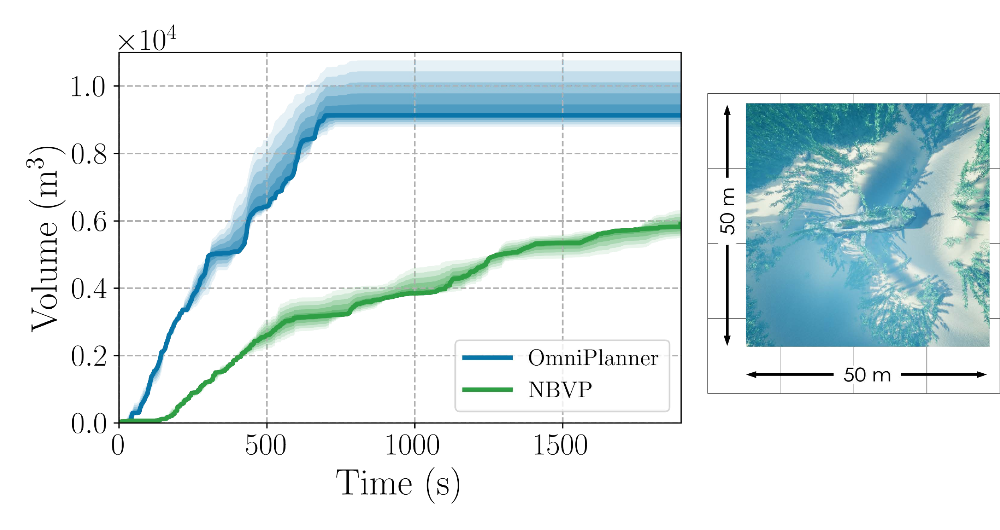{width="100%"}

::: caption
Underwater robot exploration performance comparison of [omniplanner]{acronym-label="omniplanner" acronym-form="singular+abbrv"}, and NBVP over 3 independent runs. The explored volume is reported as a function of time. Solid lines denote the median performance across runs, while shaded regions indicate the 10th--90th percentile range.
:::
::::

::: {#tab:underwater_robot_comparison_efficiency}
  **Metric**                **NBVP**    **[omniplanner]{acronym-label="omniplanner" acronym-form="singular+abbrv"}**
  ----------------------- ------------ ------------------------------------------------------------------------------
  AUC                      $100.00\%$                                    $155.56\%$
                                                                   ($\mathbf{+55.56\%}$)
  Exploration Time         $100.00\%$                                    $35.00\%$
  (% of NBVP)                                                   ($\mathbf{65.00\%}$ faster)
  Computation Time (ms)     $54.39$                                       $278.15$

  : Underwater robot evaluation in submarine crash site environment: Performance relative to NBVP
:::

We compare [omniplanner]{acronym-label="omniplanner" acronym-form="singular+short"} against NBVP, evaluating the underwater exploration performance in a simulation model of an underwater submarine crash site. The environment contains vegetation and a crashed submarine providing additional structures. The environment spans approximately $50 \times 50 \times 25$ m, as shown in Fig. [13](#fig:underwater_robot_comparisons){reference-type="ref" reference="fig:underwater_robot_comparisons"}. All methods are evaluated over 3 runs, starting at the same location. In this study, a depth camera with $[F^{\pazocal{D}}_H, F^{\pazocal{D}}_V] = [90^{\circ}, 90^{\circ}]$ and $d^{\pazocal{D}}_{\max} = 10\textrm{m}$ was used as the depth sensor.

Figure [13](#fig:underwater_robot_comparisons){reference-type="ref" reference="fig:underwater_robot_comparisons"} reports the explored volume as a function of time, where solid curves indicate the median performance across trials and shaded regions denote the $10^{\mathrm{th}}$--$90^{\mathrm{th}}$ percentile range. Due to the single tree built by NBVP, its exploration efficiency is lower than [omniplanner]{acronym-label="omniplanner" acronym-form="singular+abbrv"} and is unable to finish the exploration even after more than twice the amount of time compared to [omniplanner]{acronym-label="omniplanner" acronym-form="singular+abbrv"}. It is noted that to facilitate fair comparison, the constraint of planning paths close to surfaces is disabled for [omniplanner]{acronym-label="omniplanner" acronym-form="singular+abbrv"}. As shown in Table [4](#tab:underwater_robot_comparison_efficiency){reference-type="ref" reference="tab:underwater_robot_comparison_efficiency"}, [omniplanner]{acronym-label="omniplanner" acronym-form="singular+abbrv"} achieves $55.56\%$ higher AUC compared to NBVP while finishing the exploration $65\%$ faster.

# FIELD EXPERIMENTS {#sec:field_experiments}

To validate [omniplanner]{acronym-label="omniplanner" acronym-form="singular+abbrv"}'s ability to autonomously execute the proposed behaviors across heterogeneous robotic morphologies and operating domains, extensive field deployments were conducted on three types of robotic platforms: two aerial robots as described below, one ground robot, and one underwater [rov]{acronym-label="rov" acronym-form="singular+abbrv"}. Each platform performed fully autonomous missions in its respective environment using the same planning pipeline described in Section [4](#sec:proposed_approach){reference-type="ref" reference="sec:proposed_approach"}.

## Robotic Platforms

### **Aerial Robots**

The aerial experiments were conducted using two flying robots, called i) [ar1]{acronym-label="ar1" acronym-form="singular+short"} and ii) [ar2]{acronym-label="ar2" acronym-form="singular+short"}.

[ar1]{acronym-label="ar1" acronym-form="singular+abbrv"} is a resilient aerial robot designed for autonomous missions in confined and structurally complex environments. The platform is equipped with a collision-tolerant frame measuring $0.38 \times 0.38 \times 0.24$ m (L $\times$ W $\times$ H) and has a total mass of $1.45$ kg, providing an average flight endurance of approximately $10$ minutes. The onboard sensing and compute payload -- hereafter referred to as [am1]{acronym-label="am1" acronym-form="singular+short"} -- consists of a Khadas VIM4 single-board computer (SBC) featuring $4\times2.2$ GHz Cortex-A73 cores and $4\times2.0$ GHz Cortex-A53 cores as the compute unit. The sensing suite of [am1]{acronym-label="am1" acronym-form="singular+short"} includes a VectorNav VN-100 IMU, an Ouster OS0-64 LiDAR (FoV: $[360^\circ \times 90^\circ]$, maximum range: $\SI{100}{\meter}$), and a Blackfly S RGB camera (FoV: $[85^\circ \times 64^\circ]$, resolution: $720 \times 540$ px). The robot runs CompSLAM [@shehryar2020complementary], a multi-modal simultaneous localization and mapping (SLAM) framework that provides accurate odometry and dense mapping in real time. In addition, the proposed unified path planning pipeline is executed onboard to generate collision-free trajectories, which are subsequently tracked using the model predictive controller (MPC) proposed in [@kamel2017model].

[ar2]{acronym-label="ar2" acronym-form="singular+abbrv"} is a collision-tolerant aerial robot designed for autonomous operation in GPS-denied and confined environments. The platform features a lightweight protective frame measuring approximately $0.52 \times 0.52 \times 0.24$ m (L $\times$ W $\times$ H) and a total mass of $1.47$ kg excluding payload. [ar2]{acronym-label="ar2" acronym-form="singular+abbrv"}'s autonomy payload [am2]{acronym-label="am2" acronym-form="singular+short"} is equipped with an NVIDIA Jetson Orin NX as the compute module and a multi-modal sensing suite including a RoboSense Airy dome LiDAR (FoV: $[360^\circ \times 90^\circ]$, max range: $\SI{60}{\meter}$), multiple MIPI cameras, a pmd flexx2 time-of-flight (ToF) camera, a D3 Embedded FMCW radar, and a VectorNav VN-100 IMU. The robot interfaces with a Pixracer flight controller running PX4 firmware, which tracks position and velocity setpoints generated by the onboard autonomy stack. All state estimation, mapping, planning, and control processes are executed fully onboard, enabling robust autonomous flight in perceptually degraded environments.

### **Ground Robot**

The ground experiments were conducted using ANYmal [@anybotics_website], hereby called [gr1]{acronym-label="gr1" acronym-form="singular+short"}, a quadruped mobile robot with dimensions of $0.93 \times 0.53 \times 0.80$ m (L $\times$ W $\times$ H), a mass of $50$ kg, and a payload capacity of up to $10$ kg. The platform provides a continuous operational endurance of approximately $1$ hour.

To demonstrate the generality of the proposed approach across heterogeneous autonomy payloads, three different sensing and computation configurations were evaluated. The first configuration employs the [am2]{acronym-label="am2" acronym-form="singular+abbrv"} as in [ar2]{acronym-label="ar2" acronym-form="singular+abbrv"}, running a LiDAR--radar--inertial odometry pipeline based on [@nissov2024degradation; @nissov2024robust], which provides accurate and robust state estimation throughout the experiment. The second configuration uses [am3]{acronym-label="am3" acronym-form="singular+short"} payload, equipped with an NVIDIA Jetson Orin AGX. Its sensing suite includes an Intel RealSense D455 RGB-D camera, an Ouster OS0-64 LiDAR, and a VectorNav VN-100 IMU. For this configuration, a LiDAR--inertial odometry pipeline based on [@khedekar2025pg] was employed, similarly providing reliable odometry during deployment. Finally, the third configuration, [am4]{acronym-label="am4" acronym-form="singular+short"}, consists of the base sensing and compute suite of the ANYmal robot. In [am4]{acronym-label="am4" acronym-form="singular+short"}, the onboard computation is handled by two 8th-generation Intel Core i7 CPUs (6 cores each). The sensing suite of [am4]{acronym-label="am4" acronym-form="singular+short"} includes a Velodyne VLP-16 LiDAR (FoV: $[360^\circ \times 30^\circ]$, maximum range: $\SI{100}{\meter}$) and six Intel RealSense depth cameras distributed around the body and primarily used for perception.

In all configurations, the proposed planning method was executed entirely onboard the payload computer. The generated paths were transmitted to the robot and tracked using [gr1]{acronym-label="gr1" acronym-form="singular+abbrv"}'s internal path-tracking controller.

### **Marsupial Ground-Aerial Robot Team** {#susubsec:marsupial_robots}

The marsupial system comprises a heterogeneous ground--aerial robot team consisting of the [gr1]{acronym-label="gr1" acronym-form="singular+abbrv"} quadruped ground robot carrying the [am4]{acronym-label="am4" acronym-form="singular+abbrv"} payload and the [ar1]{acronym-label="ar1" acronym-form="singular+abbrv"} aerial robot carrying [am1]{acronym-label="am1" acronym-form="singular+abbrv"} payload operating in a marsupial configuration. The aerial robot is mechanically integrated with the ground platform via a dedicated deployment mechanism that enables secure transport during autonomous ground operation and reliable, controlled detachment. [ar1]{acronym-label="ar1" acronym-form="singular+abbrv"} is mounted on a rigid, custom-designed interface engineered to withstand ground robot motion while supporting autonomous deployment. Both robots maintain independent onboard computation, sensing, and state estimation pipelines, and communicate over a wireless network to enable bidirectional data exchange when connectivity is available. This design supports coordinated operation while allowing each robot to function autonomously after deployment, with all sensing, computation, and control processes executed fully onboard their respective autonomy modules.

### **Underwater Robot**

The underwater experiments were conducted using an [ur1]{acronym-label="ur1" acronym-form="singular+short"} that is a custom modification of the BlueROV2 Heavy Configuration platform [@BlueROV2Heavy]. [ur1]{acronym-label="ur1" acronym-form="singular+abbrv"} integrates the autonomy payload [am5]{acronym-label="am5" acronym-form="singular+short"} consisting of an Alphasense Core Research Development Kit comprising five monochrome Sony IMX-287 global-shutter cameras ($0.4$ MP) rigidly mounted on a common frame (FoV: $[126^\circ \times 92.4^\circ]$). The cameras are tightly synchronized with a Bosch BMI085 IMU using a mid-frame, exposure-compensated scheme, achieving sub-100 $\mu$s synchronization accuracy. An NVIDIA Orin AGX compute board is utilized to perform all the computations onboard the robot as part of [am5]{acronym-label="am5" acronym-form="singular+short"}, while the high-level commands and telemetry are supported by a tether cable. The robot state estimation is based on ReAqROVIO [@mohit2024refractive], a refraction-aware multi-camera visual-inertial odometry (VIO) system, providing real-time state estimation, alongside velocity aiding by proprioceptive method DeepVL [@mohit2025DeepVL], to enable robustness to lack of visual features in the underwater environment. Among the five cameras, two are used as the front-facing stereo camera pair, with stereo matching performed using [@lipson2021raft] for geometric 3D perception.\
In all robot cases, the proposed unified path-planning framework is also executed onboard the respective autonomy modules to generate motion plans for autonomous operation.

## Field Results

::::: table*
:::: threeparttable
+--------------------------------+------------------------------+------------------------------------+-----------------------------------------+----------------------------------+
| **Field Experiment**           | **Robot**                    | **Environment**                    | **Mission Behaviors**                   | **Mission Statistics**           |
+:==============================:+:======:+:======:+:==========:+:======:+:=======:+:======:+:======:+:===========:+:==========:+:============:+:===============:+:==============:+
| 2-4 (lr)5-8 (lr)9-11 (lr)12-13 | Aerial | Ground | Underwater | Indoor | Outdoor | Narrow | Wide   | Exploration | Inspection | Target Reach | Path Length (m) | Duration (min) |
+--------------------------------+--------+--------+------------+--------+---------+--------+--------+-------------+------------+--------------+-----------------+----------------+
| Underground Mine               |        |        |            |        |         |        |        |             |            |              | $$168.5$$       | $4.3$          |
|                                +--------+--------+------------+--------+---------+--------+--------+-------------+------------+--------------+-----------------+----------------+
|                                |        |        |            |        |         |        |        |             |            |              | $357.7$         | $19.5$         |
+--------------------------------+--------+--------+------------+--------+---------+--------+--------+-------------+------------+--------------+-----------------+----------------+
| University Campus              |        |        |            |        |         |        |        |             |            |              | $1228.6$        | $49.5$         |
+--------------------------------+--------+--------+------------+--------+---------+--------+--------+-------------+------------+--------------+-----------------+----------------+
| Forest                         |        |        |            |        |         |        |        |             |            |              | $91.3~|~310.8$  | $2.5~|~13.9$   |
|                                +--------+--------+------------+--------+---------+--------+--------+-------------+------------+--------------+-----------------+----------------+
|                                |        |        |            |        |         |        |        |             |            |              | $129.8$         | $5.1$          |
+--------------------------------+--------+--------+------------+--------+---------+--------+--------+-------------+------------+--------------+-----------------+----------------+
| Ballast Water Tank             |        |        |            |        |         |        |        |             |            |              | $45.1$          | $4.2$          |
+--------------------------------+--------+--------+------------+--------+---------+--------+--------+-------------+------------+--------------+-----------------+----------------+
| Submarine Bunker               |        |        |            |        |         |        |        |             |            |              | $238.9$         | $13.9$         |
|                                +--------+--------+------------+--------+---------+--------+--------+-------------+------------+--------------+-----------------+----------------+
|                                |        |        |            |        |         |        |        |             |            |              | $156.3$         | $8.2$          |
+--------------------------------+--------+--------+------------+--------+---------+--------+--------+-------------+------------+--------------+-----------------+----------------+

::: tablenotes
Values are reported as $\mathfrak{a}~|~\mathfrak{b}$, where $\mathfrak{a}$ corresponds to the aerial robot and $\mathfrak{b}$ corresponds to the ground robot.
:::
::::

[]{#tab:field_experiments label="tab:field_experiments"}
:::::

To provide a structured overview of the conducted field deployments, Table [\[tab:field_experiments\]](#tab:field_experiments){reference-type="ref" reference="tab:field_experiments"} summarizes all field experiments performed across three robotic platforms and operating domains. The table reports, for each field environment, the deployed robot platform, key environment characteristics, executed mission behaviors, and associated mission statistics. The table serves as a reference for the detailed qualitative and quantitative results presented in the following subsections.

### **Underground Mine**

The (abandoned) underground mine environment consists of a narrow, tunnel-like structure characterized by constrained cross-sections, uneven surfaces, and multiple branching corridors. The geometry includes long, winding passages with occasional junctions that lead to side branches of varying lengths and visibility. The environment presents limited line-of-sight, visually-degraded conditions, and restricted maneuvering space.

:::: {#fig:mine_exporation_aerial .figure latex-placement="t"}
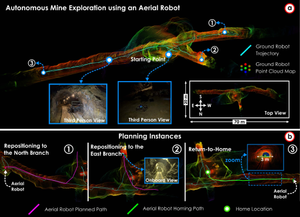{width="100%"}

::: caption
Field results from the [ar2]{acronym-label="ar2" acronym-form="singular+abbrv"} autonomous aerial robot exploration mission conducted in an underground mine. (a) Full point cloud map generated by the aerial robot, overlaid with the executed robot trajectory and annotated exploration waypoints. Representative third-person views acquired during the mission are shown for reference, along with a top-down view of the reconstructed environment. (b) Key planning instances during the mission, illustrating global repositioning toward unexplored branches and the return-to-home behavior. The planned exploration paths (magenta), homing trajectory (green), and home location are highlighted.
:::
::::

**Aerial Robot Mission**. For the first mission conducted in the underground mine, we deployed the [ar2]{acronym-label="ar2" acronym-form="singular+abbrv"} aerial robot to explore the environment starting from a designated location inside the mine. The mission was initialized at the starting point indicated in Fig. [14](#fig:mine_exporation_aerial){reference-type="ref" reference="fig:mine_exporation_aerial"}(a), from which the robot began volumetric exploration using the proposed planning framework. At each planning iteration, the planner selected informative exploration paths while accounting for collision constraints imposed by the narrow tunnel geometry. As the exploration progressed, the aerial robot encountered multiple branching corridors. When local exploration within a branch was completed, the global planner triggered repositioning maneuvers to guide the robot toward unexplored branches, as illustrated in Fig. [14](#fig:mine_exporation_aerial){reference-type="ref" reference="fig:mine_exporation_aerial"}(b.1)-(b.2). These repositioning actions enabled systematic coverage of the environment while avoiding previously explored regions. Upon completion of the exploration task, the return-to-home was triggered, and the planner generated a homing path directing the robot back to the starting location, as shown in Fig. [14](#fig:mine_exporation_aerial){reference-type="ref" reference="fig:mine_exporation_aerial"}(b.3). The full three-dimensional map generated during the mission, along with the executed aerial trajectory, is shown in Fig. [14](#fig:mine_exporation_aerial){reference-type="ref" reference="fig:mine_exporation_aerial"}(a). The robot traversed a total path length of $168.5$ m over a mission duration of $4.3$ min.

:::: {#fig:mine_exporation_ground .figure latex-placement="t"}
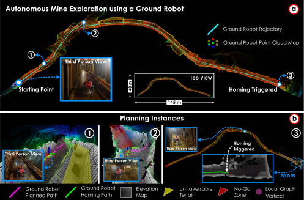{width="100%"}

::: caption
Field results from an autonomous exploration mission conducted in a mine using the [gr1]{acronym-label="gr1" acronym-form="singular+abbrv"} ground robot with the [am2]{acronym-label="am2" acronym-form="singular+abbrv"} payload. (a) Full map generated by the ground platform, alongside its executed trajectory. (b) Planning instances of the local and global planners, including local planning that exploits the elevation map to avoid untraversable and blocked regions, as well as global repositioning toward the home location.
:::
::::

**Ground Robot Mission**. For the second mission conducted in the underground mine, we deployed [gr1]{acronym-label="gr1" acronym-form="singular+abbrv"} with the [am2]{acronym-label="am2" acronym-form="singular+abbrv"} payload. The mission was initiated at the mine entrance, where the robot engaged its volumetric exploration mode. At each planning iteration, the planner selected the most informative path (pink) while accounting for constraints derived from the elevation map and predefined no-go zones. Consequently, the local planning graph did not expand into these restricted areas, as illustrated in Fig. [15](#fig:mine_exporation_ground){reference-type="ref" reference="fig:mine_exporation_ground"}(b.1)-(b.2). Upon completion of the exploration task, the return-to-home functionality was triggered, and the global planner generated a homing path (green) for the robot, as shown in Fig. [15](#fig:mine_exporation_ground){reference-type="ref" reference="fig:mine_exporation_ground"}(b.3). The complete map generated by the ground platform, alongside its executed trajectory (cyan), is presented in Fig. [15](#fig:mine_exporation_ground){reference-type="ref" reference="fig:mine_exporation_ground"}(a). The robot traversed a total path length of $357.7$ m over a mission duration of $19.5$ min.

### **University Campus**

:::: {#fig:campus_exporation .figure latex-placement="t"}
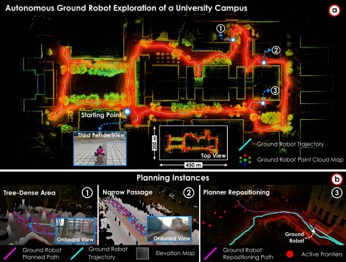{width="100%"}

::: caption
Field results from an autonomous exploration mission conducted on a university campus using the [gr1]{acronym-label="gr1" acronym-form="singular+abbrv"} ground robot with the sensing and compute configuration of the [am3]{acronym-label="am3" acronym-form="singular+abbrv"} payload. (a) Full map generated by the ground platform, alongside its executed trajectory. (b) Planning instances of the local and global planners, including local planning that exploits the elevation map in tree-dense areas and narrow passages, as well as global repositioning toward unexplored regions via frontier selection.
:::
::::

This field experiment was conducted in a large-scale outdoor academic environment including long corridors formed by buildings, narrow pedestrian pathways between structures, and tree-dense regions.

**Ground Robot Mission**. To showcase the realistic and challenging setting for a long-range autonomous exploration, the [gr1]{acronym-label="gr1" acronym-form="singular+abbrv"} robot was deployed with the sensing and compute payload [am3]{acronym-label="am3" acronym-form="singular+short"}. The platform initiated exploration from a designated starting location and incrementally explored the environment by executing the planned paths generated by the proposed planner. Fig. [16](#fig:campus_exporation){reference-type="ref" reference="fig:campus_exporation"}(b) highlights three representative planning instances encountered during the mission. Fig. [16](#fig:campus_exporation){reference-type="ref" reference="fig:campus_exporation"}(b.1)-(b.2) demonstrate the planner's ability to operate in environments with limited clearance and dense obstacle distributions, successfully generating collision-free paths in both tree-dense regions and narrow passages. Fig. [16](#fig:campus_exporation){reference-type="ref" reference="fig:campus_exporation"}(b.3) illustrates a planner's repositioning path that enables the robot to escape a local deadlock and reach unexplored regions. The complete point cloud map produced during the experiment, alongside the executed ground robot trajectory (cyan), is shown in Fig. [16](#fig:campus_exporation){reference-type="ref" reference="fig:campus_exporation"}(a). The robot traversed a total path length of $1228.6$ m over a mission duration of $49.5$ min.

### **Forest**

:::: {#fig:forest_exporation .figure latex-placement="t"}
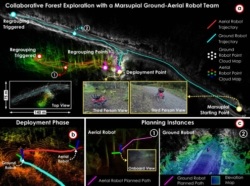{width="100%"}

::: caption
Field results from a collaborative exploration of the marsupial ground-aerial robot team ([ar1]{acronym-label="ar1" acronym-form="singular+abbrv"} with [am1]{acronym-label="am1" acronym-form="singular+abbrv"} payload and [gr1]{acronym-label="gr1" acronym-form="singular+short"} with [am4]{acronym-label="am4" acronym-form="singular+short"} payload) in a forest environment. (a) Combined map generated by both robots, highlighting the start, deployment, and regrouping locations. The aerial robot is deployed when the ground robot cannot continue its mission due to untraversable terrain. (b) Deployment phase of the aerial robot. (c) Planning instances for both robots.
:::
::::

:::: {#fig:forest_target .figure latex-placement="t"}
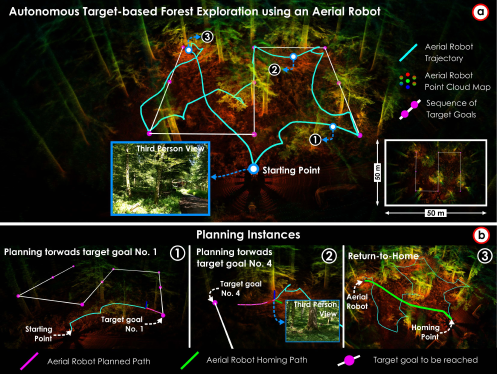{width="100%"}

::: caption
Field results from an autonomous target-based exploration mission conducted in a forest environment using the [ar1]{acronym-label="ar1" acronym-form="singular+abbrv"} aerial robot. (a) Full point cloud map reconstructed during the mission, overlaid with the executed aerial trajectory and the sequence of target goals. The starting location, intermediate planning instances, and a representative third-person view are indicated, together with a top-down view of the explored area. (b) Key planning instances illustrating motion planning toward successive target goals and the return-to-home behavior. Planned exploration paths (magenta), homing trajectory (green), and target goals are highlighted.
:::
::::

Two field experiments were conducted in forest environments to evaluate the proposed planning framework under different operational settings. Although both experiments were performed in outdoor forested areas, they were carried out at distinct locations with different terrain and vegetation characteristics.

**Marsupial Ground--Aerial Robot Team Mission**. The first experiment was conducted in a forest environment featuring uneven terrain and dense vegetation. To address these challenges, a marsupial ground--aerial robot team was deployed, with the aerial robot initially carried by the ground platform. The mission was initiated from a predefined starting location, after which the aerial robot was deployed to assist exploration when the ground robot encountered untraversable terrain. While the ground robot continued exploration along accessible trails, the aerial robot explored regions beyond the reach of the ground platform. Fig. [17](#fig:forest_exporation){reference-type="ref" reference="fig:forest_exporation"}(a) illustrates the resulting collaborative exploration outcome, showing the trajectories executed by the ground robot (cyan) and the aerial robot (red), along with the fused point cloud map generated during the mission. Regrouping events were initiated when the remaining time budget became limited, allowing the robots to reestablish coordination. The aerial robot deployment process is shown in Fig. [17](#fig:forest_exporation){reference-type="ref" reference="fig:forest_exporation"}(b), while representative planning instances for both robots are presented in Fig. [17](#fig:forest_exporation){reference-type="ref" reference="fig:forest_exporation"}(c.1)-(c.2), highlighting the planners' ability to generate collision-free and terrain-aware paths in cluttered forest conditions. The [gr1]{acronym-label="gr1" acronym-form="singular+abbrv"} and [ar1]{acronym-label="ar1" acronym-form="singular+abbrv"} robots traversed total path lengths of $310.8$ m and $91.3$ m, respectively, over mission durations of $13.9$ min and $2.5$ min.

**Aerial Robot Mission**. The second experiment was conducted in a different forest environment characterized by tall trees, dense canopy coverage, and cluttered three-dimensional vegetation structures. This setting emphasizes aerial navigation challenges such as limited free space, reduced visibility, and complex obstacle distributions. In this experiment, the [ar1]{acronym-label="ar1" acronym-form="singular+abbrv"} aerial robot was deployed, and the [tr]{acronym-label="tr" acronym-form="singular+short"} behavior was tested. The mission was initialized at a predefined starting location, from which a sequence of spatial target goals was specified within the forested area. At each planning iteration, the planner generated collision-free trajectories toward the current target goal while accounting for surrounding vegetation and previously mapped obstacles. Upon reaching a target, the planner transitioned to the next goal in the sequence, enabling structured coverage of the environment, as shown in Fig. [18](#fig:forest_target){reference-type="ref" reference="fig:forest_target"}(a). Key planning instances are illustrated in Fig. [18](#fig:forest_target){reference-type="ref" reference="fig:forest_target"}(b.1)-(b.2), demonstrating the planner's ability to adaptively generate feasible paths in densely cluttered environments. After completing the target sequence, the return-to-home behavior was triggered, and the planner generated a homing trajectory guiding the aerial robot back to the starting location, as depicted in Fig. [18](#fig:forest_target){reference-type="ref" reference="fig:forest_target"}(b.3). The robot traversed a total path length of $129.8$ m over a mission duration of $5.1$ min.

### **Ballast Water Tank**

:::: {#fig:btw_exporation_inspection .figure latex-placement="t"}
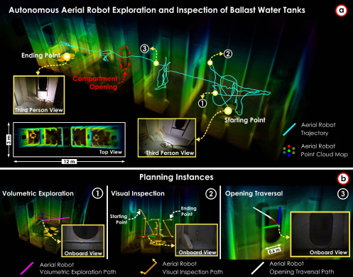{width="100%"}

::: caption
Field results from an autonomous exploration-inspection mission of a ballast water tank using the [ar1]{acronym-label="ar1" acronym-form="singular+abbrv"} aerial robot. (a) Final map generated by the aerial platform, alongside its executed trajectory. (b) Planning instances of the behaviors executed during the mission, including volumetric exploration using LiDAR point clouds, visual inspection using a camera sensor, and opening traversal based on LiDAR point cloud opening detection.
:::
::::

This field experiment was conducted in a confined industrial environment consisting of interconnected ballast water tank compartments with narrow passages and complex internal geometry.

**Aerial Robot Mission**. To evaluate both the proposed exploration and inspection behaviors under these conditions, the [ar1]{acronym-label="ar1" acronym-form="singular+abbrv"} aerial robot was deployed to perform a fully autonomous mission inside the tank structure. The mission began from a designated entry point, after which the robot autonomously explored the interior volume while incrementally building a three-dimensional map of the environment, followed by visual inspection of the mapped surfaces. Fig. [19](#fig:btw_exporation_inspection){reference-type="ref" reference="fig:btw_exporation_inspection"}(a) presents the final point cloud map generated during the mission together with the executed aerial robot trajectory. The robot navigated through multiple compartments and traversed a narrow opening to access adjacent sections of the tank before reaching the designated end point. Fig. [19](#fig:btw_exporation_inspection){reference-type="ref" reference="fig:btw_exporation_inspection"}(b) illustrates representative planning instances corresponding to different autonomous behaviors executed during the mission. These include volumetric exploration for map coverage, visual inspection for close-range sensing of structural elements, and opening traversal for navigating through constrained passages. The robot traversed a total path length of $45.1$ m over a mission duration of $4.2$ min.

### **Submarine Bunker**

:::: {#fig:bunker_exploration_inspection .figure latex-placement="t"}
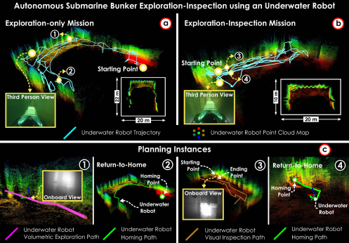{width="100%"}

::: caption
Field results from two autonomous missions conducted in a submarine bunker environment (dry dock) using the [ur1]{acronym-label="ur1" acronym-form="singular+abbrv"} underwater robot with [am5]{acronym-label="am5" acronym-form="singular+abbrv"} payload: an exploration-only mission and an exploration-inspection mission. (a) Exploration-only mission showing the reconstructed point cloud map and executed trajectory from the deployment location. (b) Exploration-inspection mission, in which VE behavior is followed by the [vi]{acronym-label="vi" acronym-form="singular+abbrv"} behavior of selected structural regions. (c) Representative planning instances: (1)-(2) correspond to the exploration-only mission and illustrate volumetric exploration and return-to-home paths, while (3)-(4) correspond to the exploration-inspection mission and show visual inspection path generation followed by the homing path.
:::
::::

The experiments were conducted in a submarine bunker environment. The water exhibited low visibility, resulting in perceptually degraded conditions that challenge both state estimation and collision-aware planning.

**Underwater Robot Mission**. Two missions were conducted using the [ur1]{acronym-label="ur1" acronym-form="singular+abbrv"} underwater robot to evaluate the proposed framework under different operational objectives: an exploration-only mission and an exploration--inspection mission. In both cases, the robot was deployed from a predefined starting location and initialized in VE mode. At each planning iteration, the local planning graph was constructed by sampling vertices in close proximity to the surrounding structure, biasing exploration toward the infrastructure of interest and preventing expansion into open-water regions, while still enforcing collision constraints.

In the exploration-only mission, the robot autonomously explored the environment and generated a three-dimensional point cloud map, as shown in Fig. [20](#fig:bunker_exploration_inspection){reference-type="ref" reference="fig:bunker_exploration_inspection"}(a). After completing the exploration task, the return-to-home was triggered, and the planner generated a homing path guiding the robot back to the deployment location. Representative planning instances for this mission are shown in Fig. [20](#fig:bunker_exploration_inspection){reference-type="ref" reference="fig:bunker_exploration_inspection"}(c.1)-(c.2). The robot traversed a total path length of $238.9$ m over a mission duration of $13.9$ min.

In the exploration--inspection mission, volumetric exploration was followed by visual inspection of the mapped surface. The planner generated an inspection path to obtain detailed observations of structural elements, as shown in Fig. [20](#fig:bunker_exploration_inspection){reference-type="ref" reference="fig:bunker_exploration_inspection"}(b). Since the VE behavior in this mission was similar to that of the exploration-only mission, only the VI behavior is illustrated. After completing the inspection task, the robot autonomously returned to the starting location. Representative planning instances for this mission are shown in Fig. [20](#fig:bunker_exploration_inspection){reference-type="ref" reference="fig:bunker_exploration_inspection"}(c.3)-(c.4). The robot traversed a total path length of $156.3$ m over a mission duration of $8.2$ min.

## Summary

We conducted eight field deployments in diverse and challenging environments to evaluate the robustness and generality of the proposed unified planning framework across robot morphologies. In all deployments, the method was executed fully onboard and operated autonomously without human intervention throughout mission execution. Across these scenarios, the planner consistently demonstrated robust performance in environments characterized by limited clearance, dense obstacles, uneven terrain, and confined spaces. The results indicate effective long-range exploration, coordinated multi-robot operation with regrouping events, and reliable execution of volumetric exploration, visual inspection, and target reach behaviors. Collectively, these deployments confirm the field readiness and broad applicability of the proposed framework across heterogeneous platforms and operational domains.

# CONCLUSION {#sec:conclusion}

This paper presented [omniplanner]{acronym-label="omniplanner" acronym-form="singular+abbrv"}, a unified planning framework built around a domain-agnostic planning kernel for autonomous exploration, inspection, and target reach across heterogeneous robotic platforms. By decoupling core planning from embodiment-specific constraints through adaptation layers, the same planning structure can be applied across aerial, ground, and underwater robots.

Simulation and field results showed that the proposed framework achieves strong performance across diverse environments and tasks, while maintaining fully onboard autonomous operation in challenging real-world deployments. The results support the effectiveness and practical generality of the proposed unified planning approach across diverse robot morphologies.

Future work will focus on extending [omniplanner]{acronym-label="omniplanner" acronym-form="singular+abbrv"} to an increased diversity of morphologies, including non-holonomic platforms (e.g., fixed-wing aerial vehicles, car-like robots, and autonomous underwater vehicles), broadening the applicability of the framework to a wider range of systems. Similarly, future work will also focus on correlating perception uncertainty with the sampling of informative viewpoints.

# NOTATIONS {#notations .unnumbered}
