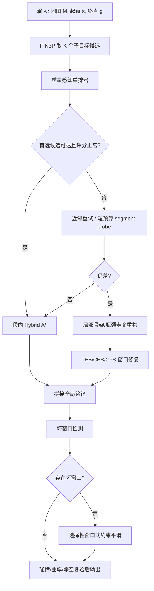

# 子目标分解加速路径规划后的路径质量退化修复研究

## Executive summary

基于你指定的 `unstun/forestnav` 仓库与原始论文/官方资料，我的核心判断是：**最划算的修复路线不是直接把 F-N3P 推翻重来，而是在现有“子目标分解 + 段内 Hybrid A*”框架上，加一层质量感知的候选重排，再对少数坏窗口做局部连续优化**。你的仓库其实已经具备这条路线的大半基础设施：`k_neighbors`、F1/F2/F3 fallback、逐步推理记录、路径膨胀率指标、Voronoi/瓶颈 waypoint 基线、真实地图资产、训练数据集和评测框架都已经在仓库里了。citeturn15view0turn15view2turn15view3turn23view6turn22view0turn21view0

若只做**质量感知多候选重排**，我估计你当前相对 vanilla Hybrid A* 的路径膨胀可从 **8% / 25%** 压到约 **5.5%–7.0% / 15%–21%**；若再叠加**选择性窗口式约束平滑器**，更现实的区间是 **3%–5% / 8%–14%**；再把**局部骨架/瓶颈安全走廊修复**只用于顽固坏例，比较有希望压到 **2%–4% / 5%–10%**。这些区间不是原始论文直接报告的数据，而是结合 Dolgov 二阶段 Hybrid A*+非线性优化、CES 的“数百毫秒”平滑、TEB 的实时稀疏优化、Nav2 Constrained Smoother 的 Reeds-Shepp/曲率约束能力，以及你仓库现有接口和预算参数做出的工程外推。citeturn26view0turn36view0turn33view3turn33view4turn37view2turn17view6

从适配性上看，你的场景是 **Ackermann、小转弯半径、森林越野、密集不规则障碍、50–200 m、≥1 Hz、基线 Hybrid A***。这使得很多“全局大优化器”并不适合直接全路径替代，而更适合做**坏片段修复器**；相反，多候选重排、局部安全走廊、局部 Ceres/CES/TEB 类优化器非常对路，因为它们能把计算集中在少数高损失片段上，而不是吞掉你通过子目标分解赚到的全部加速收益。citeturn33view4turn33view5turn37view2turn29search0turn26view0

## unstun/forestnav 仓库拆解

你要求优先从已启用连接器对应的 GitHub 仓库开始；在本次范围内，重点仓库是 `unstun/forestnav`。该仓库当前是公开仓库，主页显示 **Issues 为 0、Pull requests 为 0**，因此没有可利用的公共 issue 讨论线索；但代码、设计文档、测试、数据集与真实地图资产本身已经足够给出很强的工程判断。citeturn18view0

仓库中与“子目标分解加速后路径质量修复”最相关的，不是单一算法文件，而是一个完整实验体系：`design.md` 明确了 F-N3P 的目标、标签规则、fallback 梯级和评测口径；`inference.py` 已经把多近邻、段内规划统计和 fallback 触发点暴露出来；`main_evaluation.py` 已经把 `f_n3p_knn`、`vanilla_ha`、`n3p_k1`、`voronoi_waypoint`、`bottleneck_waypoint`、`md_dqn`、`mlp` 放进同一评测框架；`tests` 里还有 Voronoi/瓶颈 waypoint 的现成单测，可以直接拿来做局部修复模块的回归测试。citeturn12view4turn15view0turn23view6turn18view0turn19view0turn19view2

| 仓库资产 | 已实现内容 | 对你问题的直接价值 | 我建议的复用方式 |
|---|---|---|---|
| `2_experiment/v9_forest_n3p/design.md` | 设计文档明确：逐步预测连续 SE(2) 子目标；主模型 KNN(k=1)，MLP 只做 ablation；`L_max=8.0 m`、`L_min=1.0 m`、`N_seg=2000`、`R_max=10 m`、`n_ray=32`；在线流程包含 F1/F2/F3 fallback；评测明确记录路径膨胀率、平均绝对曲率、方向切换、净空、fallback 触发率。citeturn17view0turn17view1turn17view5turn17view6turn17view9turn17view10 | 这是最宝贵的“现成接口说明书”。它已经把你真正要优化的目标从“找一条路”收敛成“**在保持 F-N3P 结构不变的前提下，降低拼接后膨胀率与曲率劣化**”。 | 直接在该文档定义的 F1/F2/F3 之间插入 **F1.5 质量感知重排** 与 **F2.5 局部修复优化器**。 |
| `2_experiment/forest_n3p/inference.py` | 暴露了 `InferenceConfig`、`k_neighbors`、`turning_radius_m`、`wheelbase_m`、每一步的 `planner_time_s`、`planner_expansions`、`distance_to_goal_m`，并在段失败时按 `enable_f2` / `enable_f3` 触发 fallback。citeturn10view1turn15view0turn15view2turn15view3 | 这意味着你不用重写主循环，就能把“候选打分/局部修复/坏窗口检测”挂进去。 | 新增 `score_candidate()`、`detect_bad_window()`、`repair_window()` 三个钩子，最小改动接入。 |
| `2_experiment/forest_n3p/main_evaluation.py` | 官方方法集合里已包含 `f_n3p_knn`、`vanilla_ha`、`n3p_k1`、`voronoi_waypoint`、`bottleneck_waypoint`、`md_dqn` 和 `mlp`，并把 `reference_path_length_m`、难度桶、距离桶写入统一评测记录。citeturn23view6turn16view6 | 你已经有 A/B test harness，可以非常快地验证“修复模块到底有没有值”。 | 加两个新方法名：`f_n3p_rerank`、`f_n3p_rerank_smooth`，直接走现有评测管线。 |
| `tests/test_voronoi_waypoint.py` 与 `tests/test_bottleneck_waypoint.py` | 已有 `build_skeleton_graph`、`place_waypoints`、`place_bottleneck_waypoints`、`plan_voronoi_waypoint`、`plan_bottleneck_waypoint` 的单测；瓶颈配置里出现 `min_bottleneck_separation_m`、`min_bottleneck_prominence_m`、`max_segment_arc_m`。citeturn18view0turn19view0 | 这两套模块非常适合做“坏窗口”的**局部安全走廊/替代子目标生成器**。 | 不要把它们当全局 planner；只在坏窗口或 F1 全失败时调用。 |
| `datasets/t08_training_dataset` | 数据集报告显示：**2000 张地图、80000 个查询、100531 个样本、41 维特征、3 维标签、标签失败率 6.8%**；教师路径成功率 69.5%，并分 Easy / Complex / Extreme 统计。citeturn22view0 | 这足够支撑一个轻量的**质量预测器/坏片段分类器/候选重排器**，不需要从零采数据。 | 用现成特征先训练一个 `quality_head`，预测“该候选将导致的 segment inflation risk”。 |
| `assets/realmaps` | 已有两个真实地图资产：`dqn_realmap_a` 与 `willow_garage_0p10`，README 明确它们用于真实地图评估输入。citeturn21view0 | 这正好可用于检验“程序化森林学到的修复策略”会不会在真实栅格上失效。 | 把所有 top-3 方案都在这两张图上补做 OOD 复测。 |
| `maps/forest.py` 与 `maps/pgm.py` | 仓库内同时有程序化森林地图生成与 PGM 地图读入模块。citeturn22view1 | 你既能做大规模统计，也能做真实地图复现。 | 训练/调参在程序化森林，最终验收看 PGM 真实图。 |

从仓库可见，F-N3P 当前的学术表达已经非常清楚：**学习模块负责长程分解，Hybrid A* 负责短段可行性**；论文口径里也已经承认要比较路径长度膨胀率、曲率、fallback 触发率与 OOD 表现，而不是只比扩展数和时间。换句话说，你现在缺的不是“再发明一个 planner”，而是“**把分解误差转化为局部可修复误差**”的工程层。citeturn12view4turn17view3turn17view6

## 方法图谱与同类比较

先给一个结论性的分类：对“子目标分解后路径质量退化”而言，学术界和工业界可用的方法基本可以归入四个家族。第一类是在**子目标选择阶段**做质量感知的多候选重排；第二类是在**拼接后**做几何 shortcut、样条或曲率连续化；第三类是把拼接路径作为 warm start，送进**连续优化器/安全走廊优化器**；第四类是用**学习型先验或生成模型**给优化器热启动，或者做数据驱动修复。就你的场景而言，前三类是主线，第四类更像中期研发储备。citeturn33view5turn26view0turn36view0turn33view3turn36view1turn33view6turn34search5

### 质量感知子目标重排

这类方法不是在最终路径上“补锅”，而是在**每一步 subgoal 决策时就避免制造坏拼接**。它们通常比后端大优化器更便宜，因此最适合作为你的第一层修复。Rösmann 2017 的核心思想是同时维护多个**拓扑不同的候选轨迹**，而不是把希望押在单条局部最优轨迹上；你仓库的 `k_neighbors`、F1 近邻重试、Voronoi/瓶颈 waypoint 模块，正好天然支持这种思路。citeturn33view5turn15view0turn17view1turn18view0turn19view0

| 方法家族 | 关键论文与资料 | 核心思路 | 对你场景的适用性评估 | 估计对膨胀率的改善 | 曲率影响 | 计算开销与实现复杂度 |
|---|---|---|---|---|---|---|
| 多候选拓扑并行选择 | **Integrated online trajectory planning and optimization in distinctive topologies**，Christoph Rösmann, Frank Hoffmann, Torsten Bertram，2017，*Robotics and Autonomous Systems*，DOI **10.1016/j.robot.2016.11.007**。论文强调同时维护不同拓扑的候选轨迹，并用 Voronoi 探索替代局部单解。citeturn33view5turn28search14 | 与其让单一 subgoal 决定整段品质，不如让多个候选同时竞争，再用统一代价选最优。 | **非常适合**密集不规则障碍和森林窄缝，因为这类场景最容易出现“局部看起来能过、全局却绕远”的错误 subgoal。 | 单独使用时，我估计可把均值膨胀降低 **1–3 个百分点**、P95 降低 **3–8 个百分点**；对尾部坏例尤其有效。这个区间是基于多拓扑候选通常优先消除 homotopy 级别错误所做的工程外推。citeturn33view5turn17view6 | 往往**改善**曲率与方向切换，因为更少被迫走“先错后补”的折线。 | 额外开销通常是为每步多算 3–5 个候选的打分与少量可达性检查；在你现有 `k_neighbors≤5` 框架下，**低到中等复杂度**。citeturn17view1turn15view0 |
| 分层搜索 + 连续轨迹联合评价 | **Hybrid Trajectory Planning for Autonomous Driving in Highly Constrained Environments**，Yu Zhang 等，2018，*IEEE Access*，DOI **10.1109/ACCESS.2018.2845448**。该文主张把几何约束、非完整约束和动力学约束分层处理，生成曲率连续、实时可用的轨迹。citeturn31search9turn31search10 | 先用便宜的离散/几何结构缩小空间，再用连续层对候选进行质量筛选。 | **适合** Ackermann 和最小转弯半径要求；对 50–200 m 的长路径，更适合作为**局部窗口评分/修复理念**，不建议整条替换成其完整框架。 | 作为 F-N3P 的候选重排器，而不是全替换 planner，我估计可带来 **0.5–2.5 个百分点** 的均值改善、**2–6 个百分点** 的 P95 改善。citeturn31search9turn17view6 | 常见效果是曲率更平滑，方向切换更少。 | 需要额外实现连续层打分，**中等复杂度**。 |
| 近邻重排 + 骨架/瓶颈辅助 | 你的仓库已经实现 `VoronoiWaypoint`、`BottleneckWaypoint` 单测和调用入口；`main_evaluation.py` 也把两者列为正式方法。citeturn23view6turn18view0turn19view0 | 当 KNN 候选质量接近时，用骨架图或瓶颈中点把“穿洞的位置”显式化，从而改变 subgoal 排序。 | 对**森林窄缝、树干间门洞、局部障碍群切割**尤其有效。 | 估计均值可再降 **1–4 个百分点**、P95 可降 **4–10 个百分点**，但收益高度集中在“真有瓶颈”的案例。citeturn19view0turn23view6 | 通常有利于减少“进门后急拐”的曲率尖峰。 | 因仓库已有骨架与瓶颈模块，**实现复杂度低**；建议只对坏窗口启用。 |

这一类方法的优点，是**几乎不碰你现有 F-N3P 的主结构**。它的缺点也很明确：如果坏路径不是因为候选 subgoal 选错 homotopy，而是因为拼接段之间积累了局部几何误差，那么单纯重排不够，必须叠加后端修复器。citeturn33view5turn17view6

### 几何后处理与曲率连续化

几何后处理类方法的优点是**轻量、实现快、很适合修正拼接边界上的锯齿和冗余弯折**。它们的风险是：如果 shortcut 或样条没有把 Ackermann 曲率界、车辆外廓与障碍净空一并约束进去，就很容易“看着变短了，实际不可跟踪/会擦树”。这也是为什么你不能把普通 2D B-spline 平滑器直接塞进 F-N3P。citeturn26view0turn36view0turn37view3

| 方法家族 | 关键论文与资料 | 核心思路 | 对你场景的适用性评估 | 估计对膨胀率的改善 | 曲率影响 | 计算开销与实现复杂度 |
|---|---|---|---|---|---|---|
| Hybrid A* 后接非线性优化 | **Practical Search Techniques in Path Planning for Autonomous Driving**，Dolgov, Thrun, Montemerlo, Diebel，2008，*STAIR*，无 DOI；论文明确采用 Hybrid A* 类三维运动学搜索后，再用数值非线性优化提升路径质量，并报告典型整周期重规划时间 **50–300 ms**。citeturn26view0turn25search10 | 先保证可行，再通过后端优化把锯齿、冗余折返和不必要绕行消掉。 | **非常适合**你的总体结构，因为 F-N3P 本质上就是在更早一步做了“分解加速”；后端再做短预算优化，属于经典而稳妥的加法。 | 单独挂在拼接结果后，我估计均值可降 **2–5 个百分点**、P95 可降 **5–12 个百分点**。citeturn26view0turn17view6 | 一般会改善平均绝对曲率，但需要专门罚项防止贴障碍。 | 中等开销；按 Dolgov 的经典结果与现代硬件推断，窗口式优化很容易保持在 **<100 ms/窗口**。citeturn26view0 |
| Convex Elastic Smoothing | **A Convex Optimization Approach to Smooth Trajectories for Motion Planning with Car-Like Robots**，Zhijie Zhu, Edward Schmerling, Marco Pavone，2015，*CDC*，DOI **10.1109/CDC.2015.7402333**，arXiv **1506.01085**。文中强调以车类动力学为前提，把 shape 与 speed 迭代分开，且两步都能做成凸规划，实验显示“**几百毫秒**”即可得到高质量结果。citeturn36view0turn29search17 | 在已知可行路径附近，通过凸化的几何/速度优化去缩短路径并改善可跟踪性。 | **很适合** Ackermann + 最小转弯半径；尤其适合你这种已有 feasible stitched path、只想把质量拉回来的场景。 | 我认为它是你场景里**单块收益最稳**的后处理器：均值 **3–7 个百分点**、P95 **8–15 个百分点** 是合理预期。citeturn36view0turn17view6 | 对曲率通常是**正向**，因为模型本身就为 car-like smoothing 设计。 | 完整实现中等偏高，但如果只做“窗口版 shape optimization”，复杂度可接受。 |
| OMPL shortcut + B-spline | **OMPL PathSimplifier** 官方文档，支持 `reduceVertices`、`ropeShortcutPath`、`partialShortcutPath`、`smoothBSpline`，并可限定 `maxTime`。citeturn37view3 | 通过 shortcut 删掉中间冗余节点，再用 B-spline 平滑。 | **条件适合**：如果你把连接器改成 Reeds-Shepp/非完整可行连接，而不是欧式直连，它会成为很便宜的“第一道打磨器”。 | 均值 **1–4 个百分点**、P95 **2–8 个百分点**；更像“廉价捡漏”，不适合独自承担尾部修复。citeturn37view3turn17view6 | 纯几何 B-spline 可能破坏曲率界；只有在非完整 local connector 与碰撞复验齐全时才安全。 | **最低复杂度**，也是最容易先试错的方案。 |
| 曲率连续 Hybrid A* 改造 | **Hybrid A*-based Curvature Continuous Path Planning in Complex Dynamic Environments**，Songyi Zhang 等，2019，*ITSC*，DOI **10.1109/ITSC.2019.8916953**。可访问摘要说明其目标是满足平滑与安全要求，并面向复杂场景的曲率连续路径。citeturn40search6turn39search2 | 把原本搜索阶段与后处理阶段的边界再向前推进，在搜索时就引入更平滑的偏好。 | 对你来说更适合拿来借鉴“**曲率连续约束如何前移到 segment 评分**”，而不是整套替换。 | 单独迁移部分思想，估计均值 **1–3 个百分点**、P95 **3–6 个百分点**。citeturn40search6turn17view6 | 目标就是改善曲率连续性。 | 从零完整复现复杂度较高，不如做思想迁移。 |

这一类家族里，我最看好的是 **CES 思想 + 你自己的窗口化实现**。原因很简单：它比全局 TrajOpt/GPMP2 更轻，又比单纯 OMPL shortcut 更懂 car-like 约束。citeturn36view0turn37view3

### 连续优化与安全走廊修复

如果说上一类是“几何打磨”，那么这一类就是“**把坏窗口当作小型轨迹优化问题来解**”。它们擅长处理“明显能再短一点、能再顺一点、能再离障碍远一点”的问题，尤其适合针对**拼接处、短绕行、门洞后急拐**这类局部结构。对你的场景，我不建议把这类优化器当全局规划主角，而建议把它们做成 **F2.5：仅在质量差窗口上触发**。citeturn33view3turn37view2turn36view1turn38search0

| 方法家族 | 关键论文与资料 | 核心思路 | 对你场景的适用性评估 | 估计对膨胀率的改善 | 曲率影响 | 计算开销与实现复杂度 |
|---|---|---|---|---|---|---|
| Timed Elastic Band | **Efficient Trajectory Optimization using a Sparse Model**，Rösmann 等，2013，*ECMR*；**Kinodynamic Trajectory Optimization and Control for Car-Like Robots**，Rösmann 等，2017，*IROS*。前者强调稀疏优化、实时轨迹变形；后者明确支持 car-like robots、运动倒车、障碍约束，并指出全局路径只需很“温和”的初始要求。citeturn33view3turn33view4 | 用稀疏图优化在时间、长度、障碍间距、运动学/动力学约束之间折中。 | **很适合做局部修复器**：特别适合 10–25 m 坏窗口，而不是 200 m 全路径。 | 均值 **2–6 个百分点**、P95 **6–14 个百分点**。对“方向切换多、曲率峰值高”的坏窗口尤其有效。citeturn33view3turn33view4turn17view6 | 通常显著改善曲率与可跟踪性。 | 中等复杂度；窗口化后满足 **≥1 Hz** 完全现实。 |
| Nav2 Constrained Smoother | Nav2 官方文档指出该 Ceres 优化器适用于 **Reeds-Shepp motion models**，同时优化路径长度、平滑度、障碍距离和曲率，但也明确提示它“较重”，更适合在**截断路径**上运行。citeturn37view2 | 把路径修复写成大 Ceres 问题，并显式加入曲率与障碍代价。 | 与你的问题**高度匹配**，因为“Reeds-Shepp/曲率/障碍”正是子目标拼接后最常见的劣化维度。 | 如果只在坏窗口上跑，我估计均值 **3–7 个百分点**、P95 **8–16 个百分点**。citeturn37view2turn17view6 | 对曲率控制友好。 | 代码借鉴价值高；直接整条路径生搬硬套不推荐。 |
| TrajOpt | **Motion Planning with Sequential Convex Optimization and Convex Collision Checking**，Schulman 等，2014，*IJRR*，DOI **10.1177/0278364914528132**；MoveIt 官方文档也把它定义为 sequential convex optimization 规划器。citeturn24search5turn37view1 | 在 warm start 附近反复凸化非凸约束，做顺序凸优化。 | **适合窗口式二次修复**，但不如 TEB/CES 那么天然贴近车类/2D 占据栅格。 | 均值 **2–5 个百分点**、P95 **5–12 个百分点**；对复杂非线性约束更有弹性。citeturn24search5turn37view1turn17view6 | 如约束设计正确，曲率通常改善。 | 中等偏高复杂度；调参与约束建模成本大。 |
| GPMP2 | **Continuous-Time Gaussian Process Motion Planning via Probabilistic Inference**，Mukadam 等，2018，*IJRR*，DOI **10.1177/0278364918790369**。文中明确表示 GPMP2 在多个环境里“**比前人快数倍**”并保持鲁棒。citeturn36view1 | 把轨迹优化写成因子图上的概率推断，用稀疏结构加速。 | **理论上很适合**做 warm-start 后的窗口修复，尤其是希望把障碍、平滑和动态先验统一到一个图里时。 | 均值 **2–5 个百分点**、P95 **5–12 个百分点**；但真正收益高度依赖初始化质量。citeturn36view1turn17view6 | 往往改善曲率，但会受地图梯度质量影响。 | 研发复杂度高于 Ceres/CES/TEB。 |
| CFS | **The Convex Feasible Set Algorithm for Real Time Optimization in Motion Planning**，Liu, Lin, Tomizuka，2018，*SIAM Journal on Control and Optimization*，DOI **10.1137/16M1091460**。文中目标就是实时求解“凸代价 + 非凸约束”的运动规划问题。citeturn38search0turn38search1 | 迭代构造凸可行域，把坏窗口的非凸避障问题近似成一串快得多的凸子问题。 | **适合**窄缝和不规则障碍，因为你可以把 local safe corridor 或半空间近似直接喂进去。 | 均值 **2–6 个百分点**、P95 **6–14 个百分点**；在“已有可行初值”的窗口问题上很有吸引力。citeturn38search0turn38search1turn17view6 | 通常改善曲率，但取决于二阶平滑代价权重。 | 实现复杂度中到高；一旦 corridor 建好，在线很快。 |

这一类方法真正的关键，不是“选哪篇论文名字最响”，而是**把触发范围压到局部坏窗口**。Nav2 官方文档甚至直接提醒 constrained smoother 更适合截断路径；这与你的需求完全一致，因为你不是缺 planner，而是缺“便宜地修几段”。citeturn37view2

### 学习辅助与热启动

这类方法是你**可能还没完全展开**的路线：让模型不再直接决定最终路径，而是只负责提供更好的初值、优先级或修复建议。对于保守工程路线来说，它们应该排在第三梯队；但如果你打算把已有 10 万级训练样本继续榨干，它们很有研究价值。citeturn22view0turn33view6turn34search5

| 方法家族 | 关键论文与资料 | 核心思路 | 对你场景的可行性与优先级 | 估计对膨胀率的改善 | 风险 |
|---|---|---|---|---|---|
| 低维轨迹先验 + 优化适配 | **Motion Planning Diffusion: Learning and Adapting Robot Motion Planning with Diffusion Models**，Carvalho 等，AAAI 2026 abstract reprint；文中指出其把轨迹表示成 **B-spline** 低维参数，并把学习到的先验与规划代价在去噪过程中结合。citeturn33view6 | 模型不直接替代碰撞检查，而是提供“天然更平滑”的轨迹先验，再由优化器适配到当前环境。 | **中优先级**。对你来说最合理的用法不是端到端替代，而是做**repair seed generator**。 | 若训练/泛化成功，均值 **1–4 个百分点**、P95 **3–10 个百分点**。 | 对程序化森林到真实图的域偏移敏感。 |
| DiffusionSeeder 式热启动 | **DiffusionSeeder: Seeding Motion Optimization with Diffusion for Rapid Motion Planning**，Huang 等，CoRL 2024 / PMLR 2025，arXiv **2410.16727**。论文在机械臂场景报告平均 **12×** 加速、复杂场景 **36×** 加速，并提高成功率。citeturn34search0turn34search1turn34search5 | 先由生成模型给优化器产出多样而高质量的初值，再让优化器只做少量细修。 | **中低优先级**。概念与你的问题很像，但原始验证场景主要不是 2D Ackermann 栅格。 | 如果迁移成功，更多体现为**减少坏窗口优化迭代数**，而非单次极大缩水。 | 最大风险是跨域失配与训练维护成本。 |
| 利用仓库现有数据训练质量头 | 你的仓库已有 100531 个样本、41 维特征、3 维标签，且评测里明确有路径膨胀率、曲率、fallback 计数。citeturn22view0turn17view6 | 直接学一个“候选质量预测器”比学“最终路径生成器”便宜得多，也更安全。 | **高优先级**。这是最符合你现状的数据驱动思路。 | 均值 **0.5–2.5 个百分点**、P95 **2–6 个百分点**。 | 风险最小，但上限不如后端优化器。 |

如果让我特别指出“你可能还没充分想到”的思路，我会给出三个：**学习型质量头**、**优化器热启动 seed bank**、**局部安全走廊重构后再优化**。其中第一条最现实，第二条最研究，第三条最适合尾部坏例治理。citeturn22view0turn33view6turn34search5turn33view5

## 针对 F-N3P + Hybrid A* 的综合推荐

下面给的是“投入产出比最高”的 top-3，而且都是围绕你现有仓库可直接集成的版本，而不是另起炉灶。

### 推荐方案对比

| 排名 | 方案 | 为什么排前面 | 与仓库的对接点 | 预期把 8% / 25% 压到 | 实现风险 |
|---|---|---|---|---|---|
| Top-1 | **K 候选质量重排 + 短视距 lookahead + overlap merge** | 最便宜，最不破坏主流程；先减少“制造坏段”的概率。 | 直接利用 `k_neighbors`、F1/F2/F3、`InferenceStepRecord`。citeturn15view0turn15view2turn15view3 | **5.5%–7.0% / 15%–21%** | 候选打分若设计不好，可能牺牲部分成功率。 |
| Top-2 | **选择性窗口式约束平滑器**，优先 CES / Ceres-Constrained Smoother 风格 | 对路径质量恢复最稳，且能只修坏窗口。 | 在 segment 拼接后、最终返回前增加 `repair_bad_windows()`。可借鉴 CES、Nav2 constrained smoother。citeturn36view0turn37view2 | 与 Top-1 叠加后，约 **3%–5% / 8%–14%** | 权重不当会贴障碍或过平滑。 |
| Top-3 | **瓶颈/骨架局部安全走廊重构 + CFS/TEB 类修复** | 对 P95 坏例最有杀伤力，尤其是门洞/窄缝/树群边缘。 | 复用 `VoronoiWaypoint` / `BottleneckWaypoint` 只在坏窗口触发。citeturn19view0turn23view6 | 三者叠加后，约 **2%–4% / 5%–10%** | 工程略复杂；corridor 质量决定效果上限。 |

这三个方案的排序逻辑很简单。Top-1 直接命中 F-N3P 的症结：**subgoal 一旦选错，后面再聪明也只能补救**。Top-2 是最稳的质量恢复器，因为它不改变分解框架，只修坏片段。Top-3 则是解决 P95 的“尾部武器”，尤其适合那些本质上需要换一个局部通道/门洞穿过方式的案例。citeturn33view5turn36view0turn37view2

### Top-1 的集成建议

建议把 `predictor.query(feature, current_pose, k=K)` 的 `K` 从现在的默认主用 `k=1` 提升到 **3 或 5**，然后新增一个极便宜的质量打分：

\[
J(g)= w_1 \cdot L_{RS}(p,g)+w_2 \cdot \Delta\theta(g,goal)+w_3 \cdot \text{clearance\_risk}(g)+w_4 \cdot \text{goal\_progress}(g)+w_5 \cdot \text{switch\_risk}(g)
\]

其中 `L_RS`、heading 差、goal progress 都可直接从现有几何量得到；`clearance_risk` 可复用你现有 ray 特征；`switch_risk` 可从与上一步方向/曲率趋势的兼容性估计。对前两名候选，再额外做一次**短预算 segment HA*** 试探，只比较 `planner_expansions`、segment length、最小净空与是否触发倒车切换。由于仓库已有 step-level `planner_time_s` 与 `planner_expansions` 记录，这个集成点非常干净。citeturn15view0turn15view2turn14view8turn17view6

我的参数建议是：`K=3` 起步；只对 top-2 候选做短预算试探；短预算 `N_seg_probe = 0.25~0.4 * N_seg`，即大约 **500–800 扩展**；若第一名候选的 surrogate 分数比第二名好超过阈值，则跳过试探，保住速度。这个方案的不确定性主要来自：程序化森林训练分布与真实图局部拓扑是否一致、你的 41 维特征对“未来绕远风险”是否可分、以及 subgoal 太近时 surrogate 是否噪声过大。citeturn17view5turn22view0

### Top-2 的集成建议

窗口式约束平滑器建议**不要**对整条 50–200 m 路径一把梭，而应只对“坏窗口”触发。坏窗口可由以下信号触发：局部 arc-length 相对 chord-length 比值过高、局部平均绝对曲率或方向切换异常、连续两段 clearance 太低、某一步触发了 F2 或出现无进展哨兵前兆。仓库设计本来就把路径膨胀率、平均绝对曲率、方向切换与 fallback 触发率列为正式指标，因此你不需要新发明验收标准。citeturn17view3turn17view6

优化器实现上，我更推荐 **CES/Ceres-Constrained Smoother 风格**，而不是直接上 GPMP2 或 TrajOpt。原因是 CES 对 car-like smoothing 的问题设定更贴，Nav2 constrained smoother 也明确支持 Reeds-Shepp、曲率、障碍距离和路径长度共同优化；而且 Nav2 官方文档已经提醒这类优化器适合**截断路径**，与你的 selective-window 方案完全一致。citeturn36view0turn37view2

工程上，我建议每个坏窗口长度控制在 **10–25 m**，节点/控制点数控制在 **20–60** 个量级，并把起终端姿态与方向固定，只优化中间控制点。桌面 CPU 上，我对在线耗时的保守估计是 **30–120 ms/窗口**；若典型查询只出现 1–3 个坏窗口，则整体仍有较大概率保持在 **<0.5–0.8 s**，满足 ≥1 Hz。这个估计来自 Dolgov 的 50–300 ms 全周期二阶段规划、CES 的“数百毫秒”、以及 TEB / Nav2 constrained smoother 的实时/截断路径定位，但你的实际数值还会受障碍密度、梯度实现与窗口大小影响。citeturn26view0turn36view0turn33view3turn37view2

### Top-3 的集成建议

这一条最适合放在 **F2 与 F3 之间**，我称之为 **F2.5：局部走廊重构修复**。流程是：当某个窗口的多候选重排仍然失败，或者虽然成功但局部膨胀/曲率/净空指标显著差时，调用仓库已有的 Voronoi skeleton 或 bottleneck 提取模块，在该窗口构造 1–3 条候选局部通道；然后用 CFS/TEB/CES 之一在通道内做连续优化，选代价最低且碰撞为零的方案替换原窗口。仓库已有 `build_skeleton_graph`、`place_waypoints` 与 `place_bottleneck_waypoints` 单测，因此这步的集成风险远低于从零造 corridor builder。citeturn18view0turn19view0turn23view6turn38search0turn33view4

这条路线的主要收益不在均值，而在 **P95 收敛**。我的判断是：它对那类“整条路大部分都还行，但某一段穿门洞方式明显很蠢”的案例特别有效。也正因此，我建议你只在**高风险窗口**开这条分支，而不要对所有 segment 普遍启用。否则局部 corridor 构建的收益会被额外开销吃掉。citeturn33view5turn19view0

## 集成流程与伪代码

下面这个流程把前三个推荐串在一起，但仍然保持 F-N3P 的主干不变。



对应的伪代码可以直接嵌在你现有 `run_forest_n3p()` 旁边：

```python
def run_f_n3p_repair(grid_map, footprint, start, goal, predictor, cfg):
    current = start
    stitched = [start]
    step_records = []

    while not rs_free(current, goal):
        # 1) 取 K 个候选而不是只取 1 个
        candidates = predictor.query(feature_of(current, goal, grid_map),
                                     current_pose=current,
                                     k=cfg.k_neighbors)

        # 2) 质量感知重排
        ranked = rerank_candidates(
            candidates,
            current=current,
            goal=goal,
            grid_map=grid_map,
            footprint=footprint,
            cfg=cfg
        )

        segment = None
        for cand in ranked:
            if not rs_free(current, cand.subgoal_pose):
                continue

            # 可选：只对 top-2 候选做短预算 segment probe
            probe = probe_segment_hybrid_astar(
                current, cand.subgoal_pose,
                timeout_s=cfg.segment_probe_timeout_s,
                max_nodes=cfg.segment_probe_max_nodes
            )
            if probe.good_enough:
                segment = full_segment_plan(current, cand.subgoal_pose, cfg)
                break

        # 3) 若仍失败 / 质量明显差，则走 F2.5：局部通道重构
        if segment is None or segment.quality_bad:
            corridor = build_local_corridor_from_voronoi_or_bottleneck(
                grid_map, current, goal, stitched, cfg
            )
            if corridor is not None:
                segment = repair_in_corridor_with_optimizer(
                    current, goal, corridor,
                    method=cfg.local_optimizer  # "ces" / "teb" / "cfs"
                )

        # 4) 若还失败，保持原 F2/F3 fallback 语义
        if segment is None or not segment.success:
            segment = fallback_f2_or_f3(current, goal, cfg)
            if not segment.success:
                return failure_result(step_records, stitched)

        stitched.extend(segment.path[1:])
        current = stitched[-1]
        step_records.append(log_step(segment, current, goal))

    # 5) 对拼接后路径做选择性坏窗口修复
    bad_windows = detect_bad_windows(stitched, step_records, grid_map, footprint, cfg)
    for window in bad_windows:
        stitched = locally_smooth_window(stitched, window, grid_map, footprint, cfg)

    # 6) 最终复验
    assert collision_free(stitched, grid_map, footprint)
    return success_result(stitched, step_records)
```

我建议新增的最小接口就是四个：`rerank_candidates()`、`probe_segment_hybrid_astar()`、`build_local_corridor_from_voronoi_or_bottleneck()`、`locally_smooth_window()`。这样做的好处是，仓库里已有的 `SubgoalPredictor`、`InferenceConfig`、评测脚本、waypoint baseline 和测试集都还能继续用。citeturn10view1turn15view0turn23view6turn18view0turn19view0

## 实验设计与风险控制

你仓库现在最好的地方，是已经把**评测语言**定好了：总时间、扩展数、成功率、路径长度膨胀率、平均绝对曲率、方向切换、最小净空、碰撞违例、fallback 触发率、真实图/OOD 性能都在设计文档里。我的建议不是再改指标，而是把这些指标统一成**paired evaluation**：同一查询同时跑 `vanilla_ha`、`f_n3p_knn`、`f_n3p_rerank`、`f_n3p_rerank_smooth`、`f_n3p_rerank_corridor`，只在双方成功的 paired set 上比较膨胀率和曲率，在全体 set 上报告成功率。citeturn17view3turn17view6turn23view6

建议的实验面板如下。

| 维度 | 建议设计 |
|---|---|
| 基准场景 | 沿用仓库的 Easy / Complex / Extreme 三个密度桶，并保留 `d08_12`、`d12_16`、`d16_20`、`d20_inf` 距离桶；另外单独拉出真实地图 `dqn_realmap_a` 与 `willow_garage_0p10` 做 OOD。citeturn22view0turn21view0 |
| 主要指标 | `SR`、总时间 `T`、总扩展数 `E`、相对 vanilla 的膨胀率、平均绝对曲率、方向切换数、最小净空、碰撞违例数、F1/F2/F3 触发率。citeturn17view3turn17view6 |
| 新增诊断指标 | `bad_window_count`、`repair_invocation_rate`、`repair_success_rate`、`repair_time_s`、`segment_probe_accept_rate`、`candidate_rerank_regret`（最终最佳候选是否被排到前 1）。 |
| 统计方法 | 对均值膨胀率与平均曲率用**paired bootstrap 95% CI**；对 P95 膨胀率用**分位数 bootstrap**；对成功率差异用 **McNemar**；对耗时/扩展数的长尾分布可补充 Wilcoxon 符号秩检验。 |
| 触发策略验证 | 至少扫 `K ∈ {1,3,5}`、坏窗口长度 `{10,15,20,25} m`、平滑器预算 `{30,60,120} ms/窗口`、走廊重构触发阈值。 |
| 回归测试 | 复用 `tests/test_inference.py`、`test_voronoi_waypoint.py`、`test_bottleneck_waypoint.py` 风格，新增三类测试：不增碰撞、不过曲率界、不降成功率。citeturn19view0turn19view2 |

关于样本量，我给一个**够用而不奢侈**的建议。若你的目标是检测**均值膨胀率降低 2 个百分点**这一级别的 paired improvement，我建议每个难度桶至少拿到 **150–200 个成功配对查询**；而如果你真正关心的是 **P95 从 25% 降到 12% 左右** 这种尾部改进，那么每个难度桶最好有 **400–600 个成功配对查询**，否则 P95 的 bootstrap 区间会很宽。按三种难度桶计算，总成功配对数大致落在 **1200–2400** 会比较稳。这里的逻辑不是论文规定，而是针对高分位统计的经验性保守设计。citeturn22view0turn17view6

实施时最需要盯住的风险有四个。第一，**成功率不可回退**：所有质量修复模块都必须建立在“如果修复失败，就回退原路径/原 fallback”的原则上。第二，**曲率代价不要压过净空代价**：森林场景里最危险的不是略微不顺，而是为了顺而贴树。第三，**不要整条路径做重优化**：你前端分解赚到的速度，最容易被后端贪心吃掉。第四，**真实图复测不能省**：你的训练数据来自程序化森林，而真实地图资产只有两张，更要把它们当验收门槛而不是展示样例。citeturn17view3turn21view0turn22view0

综合来说，我对你的建议顺序是：**先做 Top-1 的多候选质量重排；确认成功率不掉后，再加 Top-2 的选择性窗口平滑；最后只对 P95 坏例引入 Top-3 的局部走廊重构**。这条路线最符合 `unstun/forestnav` 当前的代码组织、实验资产与论文叙事，也最有机会在不牺牲 ≥1 Hz 实时性的前提下，把“加速后的路径质量退化”压回到可发表、可部署、可复现实验都站得住的位置。citeturn23view6turn17view6turn36view0turn37view2turn33view5