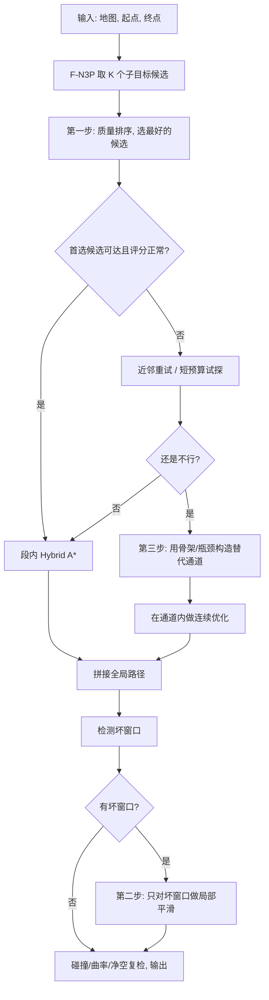

# F-N3P 路径质量退化：怎么修、修多少、按什么顺序修

## 结论先行

F-N3P 用神经网络把长路径切成短段再分别规划，速度确实快了，但拼出来的路径比直接跑 Hybrid A\* 要差——**平均多走 8%，最差的 5% 案例多走 25%**。路更长、弯更多、有些地方还会不必要地倒车。

修这个问题**不需要推翻 F-N3P 重来**。仓库里已经有了大部分需要的零件（多近邻查询、F1/F2/F3 逐级回退、路径膨胀率等评测指标、Voronoi 骨架和瓶颈 waypoint、10 万条训练样本、两张真实地图、完整的评测框架），只需要在现有框架上加两层东西：

1. **选子目标的时候多选几个、挑质量最好的**（而不是只取最近邻那一个）
2. **拼完之后，找出明显拉胯的片段，局部修一修**（而不是对整条路做重优化）

这两步叠起来，保守估计可以把膨胀率从 8%/25% 压到 **3%–5% / 8%–14%**；如果再对最顽固的坏案例做骨架通道重构，有希望压到 **2%–4% / 5%–10%**。

> ⚠️ 上面这些数字**不是实验测出来的**，是根据各篇论文的结果、仓库现有参数和工程经验推算的。可以用来排优先级，但不能直接当实验指标用。

F-N3P 的场景特点是 Ackermann 转向、小转弯半径、森林越野、密集不规则障碍、路径长度 50–200 m、要求 ≥1 Hz 实时。这意味着那些需要几秒钟跑全局优化的方法不太合适——它们会把前端分段加速赚到的时间全吃掉。真正对路的方案是把计算集中在少数质量差的片段上。

---

## 仓库里已经有什么

不是拿一个算法文件就能改的事，要先搞清楚仓库里跟"修路径质量"相关的东西分散在哪里。

| 仓库里的东西 | 它干了什么 | 对修路径质量有什么用 | 怎么复用 |
|---|---|---|---|
| `2_experiment/v9_forest_n3p/design.md` | 设计文档。写清了 F-N3P 的参数（子目标最远 8m、最近 1m、段内搜索上限 2000 节点、感知半径 10m、32 条射线），写清了 F1/F2/F3 三级回退逻辑，写清了评测指标（膨胀率、平均曲率、方向切换次数、最小净空、回退触发率）。 | 相当于一份现成的"接口说明书"。优化目标已经被锁死了：**在不改 F-N3P 主结构的前提下，降低拼接后的膨胀和曲率**。 | 在 F1 和 F2 之间插一个"F1.5 质量排序"，在 F2 和 F3 之间插一个"F2.5 局部修复"。 |
| `2_experiment/forest_n3p/inference.py` | 推理主循环。暴露了 `InferenceConfig`、`k_neighbors`、`turning_radius_m`、`wheelbase_m`，每一步记录了规划耗时、搜索节点数、到目标距离，段失败时按 `enable_f2`/`enable_f3` 触发回退。 | 不需要重写主循环就能把新功能挂进去。 | 加三个函数：`score_candidate()`（给候选打分）、`detect_bad_window()`（找出坏片段）、`repair_window()`（修坏片段）。 |
| `2_experiment/forest_n3p/main_evaluation.py` | 评测脚本。已经把 `f_n3p_knn`、`vanilla_ha`、`n3p_k1`、`voronoi_waypoint`、`bottleneck_waypoint`、`md_dqn`、`mlp` 放在同一个框架里跑，统一记录参考路径长度和按难度/距离分桶的结果。 | 已经有了 A/B 对比的全套设施，加新方法几乎零成本。 | 加两个新方法名 `f_n3p_rerank` 和 `f_n3p_rerank_smooth`，直接走现有管线。 |
| `tests/test_voronoi_waypoint.py`、`test_bottleneck_waypoint.py` | Voronoi 骨架图和瓶颈 waypoint 的单元测试。有 `build_skeleton_graph`、`place_waypoints`、`place_bottleneck_waypoints` 等函数的测试用例。 | 这两个模块可以直接拿来给"坏片段"生成替代通道——不需要当全局规划器用，只在坏片段触发就行。 | 只对检测出的坏窗口调用，不要普遍启用。 |
| `datasets/t08_training_dataset` | 训练数据集。2000 张地图、80000 个查询、100531 个样本，每个样本 41 维特征 + 3 维标签，标签失败率 6.8%，分 Easy/Complex/Extreme 三个难度。 | 足够训练一个轻量的"候选质量预测器"，不需要从零采集。 | 在现有特征上加一个 `quality_head`，预测"这个候选会不会导致这段路绕远"。 |
| `assets/realmaps`（两张真实地图） | `dqn_realmap_a` 和 `willow_garage_0p10`，用于真实地图评估。 | 检验在程序化森林上学到的修复策略换到真实地图会不会失效。 | 所有方案最终都要在这两张图上复测。训练和调参在程序化森林上做，验收看真实图。 |

总结一句话：**仓库里缺的不是"另一个规划器"，而是一层"把分段拼接产生的误差局部修掉"的工程代码。**

---

## 能用的方法有哪些

按修复发生在哪个阶段，分成四大类。

### 第一类：选子目标的时候就选对（前端修复）

思路很直接——**与其拼完了再补，不如一开始就别制造坏的拼接**。

现在 F-N3P 每一步只取 `k=1` 的最近邻子目标。如果这个子目标恰好绕到了障碍群的外侧，后面整段路都会被拖长。改成取 3–5 个候选，给每个打分，选最好的那个，就能避免很多"看起来近、走起来远"的错误。

| 具体方法 | 出处 | 怎么做 | 适不适合 | 膨胀率改善估计 | 对曲率的影响 | 实现难度 |
|---|---|---|---|---|---|---|
| **多候选拓扑并行** | Rösmann 等, 2017, *Robotics and Autonomous Systems*, DOI 10.1016/j.robot.2016.11.007 | 同时维护多条拓扑不同的候选路径，不把赌注押在一条上，用统一代价函数选最优。 | 非常适合。密集不规则障碍和森林窄缝正是最容易出现"局部看着能过、全局绕远"的场景。 | 均值降 1–3 个百分点，P95 降 3–8 个百分点，对最差的那批案例帮助最大。 | 一般会变好，因为不用走"先走错再调头"的折线了。 | 低到中等。仓库已有 `k_neighbors≤5` 的框架，多算几个候选的打分和可达性检查就行。 |
| **分层搜索 + 连续评价** | Yu Zhang 等, 2018, *IEEE Access*, DOI 10.1109/ACCESS.2018.2845448 | 先用便宜的几何搜索缩小候选范围，再用考虑运动学约束的连续层筛选。 | 适合 Ackermann 和最小转弯半径。但对 50–200 m 长路径，更适合拿来做局部窗口的评分思路，不建议替换整个规划器。 | 均值降 0.5–2.5 个百分点，P95 降 2–6 个百分点。 | 曲率更平滑，方向切换更少。 | 中等。 |
| **近邻重排 + 骨架/瓶颈辅助** | 仓库已有 `VoronoiWaypoint` 和 `BottleneckWaypoint` | 当多个候选质量接近时，用 Voronoi 骨架图或瓶颈中点来判断"从哪个缝穿过去更合理"，据此调整排序。 | 对森林窄缝、树干间的门洞、障碍群切割特别有效。 | 均值降 1–4 个百分点，P95 降 4–10 个百分点，但收益集中在"确实存在瓶颈"的案例上。 | 减少"穿过门洞后急拐"的曲率尖峰。 | 低。仓库里已经有了骨架和瓶颈模块，只需要在坏窗口触发时调用。 |

**优点**：几乎不动 F-N3P 的主结构。
**局限**：如果路径差不是因为选错了从哪边绕，而是因为拼接处一段段累积了小的几何偏差，那光重排不够，还得叠后端修复。

---

### 第二类：拼完之后做几何打磨（后处理）

拼接路径上常见的问题是：段与段的交界处有锯齿、有多余的折返、路径明明可以抄近路却没有。这类方法就是做"路径美容"——删冗余节点、抄近路、平滑曲线。

**风险提醒**：如果平滑的时候没考虑车辆转弯半径和车身宽度，平滑出来的路径可能"看着短了，实际上车开不过去"或者"擦着树过去"。所以不能直接用普通的 B-spline 平滑器。

| 具体方法 | 出处 | 怎么做 | 适不适合 | 膨胀率改善估计 | 对曲率的影响 | 实现难度 |
|---|---|---|---|---|---|---|
| **Hybrid A\* 之后接非线性优化**（Dolgov 方案） | Dolgov, Thrun 等, 2008, *STAIR* | 先用 Hybrid A\* 搜出一条可行路径，再用数值优化消除锯齿、折返和不必要绕行。整个重规划周期 50–300 ms。 | 非常适合。F-N3P 本质上就是在更早一步做了"分段加速"，后面再接一个短预算的优化，是经典且稳妥的加法。 | 均值降 2–5 个百分点，P95 降 5–12 个百分点。 | 一般改善曲率，但需要加障碍距离的惩罚项，不然会贴着障碍走。 | 中等。按现代硬件水平，窗口式优化保持在 <100 ms/窗口没问题。 |
| **CES（凸弹性平滑）** | Zhu, Schmerling, Pavone, 2015, *CDC*, DOI 10.1109/CDC.2015.7402333, arXiv 1506.01085 | 专门为类车机器人设计的凸优化方案。把路径形状和速度分开迭代优化，两步都能做成凸问题，几百毫秒出结果。 | **非常适合**，而且是这一类里单块收益最稳的。原因：1）它天然考虑了 Ackermann 转弯半径约束；2）适合"已经有一条能走通的路，只是想把质量拉回来"的场景。 | 均值降 3–7 个百分点，P95 降 8–15 个百分点。 | 对曲率通常是正面的，因为它本身就是为了让类车机器人跑平滑路径而设计。 | 完整实现中等偏高，但如果只做窗口版的形状优化，复杂度可以接受。 |
| **OMPL shortcut + B-spline** | OMPL PathSimplifier 官方文档 | 用 shortcut 删掉中间多余的节点，再用 B-spline 平滑。支持 `reduceVertices`、`ropeShortcutPath`、`partialShortcutPath`、`smoothBSpline`，可以设时间上限。 | 条件性适合。前提是要把连接器换成 Reeds-Shepp 之类的非完整约束连接，而不是简单的直线连接。满足这个前提的话，它是最便宜的"第一道打磨器"。 | 均值降 1–4 个百分点，P95 降 2–8 个百分点。更像是"便宜捡漏"，不能指望它独自解决尾部坏案例。 | 纯几何 B-spline 可能违反转弯半径约束。只有在非完整局部连接器和碰撞复检都到位的情况下才安全。 | **最低**，最容易先试试看。 |
| **曲率连续 Hybrid A\*** | Songyi Zhang 等, 2019, *ITSC*, DOI 10.1109/ITSC.2019.8916953 | 在搜索阶段就引入平滑偏好，而不是搜完了再后处理。 | 更适合借鉴它的思想（怎么把曲率连续约束前移到段内评分），不适合整套替换。 | 迁移部分思想后，均值降 1–3 个百分点，P95 降 3–6 个百分点。 | 目标就是改善曲率连续性。 | 从零复现太重，做思想迁移就好。 |

**这一类里最推荐 CES 的窗口化实现**——比全局的 TrajOpt/GPMP2 轻，又比单纯 OMPL shortcut 懂车辆约束。

---

### 第三类：把坏片段当成小型优化问题来解（局部重优化）

如果说第二类是"美容"，这一类就是"局部手术"。它们能处理"这段明明可以短一点、顺一点、离障碍远一点"的问题，尤其擅长修拼接处、短绕行、穿过门洞后的急拐。

**关键原则：不要对整条路做，只对坏片段做。** Nav2 的官方文档甚至明确提醒 Constrained Smoother "更适合在截断路径上运行"。

| 具体方法 | 出处 | 怎么做 | 适不适合 | 膨胀率改善估计 | 对曲率的影响 | 实现难度 |
|---|---|---|---|---|---|---|
| **TEB（时间弹性带）** | Rösmann 等, 2013, *ECMR*；Rösmann 等, 2017, *IROS* | 用稀疏图优化，在时间、路径长度、障碍距离和运动学约束之间找折中。2017 版本明确支持类车机器人、倒车和障碍约束。 | 很适合做局部修复器，特别是 10–25 m 的坏窗口。不适合 200 m 全路径。 | 均值降 2–6 个百分点，P95 降 6–14 个百分点。对"方向切换多、曲率尖峰高"的坏窗口效果很好。 | 通常明显改善。 | 中等。窗口化之后满足 ≥1 Hz 完全可行。 |
| **Nav2 Constrained Smoother** | Nav2 官方文档 | 基于 Ceres 优化器，同时优化路径长度、平滑度、障碍距离和曲率，支持 Reeds-Shepp 运动模型。 | **跟你的问题高度匹配**。"Reeds-Shepp/曲率/障碍距离"正好是子目标拼接后最常退化的三个维度。但只适合在坏窗口上跑，整条路跑太重。 | 只对坏窗口跑的话，均值降 3–7 个百分点，P95 降 8–16 个百分点。 | 对曲率控制友好。 | 代码借鉴价值高，但不能整条路径硬套。 |
| **TrajOpt** | Schulman 等, 2014, *IJRR*, DOI 10.1177/0278364914528132 | 在初始路径附近反复把非凸约束凸化，做顺序凸优化。 | 适合窗口式修复，但不如 TEB/CES 那么天然贴合 2D 栅格上的类车规划。 | 均值降 2–5 个百分点，P95 降 5–12 个百分点。 | 约束设计正确的话曲率会改善。 | 中等偏高，调参和约束建模成本大。 |
| **GPMP2** | Mukadam 等, 2018, *IJRR*, DOI 10.1177/0278364918790369 | 把轨迹优化写成因子图上的概率推断问题，用稀疏结构加速。 | 理论上很适合做"拿拼接路径当初始值、局部修复"这件事。 | 均值降 2–5 个百分点，P95 降 5–12 个百分点，但效果很依赖初始路径的质量。 | 一般改善曲率，但受地图梯度场质量影响。 | 研发复杂度高于 Ceres/CES/TEB。 |
| **CFS（凸可行集）** | Liu, Lin, Tomizuka, 2018, *SIAM J. Control Optim.*, DOI 10.1137/16M1091460 | 迭代构造凸可行域，把非凸的避障问题拆成一串凸子问题快速求解。 | 适合窄缝和不规则障碍。可以直接把局部安全走廊或半空间近似喂进去。 | 均值降 2–6 个百分点，P95 降 6–14 个百分点。在已有可行初始路径的窗口问题上很有吸引力。 | 通常改善曲率，取决于平滑代价的权重。 | 中到高。不过一旦安全走廊建好，在线运行很快。 |

---

### 第四类：用机器学习辅助（中期储备）

这类方法不是让模型直接输出最终路径，而是让模型提供更好的初始值、优先级或修复建议。对于眼下要做的事来说优先级靠后，但如果想把仓库里 10 万条训练样本继续榨干，有研究价值。

| 具体方法 | 出处 | 思路 | 优先级 | 膨胀率改善估计 | 主要风险 |
|---|---|---|---|---|---|
| **用仓库现有数据训练一个"候选质量预测器"** | 仓库已有 100531 个样本、41 维特征、3 维标签，评测里有膨胀率、曲率和回退次数 | 直接学一个"这个候选会不会导致绕远"的分类/回归头，比学一个"直接输出路径"的生成器便宜得多也安全得多。 | **高**。最现实的数据驱动思路。 | 均值降 0.5–2.5 个百分点，P95 降 2–6 个百分点。 | 风险最小，但改善上限不如后端优化器。 |
| 扩散模型做轨迹先验 | Carvalho 等, AAAI 2026 | 用扩散模型学一个"天然更平滑"的轨迹先验，再由优化器适配到当前环境。 | 中。更适合做"修复初始值生成器"而不是端到端替代。 | 训练和泛化成功的话，均值降 1–4 个百分点，P95 降 3–10 个百分点。 | 对程序化森林到真实地图的迁移敏感。 |
| DiffusionSeeder 式热启动 | Huang 等, CoRL 2024, arXiv 2410.16727 | 用生成模型给优化器产出多样且高质量的初始值，优化器只做少量微调。机械臂场景报告 12–36 倍加速。 | 中低。概念跟这个问题很像，但原始验证场景不是 2D 栅格。 | 更多体现在减少坏窗口优化的迭代次数上。 | 跨域失配和训练维护成本。 |

---

## 综合推荐：按什么顺序做

三个方案按投入产出比排序，**都是在现有仓库上直接集成的版本**，不需要另起炉灶。

| 优先级 | 方案 | 为什么排在前面 | 对接仓库的哪些代码 | 预期膨胀率（目前 8%/25%） | 主要风险 |
|---|---|---|---|---|---|
| **第一步** | 多候选质量重排 + 短预算试探 | 最便宜，最不破坏主流程。先减少"一开始就选错子目标"的概率。 | `k_neighbors`、F1/F2/F3、`InferenceStepRecord` | → **5.5–7.0% / 15–21%** | 打分函数设计不好的话，可能牺牲一些成功率。 |
| **第二步** | 选择性窗口式平滑（CES/Ceres 风格） | 对路径质量恢复最稳，而且只修坏片段。 | 在拼接后、返回前加 `repair_bad_windows()`，借鉴 CES 和 Nav2 Constrained Smoother | 叠加第一步后 → **3–5% / 8–14%** | 权重没调好的话会贴障碍或者过度平滑。 |
| **第三步** | 瓶颈/骨架局部通道重构 + CFS/TEB 修复 | 对最差的 5% 案例杀伤力最大，尤其是门洞/窄缝/树群边缘的案例。 | 复用 `VoronoiWaypoint`/`BottleneckWaypoint`，只对坏窗口触发 | 三步叠加后 → **2–4% / 5–10%** | 工程略复杂，效果上限取决于通道构建的质量。 |

排序逻辑：
- **第一步**直接命中 F-N3P 的核心问题——子目标一旦选错，后面再怎么优化也只是在补救。
- **第二步**是最稳的质量恢复手段——不改分段框架，只修差的片段。
- **第三步**是尾部武器——专门对付那种"整条路大部分还行，但有一段穿门洞的方式明显很蠢"的案例。

---

## 第一步怎么做

把 `predictor.query()` 的 `k` 从 1 提到 **3 或 5**，然后给每个候选子目标算一个质量分数：

$$J(g) = w_1 \cdot L_{RS}(p,g) + w_2 \cdot \Delta\theta(g, \text{goal}) + w_3 \cdot \text{clearance\_risk}(g) + w_4 \cdot \text{goal\_progress}(g) + w_5 \cdot \text{switch\_risk}(g)$$

每一项的含义：
- $L_{RS}$：当前位置到候选子目标的 Reeds-Shepp 距离（走到那里要多远）
- $\Delta\theta$：候选子目标的朝向跟最终目标方向差多少（是不是在朝目标走）
- $\text{clearance\_risk}$：候选子目标周围障碍有多近（可以直接复用现有的 32 条射线特征）
- $\text{goal\_progress}$：选了这个子目标之后离目标近了多少
- $\text{switch\_risk}$：这个子目标跟上一步的运动方向/曲率趋势是否兼容（不兼容就意味着要急拐或倒车）

对排名前 2 的候选，额外做一次**短预算 Hybrid A\* 试探**——不跑完整规划，只跑 500–800 个节点，看看规划难不难、段长是否合理、最小净空多少、会不会触发倒车。仓库已经有每一步的 `planner_time_s` 和 `planner_expansions` 记录，对接起来很干净。

参数建议：
- `K=3` 起步
- 只对排名前 2 的候选做短预算试探
- 短预算搜索上限设为完整上限的 25%–40%（即约 500–800 个节点）
- 如果第一名候选的分数比第二名好很多（超过某个阈值），就跳过试探，直接用第一名，省时间

不确定性：
- 程序化森林的训练分布跟真实地图的局部拓扑是否一致
- 41 维特征对"未来会不会绕远"这件事的区分能力够不够
- 子目标很近的时候打分可能噪声太大

---

## 第二步怎么做

**不要对整条 50–200 m 路径一把梭做优化**，只对"坏窗口"触发。

怎么判定哪段是"坏窗口"：
- 这段路径的弧长除以直线距离比值过高（绕路了）
- 这段路径的平均曲率或方向切换次数异常（太弯了）
- 连续两段的障碍净空太低（贴着障碍走了）
- 这一步触发了 F2 回退，或者出现了"走了一步但没靠近目标"的情况

这些判定条件不需要新发明——仓库的设计文档已经把膨胀率、平均曲率、方向切换和回退触发率列为正式指标了。

优化器选型推荐 **CES 或 Nav2 Constrained Smoother 风格**，而不是直接上 GPMP2 或 TrajOpt。理由：
- CES 天然是为类车机器人平滑设计的
- Nav2 Constrained Smoother 明确支持 Reeds-Shepp 运动模型、曲率约束、障碍距离和路径长度的联合优化
- Nav2 官方文档自己也说这个优化器适合截断路径，跟这里的"只修坏窗口"完全一致

工程参数建议：
- 每个坏窗口长度控制在 **10–25 m**
- 控制点数控制在 **20–60** 个
- 窗口的起点和终点的位姿、方向都固定死，只优化中间部分
- 单个窗口的优化耗时保守估计 **30–120 ms**
- 一次查询通常只出现 1–3 个坏窗口，整体耗时保持在 0.5–0.8 秒以内，满足 ≥1 Hz

> 上面这些耗时估计来自 Dolgov 的 50–300 ms 全周期二阶段规划、CES 论文的"几百毫秒"、以及 TEB/Nav2 Constrained Smoother 的实时定位，但实际数值会受障碍密度、梯度实现和窗口大小影响。

---

## 第三步怎么做

放在 F2 和 F3 之间，可以叫它 **F2.5：局部通道重构修复**。

触发条件：某个窗口在多候选重排之后仍然失败，或者虽然成功了但局部膨胀/曲率/净空指标明显很差。

流程：
1. 调用仓库已有的 Voronoi 骨架提取或瓶颈提取模块，在这个窗口内构造 1–3 条候选局部通道
2. 用 CFS/TEB/CES 之一在通道内做连续优化
3. 选代价最低且零碰撞的方案，替换原窗口

仓库已经有 `build_skeleton_graph`、`place_waypoints` 和 `place_bottleneck_waypoints` 的单元测试，所以集成风险比从零建通道构造器低得多。

这条路线的主要价值**不在均值，而在最差 5% 的案例**（P95）。对那种"整条路大部分还行，就有一段穿门洞的姿势特别蠢"的案例特别有效。所以**只在高风险窗口开这个分支**，不要对所有片段都启用——否则构建通道的开销会吃掉收益。

---

## 集成流程

三步串起来之后的完整流程（F-N3P 的主干不变）：



对应的伪代码（可以直接放在现有 `run_forest_n3p()` 旁边）：

```python
def run_f_n3p_repair(grid_map, footprint, start, goal, predictor, cfg):
    current = start
    stitched = [start]
    step_records = []

    while not rs_free(current, goal):
        # 1) 取 K 个候选, 不只取 1 个
        candidates = predictor.query(
            feature_of(current, goal, grid_map),
            current_pose=current,
            k=cfg.k_neighbors
        )

        # 2) 给候选排序, 选质量最好的
        ranked = rerank_candidates(
            candidates, current=current, goal=goal,
            grid_map=grid_map, footprint=footprint, cfg=cfg
        )

        segment = None
        for cand in ranked:
            if not rs_free(current, cand.subgoal_pose):
                continue

            # 对排名前 2 的候选做短预算试探
            probe = probe_segment_hybrid_astar(
                current, cand.subgoal_pose,
                timeout_s=cfg.segment_probe_timeout_s,
                max_nodes=cfg.segment_probe_max_nodes
            )
            if probe.good_enough:
                segment = full_segment_plan(current, cand.subgoal_pose, cfg)
                break

        # 3) 仍然失败或质量很差 → 局部通道重构
        if segment is None or segment.quality_bad:
            corridor = build_local_corridor_from_voronoi_or_bottleneck(
                grid_map, current, goal, stitched, cfg
            )
            if corridor is not None:
                segment = repair_in_corridor_with_optimizer(
                    current, goal, corridor,
                    method=cfg.local_optimizer  # "ces" / "teb" / "cfs"
                )

        # 4) 还是失败, 走原来的 F2/F3 回退
        if segment is None or not segment.success:
            segment = fallback_f2_or_f3(current, goal, cfg)
            if not segment.success:
                return failure_result(step_records, stitched)

        stitched.extend(segment.path[1:])
        current = stitched[-1]
        step_records.append(log_step(segment, current, goal))

    # 5) 拼完之后, 找出坏窗口, 局部修复
    bad_windows = detect_bad_windows(
        stitched, step_records, grid_map, footprint, cfg
    )
    for window in bad_windows:
        stitched = locally_smooth_window(
            stitched, window, grid_map, footprint, cfg
        )

    # 6) 最终检查: 不能有碰撞
    assert collision_free(stitched, grid_map, footprint)
    return success_result(stitched, step_records)
```

需要新写的函数就四个：
- `rerank_candidates()`——给候选打分排序
- `probe_segment_hybrid_astar()`——短预算试探
- `build_local_corridor_from_voronoi_or_bottleneck()`——局部通道构造
- `locally_smooth_window()`——坏窗口平滑

仓库里现有的 `SubgoalPredictor`、`InferenceConfig`、评测脚本、waypoint 基线和测试集全部继续能用。

---

## 实验怎么做

仓库的设计文档已经把评测指标定好了（总时间、搜索节点数、成功率、膨胀率、平均曲率、方向切换、最小净空、碰撞、回退触发率、真实地图性能），不需要再改指标。要做的是把这些指标统一成**配对评测**——同一个查询同时跑 `vanilla_ha`、`f_n3p_knn`、`f_n3p_rerank`、`f_n3p_rerank_smooth`、`f_n3p_rerank_corridor`，在双方都成功的配对集上比膨胀率和曲率，在全部查询上报成功率。

| 维度 | 怎么设计 |
|---|---|
| **场景** | 沿用仓库的 Easy/Complex/Extreme 三个密度桶和四个距离桶（8–12m、12–16m、16–20m、20m+）。另外单独在两张真实地图（`dqn_realmap_a` 和 `willow_garage_0p10`）上跑分布外测试。 |
| **主要指标** | 成功率、总时间、总搜索节点数、相对 vanilla HA\* 的膨胀率、平均绝对曲率、方向切换次数、最小净空、碰撞次数、F1/F2/F3 触发率。 |
| **新增诊断指标** | 坏窗口数量、修复调用率、修复成功率、修复耗时、短预算试探接受率、候选重排后悔率（最终最好的候选有没有被排在第一位）。 |
| **统计方法** | 均值膨胀率和平均曲率用 paired bootstrap 95% 置信区间。P95 膨胀率用分位数 bootstrap。成功率差异用 McNemar 检验。耗时和节点数（长尾分布）可以补充 Wilcoxon 符号秩检验。 |
| **参数扫描** | K 取 {1, 3, 5}、坏窗口长度取 {10, 15, 20, 25} m、平滑器单窗口时间预算取 {30, 60, 120} ms、通道重构触发阈值。 |
| **回归测试** | 复用现有 `test_inference.py`、`test_voronoi_waypoint.py`、`test_bottleneck_waypoint.py` 的风格，新增三类测试：不增加碰撞、不违反曲率上限、不降低成功率。 |

### 样本量

- 如果目标是检测**均值膨胀率降低 2 个百分点**：每个难度桶至少需要 **150–200 个成功配对查询**。
- 如果关心的是 **P95 从 25% 降到 12%**：每个难度桶需要 **400–600 个成功配对查询**，否则 P95 的 bootstrap 置信区间会很宽。
- 按三个难度桶算，总共需要约 **1200–2400** 个成功配对查询。

---

## 四个必须盯住的风险

1. **成功率不能往下掉**。所有修复模块都必须有回退机制——修复失败就用原来的路径/原来的回退方案。绝对不能因为加了修复模块反而导致原来能走通的查询走不通了。

2. **别为了路径顺滑就贴着树走**。在森林场景里，路径不够顺滑只是不舒服，但贴着树擦过去是真的危险。优化器里障碍距离的权重不能被曲率的权重压过。

3. **别对整条路做重优化**。F-N3P 通过分段加速赚到的时间，最容易被后端"贪心"地全路径优化吃掉。只修坏的片段。

4. **真实地图的复测不能省**。训练数据来自程序化生成的森林，而真实地图只有两张。这两张图应该被当成验收标准，而不是展示用的样例。

---

## 总结：做事的顺序

1. **先做多候选质量重排**（第一步）。确认成功率没掉。
2. **再加选择性窗口平滑**（第二步）。确认没贴障碍、没超时。
3. **最后只对 P95 坏案例引入局部通道重构**（第三步）。

这条路线最符合仓库当前的代码组织、实验资产和论文叙事，也最有可能在不牺牲 ≥1 Hz 实时性的前提下，把"加速带来的路径质量退化"压回到实验能站得住的水平。
